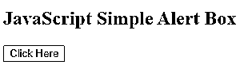
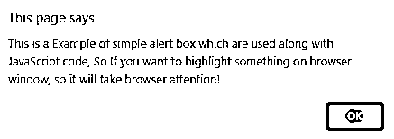
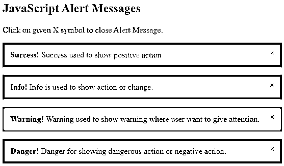
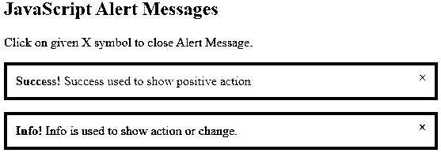
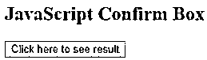
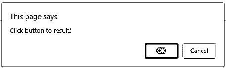
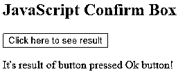
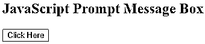
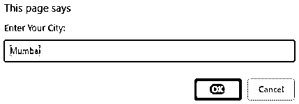
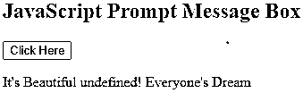

# JavaScript 消息框

> 原文：<https://www.educba.com/javascript-message-box/>


## JavaScript 消息框简介

*   JavaScript 消息框只是一个警告框，用来显示消息和 Ok 按钮。这种类型的消息框帮助用户从当前窗口转移注意力，并迫使用户阅读消息框中的文本或消息。
*   消息框有助于显示不同方面的警告消息，如危险用于显示危险行为或消极行为，成功用于显示积极行为，信息用于显示行动或改变，警告用于显示用户希望注意的警告。
*   JavaScript 消息框使用 JavaScript 中的内置函数在用户窗口中显示弹出消息。

### JavaScript 中的消息框是如何工作的？

**1。**如前所述，我们已经讨论了用于显示弹出消息的 JavaScript 消息框，如果我们想要通知用户特定的消息或警告，它可能会显示。这些对话框被视为窗口对象的方法

**2。**JavaScript 中的消息框可以进一步分为警告框、确认框、提示框三种不同的类型。这些建议如下:

<small>网页开发、编程语言、软件测试&其他</small>

#### 警告框

JavaScript 警告消息框是显示框之一，当你想向用户显示或显示确定的信息时使用。警告框包括“确定”按钮，因此可以按下此按钮继续处理。

**语法:**

```
window. Alert("text");
```

所以在这个语法窗口中。Alert()方法在没有窗口前缀的情况下使用。

警告框用于在用户的浏览器窗口上通过弹出窗口向用户显示确定的信息。该警告消息可以是危险、成功、警告、信息，根据其重要性，每一个都具有不同的含义。危险值用于在弹出框中显示危险或负面行为。成功可用于显示成功和积极的行动，而警告值用于显示需要用户注意的警告消息。Info 用于显示关于变化或动作的中性信息。通过考虑每个元素上的,可以使用 onclick 属性使用关闭弹出框的脚本在网页上创建多个警告消息框。

#### 确认框

JavaScript 中使用确认框，每当用户需要通过弹出框确认或接受时。因此，这种类型的消息框包括两个值 Ok 和 Cancel，以便进一步处理。因此，如果您想继续进一步的过程，您将单击“确定”意味着此单击将返回值“真”,否则您可以单击“取消”进行进一步的过程，意味着它将返回值“假”。

**语法:**

```
window.confirm ("text");
```

#### 提示席

提示框是 JavaScript 消息框的一种，用作交互式弹出窗口，用户希望在实际访问网页之前输入内容。和确认框一样，有两个值 Ok，Cancel。一旦用户进入确定按钮，然后用户需要输入输入值来访问网页，如果用户点击取消，则返回空值。

**语法:**

```
window.prompt("text", "default text")
```

### JavaScript 消息框的示例

以下是 JavaScript 消息框的示例:

#### 示例#1

在第一个例子中，我们将在按钮点击时创建一个简单的警告框，因此当用户点击按钮时，他或她能够看到弹出的消息窗口，一旦完成，通过点击 Ok 按钮弹出窗口关闭**。**

**代码:**

```
<!DOCTYPE html>
<html>
<body>
<h2>JavaScript Simple Alert Box</h2>
<button onclick="myFunction()">Click Here</button>
<script>
function myFunction() {
alert("This is a Example of simple alert box which are used along with JavaScript code, So If you want to highlight something on browser window, so it will take browser attention!");
}
</script>
</body>
</html>
```

**输出:**




点击按钮后




#### 实施例 2

在这个例子中，我们将创建警告框，如前面讨论的成功、信息、警告、危险，让我们看看例子:

**代码:**

```
<!DOCTYPE html>
<html>
<head>
<meta name="viewport" content="width=device-width, initial-scale=1">
<style>
.alert {
padding: 15px;
background-color: red;
color: black;
margin-bottom: 15px;
}
.alert.success {background-color: green;}
.alert.info {background-color: dodgerblue;}
.alert.warning {background-color: orange;}
.closebutton {
margin-left: 10px;
color:black;
font-weight: bold;
float: right;
line-height: 10px;
cursor: pointer;
}
</style>
</head>
<body>
<h2>JavaScript Alert Messages</h2>
<p>Click on given X symbol to close Alert Message.</p>
<div class="alert success">
&times;
<strong>Success!</strong> Success used to show positive action
</div>
<div class="alert info">
&times;
<strong>Info!</strong> Info is used to show action or change.
</div>
<div class="alert warning">
&times;
<strong>Warning!</strong> Warning used to show warning where user want to give attention.
</div>
<div class="alert">
&times;
<strong>Danger!</strong> Danger for showing dangerous action or negative action.
</div>
<script>
var close = document.getElementsByClassName("closebutton");
var i;
for (i = 0; i < close.length; i++) {
close[i].onclick = function(){
var div = this.parentElement;
div.style.opacity = "0";
setTimeout(function(){ div.style.display = "none"; }, 400);
}
}
</script>
</body>
</html>
```

**输出:**

无论何时运行这段代码，它都会显示如下输出:




因此，从上面的警告框中，我们可以通过单击下面给出的十字符号来关闭这些警告框:




#### 实施例 3

在这个例子中我们要创建确认框。

**代码:**

```
<!DOCTYPE html>
<html>
<body>
<h2>JavaScript Confirm Box</h2>
<button onclick="myFunction()">Click here to see result</button>
<p id="confirmdemo"></p>
<script>
function myFunction() {
var demo;
if (confirm("Click button to result!")) {
demo = "It's result of button pressed Ok button!";
} else {
demo = "It's result of button pressed Cancel button!";
}
document.getElementById("confirmdemo").innerHTML = demo;
}
</script>
</body>
</html>
```

**输出:**










#### 实施例 4

在这个例子中，我们将创建一个提示框。

**代码:**

```
<!DOCTYPE html>
<html>
<body>
<h2>JavaScript Prompt Message Box</h2>
<button onclick="myFunction()">Click Here</button>
<p id="pdemo"></p>
<script>
function myFunction() {
var demo;
var city = prompt("Enter Your City:", "Mumbai");
if (city == null || city == "") {
demo = "User denied to enter city in the prompt.";
} else {
demo = "It's Beautiful " + demo + "! Everyone's Dream";
}
document.getElementById("pdemo").innerHTML = demo;
}
</script>
</body>
</html>
```

**输出:**










### 结论

*   从所有的信息中，我们知道 JavaScript 消息框是用来显示弹出框或模态窗口，其中包含一些信息，以引起用户对对话框的注意。
*   所有这些消息框进一步分为三种类型，如警告框，确认框和提示框，值为 Ok 和 Cancel，因此用户可以根据自己的选择使用其中的任何一个。

### 推荐文章

这是一个 JavaScript 消息框的指南。在这里，我们讨论 JavaScript 消息框的介绍及其示例和代码实现。您也可以浏览我们推荐的其他文章，了解更多信息——

1.  [Javascript 嵌套函数](https://www.educba.com/javascript-nested-functions/)
2.  [JavaScript 日期函数](https://www.educba.com/javascript-date-function/)
3.  [JavaScript 警告](https://www.educba.com/javascript-alert/)
4.  [JavaScript 键盘事件](https://www.educba.com/javascript-keyboard-events/)


