# addEventListener JavaScript

> 原文：<https://www.educba.com/addeventlistener-javascript/>

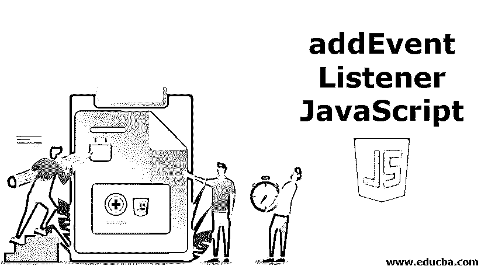


## addEventListener JavaScript 简介

EventTarget 接口提供了多种方法来处理 DOM 对象上的 javascript 事件。EventTarget 接口最重要的方法之一是 addEventListener()帮助创建和定义在事件发生时执行的代码片段。这些事件也可以在事件支持对象上定义，如 AudioNode、AudioContext、XMLHttpRequest。

使用 addEventListener()可以非常容易地在 javascript 中向任何对象添加事件。我们甚至可以向同类型的单个对象添加多个事件侦听器。这些事件不会相互覆盖，并且会按预期正确执行，不会影响彼此的工作。

<small>网页开发、编程语言、软件测试&其他</small>

**语法:**

```
element.addEventListener(event, functionName, useCapture);
```

下面通过描述其每个内容变量来详细解释上述语法:

*   **元素:**可以是当前 DOM 中的任何元素，也可以是 window 或 XMLHttpRequest 等支持事件处理的对象。
*   **Event:** 这是一个区分大小写的字符串，它指定要执行指定操作的事件。这种事件的例子有 click、dbclick、mouseover、mousemove 等。指定事件时应该小心，因为该字符串区分大小写，并且需要正确的单词来正确执行这些事件。
*   **functionName:** 该函数定义了当上述事件发生时，您想要执行的实际代码。这个函数可以是命名的，也可以是匿名的。我们将在后面的部分看到这两种声明函数的方法的例子。
*   **useCapture:** 这是一个布尔参数，默认设置为 false。这指定父子结构时事件执行的性质是事件捕获还是冒泡。如果我们想要捕获事件执行类型，我们可以将此参数作为 true 发送，而在所有其他情况下，它将在事件执行时显示冒泡类型的性质。我们将进一步借助例子清楚地看到这种工作方式和两者之间的区别。

### addEventListener JavaScript 示例

以下是 addEventListener JavaScript 的示例:

**代码:**

```
<!DOCTYPE html>
<html>
<body>
<p>This example will demonstrate the working of addEventListener by calling a method to alert a message when the button is clicked</p>
<button id="demoButton">Greetings for today</button>
<script>
document.getElementById("demoButton").addEventListener("click", function(){ alert("Good Morning! Have a great day ahead.");
});
</script>
</body>
</html>
```

**输出:**

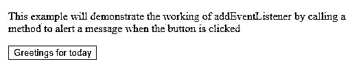


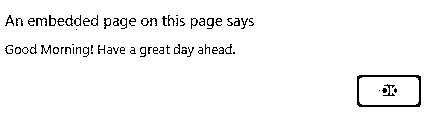


#### 1.命名和匿名函数调用

我们可以直接提到一个[匿名函数](https://www.educba.com/javascript-anonymous-function/)来指定当一个事件发生时必须做什么，或者写一个单独的指定相同内容的命名函数。

**代码:**

```
<!DOCTYPE html>
<html>
<body>
<p>These methods demonstrate that anonymous as well as named functions can be used with addEventListener event handler</p>
<p id="anonymousFuncOutput"></p>
<p id="namedFuncOutput"></p>
<button id="demoButton">Test it</button>
</body>
<script type="text/javascript"> document.getElementById("demoButton").addEventListener("click", function(){
document.getElementById("anonymousFuncOutput").innerHTML = "Output of anonymous function";
});
document.getElementById("demoButton").addEventListener("click", myNamedFunction);
function myNamedFunction() {
document.getElementById("namedFuncOutput").innerHTML = "Output of named function";
}
</script>
</html>
```

**输出:**

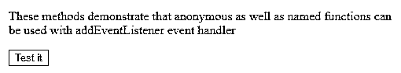


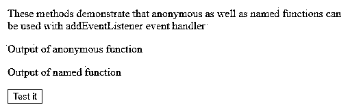


#### 2.同一个元素的多个事件

我们可以向 DOM 的同一个对象添加多个事件处理程序，或者支持示例的等效事件处理程序。在上面的例子中，我们已经看到了如何用不同的执行或函数将相同的元素分配给相同的事件。demo 按钮被分配了两次 click 事件，用于匿名和命名函数执行。我们甚至可以向同一个对象添加不同的多个事件。

**代码:**

```
<!DOCTYPE html>
<html>
<body>
<p>These methods demonstrate that different multiple addEventListener event handlers can be defined for single element</p>
<p id="singleElement">Default Content</p>
<button id="demoButton">Test it</button>
</body>
<script type="text/javascript">
var demoButtonElement = document.getElementById("demoButton"); demoButtonElement.addEventListener("mouseover", mouseOverFunction); demoButtonElement.addEventListener("click", clickFunction); demoButtonElement.addEventListener("mouseout", mouseOutFunction);
function mouseOverFunction() {
document.getElementById("singleElement").innerHTML = "This element represents mouseOver event";
}
function clickFunction() {
document.getElementById("singleElement").innerHTML = "This element represents click event";
}
function mouseOutFunction() {
document.getElementById("singleElement").innerHTML = "This element represents mouseOut event";
}
</script>
</html>
```

**输出:**

当程序运行时，singleElement 段落的第一个内容是“默认内容”。

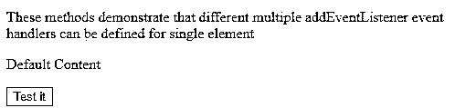


当鼠标停留在按钮上方时，调用 mouseOverFunction，singleElement 的内容从“默认内容”变为“此元素表示鼠标悬停事件”。

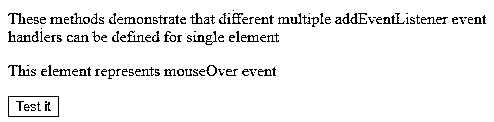


当鼠标离开单元素按钮时，输出看起来有点像这样:

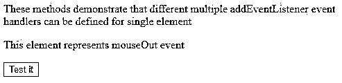


当单击 id 为 singleElement 的最后一个按钮时，名为 clickFunction 的方法将被调用，因为当单击此按钮时，click 事件调用此方法。

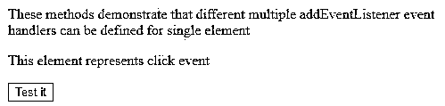


#### 3.传递参数

当事件发生时，将参数传递给被调用的函数只能通过调用一个方法来完成，该方法将调用另一个带有参数的方法。示例中，addEventListener 编写并调用一个匿名方法，该方法内部将调用实际的方法，我希望在事件发生时执行该方法，并向其传递所需的参数。

**代码:**

```
<!DOCTYPE html>
<html>
<body>
<p>These methods demonstrate how parameters can be passed in addEventListener by calling a method which in turn will call our desired method with parameters</p>
<p id="multipliedResult"></p>
<button id="demoButton">Test it</button>
</body>
<script type="text/javascript"> document.getElementById("demoButton").addEventListener("click", () => { multiplyNumbers(15, 27);
});
function multiplyNumbers(a, b) { var multipliedValue = a * b;
document.getElementById("multipliedResult").innerHTML = multipliedValue;
}
</script>
</html>
```

**输出:**

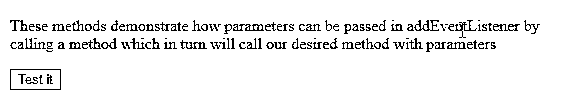


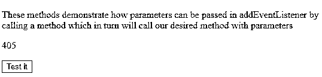


#### 4.事件冒泡和捕获

假设有一个 id 为 outerElement 的 div 元素，在 id 为 innerElement 的 div outerElement 内部有一个段落 p 元素。如果我们在两者上声明一个 click eventlistener 并单击子元素 paragraph，那么哪个事件将首先执行，它的父 division 还是子 division 本身由 eventlistener 的第三个可选参数决定。

如果是捕获，那么父元素(即 div 元素)的事件监听器将被调用，而在冒泡的情况下，子元素的事件监听器将首先被调用，然后是另一个。

### 结论

这样，我们可以在单个元素上使用多个 addEventListner 和 removeEventListener 来清除添加的事件侦听器。

### 推荐文章

这是一个关于 addEventListener JavaScript 的指南。这里我们讨论 addEventListener JavaScript 的介绍和例子。您也可以看看以下文章，了解更多信息–

1.  [JavaScript 箭头函数](https://www.educba.com/javascript-arrow-function/)
2.  [JavaScript 中的控制语句](https://www.educba.com/control-statement-in-javascript/)
3.  [JavaScript 自定义事件](https://www.educba.com/javascript-custom-events/)
4.  [JavaScript 字符串替换](https://www.educba.com/javascript-string-replace/)


