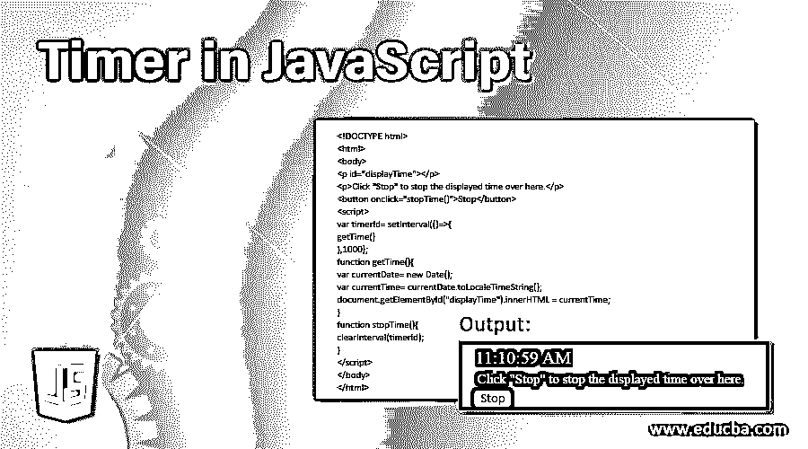
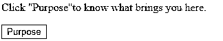
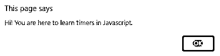
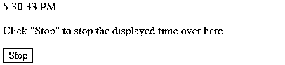
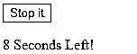
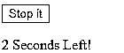
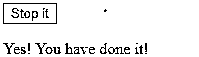
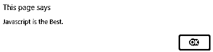
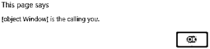

# JavaScript 中的计时器

> 原文：<https://www.educba.com/timer-in-javascript/>




## JavaScript 定时器简介

窗口对象为我们提供了可以在 javascript 中使用的定时器函数。基本上这些功能都是浏览器自己实现的。它们的实现因浏览器而异。由于这些函数具有全局范围，我们可以在 JavaScript 的

### 用 JavaScript 实现定时器的例子

下面是提到的例子:

<small>网页开发、编程语言、软件测试&其他</small>

#### 1.window.setTimeout(参数 1，参数 2，参数 3，…)

其中，argument1 代表要执行的函数的引用，argument2 代表要执行该函数的时间段(以毫秒为单位), argument3 以此类推，作为要传递给 argument1 的函数引用的选项参数。

SetTimeout()函数允许你在一段时间后执行一个特定的功能。例如，如果您想打印一条消息说“嗨！你是来学习 JavaScript 中的定时器的。”点击名为“目的”的按钮 5 秒钟后。在这种情况下，您可以编写一个函数来提醒消息，并在单击名为“目的”的按钮 5 秒钟后使用 setTimeout 函数调用它。你的代码看起来会是这样的-

**代码:**

```
<!DOCTYPE html>
<html>
<body>
<p>Click "Purpose"to know what brings you here.</p>
<button onclick="setTimeout(knowPurpose(), 5000);">Purpose</button>
<script>
function knowPurpose() {
alert('Hi! You are here to learn timers in Javascript.');
}
</script>
</body>
</html>
```

**代码:**运行代码后。




**代码:**点击按钮 5 秒后，看到的输出将如下所示




**说明:** clearTimeout()函数用于阻止事件发生。您可以通过用 setTimeout()函数返回的 id 调用它来使用它。例如，在上述情况下，如果计时器返回的 id 存储在变量名 timeouteId 中，并且您在 5 秒之前调用 clearTimeout(timeouteId ),则消息不会显示。

#### 2.window.setInterval(参数 1，参数 2，参数 3，…)

其中 argument1 代表要执行的函数的引用，argument2 代表要重复执行该函数的时间段(以毫秒为单位), argument3 以此类推，作为可选参数存在，要传递给 argument1 的函数引用。

当你想在特定时间段后重复执行某些功能时，你可以使用 setInterval 函数来实现。假设你想显示一个数字钟，并在你点击“停止”按钮时停止它。然后，您可以使用 setInterval 方法在 1 秒钟后重复调用 getTime 函数，以便更新显示的时间。你可以这样写代码-

**代码:**

```
<!DOCTYPE html>
<html>
<body>
<p id="displayTime"></p>
<p>Click "Stop" to stop the displayed time over here.</p>
<button onclick="stopTime()">Stop</button>
<script>
var timerId= setInterval(()=>{
getTime()
},1000);
function getTime(){
var currentDate= new Date();
var currentTime= currentDate.toLocaleTimeString();
document.getElementById("displayTime").innerHTML = currentTime;
}
function stopTime(){
clearInterval(timerId);
}
</script>
</body>
</html>
```

**说明:** clearInterval()函数用于阻止事件发生。您可以通过用 setInterval()函数返回的 id 调用它来使用它。一旦您点击停止按钮，它将停止显示更新的时间，并将显示您点击该按钮的时间。

**输出:**上述程序的输出如下-




现在假设你想更新消息说“还剩 10 秒！”，“还剩 9 秒！”、…等等，并显示“是！你做到了！”.怎么才能实现呢？这里我们可以利用 setInterval()函数。让我们为它写代码。

**代码:**

```
<!DOCTYPE html>
<html>
<body>
<button onclick="clearInterval(progressBarId)">Stop it</button>
<p id="progressBar"></p>
<script>
var waitingCount=10; //Initialize counter
var progressBarId = setInterval(displayProgress ,1000);
function displayProgress() {
document.getElementById("progressBar").innerHTML = waitingCount + " Seconds Left!";
waitingCount -=1; //decrement counter
if(waitingCount===0)
document.getElementById("progressBar").innerHTML = "Yes! You have done it!";
clearInterval(progressBarId); //Display the final message and clear the timer
}
}
</script>
</body>
</html>
```

**输出:**










**说明:**信息会显示倒计时，并会显示“是！你做到了！”十秒钟后。在倒计时过程中，如果您按下“停止”按钮，计时器将停止计时，显示的消息也将停止显示在您按下按钮时看到的消息，并且不会被进一步修改。

### 使用被调用函数的参数

现在假设在实时情况下，有必要向被调用的函数传递一个参数。例如，您希望在单击 submit 按钮 3 秒钟后显示一条消息，该消息应该显示传递给该函数的名称。在这种情况下，您将使用 setTimeOut()函数，因为消息在一段时间后只显示一次，不会重复显示。现在您将使用带有两个以上参数的 setTimeOut()函数。我们可以使用第三个参数来指定要在消息中显示并传递给函数的名称，并相应地创建消息。相同的代码如下所示-

**代码:**

```
<!DOCTYPE html>
<html>
<body>
<script>
setTimeout(isBest,3000, 'Javascript');
function isBest(what) {
alert(what+" is the Best.");
}
</script>
</body>
</html>
```

**输出:上面代码的**将是一个警告消息，显示“Javascript 是最好的。”三秒钟后。




现在您知道如何向 setTimeout()函数传递参数了。类似的还有 setInterval()函数的工作方式。

正如我们前面讨论的，所有这些定时器函数都是由窗口对象调用的，而窗口对象又是 HTML DOM(文档对象模型)的对象。让我们借助一个例子来验证这一点。在 javascript 中，如果你想知道当前的对象，那么“this”关键字被用来表示它。

**代码:**

```
<!DOCTYPE html>
<html>
<body>
<script>
setTimeout(whoIsCalling,1000);
function whoIsCalling() {
alert(this+" is the calling you.");
}
</script>
</body>
</html>
```

**输出:**




### 结论

我们可以断定 setTimeout()函数是由 HTML Dom 的 Window 对象调用的。您也可以在其他函数中尝试这样做，并亲自验证一下。setTimeout()和 setInterval()函数在您想要在某个预定义的时间段后安排一个事件时被广泛使用，并且根据您是想要一次还是重复调用该事件，您可以从这两个函数中进行选择。clearTimeout()和 clearInterval()函数用于停止和清除分别由 setTimeout()和 setInterval()函数设置的计时器。

### 推荐文章

这是一个 JavaScript 定时器指南。这里我们讨论 JavaScript 中定时器的介绍，并举例说明被调用的函数。您也可以浏览我们推荐的其他文章，了解更多信息——

1.  [JavaScript 模块](https://www.educba.com/javascript-modules/)
2.  [JavaScript DOM](https://www.educba.com/javascript-dom/)
3.  [c#中的定时器](https://www.educba.com/timer-in-c-sharp/)
4.  [Java 中的定时器](https://www.educba.com/timer-in-java/)


