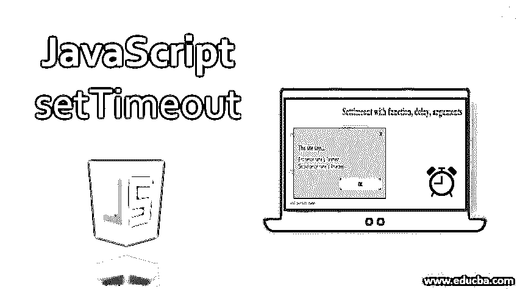
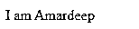
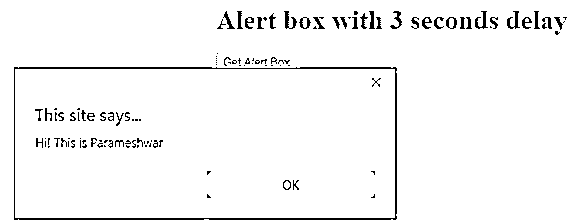
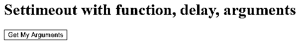
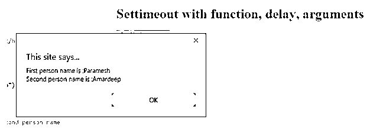
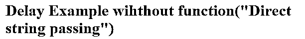
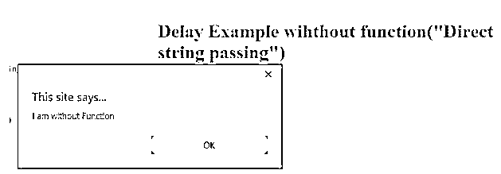

# JavaScript setTimeout

> 原文：<https://www.educba.com/javascript-settimeout/>




## JavaScript setTimeout 简介

setTimeout()是 JavaScript 中的一个[方法，用于延迟特定时间实例的函数或输出。setTimeout()是调度时间概念的一部分。](https://www.educba.com/arrays-methods-in-javascript/)

**示例:**cribbuzz 网站你可以看到，即使我们不刷新页面，页面也会每 2 秒钟自动刷新一次。在这种情况下，使用 setTimeout()方法使其在比赛进行过程中每 2 秒刷新一次。如果要设计倒计时按钮，就必须使用 setTimeout()方法每隔 1 秒进行一次。

<small>网页开发、编程语言、软件测试&其他</small>

### JavaScript 中 setTimemethod()是如何工作的？

setTimemethod()在没有任何实例的情况下工作。意味着，我们可以像 setTimemethod()一样直接传递方法；

**语法#1**

```
setTimeout(function,delay);
```

**语法#2**

```
setTimeout(function,delay,argument1,argument2,….);
```

*   **函数:**我们可以传递任何预定义的函数或者用户自定义的函数。
*   **延迟:**提到时间，我们希望延迟多少时间来执行功能。延迟总是以毫秒为单位，例如，如果我们想要延迟 2 秒，我们必须传递 2000 作为值来获得 2 秒。
*   **argument1，argument2:** 我们甚至可以用方法传递参数。

**Note:** Internet Explorer 9 and previous versions of it, not supported for setTimeout() method with arguments.

### 实现 JavaScript setTimeout 的示例

以下是在 JavaScript setTimeout 中实现的示例:

#### 示例 1–每隔 5 秒钟打印一次姓名

**代码:**

```
<html>
<body>
<font color="green">
<h1>Name with 5 seconds delay</h1>
</font>
<script>
function getNameDelay() {
timeDelay=setTimeout(printMyName, 5000);
}
function printMyName() {
document.write("I am Amardeep"+"<br>");
}
getNameDelay();
</script>
</body>
</html>
```

**延迟前输出:**


**延迟后输出:**




**对上面代码的解释:** printMyName()有我们需要打印的文本。getNameDelay()函数中提到了延迟 5 秒的函数，其中包含 setTimeout()方法。5 秒钟后 getNameDelay()函数给出我是 Amardeep。

#### 示例 2–按下按钮 3 秒钟后显示警告框

**代码:**

```
<!DOCTYPE html>
<html>
<body>
<font color="green">
<h1>Alert box with 3 seconds delay</h1>
</font>
<script>
function getAlertBoxDelay()
{
setTimeout(myAlertBox, 3000);
}
function myAlertBox()
{
alert("Hi! This is Parameshwar");
}
</script>
<button onClick="getAlertBoxDelay()">Get Alert Box</button>
</body>
</html>
```

**延迟前输出:**


**延迟后输出:**




**对上面代码的解释:** myAlertBox()方法要得到一个警告框弹出代码。一旦点击获取警告框按钮，onClick 属性就调用 getAlertBoxDelay()。它将显示一个警告框与嗨！这是 5 秒钟延迟后的 Parameshwar 消息。

#### 示例 3–带有函数、延迟和参数的 setTimeout()方法

**代码:**

```
<!DOCTYPE html>
<html>
<body>
<font color="green">
<h1>Settimeout with function, delay, arguments</h1>
</font>
<script>
function getArgsDelay()
{
setTimeout(getMyArgs, 5000,"Paramesh","Amardeep");
}
function getMyArgs(firstArg,secondArg)
{
alert("First person name is :"+firstArg+"\n"+"Second person name is :"+secondArg);
}
</script>
<button onClick="getArgsDelay()">Get My Arguments</button>
</body>
</html>
```

**延迟前输出:**




**延迟后输出:**




**解释上面的代码:** getMyArgs()方法要得到一个弹出警告框的代码。一旦点击获取我的参数按钮，onClick 属性称为 getArgsDelay()它将显示警告框输出后，5 秒钟的延迟。

#### 示例 4–不带函数和延迟的 setTimeout()方法

**语法:**

```
setTimeout("Any String",delay);
```

**代码:**

```
<!DOCTYPE html>
<html>
<body>
<font color="green">
<h1>Delay Example wihthout function("Direct string passing")</h1>
</font>
<script>
function delayFun() {
setTimeout("alert('I am without Function')", 5000)
}
delayFun();
</script>
</body>
</html>
```

**延迟前输出:**




**延迟后输出:**




**对上面代码的解释:**确保不建议将字符串直接传递给 setTimeout()方法。它不符合标准编码标准。因此，除了字符串传递，您可以在 **setTimeout()** 中使用匿名函数

### setTimeout()方法中匿名函数的语法

```
setTimeout(function (){ //code},delay);
```

*   **function (){ //code}:** 我们可以在 setTimeout()内部传递匿名函数。这是一种很难写的代码。
*   在这两种情况下，传递字符串和匿名函数给出相同的输出。

**对上述代码的解释:**

delayFun()方法有 setTimeout()，以字符串为函数，延迟 5 秒。5 秒钟后，一个带有 I 的弹出框显示无功能信息。

### 结论

setTimeout()方法可以处理函数、延迟，也可以处理函数、延迟和参数。setTimeout 的主要目的是使函数休眠或睡眠一段时间。

### 推荐文章

这是一个 JavaScript setTimeout 的指南。这里我们讨论一个介绍，JavaScript setTimeout 如何工作，用正确的代码和输出实现的例子。您也可以浏览我们的其他相关文章，了解更多信息——

1.  [JavaScript 合并数组](https://www.educba.com/javascript-merge-arrays/)
2.  [JavaScript 静态方法](https://www.educba.com/javascript-static-method/)
3.  [JavaScript 事件](https://www.educba.com/javascript-events/)
4.  [JavaScript 中的表单](https://www.educba.com/forms-in-javascript/)


