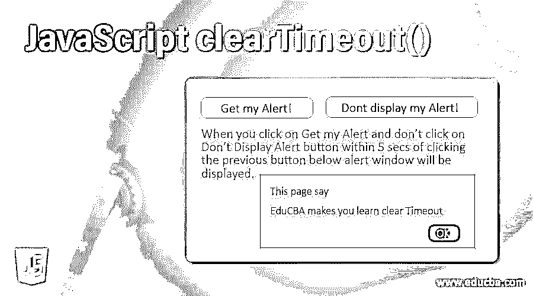
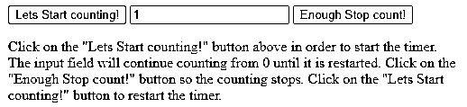
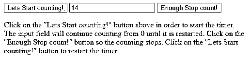
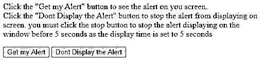
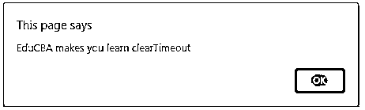

# JavaScript clearTimeout()

> 原文：<https://www.educba.com/javascript-cleartimeout/>




## JavaScript clearTimeout()的定义

clearTimeout()是一个帮助清除先前设置的超时时间的函数，该超时时间是通过使用 set time out()函数设置的，该函数创建一个 ID 值，并且该值反过来帮助清除作为参数发送给 JavaScript clearTimeout()的超时时间。

**语法:**

<small>网页开发、编程语言、软件测试&其他</small>

JavaScript clearTimeout()函数的语法如下:

```
scope.clearTimeout(timeoutID)
```

clearTimeout()方法是 WindowOrWorkerGlobalScope 类的一部分。timeoutID 参数是一个标识符，表示您想要清除的 timeout()函数。这将是 setTimeout()函数返回的 ID。您可以使用标识超时的 id 来清除超时。将作为参数发送给该函数的 id 由两个函数 setTimeout()和 setInterval()共享。

### clearTimeout 在 JavaScript 中是如何工作的？

让我们检查下面的代码，以便理解 JavaScript 中 clearTimeout()函数的工作原理。

**代码:**

```
var variable1;
function mytimeFunction() {
variable1 = setTimeout(function(){ alert("Hey World"); }, 5000);
}
function myClearFunction() {
clearTimeout(varaible1);
}
```

上面的程序声明了一个变量。这是我们在函数中首先用来设置超时的变量。带有警报和超时时间的 setTimeout()函数被发送到这个变量。此变量“varaible1”将存储有关超时的详细信息以及消息和时间。这两个东西将被命名为“varaible1”。每当屏幕页面空闲超过 5000 毫秒时，消息将在警告窗口中显示为 Hey World，然后您可以调用 myClearFunction，其中我们调用 clearTimeout 函数并传递此变量 1，它保存了有关会话的所有详细信息。当一个变量被用作引用时，编译器立即理解哪个会话被调用，并清除存储的超时值。我们只需将这个变量作为一个参数传递给 clearTimeout，以便清除存储在这个变量中的所有细节。我们将看到一些例子，帮助你更好地理解这一点。

### JavaScript clearTimeout()的示例

下面是一些例子:

#### 示例#1

clearTimeout()用于跟踪会话。

**代码:**

```
<!DOCTYPE html>
<html>
<body>
<button onclick="startSession()">Lets Start counting!</button>
<input type="text" id="txt">
<button onclick="stopSession()">Enough Stop count!</button>
<p>
Click on the "Lets Start counting!" button above in order to start the timer. The input field will continue counting from 0 until it is restarted. Click on the "Enough Stop count!" button so the counting stops. Click on the "Lets Start counting!" button to restart the timer.
</p>
<script>
var cnt = 0;
var temp;
var timer_on = 0;
function Countedtime() {
document.getElementById("txt").value = cnt;
cnt = cnt + 1;
temp = setTimeout(Countedtime, 3000);
}
function startSession() {
if (!timer_on) {
timer_on = 1;
Countedtime();
}
}
function stopSession() {
clearTimeout(t);
timer_on = 0;
}
</script>
</body>
</html>
```

上面的程序取了两个按钮。一个按钮启动会话，而第二个按钮将触发停止会话。该脚本使用一个计数变量来存储开始按钮被点击的次数。它会记录计数。temp 变量用于使用 setTimeout()函数设置集合。而 timer_on 变量用于每当这些按钮事件被触发时将计数重置为 1 或 0。脚本中指定了三个函数。在第一个函数中，我们通过 id 获取元素并存储在 count 变量中。每次单击按钮时，该计数都会增加。我们将时间设置为 3000 毫秒。startSession()函数将变量设置为 1，每次都调用计数器函数。第三个功能对我们很重要。我们使用 clearTimeout()函数，该函数清除 temp 变量中设置的所有会话细节。temp 有助于模仿并充当会话变量和设置的引用。下面是上面代码的输出:




最初，计数将为零。一旦我们得到这个，每次，我们点击开始计数按钮，我们将得到递增计数。




#### 实施例 2

创建和停止警报。

**代码:**

```
<!DOCTYPE html>
<html>
<body>
<p>Click the "Get my Alert" button to see the alert on you screen. <br />Click the "Dont Display the Alert" button to stop the alert from displaying on screen. you must click the stop button to stop the alert displaying on the window before 5 seconds as the display time is set to 5 seconds</p>
<input type="button" value="Get my Alert" onclick="AlertMe()"/>
<input type="button" value="Dont Display the Alert" onclick="StopAlertForMe()"/>
<script>
var abc;
function AlertMe() {
abc = setTimeout(function () { alert("EduCBA makes you learn clearTimeout") }, 5000);
}
function StopAlertForMe() {
clearTimeout(abc);
}
</script>
</body>
</html>
```

上面的程序是我们创建警报的一种方式，在超时之前，如果我们不想显示警报，我们可以停止警报并清除会话。上面的代码有两个按钮，一个是获取警报的按钮，另一个是停止警报的按钮。我们创建了一个函数 AlertMe()，它将显示其中提到的警报和消息。第二个函数帮助我们清除所有超时设置。我们使用了 clearTimeout()函数，它将帮助我们清除 5 秒的等待时间。如果在单击“获取警报”按钮后 5 秒钟内未完成单击此按钮，警报窗口将不会显示。让我们检查上述程序的输出，看看它是如何工作的。




当您点击获取我的提醒，并且在点击下面的上一个按钮后 5 秒内没有点击不显示提醒按钮，将会显示提醒窗口。




如果您在 5 秒钟内按下第二个按钮，警报窗口将不会显示。

### 结论

JavaScript 中的 clearTimeout()函数有助于清除会话的超时设置。它使用 setTimeout 函数中使用的变量名，并以此为参考清除设置。您可以根据需要随时清除超时设置。

### 推荐文章

这是 JavaScript clearTimeout()的指南。在这里，我们还将讨论 cleartimeout 在 javascript 中的定义和工作原理，以及不同的例子和代码实现。您也可以看看以下文章，了解更多信息–

1.  [JavaScript 鼠标移动](https://www.educba.com/javascript-mousemove/)
2.  [JavaScript 串联字符串](https://www.educba.com/javascript-concat-string/)
3.  [JavaScript 布尔()](https://www.educba.com/javascript-boolean/)


