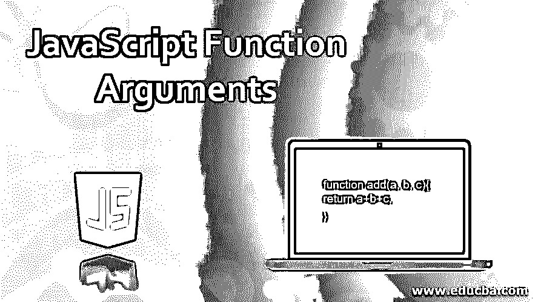
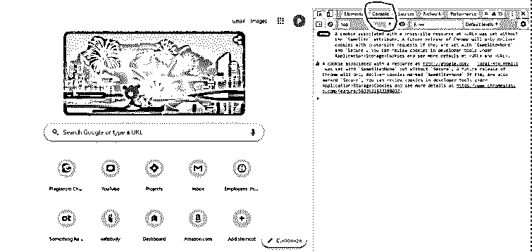
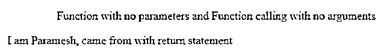
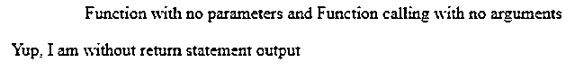
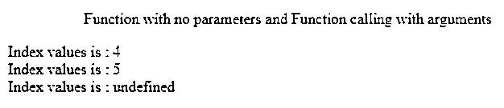
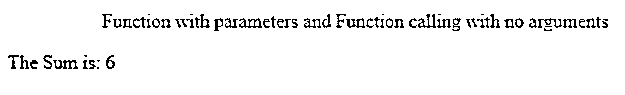
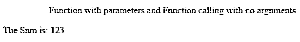
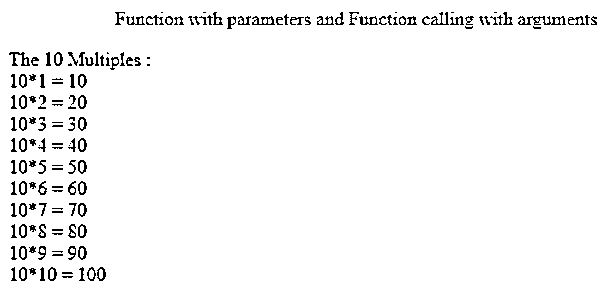

# JavaScript 函数参数

> 原文：<https://www.educba.com/javascript-function-arguments/>




## JavaScript 函数参数介绍

JavaScript 参数可以通过 function 关键字中的函数传递。参数可以使用任何名称，但是为了更好地理解代码，它应该符合 JavaScript 命名约定。为了更好地理解这个概念，我们必须清楚实参和形参之间的区别。当我们声明一个函数时，函数中的一些名字就叫做参数。

**举例:**

<small>网页开发、编程语言、软件测试&其他</small>

```
function add(a, b, c){
return a+b+c;
}
```

**说明:**这里把 a，b，c 称为参数。

**参数:**当我们在调用一个函数的时候，传递一些值被称为参数。

**举例:**

```
add(2,4,6);
```

**说明:**这里调用上面声明的带有 2，4，6 值的 add 函数，2，4，6 称为自变量。一句话，参数是真实值。

### JavaScript 中的参数是如何工作的？

*   在 JavaScript 中不需要指定参数的类型。因为 type 将负责 JavaScript 引擎，这意味着 JavaScript 根本不检查对象的类型。
*   传递参数并不重要，因为 JavaScript 引擎只检查参数是否起作用。而在 Java 中，我们必须满足参数的数量和自变量的数量。
*   函数有 3 个参数，实参只有 2 个参数；我们没有得到任何错误，因为 JavaScript 引擎确实检查了参数的数量。

**语法:**

```
function addition(a,b,c) //function with parameters
{
return a+b+c;
}
addition(1,2,3);//function calling with arguments
```

### JavaScript 输出方法

**Console.log:** 它会在浏览器控制台显示 out。




请参见上面在控制台中用蓝色标记突出显示的图像。

**document.write:** 像 html 页面一样直接在浏览器中显示出来。


**代码示例:**

它分为 4 种类型

*   不带参数的函数和不带参数的函数调用
*   不带参数的函数和带参数的函数调用
*   带参数的函数和不带参数的函数调用
*   带参数的函数和带参数的函数调用

#### 1.不带参数的函数和不带参数的函数调用

函数定义和调用函数分别没有参数和自变量。

**语法:**

```
function functionName(){ //function definition
//code
}
functionName();//function calling
```

**举例:**

**ReturnName.js**

```
<!DOCTYPE html>
<html>
<body>
<font color="green"><p align="center">Function with no parameters and Function calling with no arguments</p></font>
<script>
function getMyName() {
return "I am Paramesh, came from with return statement"
}
document.write(getMyName());
</script>
</body>
</html>
```

**输出:**




**注意:**在 JavaScript 中，即使没有返回类型，我们也可以使用 return 语句，因为 JavaScript 引擎会自动检测结果返回类型。因此，断定 JavaScript 没有任何检查返回类型。

**NonReturnString.js**

```
<!DOCTYPE html>
<html>
<body>
<font color="green"><p align="center">Function with no parameters and Function calling with no arguments</p></font>
<script>
function getOutput() {
document.write("Yup, I am without return statement output")
}
getOutput();
</script>
</body>
</html>
```

**输出:**




#### 2.不带参数的函数和带参数的函数调用

函数定义没有任何参数，函数调用有一些参数。

**语法:**

```
function functionName(){
//code
}
functionName(x,y,z);
```

**举例:**

**IndexValue.js**

```
<!DOCTYPE html>
<html>
<body>
<font color="green"><p align="center">Function with no parameters and Function calling with arguments</p></font>
<script>
function getIndexValue() {
document.write("Index values is : "+arguments[0]);
document.write("<br>"); //make output in a new line
document.write("Index values is : "+arguments[1]);
document.write("<br>");
document.write("Index values is : "+arguments[2]);
}
getIndexValue(4,5);
</script>
</body>
</html>
```

**输出:**




**说明:**

*   JavaScript arguments [] array 给出了由函数参数传递的值的数组(getIndexValue(4，5))。它向我们证实了传递参数在 JavaScript 中是像数组一样存储的。
*   在上面的例子中，我们试图访问 arguments [2],这意味着数组的第三个值给出了未定义的输出，因为 getIndexValue(4，5)中不存在这样的值。
*   另一个观察是，我们可以将参数传递给非参数函数 getIndexValue()。它证实了 JavaScript 并不检查传递给它的参数或自变量的数量。

#### 3.带参数的函数和不带参数的函数调用:

函数定义有参数，函数调用没有任何实参。

**举例:**

**ReturnSum.js**

```
<!DOCTYPE html>
<html>
<body>
<font color="green"><p align="center">Function with parameters and Function calling with no arguments</p></font>
<script>
function getSum(a=1,b=2,c=3) {
return "The Sum is: "+(a+b+c);
}
document.write(getSum());
</script>
</body>
</html>
```

**输出:**




**说明:**

*   调用函数(getSum())没有任何参数，而函数定义(getSum(a=1，b=2，c=3))有一些参数。清楚地告诉你 JavaScript 不检查参数个数。
*   正如你在 getSum(a=1，b=2，c=3)中看到的，有未定义返回类型的参数。JavaScript 也不检查参数返回。

**StringPlusValueString.js**

```
<!DOCTYPE html>
<html>
<body>
<font color="green"><p align="center">Function with parameters and Function calling with no arguments</p></font>
<script>
function getSum(a=1,b=2,c=3) {
document.write("The Sum is: "+a+b+c);
}
getSum();
</script>
</body>
</html>
```

**输出:**




**说明:**

在任何编程语言中

String+String 始终仅是字符串。在上面的例子中，我们将 a+b+c 加到字符串“Sum is:”中。如果我们写出“总和是:“+a+b+c”，那么输出将变成

总数是:123

让你吃惊吗？这是因为“Sum is:”是一个字符串，值总是字符串。

我们将括号中的 3 个数相加((a+b+c))，然后我们将它添加到字符串中，因为任何编程语言都遵循 BODMAS 规则。首先执行括号，然后执行 Of、除法、乘法、加法和减法。

#### 4.带参数的函数和带参数的函数调用

函数定义和函数调用都分别有参数和自变量。

**语法:**

```
function functionName(a,b)
{
//code
}
functionName(2,1);
```

**举例:**

**multiplicationtable . js**

```
<!DOCTYPE html>
<html>
<body>
<font color="green"><p align="center">Function with parameters and Function calling with arguments</p></font>
<script>
function getMultiples(nThTable,upTo) {
document.write("The 10 Multiples : ");
document.write("<br>")
for(let i=1;i<=upTo;i++)
{
document.write(nThTable+"*"+i+" = "+nThTable*i);
document.write("<br>")
}
}
getMultiples(10,10);
</script>
</body>
</html>
```

**输出:**




**说明:**

假设我们想要传递来自调用函数的参数和来自函数定义的参数。JavaScript 引擎对此并不抱怨。因此，JavaScript 允许带参数的函数和带参数的函数调用。

### 结论

函数参数可以传递给参数化和非参数化函数，JavaScript 引擎不会出现任何错误。

### 推荐文章

这是一个 JavaScript 函数参数的指南。这里我们讨论 JavaScript 中的参数是如何工作的，以及 JavaScript 的输出方法。您也可以看看以下文章，了解更多信息–

1.  [JavaScript 数组串联](https://www.educba.com/javascript-array-concat/)
2.  [汉堡菜单 JavaScript](https://www.educba.com/hamburger-menu-javascript/)
3.  [Javascript 数组到字符串](https://www.educba.com/javascript-array-to-string/)
4.  [要浮动的 JavaScript 字符串](https://www.educba.com/javascript-string-to-float/)


