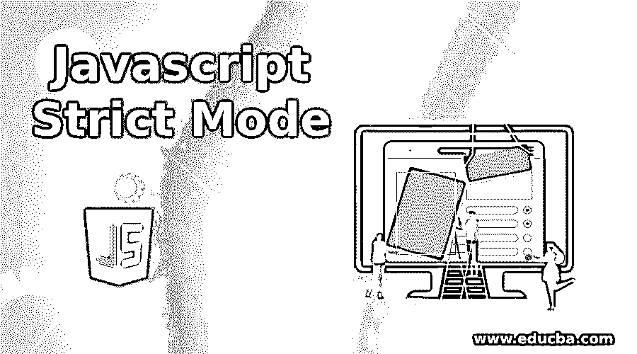
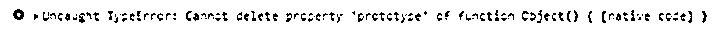

# Javascript 严格模式

> 原文：<https://www.educba.com/javascript-strict-mode/>




## Javascript 严格模式介绍

随着 ES5 的变化，严格模式是 JavaScript 中引入的一个新特性。它改变了 JavaScript 中普通代码的整个模式，使其更像一个“严格”的操作类别。严格的上下文使得 JavaScript 代码更有能力拒绝某些操作并抛出更多异常。这种模式可以通过编写“use strict”在代码中实现，它调用浏览器在严格模式下操作，这是一种更安全、更好的工作模式。当在一些不支持严格模式的浏览器中使用严格模式时，它们的行为会有所不同，因此在使用严格模式之前，应该先对浏览器进行可行性测试。严格模式代码和非脚本模式代码可以在代码中同时出现，因此脚本可以缓慢地、渐进地选择严格模式。

**语法**

<small>网页开发、编程语言、软件测试&其他</small>

我们可以通过在支持的浏览器中使用句子“use strict”来声明任何要在严格模式下使用的 JavaScript 代码，如下所示:

```
'use strict';
var x = 4; //Valid in strict mode
y = 1; //invalid in strict mode
```

### 使用严格模式的好处

严格模式为普通的 JavaScript 代码提供了多种变化，改变了它的语义，并通过错误抛出逻辑使它更容易控制。在 JavaScript 中引入它的一些主要好处如下:

*   在这种情况下，严格模式通过抛出错误语句来帮助消除 JavaScript 中的一些无声错误。

*   每当在 JavaScript 代码中执行相对“不安全”的操作时(例如，访问一个全局对象或初始化一个变量而不定义它)，严格模式抛出或防止错误。
*   严格模式基本上修复了严格上下文中的错误，这使得 JavaScript 引擎更容易执行优化。因此，严格模式的 JavaScript 代码可能会比在非严格模式下运行的相同 JavaScript 代码运行得更快。
*   一些语法和语义可能会在未来版本的 ECMAScript 中添加到 JavaScript 中，因此如果这些更改的基础被严格模式所禁止，事情会变得更容易。
*   严格模式也可以在脚本、函数和模块中调用。

**脚本中的严格模式:**

```
'use strict';
var x = 'Strict Mode in Scripts!';
```

**函数中的严格模式:**

```
const Strict = () => {
'use strict';
return "Strict Mode in Functions!"
}
```

**模块中的严格模式:**

```
function method( ) {
// being a module it is by default strict in nature
}
export default method;
```

*   严格模式基本上有助于编写严格和安全的 JavaScript 代码。
*   严格模式禁用了令人困惑或考虑不周的功能。

### Javascript 严格模式的示例

下面举几个例子

#### 示例 1–初始化未定义的变量

**代码:**

```
"use strict"
var v = 1 // error raised
```

**输出:**


#### 示例 2–函数级严格模式的应用

**代码:**

```
"use strict";
myFunc();
function myFunc() {
y = 1;   // error raised
}
```

**输出:**


#### 例 3——在函数中声明 strict

**代码:**

```
x = 1;    // not raise error
myFunction();
function myFunction() {
"use strict";
y = 1;  // error raised
}
```

**输出:**


#### 示例 4–初始化未定义的对象

**代码:**

```
"use strict";
x = {y:1, z:2};   // error raised
```

**输出:**


#### 示例 5–删除变量

**代码:**

```
"use strict";
var x = 1;
delete x;     // error raised
```

**输出:**


#### 示例 6–删除功能

**代码:**

```
"use strict";
function x(y, z) {};
delete x;        // error raised
```

**输出:**


#### 示例# 7–复制参数

**代码:**

```
"use strict";
function x(y, y) {};   // error raised
```

**输出:**


#### 示例 8–使用八进制数字文字

**代码:**

```
"use strict";
var v = 011;   // error raised
```

**输出:**


#### 示例 9–使用八进制转义字符

**代码:**

```
"use strict";
var x = "\011";   // error raised
```

**输出:**


#### 示例# 10–修改只读属性

**代码:**

```
"use strict";
var obj = {};
Object.defineProperty(obj, "y", {value:1, writable:false});
obj.y = 10;   // error raise
```

**输出:**


#### 示例 11–修改 get-only 属性

**代码:**

```
"use strict";
var obj = {get y() {return 0} };
obj.y = 1;   // error raised
```

**输出:**


#### 示例# 12–删除对象原型

**代码:**

```
"use strict";
delete Object.prototype;   // error raised
```

**输出:**




#### 示例# 13–将变量初始化为“eval”

**代码:**

```
"use strict";
var eval = 1;   // error raised
```

**输出:**


#### 示例# 14–将变量初始化为“参数”

**代码:**

```
"use strict";
var arguments = 1;   // error raised
```

**输出:**


#### 示例# 15–使用“with”语句

**代码:**

```
"use strict";
with (Math){y = sin(2)};   // error raised
```

**输出:**


#### 示例# 16–使用“eval”在范围内创建变量

**代码:**

```
"use strict";
eval ("var y = 1");
alert (y);      // error raised
```

**输出:**


#### 示例# 17–在严格模式的函数中使用“this”关键字

“this”关键字用于引用调用某个函数的对象。如果任何对象在函数中未定义，那么在严格模式下，函数将为该对象返回“未定义”，而在非严格模式下工作的函数将返回该对象的全局值(如果是全局定义的)。

**代码:**

```
"use strict";
function myFunc() {
alert(this);
}
myFunc();
```

#### 示例# 18——使用未来 JavaScript 版本的保留字来定义变量

**代码:**

```
"use strict";
var public = 1;   // error raised
```

**输出:**


**代码:**

```
"use strict";
var implements= 1;   // error raised
```

**输出:**


**代码:**

```
"use strict";
var interface= 1;   // error raised
```

**输出:**


**代码:**

```
"use strict";
var let= 1;   // error raised
```

**输出:**


**代码:**

```
"use strict";
var package= 1;   // error raised
```

**输出:**


**代码:**

```
"use strict";
var private= 1;   // error raised
```

**输出:**


**代码:**

```
"use strict";
var protected= 1;   // error raised
```

**输出:**


**代码:**

```
"use strict";
var static= 1;   // error raised
```

**输出:**


**代码:**

```
"use strict";
var yield= 1;   // error raised
```

**输出:**


### 结论

严格模式是 ECMAScript 5.0 引入的一个令人兴奋的特性，它增强了语义，也为 JavaScript 编码平台增加了额外的安全性。它降低了 JavaScript 中的容错能力，也使得开发人员可以轻松地用 JavaScript 编写代码，而不必担心它显式抛出的一些常见错误。

### 推荐文章

这是 Javascript 严格模式的指南。这里我们讨论 Javascript 严格模式的例子及其好处。您也可以看看以下文章，了解更多信息–

1.  [JavaScript 文件阅读器](https://www.educba.com/javascript-filereader/)
2.  [JavaScript 数组串联](https://www.educba.com/javascript-array-concat/)
3.  [JavaScript 中的嵌套循环](https://www.educba.com/nested-loop-in-javascript/)
4.  [JavaScript 字符串到 int](https://www.educba.com/javascript-string-to-int/)


