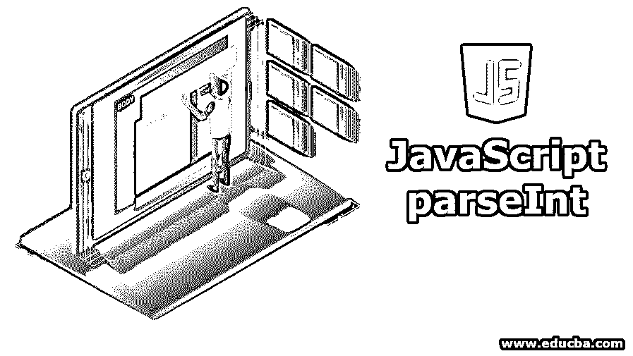
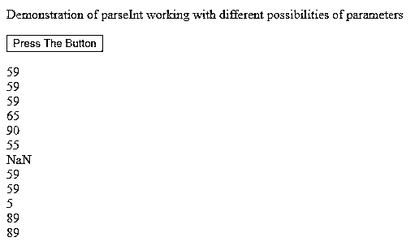
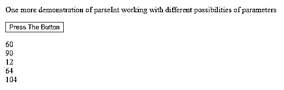

# JavaScript parseInt

> 原文：<https://www.educba.com/javascript-parseint/>




## JavaScript parseInt 简介

在 javaScript 中，借助 parseInt 方法，我们可以将任何字符串格式的对象转换为相应的整数格式。此函数解析提供给它的第一个字符串参数，然后根据调用时提供给它的第二个参数 radix 将其转换为整数。这里的基数代表数学中数系的基数，可以是 2 到 36 之间的任何数。

当我们想要对数字进行操作时，这个功能是非常重要的，但是我们不能确定我们所操作的对象本身是不是数字。这里，我们首先在 parseInt 方法的帮助下解析所有的对象，如果它们不是整数，那么就把它们转换成整数。除此之外，parseInt 方法可以用在很多地方，它的实现完全取决于我们，取决于我们何时何地可以使用它。

<small>网页开发、编程语言、软件测试&其他</small>

**JavaScript parse int 的语法:**

```
var integerObject = parseInt(stringParameter[,radix]);
```

### JavaScript parseInt 的参数

**1。stringParameter:** 这是我们要解析并转换成整数的参数。该参数应为字符串格式。即使它是任何其他格式的，那么首先使用 to string()方法将该对象转换为字符串格式，然后进一步考虑进行解析。这是必需的参数。

**2。Radix:** 这是数学数字系统的基数，有助于识别作为字符串参数提供的整数类型。这可以是 2 到 36 之间的任何数值。例如，如果基数是 2，则传递的数字被视为仅包含 1 和 0 位的二进制数，或者如果是 10，则被视为十进制数，而 16 被视为十六进制数。该参数是可选的。如果我们不指定它，那么默认情况下，它的值不会被认为是一个小数。

根据传递的参数，有不同的规则来考虑未指定时的基数。如果传递的参数字符串以 0 和小写或大写字母(X 或 X)开头，则基数被视为十六进制。如果数字以 0 开始，那么它可以被认为是十进制或八进制，这也取决于浏览器及其实现。对于支持 ECMAScript 5 的浏览器，它会将其视为十进制数。然而，并不是所有的浏览器都采用这种方式，所以不推荐使用。因此，在解析为整数时指定基数很重要。在所有其他情况下，如果数字不是以 0 开头，则被视为小数。

**3。integerObject:** 这是 parseInt()方法的返回值，它是一个 integer 对象，包含所提供字符串的第一个解析单词的数值。请注意，所提供的字符串参数中的前导空格和尾随空格是允许的，但会被忽略。

请注意，如果为转换传递的字符串是不可解析的整数，那么 parseInt()方法返回的值是 NAN，它代表非数字。对于作为 parseInt()方法的参数传递的大十进制值，其精度将会丢失，因为小数点后的所有十进制数字都将被删除，而完整的整数值将被返回。

### parseInt()方法的示例

下面给出了 parseInt()方法的例子:

#### 示例#1

**代码:**

```
<!DOCTYPE html>
<html>
<body>
<p>Demonstration of parseInt working with different possibilities of parameters</p>
<button onclick="parseIntExample()">Press The Button</button>
<p id="demoSample"></p>
<script>
function parseIntExample() {
var sample1 = parseInt("59") + "<br>"; var sample2 = parseInt("59.00") + "<br>"; var sample3 = parseInt("59.55") + "<br>";
var sample4 = parseInt("65 78 57") + "<br>"; var sample5 = parseInt(" 90 ") + "<br>"; var sample6 = parseInt("55 years") + "<br>"; var sample7 = parseInt("She was 55") ;
var sample8 = parseInt("59", 10)+ "<br>"; var sample9 = parseInt("059")+ "<br>"; var sample59 = parseInt("59", 8)+ "<br>"; var sample11 = parseInt("0x59")+ "<br>"; var sample12 = parseInt("59", 16)+ "<br>";
var n = sample1 + sample2 + sample3 + sample4 + sample5 + sample6 + sample7 + "<br>" + sample8 + sample9 + sample59 + sample11 +sample12; document.getElementById("demoSample").innerHTML = n;
}
</script>
</body>
</html>
```

**输出:**




#### 实施例 2

另一个字符串参数和基数的例子。

**代码:**

```
<!DOCTYPE html>
<html>
<body>
<p>One more demonstration of parseInt working with different possibilities of parameters</p>
<button onclick="parseIntExamples()">Press The Button</button>
<p id="demoSample"></p>
<script>
function parseIntExamples() {
var sample1 = parseInt("30", 20) + "<br>"; var sample2 = parseInt("090") + "<br>"; var sample3 = parseInt("15", 7) + "<br>"; var sample4 = parseInt("0x40") + "<br>"; var sample5 = parseInt("62", 17) + "<br>";
var result = sample1 + sample2 + sample3 + sample4 + sample5; document.getElementById("demoSample").innerHTML = result;
}
</script>
</body>
</html>
```

**输出:**




注意，在上面的例子中，parseInt()方法只返回字符串中的第一个数字。如果我们在支持 ECMAScript 1 旧版本的旧版本浏览器中执行 parse int(“010”)，那么它将返回值 8，因为那里的八进制系统将被视为数字以零(0)开始。然而，在支持 ECMAScript 5 的新浏览器版本中，相同的 parse int(“010”)将返回 10，因为在这里 radix 被视为十进制数(10)。这是因为 ECMAScript 5 将默认基数定义为 10。但是由于浏览器的不可靠性，在将对象解析为整数时，指定要考虑的基数总是一个好的做法。

有必要考虑您的应用程序将使用的所有浏览器版本，如果您不了解这些版本，那么在指定第一个参数的同时指定适当的基数作为第二个参数。这样，您可以实现 parseInt()方法来验证一个对象是否是整数，并检索其整数值。

### 推荐文章

这是 JavaScript parseInt 的指南。这里我们讨论 JavaScript parseInt 的介绍、参数和例子。您也可以看看以下文章，了解更多信息–

1.  [JavaScript 提示](https://www.educba.com/javascript-prompt/)
2.  [JavaScript 闭包](https://www.educba.com/javascript-closure/)
3.  [Javascript 原型](https://www.educba.com/javascript-prototype/)
4.  [JavaScript 自定义事件](https://www.educba.com/javascript-custom-events/)


