# JavaScript 提示

> 原文：<https://www.educba.com/javascript-prompt/>

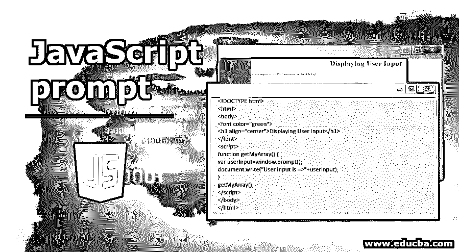


## JavaScript 提示简介

*   用于要求用户输入动态值的提示框。
*   输入值后，单击“确定”按钮或“取消”按钮采取必要的措施。如果您单击 OK 或 enter，那么从用户输入中读取的值将进入我们的代码。
*   如果您单击“取消”,将弹出“已取消”提示，并显示一条用户取消提示的消息。

**语法:**

```
prompt("message","default value");
```

*   **消息:**写一些关于用户在输入时必须输入的内容的文本。如果不是空的，弹出框不显示任何文本。
*   **默认值:**为了用户理解，你也可以有一些初始默认值。

**语法:**

<small>网页开发、编程语言、软件测试&其他</small>

```
prompt("message");
```

*   **消息:**写一些关于用户在输入时必须输入的内容的文本。

**Note:** You can also use a prompt box without a default value.

*   prompt()函数也可以用于原型窗口。

**语法:**

```
Window.prompt(); **//**open empty pop up box without any text.
```

**实时示例:**在任何应用程序中，表单用户想要输入他的年龄，只需动态输入该值。此时，我们使用了一个提示弹出框来输入用户输入

### JavaScript 提示的示例

以下是 JavaScript 提示的示例:

#### 示例 1–向用户显示输入的文本。

**代码:**

```
<!DOCTYPE html>
<html>
<body>
<font color="green">
<h1 align="center">Displaying User Input</h1>
</font>
<script>
function getMyArray() {
var userInput=window.prompt();
document.write("User input is =>"+userInput);
}
getMyArray();
</script>
</body>
</html>
```

**进入输入输出前:**

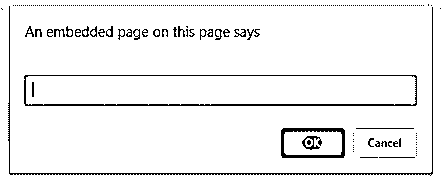


**进入输入输出后:**

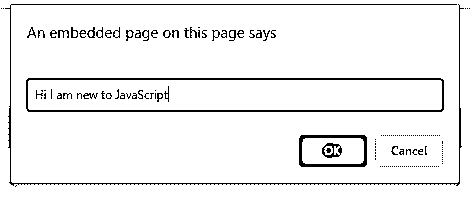


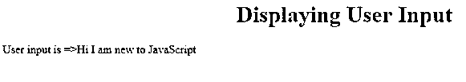


**说明:**

*   从上面的输出可以看出，prompt()给出了一个没有任何文本的弹出窗口。
*   弹出窗口打开后，输入一些文本，然后单击确定或回车。
*   提供的输入在输出中显示为上述输出。

#### 示例 2–显示用户输入的数组值。

**代码:**

```
<!DOCTYPE html>
<html>
<body>
<font color="green">
<h1 align="center">Displaying User Input</h1>
</font>
<script>
function getMyArray() {
var userInputArray=[];
for(let i=0;i<=9;i++)
{
userInputArray.push(prompt("enter array index "+(i+1)+" value","1"));
}
document.write("User input is Array values are =>")
for(let i=0;i<=9;i++)
{
document.write(userInputArray[i]+"<br>");
}
}
getMyArray();
</script>
</body>
</html>
```

**进入输入输出前:**

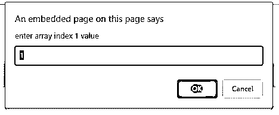


**进入输入输出后:**

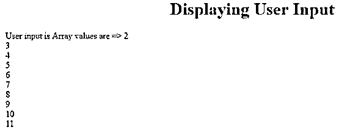


**说明:**

*   正如你在上面的代码中看到的,[用 unserInputArray 名称定义了一个空数组](https://www.educba.com/javascript-empty-array/)。
*   在 for 循环中，由于用户动态输入了 10 个值，提示出现了 10 次。
*   带有消息和默认值的提示。
*   通过使用数组的内置 push 方法(push())将每个值添加到数组中。
*   下一个 for 循环迭代数组值并显示给用户。

#### 示例 3–显示用户输入值的加、乘、减和除。

**代码:**

```
<!DOCTYPE html>
<html>
<body>
<font color="green">
<h1 align="center">Displaying Addition, Subtraction, Multiplication and Division for User Input</h1>
</font>
<script>
var a=parseInt(prompt("enter first value","1"));
var b=parseInt(prompt("enter second value","2"));
function getMyAddition() {
document.write("Addition of "+a+" and "+b+" is =>"+(a+b)+"<br>");
}
function getMySubtraction() {
document.write("Subtraction of "+a+" and "+b+" is =>"+(b-a)+"<br>");
}
function getMyMultiplication() {
document.write("Multiplication of "+a+" and "+b+" is =>"+(a*b)+"<br>");
}
function getMyDivision() {
document.write("Division of "+a+" and "+b+" is =>"+(b/a));
}
getMyAddition();
getMySubtraction();
getMyMultiplication();
getMyDivision();
</script>
</body>
</html>
```

**进入输入输出前:**

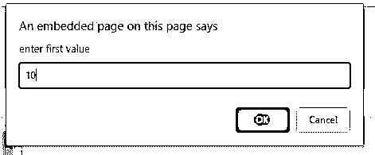


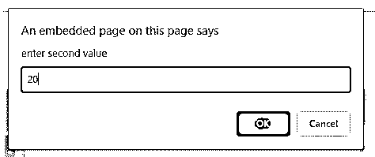


**进入输入输出后:**

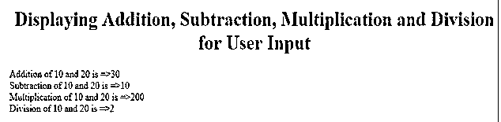


**说明:**

*   在上面的代码中，要求用户输入 2 个输入值。
*   您可以看到用 parseInt()解析的提示值，因为默认情况下，用户输入的输入被视为字符串。
*   getMyAddition()函数将 10 和 20 相加得到 30。
*   getMySubtraction()函数给出了两个数 10 的加法，20 等于 10。
*   函数的作用是:将 10 和 20 相加得到 200。
*   getMyDivision()函数给出了两个数 10 和 20 的加法是 2。

#### 示例 4–显示从用户输入值开始的 50 个数的总和。

**代码:**

```
<!DOCTYPE html>
<html>
<body>
<font color="green">
<h1 align="center">Sum of 50 numbers from a number entered by User</h1>
</font>
<script>
var a=parseInt(prompt("enter a value to start sum"));
var initial=a;
var sum=0;
var temp=50;
function getMySum() {
while(temp>0)
{
sum=sum+a;
a++;
temp--;
}
document.write("Sum of 50 numbers from strating "+initial+" is =>"+sum);
}
getMySum();
</script>
</body>
</html>
```

**进入输入输出前:**

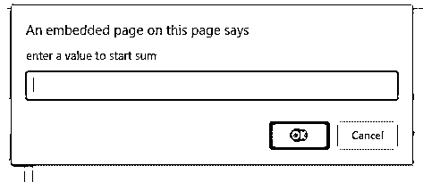


**After entering input-Output:**


**说明:**

*   在上面的代码中，输入是从用户处获取的，并对其进行解析，因为用户输入了默认字符串。
*   您很清楚地看到，提示也可以不使用默认值。
*   在临时变量中存储 while 循环 50 次迭代的值 50。
*   在总和变量中存储值 0
*   在初始变量中存储用户输入的值，因为我们可以在输出显示中将该值作为一个玩笑。
*   在 while 循环中，它每次都检查 temp 是否> 0。如果执行时为 true。

```
50>0 so
Sum=0+a; Here a=3 so sum=3
a++=>4
temp--=>49
```

*   同样，while 循环执行 49>0 所以

```
Sum=3+a; Here a=4 so sum=7
a++=>5
temp--=>48
```

*   同样，while 循环执行 48>0 所以

```
Sum=7+a; Here a=5 so sum=12
a++=>6
temp--=>47
```

*   如此等等，直到 while 循环为假(0>0)。
*   在整个 while 输出执行之后，从 3 开始打印为 1375 sum。

#### 示例 5–根据相应的用户输入显示习惯

**代码:**

```
<!DOCTYPE html>
<html>
<body>
<font color="green">
<h1 align="center">Display your habit based on Choosen color</h1>
</font>
<script>
function getMySum(color) {
var myHobby="";
switch(color)
{
case "Red":
myHobby = "Playing Cricket!";
break;
case "Green":
myHobby = "Singing Songs!";
break;
case "Blue":
myHobby = "Dancing!";
break;
case "White":
myHobby = "Reading Books!";
break;
default:
myHobby = "You can be habituated to anything!";
}
return myHobby;
}
var color=prompt("which color do you like most?");
var hobby=getMySum(color);
document.write(hobby);
alert(hobby);
</script>
</body>
</html>
```

**进入输入输出前:**

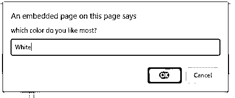


**进入输入输出后:**

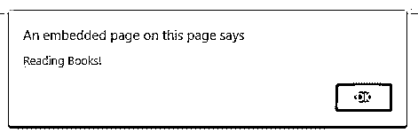


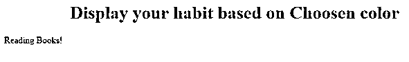


**说明:**

*   在上面的代码中输入从 getMyHobby()函数传递来的内容。
*   当用户输入任何颜色时，基于颜色的切换情况会相应的爱好。
*   输出将分别显示在警告框和控制台中。

### 结论

提示用于明确输入用户的值。prompt()函数可以与消息和默认文本或空提示()一起使用

### 推荐文章

这是一个 JavaScript 提示指南。这里我们讨论 JavaScript 提示的工作和不同的例子。您也可以看看以下文章，了解更多信息–

1.  [在 JavaScript 中反转](https://www.educba.com/reverse-in-javascript/)
2.  [JavaScript 闭包](https://www.educba.com/javascript-closure/)
3.  [JavaScript 设置类](https://www.educba.com/javascript-set-class/)
4.  [JavaScript 自定义事件](https://www.educba.com/javascript-custom-events/)


