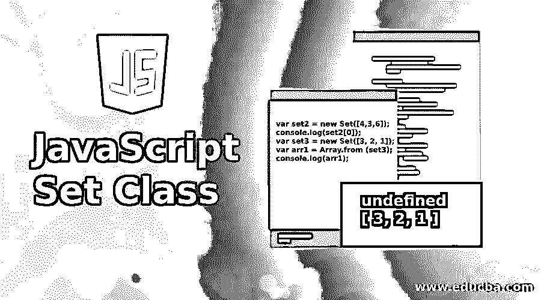

# JavaScript 集合类

> 原文：<https://www.educba.com/javascript-set-class/>




## 介绍**到** Javascript Set 类

让我们来看集合的纯粹定义，它是可识别的不同对象的明确定义的集合，被认为是一个对象。例如，4，3，9，6 在单独考虑时是不同的对象，但在作为一个集合考虑时，它们形成一个大小为 4 的集合，写作{4，3，9，6}。

在计算机语言中，集合是具有 ES6 的新对象的抽象数据类型，即 ECMAScript 6 是自 2015 年以来 javascript 的当前标准，它允许创建唯一值的集合。这些值可以是字符串、整数等基本类型，也可以是对象文字或数组等复杂对象。ES6 中的集合是有序的，并被视为使用键的键集合，可以按照插入顺序进行迭代。

<small>网页开发、编程语言、软件测试&其他</small>

### 句法

创建新集合的语法。

**Set 有一个内置的构造函数:**

```
var set_name = new Set();
var set_name = new Set([set of values separated with comma]);
```

**初始化集合:**

```
var set1 = new Set();
var set2 = new Set([4,3,6]);
```

由于 set 接收 iterable 对象作为它的输入参数，我们可以从不包含重复项的数组中构造 set。

```
var set2 = new Set([4,3,6]); returns {4, 3, 6}
var arr1 = Array.from(set2); returns [4, 3, 6]
```

Set 不支持通过索引随机访问元素，即 set2[0]将返回 undefined，而数组将返回 4

**举例:**

```
var set2 = new Set([4,3,6]);
console.log(set2[0]);
var set3 = new Set([3, 2, 1]);
var arr1 = Array.from (set3);
console.log(arr1);
```

**输出:**


如果我们不指定集合的可迭代数据，它将返回 null，集合为空。集合中使用了一些方法。它们适用于布景。

*   增加
*   删除
*   大小
*   清楚的
*   有
*   .为每一个

1.Set.add(value)返回添加了值的集合本身。重复调用相同的值不会损害集合，因为它只接受唯一的值

2.Set.delete(value)返回布尔值 true 或 false，并从集合中删除该值。

3.Set.size 是集合中元素的大小。

4.Set.clear()从集合中移除可迭代数据。

5.Set.has(value)检查集合中的指定值，如果集合由指定值组成，则返回 true，否则返回 false。

6..forEach()是一个循环，用于迭代集合并打印值。

### JavaScript Set 类的示例

考虑一个展示所有方法的例子，

#### 示例#1

**代码:**

```
let students = new Set();
students.add('Rohan');
students.add('Srikanth');
students.add('Lekha');
console.log(students.size);
students.add('Reshma');
console.log(students.size);
console.log(students.delete('Lekha'));
console.log(students.has('Rohan'));
students.delete('Rohan');
console.log(students.has('Rohan'));
console.log(students.size);
students.forEach(student => {
console.log(`Hi ${student}`)
});
```

**输出:**


在这里，学生是一个新的学生姓名集合，我们添加了' Rohan '，' Srikanth '，' Lekha '使用。add()方法并检查集合的大小。对集执行了. delete()方法以移除“Lekha ”,该方法返回 true，因为 iterable 存在并且删除成功。同样我们检查了。has()方法返回一个布尔值。

.forEach()迭代集合并通过循环集合返回每个值。

#### 实施例 2

从数组中删除重复的元素:如上所述，set 只接受唯一的值/元素。让我们考虑一组具有重复元素但可以移除这些重复的元素。

**代码:**

```
const numbers = [2,3,4,4,2,3,3,4,4,5,5,6,6,7,5,32,3,4,5]
console.log([...new Set(numbers)])
```

**输出:**


#### 实施例 3

与字符串的关系:使用 set 类，我们可以找到字符串的大小。让我们考虑字符串“Canada ”,并将该字符串传递给 set。

**代码:**

```
let text = 'Europe';
var mySet = new Set(text  // Set ['E', 'u', 'r', 'o', 'p', 'e']
console.log(mySet.size);
```

**输出:**


文本“Europe”被传递给 mySet，后者又将字符串转换成一组键。

让我们看看一些基本的集合运算，如超集、子集、并集、交集和差集。

*   如果集合 A 是集合 b 的超集，则超集返回 true。
*   如果集合 A 是集合 B 的子集，即集合 A 的所有元素都出现在集合 B 中，则 subSet 返回 true。
*   如果集合由集合 A 和集合 b 的组合组成，则 union 返回 true。
*   如果集合由同时出现在集合 A 和集合 b 中的元素组成，则交集返回 true。
*   如果集合 A 和集合 B 的差包含集合 A 中存在而集合 B 中不存在的一组元素，则差返回 true。

#### 实施例 4

子集示例

**代码:**

```
Set.prototype.subSet = function(exampleSet)
{
if(this.size > exampleSet.size)
return false;
else
{
for(var element of this)
{
if(!exampleSet.has(element))
return false;
}
return true;
}
}
var setA = new Set([1,2,3]);
var setB = new Set([4,6,3,2,1]);
console.log(setA.subSet(setB));
```

**输出:**


由于集合 B 由集合 A 的元素组成，subSet 返回 true。

### 弱集

在集合中，元素不被垃圾收集，而在弱集合中，所有的元素都被垃圾收集。弱集中的每个键都是一个对象。当对象的引用丢失时，弱集被垃圾收集。正规集和弱集的区别是，我们不能迭代弱集，而在正规集中，它可以迭代。弱集合的所有元素都可以被清除，而在正常集合中，元素可以被清除。可以检查正常集合的大小，而对于弱集合，不能检查大小。弱集只有 3 个方法，add()，has()和 delete()。

### 集合和数组的比较

Set 只包含不同的元素，union()、difference()、intersect()、subset()等基本操作是基于内置操作符实现的，而 array 则适用于具有快速访问和修改功能(如添加和删除元素)的有序元素。

一般来说，集合并不比数组更有优势，除非用户希望用基本操作集合来维护不同的数据，而不直接访问元素，否则可以认为数组获取元素所需的工作更少。因此，我们可以这样总结本文:只有在处理数据集中的唯一元素时，才应该使用集合。新的 ES6 类允许 set 只接受不同的对象，要从集合中删除元素，可以使用 delete 方法，而在数组中，我们必须使用循环迭代，然后使用 splice 删除，还可以使用 spread 运算符将集合转换为数组。

### 推荐文章

这是一个 JavaScript 集合类的指南。这里我们讨论基本概念、例子、弱集合以及集合和数组之间的比较。您也可以看看以下文章，了解更多信息–

1.  [Javascript 匿名函数](https://www.educba.com/javascript-anonymous-function/)
2.  [Javascript 嵌套函数](https://www.educba.com/javascript-nested-functions/)
3.  [JavaScript 日期函数](https://www.educba.com/javascript-date-function/)
4.  [JavaScript 未定义](https://www.educba.com/javascript-undefined/)


