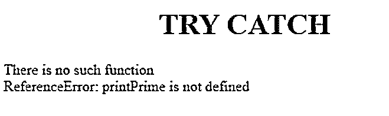
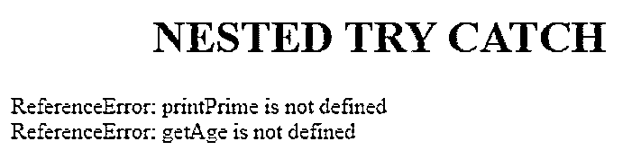
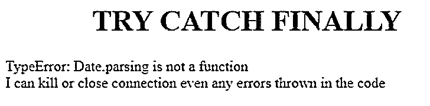

# JavaScript 尝试捕捉

> 原文：<https://www.educba.com/javascript-try-catch/>


## JavaScript Try Catch 简介

try catch 语句标记要尝试的语句块，并指定在引发异常时的响应。我们可以用 catch 或 finally 声明 try 块，并在 JavaScript 中嵌套 try 块，而不会受到 JavaScript 引擎的任何抱怨。

*   **Try Block:** Try block 用于写不能被零整除、数组索引越界异常等错误代码。
*   **Catch 块:** Catch 块用于捕捉或写入错误输出。
*   **Finally Block:**Finally Block 用于编写非常重要的代码，比如终止连接、关闭连接等。即使 try 块中有错误，它也会执行。

### JavaScript 中的 Try 和 Catch 块是如何工作的？

Try 块总是与 catch 块或 finally 块一起工作。如果两者都没有，那么 JavaScript 引擎会抛出一个错误，没有 catch 或 finally 块。

<small>网页开发、编程语言、软件测试&其他</small>

Catch 块总是只与 try 块一起工作。我们可以用一个 try 块包含多个 catch 块。

**语法:**

```
<script>
try
{
//error code
}
catch(err)
{
//error output
}
</script>
```

*   在 JavaScript 中我们可以有一个嵌套的 try 块。
*   我们可以用一个 try 块声明多个 catch 块，JavaScript 引擎不会出错。

### Try and Catch 块的示例

Try 用于保护可能发生异常的代码块。下面给出了 try 和 catch 块的示例:

#### 1.带有 Catch 块的单个 Try 块

**语法:**

```
<script>
try
{
//error code
}
catch(err)
{
//error output
}
</script>
```

**代码:**

```
<!DOCTYPE html>
<html>
<body>
<font color="green">
<h1 align="center">TRY CATCH</h1>
</font>
<script>
function doTryCatch()
{
try
{
printPrime();
}
catch(err)
{
document.write("There is no such function");
document.write("<br>"+err); //prints what is the error exactly by JavaScript Engine
}
}
doTryCatch();
</script>
</body>
</html>
```

**输出:**




**代码解释:**

*   在 try 块中，我们试图调用 printPrime()，但是没有那个方法。所以，这里用 catch 块捕捉异常。
*   Catch 块抛出用户定义的(没有这样的函数)和实际错误(err=>ReferenceError: PrintPrime 未定义)。

#### 2.带有多个 Catch 块的单个 Try 块

*   有趣的是，在 JavaScript 中，我们没有一次尝试使用多个 catch 块。如果我们遇到这种情况，我们可以通过 if-else 语句或 switch case 来实现。

#### 3.嵌套的 Try Catch 块

无论何时，如果我们想在 try 块中再次捕获异常或错误。我们必须采用嵌套的 try 块概念。

**语法:**

```
<script>
try
{
//error code
try
{
//error code
}
catch(err)
{
//error output
}
}
catch(err)
{
//error output
}
</script>
```

**代码:**

```
<!DOCTYPE html>
<html>
<body>
<font color="green">
<h1 align="center">NESTED TRY CATCH</h1>
</font>
<script>
function doNestedTryCatch()
{
try
{
try{
printPrime();//getPrint() function calling
}
catch(err)
{
document.write(err+"<br>");
}
getAge(); //getAge() function calling
}
catch(err)
{
document.write(err);
}
}
doNestedTryCatch();
</script>
</body>
</html>
```

**输出:**




**说明:**

*   我在 try 块中有一个情况未知的方法两次。所以，我不想把它丢给一个 catch 块，然后我又做了一次尝试，在 try 块中捕捉块。
*   因为没有 printprime()方法，所以它给出第一个 catch 块输出，然后因为没有 get()方法，所以给出第二个 catch 块输出。

#### 4.尝试、捕捉并最终阻止

**语法:**

```
<script>
try
{
//error code
}
catch(err)
{
//error output
}
finally
{
//closing or kill connections code
}
</script>
```

**代码:**

```
<!DOCTYPE html>
<html>
<body>
<font color="green">
<h1 align="center">TRY CATCH FINALLY</h1>
</font>
<script>
function doTryCatchFinally()
{
try
{
var p=Date.parsing("January 1,2020");
}
catch(error)
{
document.write(error+"<br>");
}
finally
{
document.write("I can kill or close connection even any errors thrown in the code");
}
}
doTryCatchFinally();
</script>
</body>
</html>
```

**输出:**




**说明:**

*   Try 块抛出一个错误，catch 块发现我们没有带 Date 类的解析方法。
*   最后，块自动执行，即使我们有错误，所以它执行输出。

**Note:** We cannot declare catch or finally block without try block.

*   当我们处理 try、catch 和 finally 语句时，我们必须知道 JavaScript 中 try-catch 抛出的一些错误。

### JavaScript 中的重要错误

内置的 JavaScript 错误对象知道所有的错误。它给你一个错误名称和错误信息。

#### 1.测距误差

当我们试图给变量或不可能的迭代赋值时，就会遇到这个错误。

**语法:**

```
var a=-6;
try{
var name="Amardeep";
name.repeat(a); //throws negative repeat number range error
}
catch(error)
{
documents.write(error.name);
}
```

#### 2.句法误差

预定义的方法或语句使用不正确，如果你试图访问它们，那么我们会得到这个错误。

**语法:**

```
try{
var date=Date.parsing("12-10-2019"); //no such method parsing in JavaScript so syntax error
}
catch(error)
{
documents.write(error.name);
}
```

#### 3.类型错误

如果您试图将一种类型转换为另一种类型，但如果这是不可能的，那么我们会得到这个错误。

**语法:**

```
try{
var date=Date.parse("ABC"); //You can't convert ABC string to date so error throws
}
catch(error)
{
documents.write(error.name);
}
```

#### 4.参考误差

试图访问未定义的变量，然后我们会得到这个错误

**语法:**

```
var a=2,b=3;
try{
documents.write(c)//No such variable "c", it throws error
}
catch(error)
{
documents.write(error.name);
}
```

### 推荐文章

这是一个 JavaScript Try Catch 的指南。这里我们讨论 javascript 的简介和重要错误，以及不同的例子和代码实现。您也可以看看以下文章，了解更多信息–

1.  [JavaScript 关键字](https://www.educba.com/javascript-keywords/)
2.  [JavaScript 中的错误](https://www.educba.com/errors-in-javascript/)
3.  [JavaScript 设置类](https://www.educba.com/javascript-set-class/)
4.  [JavaScript 滚动到顶部](https://www.educba.com/javascript-scroll-to-top/)


