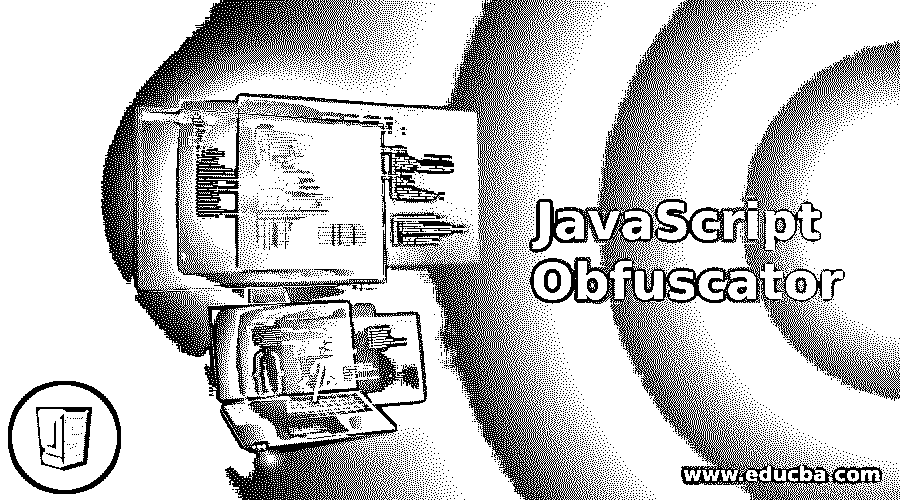
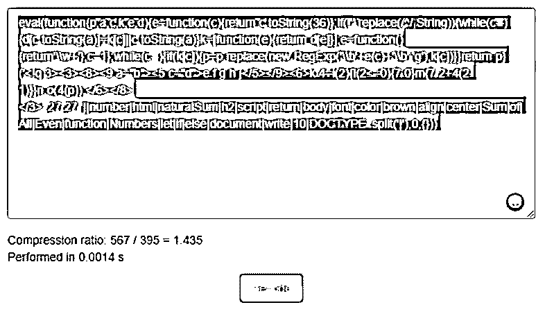
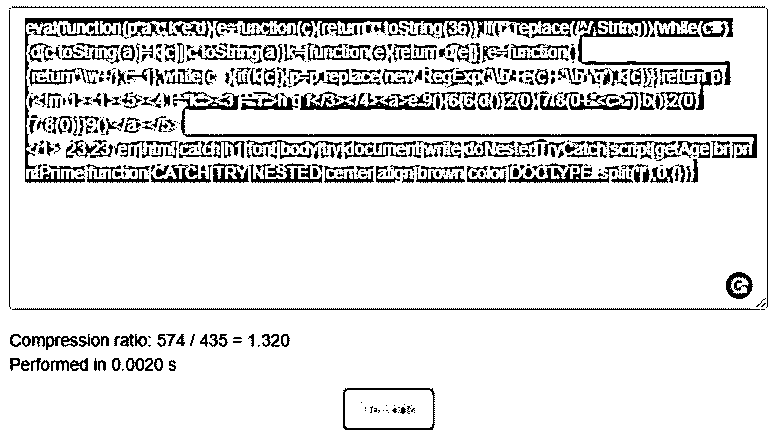
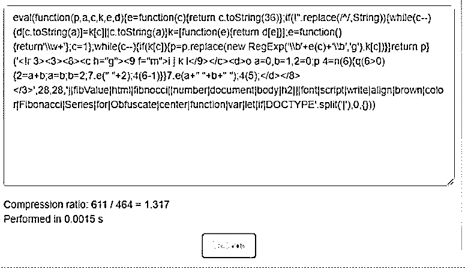
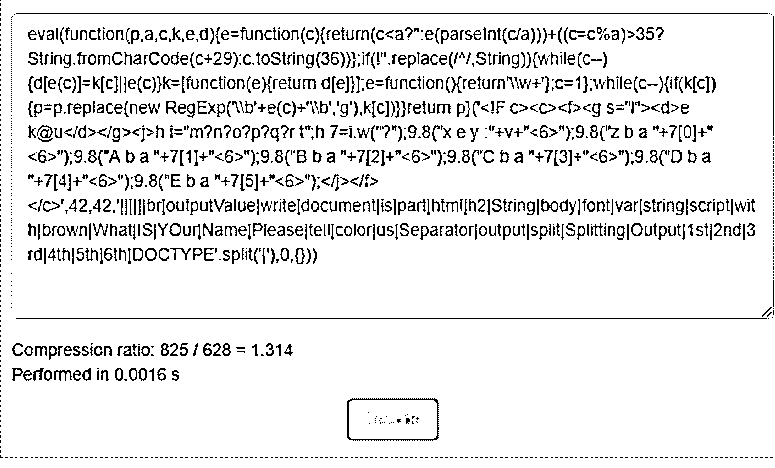
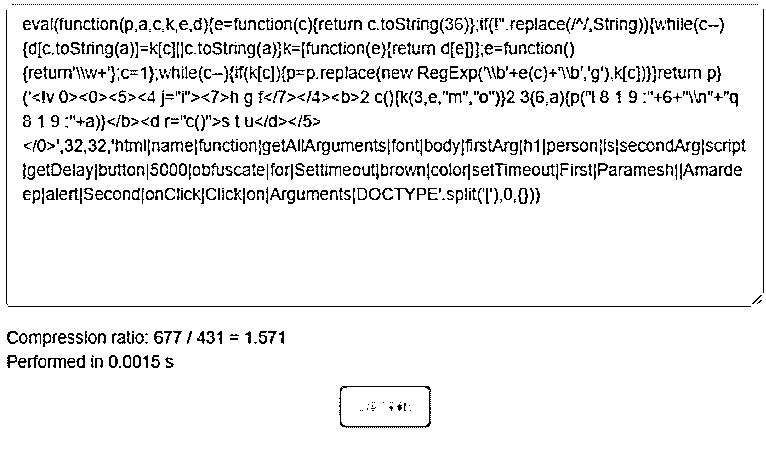
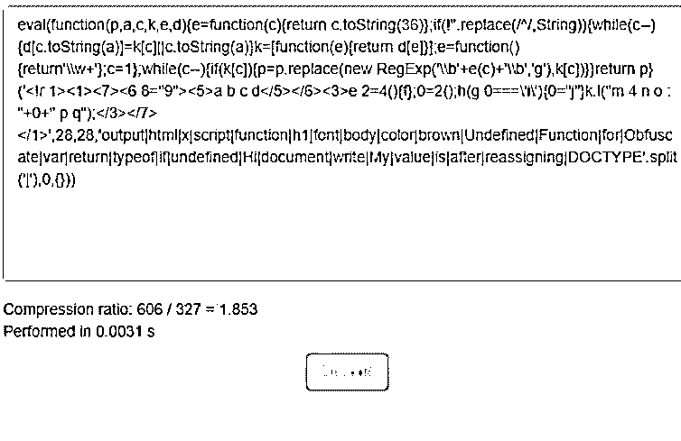
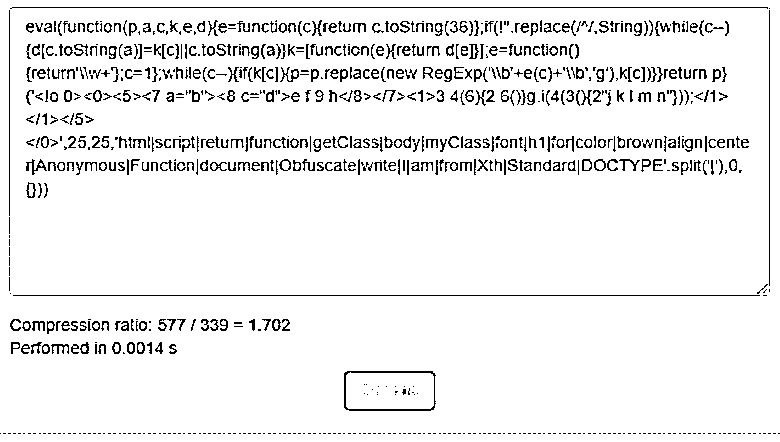

# JavaScript 混淆器

> 原文：<https://www.educba.com/javascript-obfuscator/>




## JavaScript 混淆器简介

JavaScript 混淆器通过将代码转换为机器语言，将 JavaScript 的实际源代码转换或编码为不可读的格式，因为它从未经授权的最终用户那里窃取代码。这个过程在 JavaScript 中是 100%安全的，也是保护源代码的最佳方式。

**注意:**不建议混淆客户端脚本，因为根据您的应用程序权重，混淆后的代码会慢 10-85%。转换后的模糊文件比实际文件大一点。

<small>网页开发、编程语言、软件测试&其他</small>

**优势**

*   保护实际代码或逻辑免受未经授权的第三方用户的攻击。
*   编码形式或不可读形式。

### 什么是 JavaScript 混淆器？

JavaScript Obfuscator 是一个工具，用于将源代码混淆成不可理解的格式，以保护代码。

我们有不同的在线工具来混淆我们的 JavaScript 代码。

其中一些列举如下:

*   [https://javascriptobfuscator.com/Javascript-Obfuscator.aspx](https://javascriptobfuscator.com/Javascript-Obfuscator.aspx)
*   [https://obfuscator.io/](https://obfuscator.io/)
*   [https://beautifytools.com/javascript-obfuscator.php](https://beautifytools.com/javascript-obfuscator.php)
*   [https://www . daft logic . com/projects-online-JavaScript-obfuscator . html](https://www.daftlogic.com/projects-online-javascript-obfuscator.htm)

### 我们为什么使用它们？

**实时场景:**如果我们有像卫星相关的源代码，印度陆军，印度海军，专利技术内容等。这种源代码是保密的，所以我们必须以编码的形式存储。因此，在 JavaScript 中，我们可以通过使用混淆器概念对其进行编码。

**注意:**我们也可以通过使用不同的在线工具对混淆代码进行解混淆，但编码形式有特定的模式，因此在解码时我们也必须遵循该模式来获得准确的源代码。这只有开发者和客户知道。这是机密。

使用了 http://beautifytools.com/javascript-obfuscator.php#的**在线编译器对所有示例的源代码进行混淆处理。**

 **### JavaScript 混淆器的示例

下面是下面提到的例子:

#### 示例#1

自然数求和混淆。

**代码:**

```
<!DOCTYPE html>
<html>
<body>
<font color="brown"><h2 align="center">Sum of All Even Numbers</h2></font>
<script>
let naturalSum=function(number)
{
if(number<=0){
return 0;
}
else{
return number+naturalSum(number-1);
}
}
document.write(naturalSum(10));//display the output in the browser
</script>
</body>
</html>
```

**输出:**




**说明:**

*   在上述在线编译器中编写 JavaScript 代码后，单击 obfuscate 按钮。
*   代码将被转换成不可理解的格式。这就是我们所说的混淆代码。
*   如你所见，我们也可以通过点击解码按钮来解码代码。

#### 实施例 2

嵌套的 Try Catch 混淆。

**代码:**

```
<!DOCTYPE html>
<html>
<body>
<font color="brown">
<h1 align="center">NESTED TRY CATCH</h1>
</font>
<script>
function doNestedTryCatch()
{
try
{
try{
printPrime();//getPrint() function calling
}
catch(err)
{
document.write(err+"<br>");
}
getAge(); //getAge() function calling
}
catch(err)
{
document.write(err);
}
}
doNestedTryCatch();
</script>
</body>
</html>
```

**输出:**




**说明:**

*   在上述在线编译器中编写 JavaScript 代码后，单击 obfuscate 按钮。
*   代码将被转换成不可理解的格式。这就是我们所说的混淆代码。
*   如你所见，我们也可以通过点击解码按钮来解码代码。

#### 实施例 3

嵌套的 Try Catch 混淆。

**代码:**

```
<!DOCTYPE html>
<html>
<body>
<font color="brown"><h2 align="center">Fibonacci Series for Obfuscate</h2></font>
<script>
var a=0,b=1,fibValue=0;
let fibnocci=function(number)//function
{
if(number>0)//base function
{
fibValue=a+b;
a=b;
b=fibValue;
document.write(" "+fibValue);
fibnocci(number-1);
}
}
document.write(a+" "+b+" ");
fibnocci(5);
</script>
</body>
</html>
```

**输出:**




**说明:**

*   在上述在线编译器中编写 JavaScript 代码后，单击 obfuscate 按钮。
*   代码将被转换成不可理解的格式。这就是我们所说的混淆代码。
*   如你所见，我们也可以通过点击解码按钮来解码代码。

#### 实施例 4

分割字符串混淆。

**代码:**

```
<!DOCTYPE html>
<html>
<body>
<font color="brown"><h2>String with @ Separator</h2></font>
<script>
var string= "What?IS?YOur?Name?Please?tell us";
varoutputValue=string.split("?");
document.write("Splitting String Output :"+output+"<br>");
document.write("1st part is "+outputValue[0]+"<br>");
document.write("2nd part is "+outputValue[1]+"<br>");
document.write("3rd part is "+outputValue[2]+"<br>");
document.write("4th part is "+outputValue[3]+"<br>");
document.write("5th part is "+outputValue[4]+"<br>");
document.write("6th part is "+outputValue[5]+"<br>");
</script>
</body>
</html>
```

**输出:**




**说明:**

*   在上述在线编译器中编写 JavaScript 代码后，单击 obfuscate 按钮。
*   代码将被转换成不可理解的格式。这就是我们所说的混淆代码。
*   如你所见，我们也可以通过点击解码按钮来解码代码。

#### 实施例 5

setTimeOut()函数混淆。

**代码:**

```
<!DOCTYPE html>
<html>
<body>
<font color="brown">
<h1>Settimeout for obfuscate</h1>
</font>
<script>
function getDelay()
{
setTimeout(getAllArguments, 5000,"Paramesh","Amardeep");
}
function getAllArguments(firstArg,secondArg)
{
alert("First person name is :"+firstArg+"\n"+"Second person name is :"+secondArg);
}
</script>
<button onClick="getDelay()">Click on Arguments</button>
</body>
</html>
```

**输出:**




**说明:**

*   在上述在线编译器中编写 JavaScript 代码后，单击 obfuscate 按钮。
*   代码将被转换成不可理解的格式。这就是我们所说的混淆代码。
*   如你所见，我们也可以通过点击解码按钮来解码代码。

#### 实施例 6

未定义的函数混淆。

**代码:**

```
<!DOCTYPE html>
<html>
<body>
<font color="brown">
<h1>Undefined Function for Obfuscate</h1>
</font>
<script>
var x=function() //function declaration
{
return;
};
output=x(); // function invoking
if(typeof output==='undefined')
{
output="Hi, Amardeep"
}
document.write("My function value is : "+output+" after reassigning");
</script>
</body>
</html>
```

**输出:**




**说明:**

*   在上述在线编译器中编写 JavaScript 代码后，单击 obfuscate 按钮。
*   代码将被转换成不可理解的格式。这就是我们所说的混淆代码。
*   如你所见，我们也可以通过点击解码按钮来解码代码。

#### 实施例 7

匿名函数混淆。

**代码:**

```
<!DOCTYPE html>
<html>
<body>
<font color="brown">
<h1 align="center">Anonymous Function for Obfuscate</h1>
</font>
<script>
function getClass(myClass)
{
return myClass(); //invoking anonymous funtion
}
document.write(getClass(function (){
return "I am from Xth Standard";
}));
</script>
</script>
</body>
</html**>**
```

**输出:**




**说明:**

*   在上述在线编译器中编写 JavaScript 代码后，单击 obfuscate 按钮。
*   代码将被转换成不可理解的格式。这就是我们所说的混淆代码。
*   如你所见，我们也可以通过点击解码按钮来解码代码

### 推荐文章

这是一个 JavaScript 混淆器指南。为了更好地理解，我们在这里讨论 JavaScript 混淆器的介绍以及相应的例子。您也可以看看以下文章，了解更多信息–

1.  [汉堡菜单 JavaScript](https://www.educba.com/hamburger-menu-javascript/)
2.  [JavaScript 数组串联](https://www.educba.com/javascript-array-concat/)
3.  [JavaScript 对象到字符串](https://www.educba.com/javascript-object-to-string/)
4.  [JavaScript 枚举](https://www.educba.com/javascript-enum/)


**