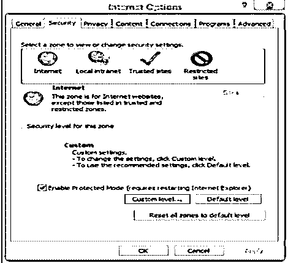
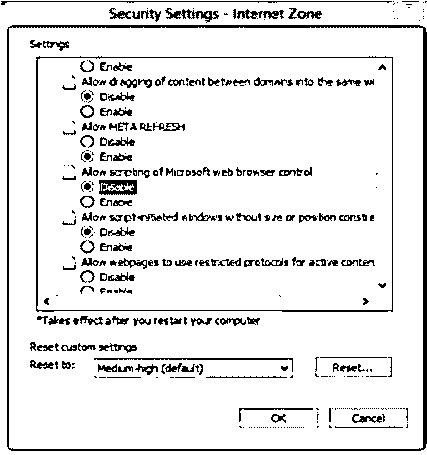
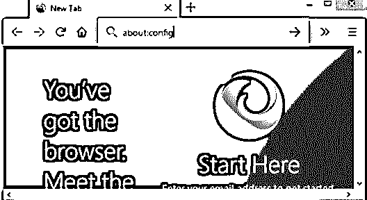
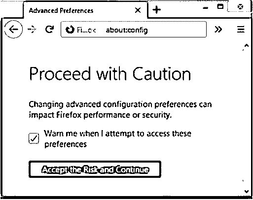
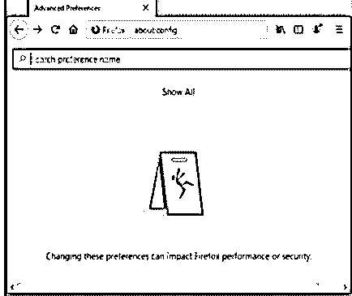
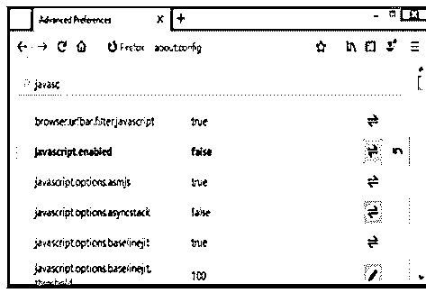

# 禁用 JavaScript

> 原文：<https://www.educba.com/disable-javascript/>

## 禁用 JavaScript 简介

JavaScript 作为一个有趣的因素来处理各种最新的功能，如弹出窗口、广告、cookies、警告、滚动和许多其他功能。用户可以禁用此 JavaScript 代码来完成所需的功能。通过使用一些可访问性指南，这将有助于减少用户的工作量和处理 JavaScript 残疾功能。通过使用 web 扩展，我们可以决定是启用还是禁用特定选项卡或给定主机的 JavaScript。现在，一天的 JavaScript 是默认安装的，并在所有互联网浏览器上启用，如果你试图禁用这些 JavaScript，那么你就不能正确地看到网站功能的结果。

### 禁用 JavaScript 的语法

让我们看看语法:

<small>网页开发、编程语言、软件测试&其他</small>

禁用 JavaScript 的第一步，您必须使用正确的说明从给定的列表中选择浏览器，这将因浏览器的不同而异:

#### 1.微软公司出品的 web 浏览器

首先，我们将看到如何禁用互联网浏览器的 JavaScript。

*   首先你必须打开 Internet Explorer。
*   然后单击浏览器窗口右上角的工具菜单。
*   现在我们必须从选择列表中选择互联网选项。
*   从这个互联网选项，我们必须点击安全标签。
*   通过这一点，我们将按下自定义级别按钮。
*   现在，我们非常接近于选择禁用选项，是的，从给定的选项列表中向下滚动以找到活动脚本选项有各种选项可供用户选择，从列表中选择禁用选项。现在我们可以禁用 Internet Explorer 的 JavaScript。

#### 2.谷歌浏览器

谷歌浏览器的步骤如下。

*   首先你得打开谷歌浏览器。
*   现在进入下一步，我们从谷歌浏览器窗口的右上角选择自定义和控制。
*   现在我们必须从可用的下拉菜单列表中选择设置。
*   在列表中的所有选项中，我们可以看到还有一个已经显示在那里的选项，即“显示高级设置”选项。
*   在那里，我们会发现选项在隐私部分，内容设置，所以点击这个按钮。
*   因此，为了管理 JavaScript，我们必须单击“管理异常”按钮来处理 JavaScript 的各种选项，通过该按钮，我们可以选择“禁用选项”来查看实际结果。
*   一旦你完成了所有的修改，最后一步就是点击完成按钮来保存修改。

#### 3.Mozilla Firefox

现在我们来看看如何禁用浏览器 Mozilla Firefox 的 JavaScript。

*   首先，我们将打开 Firebox 浏览器。
*   现在，我们将从地址栏中找到 about:config，然后在它旁边单击 Enter。
*   接下来，我们将单击位于用户屏幕中央的“我接受风险”按钮。
*   下一步是从浏览器窗口禁用 JavaScript，因此我们将键入 0020javascript.disabled。
*   现在，我们将右键单击选项 javascript.disabled，它位于搜索栏下方。

#### 4.旅行队

现在我们将看到 Safari 浏览器的相同过程，详细过程如下。

*   第一步，我们将打开 Safari 浏览器。
*   现在，我们将通过浏览器右上角的图标选择菜单。
*   将有一个可用的选择列表，因此我们将从中选择首选项选项。
*   在此步骤中，我们将单击“安全”选项卡，以访问 Web 内容部分。
*   下一步是从可用复选框中选择禁用 JavaScript 选项。

#### 5.歌剧

也可以在 opera 浏览器中禁用 JavaScript。

*   首先打开 Opera 浏览器。
*   按下自定义和控制 opera 选项，该选项位于浏览器窗口的左上角。
*   下一步，我们将从选择列表中选择选项设置。
*   在设置菜单中有一个选项叫做网站，点击它。
*   现在，您可以看到 JavaScript 部分，通过该部分，您可以根据需要选择适当的选项，如通过单击管理异常按钮禁用 JavaScript。

### 禁用 JavaScript 的示例

下面是一些例子:

#### 示例#1

在第一个例子中，我们将看到如何禁用 Internet Explorer 浏览器的 JavaScript。

**步骤 1:** 打开 Internet Explorer 浏览器，点击位于右上角的设置图标。它将打开选项列表，我们将从中选择如下互联网选项:

**步骤 2:** 现在将出现具有不同选项卡的窗口，我们通过该窗口选择安全选项卡。

**步骤 3:** 其中我们选择自定义级别选项，用于禁用浏览器窗口的 JavaScript 选项。

#### 实施例 2

在这里，我们将看到如何为 Mozilla Firefox 浏览器禁用 JavaScript。

**第一步:**首先打开 Mozilla Firebox 浏览器，在地址栏输入 about:config。

**步骤 2:** 在它旁边，我们点击按钮接受风险并继续进一步处理，因此进入下一个窗口，我们必须点击显示所有选项以查看下一个选项列表。

**第三步:**点击“显示所有选项”后，它将显示选项列表，通过该列表，我们可以选择 JavaScript enabled 选项，如果该选项为假，则点击切换以禁用该选项**。**

### 结论

因此，从所有的信息中，我们了解到，通过使用一些重要的步骤来满足用户的需求，也可以根据用户的选择禁用各种浏览器的 JavaScript。在这里，我们看到了如何禁用浏览器如 Mozilla，Google chrome，Safari，Internet Explorer 和许多其他浏览器的 JavaScript。

### 推荐文章

这是一个禁用 JavaScript 的指南。在这里，我们讨论禁用 JavaScript 的介绍和禁用 web 浏览器的例子。您也可以看看以下文章，了解更多信息–

1.  [设置属性 JavaScript](https://www.educba.com/setattribute-javascript/)
2.  [JavaScript 表单验证](https://www.educba.com/javascript-form-validation/)
3.  [JavaScript 中的导航器](https://www.educba.com/navigator-in-javascript/)
4.  [JavaScript 窗口事件](https://www.educba.com/javascript-window-events/)

