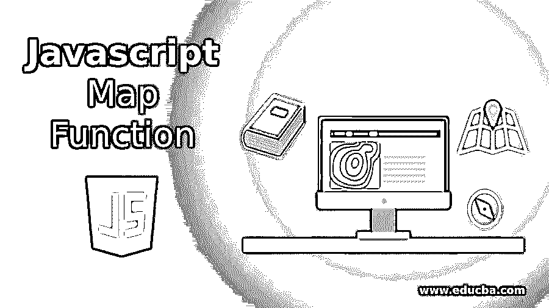
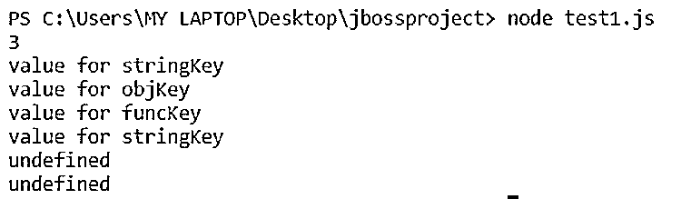
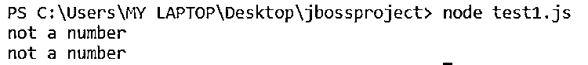
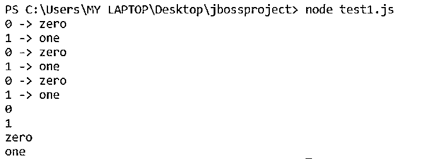
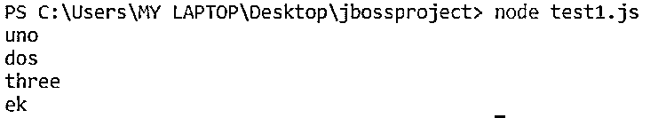

# Javascript 映射函数

> 原文：<https://www.educba.com/javascript-map-function/>




## Javascript 映射函数介绍

Map 是一个标准的内置对象，用于保存键-值对中的元素，它还重新收集键的原始插入序列。所有类型的值，如对象、原始值、函数等。，可以用作键或值。Javascript Map 函数对象在原始插入序列中迭代。如果 for each 循环用于迭代映射，则每次迭代都会产生一个键值对数组。

**语法:**

<small>网页开发、编程语言、软件测试&其他</small>

```
new Map( [itr] )
```

在这里，它是一个数组或任何其他键值对形式的可迭代对象。(例如，一个名为 arr 的 2 值数组，类似 arr =[' a '，' a 的值']，['b '，' b 的值']])。这些键值对中的每一个值都将被添加到新创建的映射中。

### 地图实例

所有地图实例都继承自 Map.prototype

**属性:**

*   **prototype.size:** 该属性将返回 map 中实例处存在的键-值对的数量。
*   **prototype.constructor:** 该属性将返回创建地图原型的函数。这是默认的地图功能。

**方法:**

*   **prototype.get( key ):** 该方法将返回键的关联值，如果键不在映射中，则返回 undefined。
*   **prototype.set( key，value ):** 如果键不存在，该方法将在映射中插入键-值对，否则用映射中的值更新键。
*   **prototype.clear( ):** 这个方法将从 Map 对象中删除所有的键值对。
*   **prototype.enteries( ):** 该方法将返回一个新的 iterable 对象，该对象将包含一个所有键值对的数组，其插入顺序与 Map 相同。
*   **prototype.delete( key ):** 如果 Map 对象中存在该键，该方法将返回 true，并将其从 Map 中删除，否则当 Map 中不存在该键时，该方法将返回 false。
*   **prototype.has( key ):** 这个方法将返回一个布尔结果来判断一个值是否与 Map 中提供的键相关联。
*   **prototype.keys( ):** 这个方法将返回一个 iterable 对象，它将包含 Map 对象中所有键的数组。
*   **prototype.values( ):** 这个方法将返回一个 iterable 对象，它将包含 Map 对象中所有值的数组。

### Javascript 映射函数的示例

javascript 映射函数的示例如下:

#### 1.使用地图对象

**代码:**

```
var mapObj= new Map()
var stringKey = 'Hello'
var objKey= {}
var funcKey = function () { }
// setting the values
mapObj.set(stringKey, "value for stringKey")
mapObj.set(objKey, "value for objKey")
mapObj.set(funcKey, "value for funcKey")
console.log(mapObj.size) // 3
// getting the values
console.log(mapObj.get(stringKey)) // "value for stringKey"
console.log(mapObj.get(objKey))    // "value for objKey"
console.log(mapObj.get(funcKey))   // "value for funcKey"
console.log(mapObj.get('Hello'))   // "value for stringKey"
// because stringKey === 'Hello'
console.log(mapObj.get({}))        // undefined, because objKey !== {}
console.log(mapObj.get(function () { })) // undefined, because funcKey !== function () {}
```

**输出:**




#### 2.使用 NaN 作为映射键

**代码:**

```
var mapObj = new Map()
mapObj.set(NaN, 'not a number')
console.log(mapObj.get(NaN)) // "not a number"
var somethingelse = Number('abc')
console.log(mapObj.get(somethingelse)) // "not a number"
```

**输出:**




#### 3.使用 forEach()循环迭代地图

**代码:**

```
var mapObj = new Map()
mapObj.set(0, 'zero')
mapObj.set(1, 'one')
mapObj.forEach(function (value, key) {
console.log(key + ' -> ' + value)
})
for (var [key, value] of mapObj.entries()) {
console.log(key + ' -> ' + value)
}
for (var [key, value] of mapObj) {
console.log(key + ' -> ' + value)
}
for (var key of mapObj.keys()) {
console.log(key)
}
for (var value of mapObj.values()) {
console.log(value)
}
```

**输出:**




#### 4.合并两张地图

**代码:**

```
var fMap = new Map([
[1, 'one'],
[2, 'two'],
[3, 'three'],
])
var sMap = new Map([
[1, 'uno'],
[2, 'dos']
])
// Merge two maps. The last repeated key wins.
// Spread operator essentially converts a Map to an Array
var outputMap = new Map([...fMap, ...sMap])
console.log(outputMap.get(1)) // uno
console.log(outputMap.get(2)) // dos
console.log(outputMap.get(3)) // three
var mergeMap = new Map([... fMap, ...sMap, [1,'ek']])
console.log(mergeMap.get(1)) // ek
```

**输出:**




### 对比地图和实物

地图和对象在某些方面通常是相似的，比如对象也有键值对。他们还可以获取与某个键相关的值，删除键值，更新键值，并找出某个键是否有相关的值。这就是为什么物体比地图更常用，但也有明显的区别，让我们看看下面的例子:

*   对象的键只能是字符串或符号，而映射可以接受任何值作为键，如函数、原语、数组等。
*   贴图的大小可以通过大小方法来确定，而对象的属性只能手动计算。
*   映射的键总是按照它们的插入顺序排序，而在 Object 中键是不排序的。
*   为了迭代一个对象，我们必须得到它的键，而映射是直接可迭代的。
*   在频繁添加和删除键值对的情况下，Map 的性能会更好。

### 结论

在数据采用键值形式并且定期更新的情况下，地图会变得很方便。映射中的键相等基于 sameValueZero 算法。NaN 与 NaN 相等(而它们不相等),所有其他值受===运算符管辖。

设置贴图的对象属性也是有效的。应注意这种情况，因为它会导致歧义。

```
var mapObj = new Map()
mapObj['abc'] = 'abcd';  // Results in Ambigous Map
MapObj.set('abc','abcd'); // Right way to set key-value pair
```

### 推荐文章

这是一个 Javascript 映射函数的指南。这里我们讨论 Javascript map 函数的基本概念、Map 实例和示例，以及代码和输出。您也可以浏览我们推荐的其他文章，了解更多信息——

1.  [JavaScript 的使用](https://www.educba.com/uses-of-javascript/)
2.  [备忘单 JavaScript](https://www.educba.com/cheat-sheet-javascript/)
3.  [JavaScript 未定义](https://www.educba.com/javascript-undefined/)
4.  [Python 地图功能](https://www.educba.com/python-map-function/)


