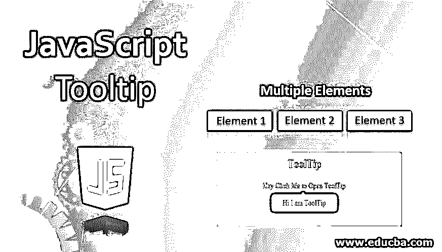
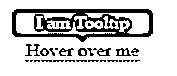
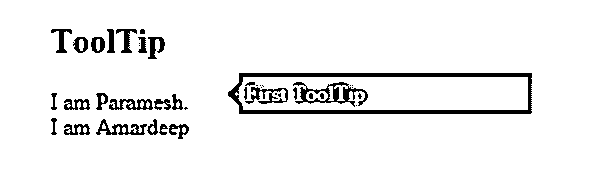
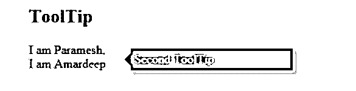
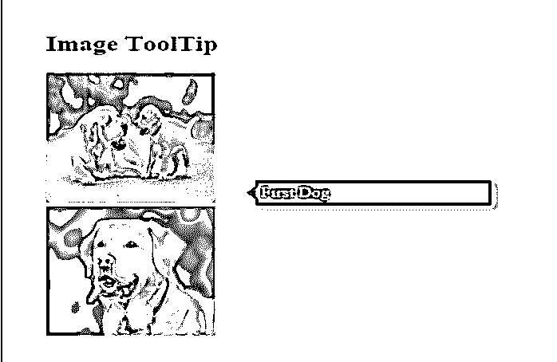
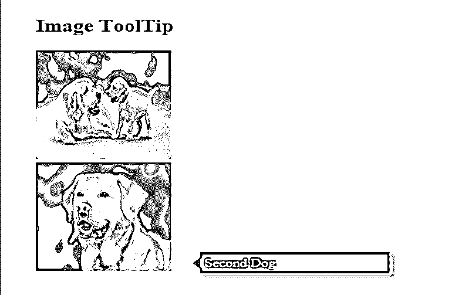

# JavaScript 工具提示

> 原文：<https://www.educba.com/javascript-tooltip/>




## JavaScript 工具提示简介

工具提示用于了解项目的详细信息，而无需通过单击或将光标悬停在项目上来打开项目。工具提示会在项目顶部显示一个小框，其中包含一些关于该项目的文本，方法是单击或将光标移动到该项上。

您可以在 JavaScript 中看到下图中的工具提示。

<small>网页开发、编程语言、软件测试&其他</small>




每当我们将光标悬停在“悬停在我的文本上”时，JavaScript 工具提示功能会弹出消息“我是工具提示”,即使没有点击它。工具提示动作我们也可以通过使用 HTML、CSS 和 jQuery 来实现。但是更准确的方法是只使用 JavaScript。

**优点:**

*   在实时场景中，空间在处理项目时起着至关重要的作用。
*   比如在 Flipkart **，**里面那么多产品项目。我们没有足够的空间来展示这个项目到底是什么。但是如果我们将光标悬停在它上面，我们会看到一些关于该项目的文本。在较小的空间内展示更多的商品，为顾客节省了大量的初始空间。

**缺点:**

*   如你所知，移动设备没有鼠标，所以没有光标，这个工具提示功能是不可用的。

### JavaScript 中的 Tooltip 是如何工作的？

在 JavaScript 预定义函数中获取工具提示特性。该函数是 toggle()。

**语法:**

```
var variableName = document.getElementById("id");
variableName.classList.toggle("class-name");
```

**说明:**

*   classList: 让我们访问 HTML 类名。
*   **toggle:** 通过点击文本显示工具提示文本——无需打开。

JavaScript 还有一种预定义的方式来获得工具提示特性。方式是 innerHTML = message。

**语法:**

```
tooltip.innerHTML = message;
```

**说明:**

当我们悬停光标时，将显示工具提示消息**。**

### JavaScript 工具提示示例

以下是 javascript 中工具提示的一些示例:

#### 示例#1

具有 toggle()功能的工具提示功能:

**HTML 代码:**

```
<!DOCTYPE html>
<html lang="en">
<head>
<title>JS Example</title>
<link rel="stylesheet" href="ToolTip.css" >
</head>
<body>
<h2>ToolTip</h2>
<div class="class" onclick="getMyToolTipFunction()">Hey Click Me to Open ToolTip
Hi I am ToolTip
</div>
<script src="script.js"></script>
</body>
</html>
```

**CSS 代码:**

```
body {
background: green;
text-align: center;
color: blue;
}
.class {
-webkit-user-select: none;
position: relative;
}
.displayText {
position: absolute;
bottom: -230%;
left: 50%;
margin-left: -80px;
width: 160px;
background-color: aqua;
color: #fff;
color: red;
text-align: center;
border-radius: 6px;
padding: 8px 0;
visibility: hidden;
}
.displayText::before {
content: "";
border-width: 5px;
border-style: solid;
top: -28%;
left: 45%;
border-color: transparent transparent yellow transparent;
position: absolute;
}
.show {
visibility: visible;
}
```

**JavaScript 代码:**

```
function getMyToolTipFunction () {
var popup = document.getElementById("displayText");
popup.classList.toggle("show");
}
```

**输出-****前点击:**


**输出–点击后:**


**说明:**

在 HTML 页面上写了一些显示在页面上的文本。在 CSS 页面中写了一些代码来设计工具提示框。从 HTML 代码调用 getMyToolTipFunction()函数来执行工具提示逻辑。在这个函数中，获取基于 ID 显示文本的工具提示文本。

让它显示工具提示文本使用切换功能，当我们点击嘿，点击我打开工具提示。当我们单击此文本工具提示文本嗨，我是工具提示消息显示。

#### 实施例 2

具有 toggle()功能的工具提示功能:

**HTML 代码:**

```
<!DOCTYPE html>
<html lang="en">
<head>
<title>ToolTip</title>
<link rel="stylesheet" href="ToolTip.css">
</head>
<body>
<h2>ToolTip</h2>
 I am Paramesh. First ToolTip

<br>
I am Amardeep Second ToolTip

</html>
```

**CSS 代码:**

```
.class1:hover .class2 {
right: -22px;
opacity: 0.99;
}
body {
padding: 29px;
font: normal 13px;
}
.class1 {
position: relative;
cursor: help;
}
.class1 .class2 {
background: green;
box-shadow: 4px 4px 6px aqua;
right: 9998px;
width: 200px;
margin-right: -220px;
opacity: 0;
width: 200px;
padding: 5px;
color: fuchsia;
position: absolute;
top: -11px;
}
.class1:hover .class2:BEFORE {
height: 0;
margin-top: -8px;
position: absolute;
top: 50%;
left: -16px;
border: 8px solid transparent;
content: ' ';
width: 0;
border-right-color: #333;
top: 50%;
left: -16px;
}
```

**JavaScript 代码:**

```
function getMyToolTip(element,messageText) {
var input = document.querySelector(element),
tooltip = input.children[0];
main.children[0]
main.addEventListener('mouseover',function() {
tooltip.innerHTML = messageText;
})
}
getMyToolTip('.class1');
getMyToolTip('.new');
```

**输出:**







**说明:**

在 HTML 页面上写了一些显示在页面上的文本。在 CSS 页面中写了一些代码来设计工具提示框。从 JavaScript 代码本身调用 getMyToolTip()函数来执行工具提示逻辑。在这个函数中，根据所选的内容获取工具提示文本，比如我是 Paramesh，我是 Amardeep。

当我们悬停在 I am Paramesh 和 I am Amardeep 上时，使用 innerHTML 工具提示变量使其显示工具提示文本。当我们悬停在上面时，我是 Paramesh 然后显示第一个工具提示，如果我们悬停在上面，我是 Amardeep 然后显示第二个工具提示。

#### 实施例 3

具有 toggle()功能的工具提示功能:

**HTML 代码:**

```
<!DOCTYPE html>
<html lang="en">
<head>
<title>ToolTip</title>
<link rel="stylesheet" href="ToolTip.css">
</head>
<body>
<h2>Image ToolTip</h2>
  First Dog

<br>
 Second Dog

</html>
```

**CSS 代码:**

```
.class1:hover .class2 {
right: -22px;
opacity: 0.99;
}
body {
padding: 29px;
font: normal 13px;
}
.class1 {
position: relative;
cursor: help;
}
.class1 .class2 {
background: green;
box-shadow: 4px 4px 6px aqua;
right: 9998px;
width: 200px;
margin-right: -220px;
opacity: 0;
width: 200px;
padding: 5px;
color: fuchsia;
position: absolute;
top: -11px;
}
.class1:hover .class2:BEFORE {
height: 0;
margin-top: -8px;
position: absolute;
top: 50%;
left: -16px;
border: 8px solid transparent;
content: ' ';
width: 0;
border-right-color: #333;
top: 50%;
left: -16px;
}
```

**JavaScript 代码:**

```
function getMyImageToolTip(element,messageText) {
var input = document.querySelector(element),
tooltip = input.children[0];
main.children[0]
main.addEventListener('mouseover',function() {
tooltip.innerHTML = messageText;
})
}
getMyImageToolTip('.class1');
getMyImageToolTip('.new');
```

**输出:**







**说明:**

在 HTML 页面上写了一些显示在页面上的文本。在 CSS 页面中写了一些代码来设计工具提示框。从 JavaScript 代码本身调用 getImageMyToolTip()函数来执行工具提示逻辑。在这个函数中，根据上面所选的图片获取工具提示图片。

当我们悬停在图像上时，使用 innerHTML tooltip 变量使它显示工具提示文本。当我们悬停在上面时，第一只狗的图像会显示第一只狗，如果我们悬停在上面，第二只狗的图像会显示第二只狗。

### 推荐文章

这是一个 JavaScript 工具提示指南。在这里，我们讨论介绍，如何在 JavaScript 的工具提示工作，语法和代码与输出的例子。您也可以浏览我们推荐的其他文章，了解更多信息——

1.  [JavaScript 提示](https://www.educba.com/javascript-prompt/)
2.  [JavaScript 刷新页面](https://www.educba.com/javascript-refresh-page/)
3.  [JavaScript 字符串替换](https://www.educba.com/javascript-string-replace/)
4.  [JavaScript 比较字符串](https://www.educba.com/javascript-compare-strings/)


