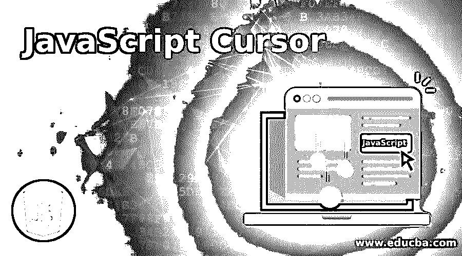
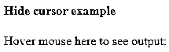
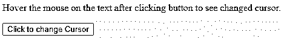
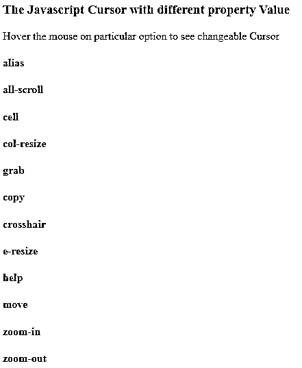
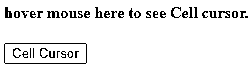

# JavaScript 光标

> 原文：<https://www.educba.com/javascript-cursor/>




## JavaScript 游标简介

JavaScript 光标是一种当鼠标光标指向特定元素时使用的东西。有各种类型的光标可用，如等待、帮助、移动、指针、十字准线、单元格、不允许、放大、缩小等。这个光标可以通过给 document.body.style.cursor 赋值来改变。JavaScript 也可以帮助我们隐藏光标，它应该是从网页中隐藏光标，隐藏特定元素的光标，在 CSS 的帮助下，我们可以将光标设置为无。通过使用 JavaScript 和 CSS，我们可以创建各种不同的光标。稍后我们将逐一详细了解所有这些内容。

### 什么是 JavaScript 光标？

JavaScript 已经有了不同种类的预定义光标。其中一些将与 CSS 一起使用，以获得正确的定位和更好的用户体验。

<small>网页开发、编程语言、软件测试&其他</small>

**JavaScript 中的光标将与不同的值一起使用，如下所示:**

*   **别名:**该光标位置被定义为是要创建的元素的别名的元素。
*   **全滚动:**每当我们想显示可以向任何方向滚动的内容时，使用全滚动光标值会很有帮助。
*   **自动:**默认情况下，自动用于设置光标值。
*   **单元格:**这是用来显示一个特定的选中元素是一个单元格。
*   **col-resize:** 该光标值用于显示列在水平方向上的大小调整。
*   **复制:**这种光标类型表示要复制的东西。
*   **e-resize:** 这是用来显示盒子的边缘将要向东移动的意思。
*   **抓取:**每当我们想要显示一些抓取的数据时，我们就用这个值来显示光标。
*   **帮助:**对于一个特定的元素，如果有一些帮助，那么使用这个光标值。
*   **不允许:**如果某物不能做任何动作，则使用这种类型的光标。
*   **进度:**如果有正在进行或正在工作的事情，那么它被用作进度光标。

**语法:**

要在我们的代码中使用 JavaScript 游标，我们将按照以下语法使用它:

```
object.style.cursor ="nameOfCursor";
```

*   在 nameOfCursor 中定义了已经可用的不同类型的光标。因此，用户可以从列表中选择适当的光标名称，用于相关操作，如鼠标指针、链接和状态、通用光标、调整大小和滚动、缩放等等。
*   可以为光标设置不同的值以获得更好的效果。其中值可以是自动、全滚动、单元格、列大小调整、无、指针、不允许、文本、URL、等待、放大、缩小等。

**语法:**

```
object.style.cursor = value;
```

*   你可以在 JS 和 CSS 中隐藏整个网页的鼠标光标:如果我们想在整个网页中隐藏鼠标光标，那么我们可以通过使用 CSS 中的简单代码来做到这一点，比如 cursor:none；价值。
*   还可以使用如下代码隐藏特定元素上的光标:

**语法:**

```
<style>
#element_id{
cursor: none;
}
</style>
```

### 我们如何使用 JavaScript 光标？

在 JavaScript 中，我们可以通过多种方式使用光标，下面我们将逐一详细介绍所有这些类型:

*   **交互式圆形光标:**可与名为 pointer.js 库的 JavaScript 文件一起使用，该文件有助于创建交互式、圆形和可定制的光标以及许多光标，以改变现有的鼠标指针。
*   交互式光标点效果:在普通 JavaScript 的帮助下，当光标停留在特定元素上时，可以在光标上创建不同的效果，如可定制的交互式效果。
*   JS 中的交互式自定义光标& CSS: 这种类型的光标帮助我们使用 kursojs JavaScript 创建网页的交互式光标。
*   **90 年代的光标移动效果:**这种类型的光标帮助我们创建动画以及 6 种类型的 90 年代的光标移动效果，它们是使用纯 JavaScript 设计的。
*   **自定义光标-控制-用户-光标:**这是一种光标类型，我们可以使用自己的样式来更改内置库，并将光标应用到悬停效果的相关元素上。

### 实现 JavaScript 光标的示例

以下是 JavaScript 光标的示例:

#### 示例#1

这可以是针对整个网页的，也可以是针对页面中特定的选定元素的。在这里，我们隐藏整个网页的光标。代码如下所示:

**代码:**

```
<!DOCTYPE html>
<html>
<head>
<title>JavaScript Cursor</title>
<style>
{
cursor: none;
}
</style>
</head>
<body>
<h4>Hide cursor example</h4>
<div>Hover mouse here to see output:</div>
</body>
</html>
```

**输出:**




#### 实施例 2

这是我们检查游标等待的第二个例子。因此，它将完全如下面的输出屏幕所示。同样的事情，我们可以用来显示处理光标。

**代码:**

```
<html>
<body>
<p id="cursor">Hover the mouse on the text after clicking button to see changed cursor.</p>
<button type="button" onclick="Change()">Click to change Cursor</button>
<script>
function Change() {
document.getElementById("cursor").style.cursor = "wait";
}
</script>
</body>
</html>
```

**输出:**




#### 实施例 3

这是 Javascript 中使用的多个光标组合的例子。让我们来看看我们将要悬停的特定元素的输出。

**代码:**

```
<!DOCTYPE html>
<html>
<head>
<style>
.alias {cursor: alias;
}
.all-scroll {cursor: all-scroll;
}
.cell {cursor: cell;
}
.col-resize {cursor: col-resize;
}
.grab {cursor: -webkit-grab; cursor: grab;
}
.copy {cursor: copy;
}
.crosshair {cursor: crosshair;
}
.e-resize {cursor: e-resize;
}
.help {cursor: help;
}
.ew-resize {cursor: ew-resize;
}
.move {cursor: move;
}
.zoom-in {cursor:zoom-in;
}
.zoom-out {cursor: zoom-out;
}
</style>
</head>
<body>
<h3>The Javascript Cursor with different property Value </h3>
<p>Hover the mouse on particular option to see changeable Cursor</p>
<h4 class="alias">alias</h4>
<h4 class="all-scroll">all-scroll</h4>
<h4 class="cell">cell</h4>
<h4 class="col-resize">col-resize</h4>
<h4 class="grab">grab</h4>
<h4 class="copy">copy</h4>
<h4 class="crosshair">crosshair</h4>
<h4 class="e-resize">e-resize</h4>
<h4 class="help">help</h4>
<h4 class="move">move</h4>
<h4 class="zoom-in">zoom-in</h4>
<h4 class="zoom-out">zoom-out</h4>
</body>
</html>
```

**输出:**




#### 实施例 4

**代码:**

```
<html>
<body>
<h4 id="cell_cur">hover mouse here to see Cell cursor.</h4>
<button type="button" onclick="Change()">Cell Cursor</button>
<script>
function Change() {
document.getElementById("cell_cur").style.cursor = "cell";
}
</script>
</body>
</html>
```

**输出:**




### 结论

从上述所有信息中，我们已经看到了游标的实际使用及其不同类型的值。因此，用户可以根据他们在网页上对元素的适当使用来使用光标值。

### 推荐文章

这是一个 JavaScript 光标指南。这里我们讨论什么是 JavaScript 游标，它的例子以及它的代码实现。您也可以浏览我们推荐的其他文章，了解更多信息——

1.  [JavaScript 字符串格式](https://www.educba.com/javascript-string-format/)
2.  [Javascript 嵌套函数](https://www.educba.com/javascript-nested-functions/)
3.  [JavaScript 日期函数](https://www.educba.com/javascript-date-function/)
4.  [JavaScript DOM](https://www.educba.com/javascript-dom/)


