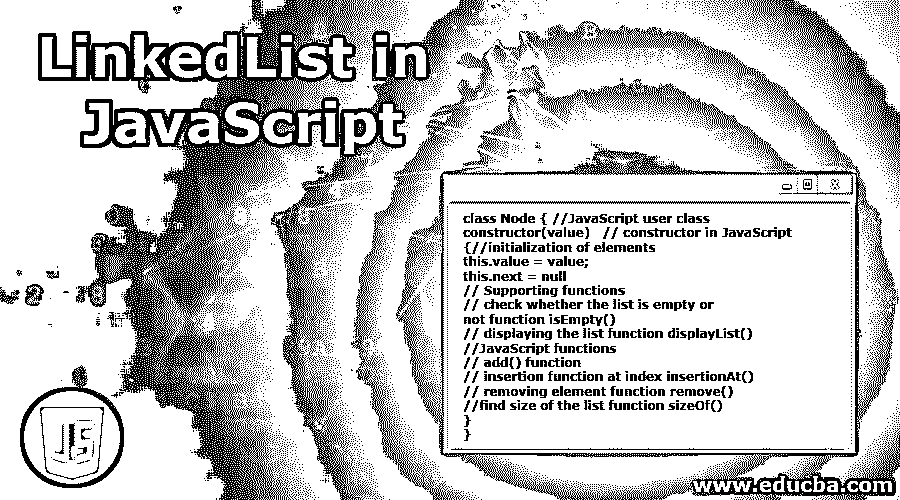

# JavaScript 中的 LinkedList

> 原文：<https://www.educba.com/linkedlist-in-javascript/>




## JavaScript 中的 LinkedList 简介

JavaScript LinkedList 使用双向链表实现来存储元素。它提供了链表数据结构。JavaScript 中没有预定义的链表，所以我们必须实现具有动态特性的链表类。动态意味着它可以根据我们的需要增长或收缩。和数组一样，链表也是顺序存储元素，而不是连续存储。

**关于 JavaScript LinkedList 的要点有:**

<small>网页开发、编程语言、软件测试&其他</small>

*   JavaScript LinkedList 实例可以包含重复元素。
*   它可以保持元素的插入顺序。
*   它的操作很快，因为不需要移动元素。

### 在 JavaScript 中我们可以用 LinkedList 做什么？

*   堆栈和队列实现。
*   图形实现。
*   链表块用于动态内存分配。
*   长整数的算术运算。

**语法:**

```
class Node { //JavaScript user class
constructor(value)   // constructor in JavaScript
{
//initialization of elements
this.value = value;
this.next = null
// Supporting functions
// check whether the list is empty or not function isEmpty()
// displaying the list function displayList()
//JavaScript functions
// add() function
// insertion function at index insertionAt()
// removing element function remove()
//find size of the list function sizeOf()
}
}
```

### JavaScript 中的 LinkedList 示例

由于它是用户实现类，为了更好地理解，我们逐个函数来看。这里以每个功能实现为例。最后，我们将把所有的代码放在一起，看看输出。

#### 1.创建链接列表

**代码:**

```
//creating user defined Linked List function
function LinkedList() {
this.pointer = null;
}
```

**说明:**创建用于添加元素的自定义链表。

#### 2.实现 isEmpty()函数

**代码:**

```
//implementing isEmpty() function
LinkedList.prototype.isEmptyLinkedList = function() {
return this.pointer === null;
};
//isEmpty() function logic
if (this.isEmptyLinkedList()) {
this.pointer = currententNode;
return;
}
```

**说明:**创建用户自定义的 isEmptyLinkedList()函数，用于检查给定列表是否为空。

#### 3.实现 sizeOf()函数

**代码:**

```
//implementing sizeOf() function
LinkedList.prototype.sizeOfLinkedList = function() {
var presentValue = this.pointer;
var tempCount = 0;
while (presentValue !== null) {
tempCount++;
presentValue = presentValue.next;
}
return tempCount;
};
```

**说明:**创建用户自定义的 sizeOfLinkedList()函数，用于检查链表的大小。

#### 4.实现 addBefore()和 addAfter()函数

**代码:**

```
//implementing addBefore() function
LinkedList.prototype.addBefore = function(value) {
var currententNode = {
content: value,
next: this.pointer
};
this.pointer = currententNode;
};
//implementing addAfter() function
LinkedList.prototype.addAfter = function(value) {
var currententNode = {
content: value,
next: null
};
```

**解释:**创建用户定义的 addBefore()函数和 addAfter()函数，因为链表是双向链表，所以我们必须实现一个类，这样它就可以允许元素出现在它想要的任何地方，比如元素之前或元素之后。

#### 5.实现 contains()函数

**代码:**

```
//implementing contains() function
LinkedList.prototype.isContainsElement = function(value) {
var presentValue = this.pointer;
while (presentValue !== null) {
if (presentValue.content === value) {
return true;
}
presentValue = presentValue.next;
}
return false;
};
```

**说明:**创建用户自定义的**is contain element**()函数，用于检查链表中是否有该元素。

#### 6.实现 remove()函数

**代码:**

```
//implementing remove() function
LinkedList.prototype.removeElement = function(value) {
if (!this.isContainsElement(value)) {
return;
}
if (this.pointer.content === value) {
this.pointer = this.pointer.next;
return;
}
var previous = null;
var current = this.pointer;
while (current.content !== value) {
previous = current;
current = current.next;
}
previous.next = current.next;
};
```

**说明:**创建用户自定义的 removeElement()函数，用于从链表中一次删除一个元素。

#### 7.实现 display()函数

**代码:**

```
//implementing display() function
LinkedList.prototype.displayLinkedList = function() {
var result = '[';
var presentValue = this.pointer;
while (presentValue !== null) {
result += presentValue.content;
if (presentValue.next !== null) {
result += ', ';
}
presentValue = presentValue.next;
}
result += ']';
document.write(result+"<br>");
};
```

**说明:**创建用户自定义的 displayLinkedList()函数，用于向最终用户显示当前总链表。

**通过将上述所有子部分添加到单个代码中来查看我们实现的代码的总示例:**

链表的所有函数示例:

**代码:**

```
<script>
function LinkedList() {
this.pointer = null;
}
LinkedList.prototype.isEmptyLinkedList = function() {
return this.pointer === null;
};
LinkedList.prototype.sizeOfLinkedList = function() {
var presentValue = this.pointer;
var tempCount = 0;
while (presentValue !== null) {
tempCount++;
presentValue = presentValue.next;
}
return tempCount;
};
LinkedList.prototype.addBefore = function(value) {
var currententNode = {
content: value,
next: this.pointer
};
this.pointer = currententNode;
};
LinkedList.prototype.addAfter = function(value) {
var currententNode = {
content: value,
next: null
};
if (this.isEmptyLinkedList()) {
this.pointer = currententNode;
return;
}
var presentValue = this.pointer;
while (presentValue.next !== null) {
presentValue = presentValue.next;
}
presentValue.next = currententNode;
};
LinkedList.prototype.isContainsElement = function(value) {
var presentValue = this.pointer;
while (presentValue !== null) {
if (presentValue.content === value) {
return true;
}
presentValue = presentValue.next;
}
return false;
};
LinkedList.prototype.removeElement = function(value) {
if (!this.isContainsElement(value)) {
return;
}
if (this.pointer.content === value) {
this.pointer = this.pointer.next;
return;
}
var previous = null;
var current = this.pointer;
while (current.content !== value) {
previous = current;
current = current.next;
}
previous.next = current.next;
};
LinkedList.prototype.displayLinkedList = function() {
var result = '[';
var presentValue = this.pointer;
while (presentValue !== null) {
result += presentValue.content;
if (presentValue.next !== null) {
result += ', ';
}
presentValue = presentValue.next;
}
result += ']';
document.write(result+"<br>");
};
//Checking user created Linked List functionality
var linkedList = new LinkedList();
//adding the elements
linkedList.addAfter(100);
linkedList.addAfter(200);
linkedList.addAfter(300);
linkedList.addAfter(300);
linkedList.addBefore(400);
linkedList.addAfter(100);
linkedList.addAfter(200);
linkedList.addAfter(300);
linkedList.addAfter(300);
linkedList.addBefore(400);
//displaying linked list
linkedList.displayLinkedList(); //[400, 400, 100, 200, 300, 300, 100, 200, 300, 300]
//removing elements
document.write("Removing 200 from linkedList =>"+"<br>");
linkedList.removeElement(200);
//displaying linked list
linkedList.displayLinkedList(); //[400, 400, 100, 300, 300, 100, 200, 300, 300]
//size of linked list
document.write("Size of linkedList:");
document.write(linkedList.sizeOfLinkedList()+"<br>"); //9
//contains the given element
document.write("Is 400 existing in linkedList?:");
document.write(linkedList.isContainsElement(400)+"<br>");//true
//contains the given element
document.write("Is 500 existing in linkedList?:");
document.write(linkedList.isContainsElement(500)+"<br>"); //false
</script>
```

**输出:**

**T2】**


 **### 结论

我们还可以实现用户定义的函数，用于添加、删除、查找大小、链表是否为空、链表是否只包含特定元素、在 JavaScript 中显示输出。这个链表的工作原理和 Java 链表一样。

### 推荐文章

这是 JavaScript 中 LinkedList 的指南。这里我们讨论 JavaScript 中 LinkedList 的介绍及其示例和代码实现。您也可以浏览我们推荐的其他文章，了解更多信息——

1.  [Javascript 嵌套函数](https://www.educba.com/javascript-nested-functions/)
2.  [JavaScript 日期函数](https://www.educba.com/javascript-date-function/)
3.  [JavaScript 混淆器](https://www.educba.com/javascript-obfuscator/)
4.  [JavaScript lastIndexOf()](https://www.educba.com/javascript-lastindexof/)


**