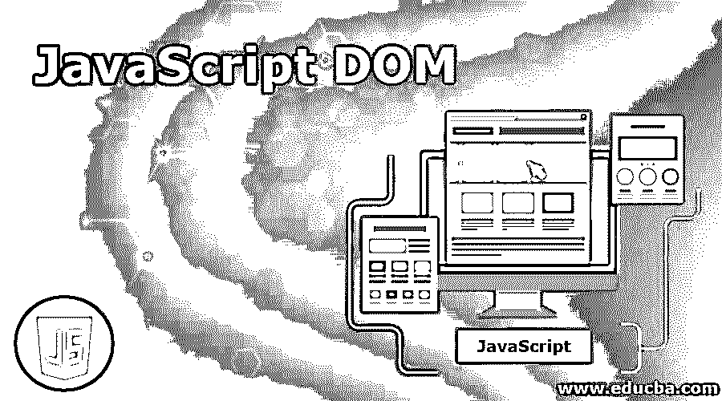
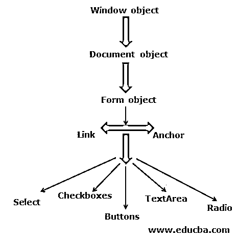
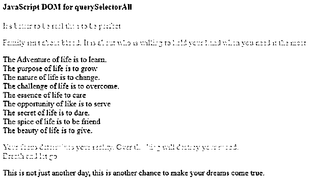
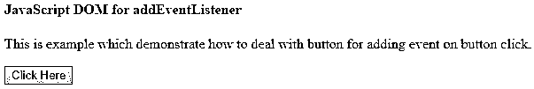
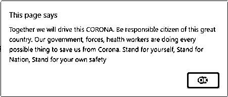
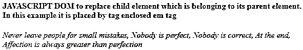

# JavaScript DOM

> 原文：<https://www.educba.com/javascript-dom/>




## JavaScript DOM 简介

*   JavaScript DOM 只不过是一个文档对象模型，作为一个标准的对象模型和一个在 HTML 上工作的编程接口。
*   它对 HTML 元素进行操作，以获取、更改、添加或删除 HTML 元素。借助 JavaScript 代码和 HTML DOM，可以改变 HTML 元素的内容。
*   也可以用它来改变 HTML 元素的样式(CSS ),也可以改变属性值。DOM 有助于将文档表示为节点和对象。
*   众所周知，DOM 是网页的面向对象表示，它在很多方面都有帮助，比如用脚本语言如 JavaScript 来修改它。

### 什么是 JavaScript DOM？

*   JavaScript DOM 是 HTML 和 XML 文档的编程接口。这与其相关的页面一起工作，所以 HTML 代码也可以改变结构、内容和样式。
*   DOM 和 JavaScript 一起帮助访问网页中的所有元素。每当网页被加载到系统中时，网页的 DOM 就被创建。它是在系统中像树形结构一样创建的。
*   在 DOM 和 JavaScript 的帮助下，一个人可以同时做多件事情，例如使用不同功能的属性，创建新的属性和元素，改变已经呈现的属性和元素，删除已经可用的属性和元素，在属性和元素的帮助下在页面上创建新的事件，以及使用这种方法可以完成许多令人兴奋的任务。
*   可以定义逻辑结构，也可以定义使用 DOM 访问和操作文档的方法。DOM 不能像二进制描述那样工作，这意味着它不能在其受尊重的接口中描述任何类型的二进制源代码。
*   它有助于执行任务，如查找元素、更改文档、创建节点、处理和使用属性、设计和使用布局、设计 HTML 页面中可用的特定属性或元素，它还可以使用级联样式表、使用查询选择器、使用 DOM 在 JavaScript 的帮助下定位和制作动画，以及使用 JavaScript DOM 可以做的更多有趣的事情。

#### 分级结构

正如我们讨论的基于分层结构的 DOM 一样，它包括各种类型的对象，我们将逐一详细介绍如下:

*   **窗口对象:**窗口对象被视为所有对象的父对象。因此，所有其他对象都被视为该层次中的子对象。窗口对象被称为其他对象的顶级对象。它包括关闭、文档、名称、状态、自身、位置等属性方法。
*   **文档对象:**一旦窗口对象步骤被加载到 HTML 文档中，它就成为一个对象。该对象被视为文档对象，它包括系统中页面的内容。它包括类似 getElementById 的方法，这些方法将返回由其 Id 提供的元素。getElementByName 有助于返回与 Name 等属性相关的对象数组。
*   **表单对象:**表单对象类似于<表单>中包含的对象..</表格>标记。它包括 id、名称、类名、元素、长度、方法名、目标等属性。除此之外，它还包含一些类似 submit()和 reset()的方法。
*   **表单控件元素:**这类元素类似于包含在所有元素中的对象，这些元素由 textinputfields、下拉列表、按钮、单选按钮等对象定义。




<small>网页开发、编程语言、软件测试&其他</small>

### JavaScript 文档对象模型的示例

以下是 JavaScript DOM 的示例:

#### 示例#1

**代码:**

```
<html>
<head>
<title>JavaScript DOM</title>
</head>
<body>
<h4>JavaScript DOM for querySelectorAll</h4>
<p>It's better to be real than to be perfect</p>
<p>Family isn't about blood. It is about who is willing to hold your hand when you need it the most</p>
<div>The Adventure of life is to learn. <br>
The purpose of life is to grow<br>
The nature of life is to change.  <br>
The challenge of life is to overcome. <br>
The essence of life to care<br>
The opportunity of like is to serve <br>
The secret of life is to dare.<br>
The spice of life is to be friend<br>
The beauty of life is to give.
</div>
<p>Your focus determines your reality. Over thinking will destroy your mood.
<br> Breath and let go</p>
<div> This is not just another day, this is another chance to make your dreams come true.</div>
<script>
var paragraphs = document.querySelectorAll('p');
for(var p of paragraphs)
p.style.color = 'gold';
</script>
</body>
</html>
```

**输出:**




#### 实施例 2

**代码:**

```
<html>
<head>
<title>JavaScript DOM</title>
</head>
<body>
<h4>JavaScript DOM for addEventListener</h4>
<p>This is example which demonstrate how to deal with button for adding event
on button click.</p>
<button>Click Here</button>
<script>
var btnclick = document.querySelector('button');
btnclick.addEventListener('click',check);
function check() {
alert('Together we will drive this CORONA. Be responsible citizen of this great country. Our government, forces, health workers are doing every possible thing to save us from Corona. Stand for yourself, Stand for Nation, Stand for your own safety');
}
</script>
</body>
</html>
```

**输出:**




单击该按钮后，输出将是:




#### 实施例 3

**代码:**

```
<html>
<head>
<title>JavaScript DOM</title>
</head>
<body>
<h4>JAVASCRIPT DOM to replace child element which is belonging to its parent element. In this example it is placed by tag enclosed em tag</h4>
<div>
<strong>Every Teacher once was a Student.<br>
Every Winner once was a Loser<br>
Every expert once was a beginner<br>
But all of them crossing the Bride called LEARNING </strong>
</div>
<script>
var em = document.createElement('em');
var strong = document.querySelector('strong');
var div = document.querySelector('div');
em.textContent = 'Never leave people for small mistakes, Nobody is perfect, Nobody is correct, At the end, Affection is always greater than perfection';
div.replaceChild(em, strong);
</script>
</body>
</html>
```

**输出:**




### 结论

从上面所有的细节，我们知道，DOM 是一个在 HTML 文档和 JavaScript 之间工作的编程接口。它负责更改 HTML 元素、HTML 属性、CSS 样式，删除现有的 HTML 元素和属性，对 HTML 元素做出反应或创建新的事件。它基于分层结构，包括窗口对象、文档对象、表单对象、表单控制元素。

### 推荐文章

这是一个 JavaScript DOM 的指南。在这里，我们讨论 JavaScript DOM 的介绍及其示例和代码实现。您也可以浏览我们推荐的其他文章，了解更多信息——

1.  [Javascript 嵌套函数](https://www.educba.com/javascript-nested-functions/)
2.  [JavaScript 日期函数](https://www.educba.com/javascript-date-function/)
3.  [JavaScript 承诺](https://www.educba.com/javascript-promise/)
4.  [JavaScript 刷新页面](https://www.educba.com/javascript-refresh-page/)


