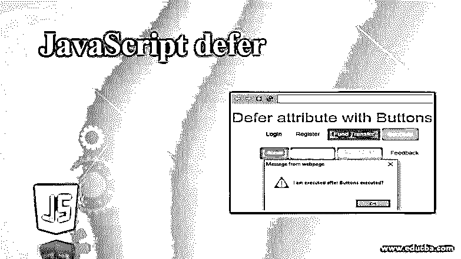
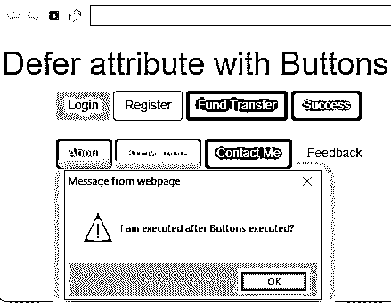
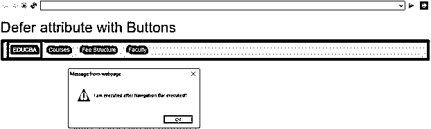

# JavaScript 延迟

> 原文：<https://www.educba.com/javascript-defer/>




## JavaScript defer 简介

在 HTML 页面上运行任何脚本时，我们需要注意 JavaScript 应用程序的加载性能。应用程序永远不会受到性能问题的影响。如果我们在 HTML 标签中添加

### 为什么我们会有延迟的概念？

一般来说，我们在 HTML 文件中加载 JavaScript 文件，如下所示

<small>网页开发、编程语言、软件测试&其他</small>

**语法:**

```
<script src="script.js"></script>
```

*   当 HTML 解析器找到这个
*   每当 HTML 解析完成后，HTML 编译器就会执行 HTML 页面的其余部分。
*   你可以在这里看到 HTML 首先完成脚本解析，然后 HTML 代码可以并行执行。因此，它将影响应用程序加载性能和应用程序时间。
*   让我们想象一下，如果脚本消耗的加载时间超过预期，那么在 web 浏览器中，我们将看到空白页，而不是原始内容。如果是移动设备的情况，情况会变得更糟，因为在更小的设备中，内存变得更少。
*   正如我们在引言部分讨论的，加载性能还取决于 HTML 页面中包含的
*   众所周知，通过在
*   但是旧的浏览器不允许或不支持使用 defer 标签，所以他们必须寻找另一种替代方法来提高性能。
*   老版本的浏览器我们必须在 HTML 文件的标签中指定

**语法:**

```
<body>
//HTML code
<script src="">
</body>
```

因此，我们可以通过在

**优点:**

*   提高应用程序性能。
*   缩短加载时间。

### JavaScript 中的 defer 标签是如何工作的？

以下几点解释了 defer 标签的工作原理:

*   defer 是 JavaScript 中的一个属性。它将真/假值存储为布尔值。
*   JavaScript 中的 defer 属性，用于在加载 HTML 的主要内容后加载 JavaScript 实用程序(
*   加载 JavaScript 实用程序后，最终用户无需等待就能看到页面的主要内容，稍后 defer 会包含其余的
*   加载主内容优先于

**语法:**

```
<body>
<script defer src="script.js"></script>
//HTML code
</body>
```

类似地，defer 属性 async 属性也执行加载 JavaScript 实用程序的相同任务。但是，如果我们在一个

### 实现 JavaScript 延迟的示例

以下是一些例子:

#### 1.根据段落内容延期

**HTML 代码:**Diferparagraph.html

```
<!DOCTYPE html>
<html>
<head>
<meta charset="ISO-8859-1">
<title>Differ Attribute</title>
<style type="text/css">
h1 {
text-align: center;
color: green;
}
.p1 {
border-style: solid;
border-color:red;
border-width: 1px;
font-size: 20px;
color: blue;
width: 1000px;
}
.p2 {
border-style: solid;
border-color:blue;
border-width: 1px;
font-size: 20px;
color: fuchsia;
width: 1000px;
}
</style>
</head>
<h1>Defer attribute with Paragraph Text</h1>
<!--Including script file with defer attribute-->
<script src="defer.js" defer></script>
<p class="p1">
defer attribute in JavaScript used for loading the JavaScript utilities
(script files) after loading of the main content of HTML</p>
<br>
<p class="p2">After loading of JavaScript utilities end user no need
to wait for seeing the main content of the page, later defer includes
rest of the files.</p>
</body>
</html>
```

**JavaScript 代码:** defer.js

```
alert("I am loading after HTML content?");
```

**输出:**


**解释:**当第一次执行应用程序时，它将首先执行 HTML 内容。稍后，执行警告框时可能会首先跟随内容，因为该应用程序已经存储在浏览器缓存中。

#### 2.用按钮推迟

**HTML 代码:**DeferButtons.html

**代码:**

```
<!DOCTYPE html>
<html>
<head>
<title>Differ Attribute</title>
<meta charset="utf-8">
<meta name="viewport" content="width=device-width, initial-scale=1">
<link rel="stylesheet"
href="https://maxcdn.bootstrapcdn.com/bootstrap/3.4.1/css/bootstrap.min.css">
<script
src="https://ajax.googleapis.com/ajax/libs/jquery/3.4.1/jquery.min.js"></script>
<script
src="https://maxcdn.bootstrapcdn.com/bootstrap/3.4.1/js/bootstrap.min.js"></script>
</head>
<h1 style="color:green">Defer attribute with Buttons</h1>
<!--Including script file with defer attribute-->
<script src="defer.js" defer></script>
<div class="container">
<button type="button" class="btn">Login</button>
<button type="button" class="btn btn-default">Register</button>
<button type="button" class="btn btn-primary">Fund Transfer</button>
<button type="button" class="btn btn-success">Success</button>
</div>
<br>
<div class="container">
<button type="button" class="btn btn-info">About</button>
<button type="button" class="btn btn-warning">Know more</button>
<button type="button" class="btn btn-danger">Contact Me</button>
<button type="button" class="btn btn-link">Feedback</button>
</div>
</body>
</html>
```

**JavaScript 代码:** defer.js

```
alert("I am executed after Buttons executed?");
```

**输出:**




**解释:**当第一次执行应用程序时，它将首先执行 HTML 内容。稍后，执行警告框时可能会首先跟随内容，因为该应用程序已经存储在浏览器缓存中。

#### 3.使用导航栏延迟

**HTML 代码:**DeferNavigation.html

```
<!DOCTYPE html>
<html>
<head>
<title>Differ Attribute</title>
<meta charset="utf-8">
<meta name="viewport" content="width=device-width, initial-scale=1">
<link rel="stylesheet"
href="https://maxcdn.bootstrapcdn.com/bootstrap/3.4.1/css/bootstrap.min.css">
<script
src="https://ajax.googleapis.com/ajax/libs/jquery/3.4.1/jquery.min.js"></script>
<script
src="https://maxcdn.bootstrapcdn.com/bootstrap/3.4.1/js/bootstrap.min.js"></script>
</head>
<h1 style="color: green">Defer attribute with Buttons</h1>
<!--Including script file with defer attribute-->
<script src="defernav.js" defer></script>
<nav class="navbar navbar-inverse">
<div class="container-fluid">
<ul class="nav navbar-nav">
<li class="active"><a href="#">EDUCBA</a></li>
<li><a href="#">Courses</a></li>
<li><a href="#">Fee Structure</a></li>
<li><a href="#">Faculty</a></li>
</ul>
</div>
</nav>
</body>
</html>
```

JavaScript 代码: defernav.js

```
alert("I am executed after Navigation Bar executed?");
```

**输出:**




**解释:**当第一次执行应用程序时，它将首先执行 HTML 内容。稍后，执行警告框时可能会首先跟随内容，因为该应用程序已经存储在浏览器缓存中。

### 推荐文章

这是 JavaScript defer 的指南。这里我们讨论什么是 defer，defer 标签如何工作，以及用正确的代码和输出实现的例子。您也可以浏览我们的其他相关文章，了解更多信息——

1.  [JavaScript 数字格式](https://www.educba.com/javascript-number-format/)
2.  [JavaScript 文件阅读器](https://www.educba.com/javascript-filereader/)
3.  [JavaScript 承诺](https://www.educba.com/javascript-promise/)
4.  [JavaScript if 语句](https://www.educba.com/javascript-if-statement/)


