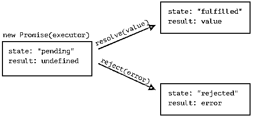
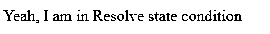
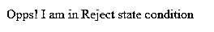
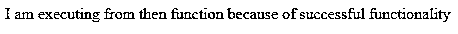
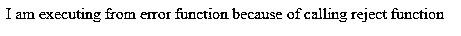
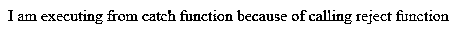

# JavaScript 承诺

> 原文：<https://www.educba.com/javascript-promise/>


## JavaScript Promise 简介

JavaScript promise 是一个对象，它将生成一个状态，该状态在现在或将来具有某种值，对于最终用户来说，它具有适当的理由，如解析值或错误值。

它有 4 种状态:

<small>网页开发、编程语言、软件测试&其他</small>

*   **已履行:**关于承诺成功的事件动作
*   **拒绝:**关于承诺的事件动作失败
*   **待定**:关于承诺为何仍处于待定状态的事件操作
*   **已解决:**关于承诺是被履行还是被拒绝的事件动作

JavaScript promise 用户可以将处理已履行、已拒绝和未决状态的回调附加到最终用户。Promises 用于处理 JavaScript 中的异步操作。在处理多个异步功能操作时，承诺很容易管理，因为回调会创建回调——这会导致不可维护的应用程序代码。你可以观察下面的图像，以便清楚地了解




**优点:**

*   应用程序的可读性更好。
*   适用于异步。
*   错误处理很容易。

### Promise 在 JavaScript 中是如何工作的？

JavaScript promise 基于“promise constructor”工作，向消费者承诺:

#### 语法#1

```
var promiseVariable= new Promise(function(resolve, reject){
//JavaScript logic
});
```

**说明:** Promise()构造函数接受一个参数作为回调函数。回调函数(function(resolve，reject))接受了 2 个参数。调用回调函数后，操作将根据函数内部编写的逻辑执行。如果一切执行良好，那么回调函数调用 resolve state。如果一切都没有执行好，那么回调函数调用拒绝状态。承诺消费者:可以通过使用 JavaScript 中的 then 和 catch 函数来注册承诺消费者。

#### 语法#2

```
.then(function(output){
//success message
}, function(errorMessage){
//error resolving logic
})
```

**解释:**承诺消费者然后显示应用程序成功消息的功能。then()函数只接受一个带单参数的回调函数。then()函数后面总是跟着另一个函数，用于显示应用程序的错误消息。

#### 语法#3

```
.catch(function(errorMessage){
//error resolving logic
})
```

**说明:** Promise consumer catch 函数用于显示应用程序的错误消息。catch()函数只接受一个带有单个参数的回调函数。catch()函数前面总是有 then Catch()函数，目的是在应用程序中显示错误消息。

#### 语法#4

错误消息也可以通过使用 Promise()的错误函数(Error())来显示

```
var error=new Promise(function(resolve, reject) {
throw new Error('Error Message')
})
```

### 实现 JavaScript Promise 的示例

下面是提到的例子:

#### 1.同等变量比较的承诺

**代号:**PromiseComparation.html

```
<!DOCTYPE html>
<html>
<title>Promise in JavaScript</title>
<script>
var promise = new Promise(function(resolve, reject) {
var firstString = "I am Fine";
var secondString= "I am Fine"
if(firstString===secondString) {
resolve();
} else {
reject();
}
});
promise.
then(function () {
document.write('Yeah, I am in Resolve state condition');
}).
catch(function () {
document.write('Opps! I am in Reject state condition');
});
</script>
</html>
```

**输出:**




#### 2.具有不等变量比较的承诺

**代号:**NonEqualVariable.html

```
<!DOCTYPE html>
<html>
<title>Promise in JavaScript</title>
<script>
var promise = new Promise(function(resolve, reject) {
var firstString = "I am Fine";
var secondString= "I am Sad"
if(firstString===secondString) {
resolve();
} else {
reject();
}
});
promise.
then(function () {
document.write('Yeah, I am in Resolve state condition');
}).
catch(function () {
document.write('Opps! I am in Reject state condition');
});
</script>
</html>
```

**输出:**




#### 3.向消费者承诺已解决的状态

**代号:**PromiseConsumerResolved.html

```
<!DOCTYPE html>
<html>
<title>Promise in JavaScript</title>
<script>
var promise = new Promise(function(resolve, reject) {
resolve('I am executing from then function because of successful functionality');
})
promise
.then(function(gainMessage) {
document.write(gainMessage);  // resolve() function executes because of calling resolve function
}, function(bugMessage) {
document.write(bugMessage);
})
</script>
</html>
```

**输出:**




#### 4.拒绝状态的承诺消费者

**代号:**PromiseConsumerReject.html

```
<!DOCTYPE html>
<html>
<title>Promise in JavaScript</title>
<body>
<script>
var promise = new Promise(function(resolve, reject) {
reject('I am executing from error function because of calling reject function');
})
promise
.then(function(gainMessage) {
document.write(gainMessage);
}, function(bugMessage) { //error handler function executes because of calling reject function
document.write(bugMessage);
})
</script>
</body>
</html>
```

**输出:**




#### 5.从 catch 函数向消费者承诺错误状态

**代号:**PromiseConsumerRejectWithCatch.html

```
<!DOCTYPE html>
<html>
<title>Promise in JavaScript</title>
<body>
<script>
var promise = new Promise(function(resolve, reject) {
reject('I am executing from catch function because of calling reject function')
})
promise
.then(function(gainMessage) {
document.write(gainMessage);
})
.catch(function(errMsg) {
//error handler function executes because of calling reject function
document.write(errMsg);
});
</script>
</body>
</html>
```

**输出:**




#### 6.向消费者承诺来自错误函数的错误状态

**代号:**PromiseError.html

```
<!DOCTYPE html>
<html>
<title>Promise in JavaScript</title>
<head>
</head>
<body>
<script>
var promise = new Promise(function(resolve, reject) {
throw new Error('I am executing from catch function because of calling Error function')
})
promise
.then(function(gainMessage) {
document.write(gainMessage);
})
.catch(function(errMsg) {
//error handler function executes because of calling Error function
document.write(errMsg);
});
</script>
</body>
</html>
```

**输出:**


### 结论

JavaScript 中的 Promise 构造函数，用于提醒最终用户申请状态，如已完成、已拒绝、待定和已结算。它主要用于异步应用程序。

### 推荐文章

这是一个 JavaScript Promise 的指南。在这里，我们讨论一个语法介绍，promise 如何在 JavaScript 中工作，并举例说明如何用正确的代码和输出来实现。您也可以浏览我们的其他相关文章，了解更多信息——

1.  [在 JavaScript 中嵌套 if](https://www.educba.com/nested-if-in-javascript/)
2.  [JavaScript 延迟](https://www.educba.com/javascript-defer/)
3.  [JavaScript WeakMap](https://www.educba.com/javascript-weakmap/)
4.  [JavaScript every()](https://www.educba.com/javascript-every/)


