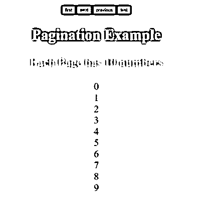
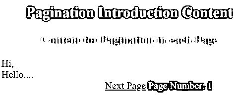
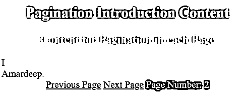
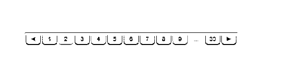

# JavaScript 中的分页

> 原文：<https://www.educba.com/pagination-in-javascript/>


## JavaScript 中分页的介绍

JavaScript 分页概念用于在具有第一个、下一个、上一个和最后一个按钮或链接的页面之间移动。分页的主要宗旨是通过点击链接或按钮立即在内容间移动。分页提供了多个链接或按钮，用于访问第一个、下一个、上一个和最后一个内容。在 JavaScript 中创建第一个、下一个、上一个和最后一个按钮我们使用了不同的 JavaScript 函数。

### 什么是引导寻呼机？

分页概念，用于根据客户要求使用第一个、下一个、上一个和最后一个或更多链接或按钮来访问内容，以便顺利访问内容。

<small>网页开发、编程语言、软件测试&其他</small>

### 为什么我们使用 JavaScript 分页？

**实时场景:**让我们以亚马逊网站或 Flipkart 网站为例，显示其数据库中的可用产品。假设他们有 100 万件产品。如果他们试图一次展示所有的商品，顾客必须等待更长的时间，比如一天才能看到所有的商品清单。

### 我们应该如何处理这种情况？

我们可以使用链接按钮列表一次显示 50 到 100 个项目，而不是一次显示所有项目。如果顾客对前 50 至 100 件产品不满意，那么他会转向下 50 至 100 件产品，以此类推。这个概念叫做分页。

**分页的语法:**

```
//function for creating page list
function prepareList() {
for (count = 0; count < 100; count++)
//add iteration elements to an array
createPages= getPageNumber();//user defined function
}
//function per creating pages
function preparePages() {
var start= ((presentPage - 1) * countPerEachPage);
var end = start+ countPerEachPage;
listPage= list.slice(start, end);
//call some user defined methods to pagination functionality
}
```

### Javascript 中分页的示例

下面举几个例子

#### 示例# 1–用数字分页

**代码:**

```
<!DOCTYPE html>
<html>
<head>
<meta charset="ISO-8859-1">
<title>Pagination</title>
<!-- default pagination styles including -->
<script type="text/javascript" src="path_to/jquery.js"></script>
<script type="text/javascript" src="path_to/jquery.simplePagination.js"></script>
<link type="text/css" rel="stylesheet" href="path_to/simplePagination.css"/>
<!-- CSS styles -->
<style type="text/css">
body
{
font-size: 30px;
background: brown;
}
h2
{
color: lime;
}
h3
{
color: olive;
}
</style>
<!-- JavaScript logic -->
<script type="text/javascript">
//creating an array for adding numbers in a page
var countList = new Array();
//creating an array for adding number of pagess
var addPageList = new Array();
var presentPage = 1;
var countPerEachPage = 10;
var countOfPages = 0;
//function for adding how many numbers in total
function prepareList() {
for (count = 0;counti< 100; count++)
countList.push(count);
countOfPages = getCountOfPages();
}
//function for creating how many how many number per each page
function getCountOfPages() {
return Math.ceil(countList.length / countPerEachPage);
}
//function for moving to next page
function getNextPage() {
presentPage += 1;
loadMyPaginationList();
}
//function for moving previous page
function getPreviousPage() {
presentPage -= 1;
loadMyPaginationList();
}
//function for moving to first page
function getFirstPage() {
presentPage = 1;
loadMyPaginationList();
}
//function for moving last page
function getLastPage() {
presentPage = countOfPages;
loadMyPaginationList();
}
//function for creating how to move between the pages
function loadMyPaginationList() {
var start = ((presentPage - 1) * countPerEachPage);
var end = start + countPerEachPage;
addPageList = countList.slice(start, end);
createPageList();
validatePageCount();
}
//function for adding numbers to each page
function createPageList() {
document.getElementById("countList").innerHTML = "";
for (p = 0; p< addPageList.length; p++) {
document.getElementById("countList").innerHTML = document.getElementById("countList").innerHTML+ addPageList[p] + "<br/>";
}
}
//function for validating real time condition like if move to last page, last page disabled etc
function validatePageCount() {
document.getElementById("next").disabled = presentPage == countOfPages ? true : false;
document.getElementById("previous").disabled = presentPage == 1 ? true : false;
document.getElementById("first").disabled = presentPage == 1 ? true : false;
document.getElementById("last").disabled = presentPage == countOfPages ? true : false;
}
//function for loading pagination functionality
function loadMyPagination() {
prepareList();
loadMyPaginationList();
}
window.onload = loadMyPagination;
</script>
</head>
<body>
<div style="text-align:center;">
<input type="button" id="first" onclick="getFirstPage()" value="first" />
<input type="button" id="next" onclick="getNextPage()" value="next" />
<input type="button" id="previous" onclick="getPreviousPage()" value="previous" />
<input type="button" id="last" onclick="getLastPage()" value="last" />
<h2>Pagination Example</h2>
<h3>Each Page has 10 numbers</h3>
<div id="countList"></div>
</div>
</body>
</html>
```

**输出:**




#### 示例# 2–用字符串分页

**代码:**

```
<!DOCTYPE html>
<html>
<head>
<meta charset="ISO-8859-1">
<title>Pagination</title>
<!-- default pagination styles including -->
<script type="text/javascript" src="path_to/jquery.js"></script>
<script type="text/javascript" src="path_to/jquery.simplePagination.js"></script>
<link type="text/css" rel="stylesheet"
href="path_to/simplePagination.css" />
<!-- CSS styles -->
<style type="text/css">
body {
font-size: 30px;
background: brown;
}
h2 {
color: lime;
text-align: center;
}
h3 {
color: olive;
text-align: center;
}
.a {
text-align: center;
color: white;
}
</style>
<!-- JavaScript logic -->
<script type="text/javascript">
var currentPage = 1;
var CountPerEachPage = 2;
//json object mapping for content
var paginationObject = [
{
content : "Hi,"
},
{
content : "Hello...."
},
{
content : "I"
},
{
content : "Amardeep."
},
{
content : "My"
},
{
content : "Best"
},
{
content : "Friend"
},
{
content : "is"
},
{
content : "Paramesh"
},
{
content : "Nathi"
},
{
content : ".........."
},];
//function for go to previous page
function getPereviousPage() {
if (currentPage > 1) {
currentPage--;
validateEachPage(currentPage);
}
}
//function for go to next page
function getNextPage() {
if (currentPage < numberOfPages()) {
currentPage++;
validateEachPage(currentPage);
}
}
//function for validating real time condition like if move to last page, last page disabled etc
function validateEachPage(paginationPage) {
var nextPage = document.getElementById("nextPage");
var previousPage = document.getElementById("previousPage");
var showMyTable = document.getElementById("showTable");
var paginationPage_span = document.getElementById("paginationPage");
//validating pages based on page count
if (paginationPage < 1)
paginationPage = 1;
if (paginationPage > numberOfPages())
paginationPage = numberOfPages();
showMyTable.innerHTML = "";
for (var i = (paginationPage - 1) * CountPerEachPage; i < (paginationPage * CountPerEachPage); i++) {
showMyTable.innerHTML += paginationObject[i].content + "<br>";
}
paginationPage_span.innerHTML = paginationPage;
if (paginationPage == 1) {
previousPage.style.visibility = "hidden";
} else {
previousPage.style.visibility = "visible";
}
if (paginationPage == numberOfPages()) {
nextPage.style.visibility = "hidden";
} else {
nextPage.style.visibility = "visible";
}
}
//function per number of Pages
function numberOfPages() {
return Math.ceil(paginationObject.length / CountPerEachPage);
}
//loading al JavaScript functions functionality
window.onload = function() {
validateEachPage(1);
};
</script>
</head>
<body>
<h2>Pagination Introduction Content</h2>
<h3>Content for Pagination in each Page</h3>
<div id="showTable"></div>
<div class="a">
<a href="javascript:getPereviousPage()" id="previousPage">Previous
Page</a> <a href="javascript:getNextPage()" id="nextPage">Next Page</a>
Page Number: 
</div>
</body>
</html>
```

**输出:**




点击下一页按钮后




#### 示例# 3–没有默认 CSS 库的分页

**代码:**

```
<!DOCTYPE html>
<html>
<head>
<meta charset="ISO-8859-1">
<title>Pagination</title>
<style type="text/css">
html {
height: 100%;
width: 100%;
background-color: #D7D7D7;
background-image: -webkit-radial-gradient(contain, #F2F2F2, #D1D1D1);
background-image: -moz-radial-gradient(contain, #F2F2F2, #D1D1D1);
background-image: -ms-radial-gradient(contain, #F2F2F2, #D1D1D1);
background-image: -o-radial-gradient(contain, #F2F2F2, #D1D1D1);
background-image: radial-gradient(contain, #F2F2F2, #D1D1D1);
}
body {
margin: 0;
height: 100%;
width: 100%;
text-align: center;
font-family: Arial, sans-serif;
}
body:before {
content: '';
display: inline-block;
width: 0;
height: 100%;
vertical-align: middle;
}
#paginationID {
display: inline-block;
vertical-align: middle;
border-radius: 4px;
padding: 1px 2px 4px 2px;
border-top: 1px solid #AEAEAE;
border-bottom: 1px solid #FFFFFF;
background-color: #DADADA;
background-image: -webkit-linear-gradient(top, #DBDBDB, #E2E2E2);
background-image: -moz-linear-gradient(top, #DBDBDB, #E2E2E2);
background-image: -ms-linear-gradient(top, #DBDBDB, #E2E2E2);
background-image: -o-linear-gradient(top, #DBDBDB, #E2E2E2);
background-image: linear-gradient(top, #DBDBDB, #E2E2E2);
}
#paginationID a, #paginationID i {
display: inline-block;
vertical-align: middle;
width: 22px;
color: #7D7D7D;
text-align: center;
font-size: 10px;
padding: 3px 0 2px 0;
-webkit-user-select: none;
-moz-user-select: none;
-ms-user-select: none;
-o-user-select: none;
user-select: none;
}
#paginationID a {
margin: 0 2px 0 2px;
border-radius: 4px;
border: 1px solid #E3E3E3;
cursor: pointer;
box-shadow: inset 0 1px 0 0 #FFF, 0 1px 2px #666;
text-shadow: 0 1px 1px #FFF;
background-color: #E6E6E6;
background-image: -webkit-linear-gradient(top, #F3F3F3, #D7D7D7);
background-image: -moz-linear-gradient(top, #F3F3F3, #D7D7D7);
background-image: -ms-linear-gradient(top, #F3F3F3, #D7D7D7);
background-image: -o-linear-gradient(top, #F3F3F3, #D7D7D7);
background-image: linear-gradient(top, #F3F3F3, #D7D7D7);
}
#paginationID i {
margin: 0 3px 0 3px;
}
#paginationID a.current {
border: 1px solid #E9E9E9;
box-shadow: 0 1px 1px #999;
background-color: #DFDFDF;
background-image: -webkit-linear-gradient(top, #D0D0D0, #EBEBEB);
background-image: -moz-linear-gradient(top, #D0D0D0, #EBEBEB);
background-image: -ms-linear-gradient(top, #D0D0D0, #EBEBEB);
background-image: -o-linear-gradient(top, #D0D0D0, #EBEBEB);
background-image: linear-gradient(top, #D0D0D0, #EBEBEB);
}
</style>
<script>
var pagePagination = {
code : '',
Extend : function(data) {
data = data || {};
pagePagination.size = data.size || 300;
pagePagination.page = data.page || 1;
pagePagination.step = data.step || 3;
},
Add : function(p, q) {
for (var l =p;l < q; l++) {
pagePagination.code += '<a>' + l + '</a>';
}
},
Last : function() {
pagePagination.code += '<i>...</i><a>' + pagePagination.size + '</a>';
},
First : function() {
pagePagination.code += '<a>1</a><i>...</i>';
},
Click : function() {
pagePagination.page = +this.innerHTML;
pagePagination.Start();
},
Prev : function() {
pagePagination.page--;
if (pagePagination.page < 1) {
pagePagination.page = 1;
}
pagePagination.Start();
},
Next : function() {
pagePagination.page++;
if (pagePagination.page > pagePagination.size) {
pagePagination.page = pagePagination.size;
}
pagePagination.Start();
},
Bind : function() {
var a = pagePagination.e.getElementsByTagName('a');
for (var num = 0; num < a.length; num++) {
if (+a[num].innerHTML === pagePagination.page)
a[num].className = 'current';
a[num].addEventListener('click', pagePagination.Click, false);
}
},
Finish : function() {
pagePagination.e.innerHTML = pagePagination.code;
pagePagination.code = '';
pagePagination.Bind();
},
Start : function() {
if (pagePagination.size < pagePagination.step * 2 + 6) {
pagePagination.Add(1, pagePagination.size + 1);
} else if (pagePagination.page < pagePagination.step * 2 + 1) {
pagePagination.Add(1, pagePagination.step * 2 + 4);
pagePagination.Last();
} else if (pagePagination.page > pagePagination.size - pagePagination.step * 2) {
pagePagination.First();
pagePagination.Add(pagePagination.size - pagePagination.step * 2 - 2,
pagePagination.size + 1);
} else {
pagePagination.First();
pagePagination.Add(pagePagination.page - pagePagination.step,
pagePagination.page + pagePagination.step + 1);
pagePagination.Last();
}
pagePagination.Finish();
},
Buttons : function(e) {
var nav = e.getElementsByTagName('a');
nav[0].addEventListener('click', pagePagination.Prev, false);
nav[1].addEventListener('click', pagePagination.Next, false);
},
Create : function(e) {
var html = [ '<a>◄</a>', // previous button
'', // paginationID container
'<a>►</a>' // next button
];
e.innerHTML = html.join('');
pagePagination.e = e.getElementsByTagName('span')[0];
pagePagination.Buttons(e);
},
Init : function(e, data) {
pagePagination.Extend(data);
pagePagination.Create(e);
pagePagination.Start();
}
};
var init = function() {
pagePagination.Init(document.getElementById('paginationID'), {
size : 30,
page : 1,
step : 3
});
};
document.addEventListener('DOMContentLoaded', init, false);
</script>
</head>
<body>
<div id="paginationID"></div>
</body>
</html>
```

**输出:**




### 结论

JavaScript 的分页用于通过使用按钮或链接立即在页面之间移动。有 CSS 库或者没有 CSS 库都可以。

### 推荐文章

这是 JavaScript 中的分页指南。这里我们讨论 Javascript 中分页的例子，以及为什么我们要和语法一起使用它。您也可以看看以下文章，了解更多信息–

1.  [JavaScript 风格可见性](https://www.educba.com/javascript-style-visibility/)
2.  [JavaScript 地图对象](https://www.educba.com/javascript-map-object/)
3.  [Java 迭代图](https://www.educba.com/java-iterate-map/)
4.  [在 Java 中设置接口](https://www.educba.com/set-interface-in-java/)


