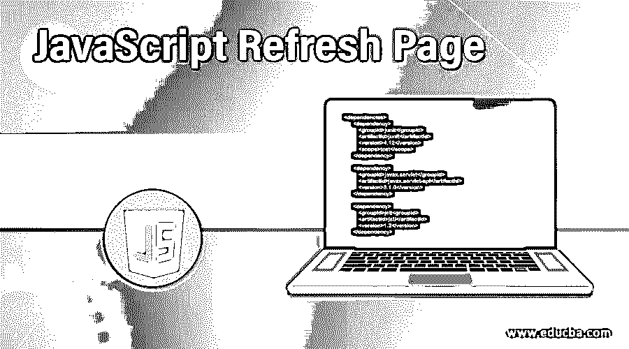
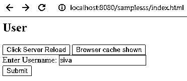
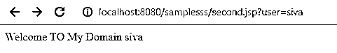
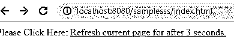
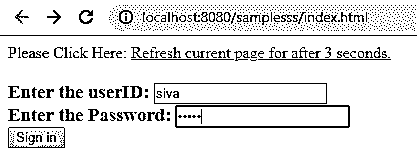
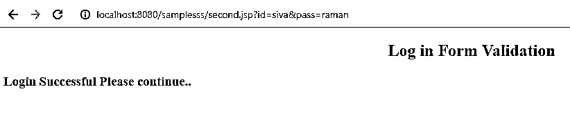

# JavaScript 刷新页面

> 原文：<https://www.educba.com/javascript-refresh-page/>




## JavaScript 刷新页面简介

javascript 函数将用于许多目的，我们可以创建自定义的事件，并在网页中使用预定义的事件。在每个 javascript 中，该函数将在 ui 标签元素(如按钮等)上执行网页。如果我们单击按钮之类的事件，将调用并执行该函数。一旦使用 reload()方法或函数重新加载页面，将触发该函数。它将根据用户要求在网页中使用。它将位于网页模块本身中，或者当用户单击重新加载或 f5 按钮刷新网页时，它将在 javascript 函数中单独调用。

**语法:**

<small>网页开发、编程语言、软件测试&其他</small>

在网页中，javascript reload()函数用于刷新网页，刷新后它可能位于页面中或应用程序的特定部分。

```
<html>
<head>
<script>
location.reload();
</script>
</head>
<body>
<button onclick="location.reload()">
</button>
---any html elements tags also used and called for this function---
</body>
</html>
```

上面的基本代码是使用 javascript 重载/刷新网页的方法之一。我们可以根据客户的需求使用这一功能，我们可以在任何需要的地方打电话。

### JavaScript 刷新页面是如何工作的？

当我们使用 location.reload()函数时，此方法不传递任何参数，我们只需在脚本中调用它就可以进行验证，如果检索的值为真，它将导致结果，因为网页总是从 web 服务器和应用程序服务器重新加载。如果值为假，它不会从服务器获取并重新加载新页面，它只会使用浏览器缓存重新加载。我们可以使用一些 javascript 预定义的函数，比如 onClick()它的 also 事件，该事件将触发新事件，它将在特定位置打开新页面窗口。我们使用 href 默认 html 属性来标识新网页的位置。我们还可以使用 javascript 功能，在某些特定时间段自动刷新网页。我们还使用一些默认方法，如 setTimeout()是内置的 javascript 函数，它可以用于根据用户要求在指定的时间间隔后执行另一个函数。

应用程序的 javascript 刷新页面可以用当前资源的给定函数来重新加载。在大多数情况下，在浏览器应用程序中选择要刷新的网页。该方法还使用了其他额外功能，如它会调用其他依赖项，例如有助于获取当前网页的 url 地址、它重定向到另一个网页的浏览器以及它当然用于在 javascript 中刷新网页。使用 location.reload()方法在 javascript 技术中重新加载当前网页。该方法还调用并接收用于重新加载 1 或刷新的后端响应。javascript 重新加载了页面，有时可能会阻止用户安全角色和访问，即使某些防火墙会阻止浏览器抛出 domexception 中的 security_error 时的网页。此外，它会发生在用户将调用重新加载方法，即他们将从应用程序或浏览器单击刷新或重新加载图标。网页脚本是通过方法位置调用的，如果假设它与来自网页原点的用户位置对象不匹配。

大多数用户将使用 Windows 操作系统。它将提供不同的方式来重新加载或刷新网页。我们可以使用 window.reload 和 window.location 对象。它将识别指定的位置，并向浏览器传递指令以重新加载网页应用程序。

### JavaScript 刷新页面示例

以下是 javascript 刷新页面的示例:

#### 示例#1

**代码:**

```
<html>
<head>
<title>Welcome To My Domain</title>
</head>
<body>
<h2>User</h2>
<button id="btn_reload">Click Server Reload</button>
<button id="btn_refresh">Browser cache shown</button>
<script src="//code.jquery.com/jquery-1.6.2.min.js"></script>
<script>
$(document).ready(function() {
$("#btn_refresh").click(function(){
location.reload(false);
});
$("#btn_reload").click(function(){
location.reload(true);
});
});
</script>
<form action="second.jsp">
Enter Username:
<input type="text" name="user">  <br/>
<input type="submit" value="Submit"><br/>
</form>
</body>
</html>
```

**Second.jsp:**

```
<%@ page language="java" contentType="text/html; charset=UTF-8"
pageEncoding="UTF-8"%>
<!DOCTYPE html PUBLIC "-//W3C//DTD HTML 4.01 Transitional//EN"
"http://www.w3.org/TR/html4/loose.dtd">
<html>
<head>
<meta http-equiv="Content-Type" content="text/html;
charset=UTF-8">
<title>Welcome</title>
</head>
<body>
<%
String n=request.getParameter("user");
out.print("Welcome TO My Domain "+n);
%>
</body>
</html>
```

**输出:**







#### 实施例 2

**代码:**

```
<html>
<head>
<title>Welcome To My Domain</title>
<script language="javascript" type="text/javascript">
function demo() {
var r = confirm("Do you want to refresh the page?");
if (r) {
setTimeout("location.reload(true);", 3000);
}
}
</script>
</head>
<body>
<p>Please Click Here: <a href="javascript:demo();">Refresh current page for after 3 seconds.</a></p>
</body>
</html>
```

**输出:**




#### 实施例 3

**代码:**

```
<html>
<head>
<title>Welcome To My Domain</title>
<script language="javascript" type="text/javascript">
function demo() {
var r = confirm("Do you want to refresh the page?");
if (r) {
setTimeout("location.reload(true);", 3000);
}
}
</script>
</head>
<body>
<p>Please Click Here: <a href="javascript:demo();">Refresh current page for after 3 seconds.</a></p>
<form method="get" action="second.jsp">
<h3>
Enter the userID: <input type="text" name="id"> <br/>
Enter the Password:   <input type="password" name="pass"> <br/>
<input type="submit" value="Sign in">
</form>
</body>
</html>
```

Second.jsp:

```
<%@ page language="java" contentType="text/html; charset=ISO-8859-1"
pageEncoding="ISO-8859-1"%>
<!DOCTYPE html PUBLIC "-//W3C//DTD HTML 4.01 Transitional//EN" "http://www.w3.org/TR/html4/loose.dtd">
<html>
<head>
<meta http-equiv="Content-Type" content="text/html; charset=ISO-8859-1">
<title>Welcome Users</title>
</head>
<body>
<h2 align="center">Log in Form Validation </h2>
<%
String s=request.getParameter("id");
String s1=request.getParameter("pass");
if(s.equalsIgnoreCase("siva") && s1.equals("raman"))
{
out.println("<h3>Login Successful Please continue..</h3>");
}
else
{
out.println("<h3> Login Failed please enter valid credentials</h3>");
}
%>
</body>
</html>
```

**输出:**







在上面的例子中，我们在不同的场景中使用 javascript 重新加载/刷新函数。在第一个和最后一个例子中，我们使用登录表单，它将在 3 秒内刷新 html 页面，并导航到第二个。第二个示例在脚本函数中使用了 location.reload()方法，它还需要在 3 秒钟内刷新网页。

### 结论

在 javascript 中，客户端脚本语言用于与客户端请求交互并接收服务器响应，同时它会有一些中断来将请求发送到服务器，有时脚本函数用于根据要求自动刷新网页。

### 推荐文章

这是一个 JavaScript 刷新页面的指南。这里我们还讨论了 javascript 刷新页面的介绍和工作原理。以及不同的示例及其代码实现。您也可以看看以下文章，了解更多信息–

1.  [JavaScript 中的多态性](https://www.educba.com/polymorphism-in-javascript/)
2.  [JavaScript getelement byid()](https://www.educba.com/javascript-getelementbyid/)
3.  [JavaScript 键盘事件](https://www.educba.com/javascript-keyboard-events/)
4.  [JavaScript 中的 push()](https://www.educba.com/push-in-javascript/)


