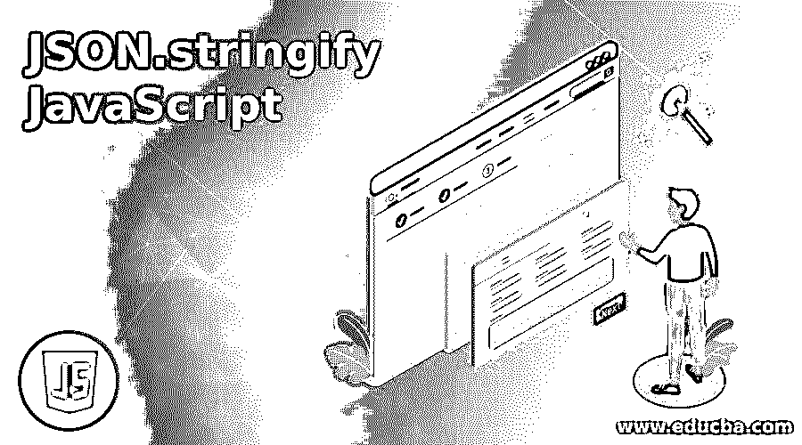
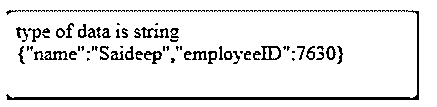
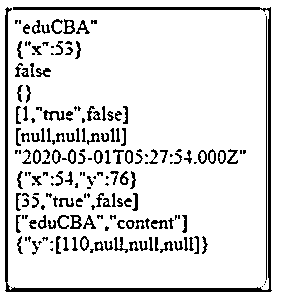
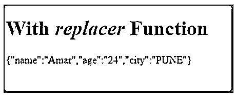
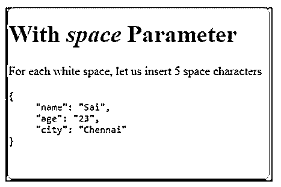

# JSON.stringify JavaScript

> 原文：<https://www.educba.com/json-stringify-javascript/>




## JSON.stringify JavaScript 简介

JSON 是用于结构化数据的 JavaScript 对象符号。它是一种以键值对的形式存储和传输数据的格式。JSON.stringify 是 JavaScript 中的一个方法，它将 JS 对象或值转换为 JSON 字符串。在使用 JavaScript 开发许多应用程序时，需要将数据序列化为字符串，以便将数据存储在数据库中并发送给 API。借助 JSON.stringify()方法可以完成对象到字符串的转换。

**语法:**

<small>网页开发、编程语言、软件测试&其他</small>

```
JSON.stringify(value, replace, space)
```

**参数:**

*   **值**:需要转换成 JSON 字符串的值。
*   **replacer:** 可以改变字符串化过程的可选函数。如果值为空或未提供，则对象的所有属性都包含在结果字符串中。
*   **space:** 一个可选参数，用于控制最终字符串中的间距，该字符串是使用 JSON.stringify()生成的。如果是数字，指定数量的空格将缩进到最终字符串，如果是字符串，则最多 10 个字符的字符串用于缩进。

返回一个 JSON 字符串，如果是循环引用，或者试图对 BigInt 类型值进行字符串化时，会引发 TypeError 异常。

**举例:**

```
console.log( JSON.stringify({ x: 32, y: 43 }) );    // returns {"x":32,"y":43}
```

```
console.log ( JSON.stringify({ x: 52, y: 0 }, null) );    //returns { "x": 52, "y": 0 }
```

**JSON 支持以下数据类型**

*   对象{ }
*   数组[ ]
*   原语，如字符串、数字、布尔值，即真或假和空

### JSON.stringify JavaScript 示例

下面是提到的例子:

#### 示例#1

**代码:**

```
<!DOCTYPE html>
<html>
<head>
<title>Page Title</title>
<body>
<script>
var json = {"name": "Saideep","employeeID": 7630};
data = JSON.stringify(json);
document.write('type of data is '+ typeof data + '</br>');
document.write(data);
</script>
</body>
</html>
```

**输出:**




#### 实施例 2

**代码:**

```
<!DOCTYPE html>
<html>
<head>
<title>Page Title</title>
<body>
<script>
document.write(JSON.stringify('eduCBA'));
document.write('</br>');
document.write(JSON.stringify({ x: 53 }));
document.write('</br>');
document.write(JSON.stringify(false));
document.write('</br>');
document.write(JSON.stringify({}));
document.write('</br>');
document.write(JSON.stringify([1, 'true', false]));
document.write('</br>');
document.write(JSON.stringify([null, NaN, Infinity]));
document.write('</br>');
document.write(JSON.stringify(new Date(2020, 4, 1, 10, 57, 54)))
document.write('</br>');
document.write(JSON.stringify({ x: 54, y: 76 }));
document.write('</br>');
document.write(JSON.stringify([new Number(35), new String('true'), new Boolean(false)]));
document.write('</br>');
let x = ['eduCBA', 'content'];
x['example'] = 'quickfix';
document.write(JSON.stringify(x));
document.write('</br>');
document.write(JSON.stringify({ y: [110, undefined, function(){}, Symbol('')] }));
document.write('</br>');
document.write(JSON.stringify({x: 2n}));  //BigInt value cannot be serialized in JSON: TypeError
</script>
</body>
</html>
```

**输出:**




**JSON.stringify()将值转换为 JSON 符号，如下:**

*   如果值是 Boolean、Number、String 对象，则通过字符串化将其转换为相应的值。
*   如果 value 必须是 JSON()方法，那么它负责序列化哪些数据。
*   如果 value 是未定义的、函数或符号，则它们不是有效的 JSON 值。这些值要么被省略，要么被更改为 NULL。
*   数字无穷大、NaN 以及 null 值都被认为是 NULL。
*   所有对象实例，如 Map、Set、WeakSet 和 WeakMap only 可枚举属性都将被序列化。

#### 实施例 3

**代码:**

```
<!DOCTYPE html>
<html>
<body>
<h1>With <em>replacer</em> Function</h1>
<p id="demo"></p>
<script>
var obj = { "name":"Amar", "age":"24", "city":"Pune"};
var text = JSON.stringify(obj, function (key, value) {
if (key == "city") {
return value.toUpperCase();
} else {
return value;
}
});
document.getElementById("demo").innerHTML = text;
</script>
</body>
</html>
```

**输出:**




#### 实施例 4

**代码:**

```
<!DOCTYPE html>
<html>
<body>
<h1>With <em>space</em> Parameter</h1>
<p>For each white space, let us insert 5 space characters</p>
<pre id="demo"></pre>
<script>
var obj = { "name":"Sai", "age":"23", "city":"Chennai"};
var text = JSON.stringify(obj, null, 5);
document.getElementById("demo").innerHTML = text;
</script>
</body>
</html>
```

**输出:**




### 空间参数

用于在输出 JSON 时插入空格的字符串或数字对象。如果是一个数字，它表示用作空白的空格字符的数量。默认情况下，该值上限为 10，如果该值小于 1，则不包括空格。如果 object 是一个字符串，字符串本身被用作空白，如果没有提供值或为空，则没有空格被添加到输出 JSON 中。

### 替换参数

Replacer 可以是一个函数，也可以是一个数组，作为一个函数，replacer 接受两个参数:键和值。首先，用一个表示要字符串化的对象的空字符串调用 replacer。Replacer 不能用于从数组中移除值，在返回 undefined 或函数时，将使用 NULL。

以下是一些数据类型的返回值:

*   如果返回值是数字，则在添加到 JSON 字符串时，对应于该数字字符串将用作属性值。
*   如果返回值是字符串*，*字符串在添加到 JSON 字符串时作为属性使用。
*   如果返回值为布尔值，即“真”或“假”是添加到 JSON 字符串的属性值。
*   如果返回值为空，则空属性被添加到 JSON 字符串中。
*   如果返回值是一个对象，它被递归地字符串化为 JSON 字符串。
*   如果返回值未定义，则属性不会添加到 JSON 字符串中。

### 结论

要点总结包括 JSON 是什么意思，JSON.stringify()如何工作的一些例子已经说明了。它的一些例外，如何在字符串化中使用空格和 replacer。JSON 作为一种数据格式，有自己的标准和库。它支持所有普通对象，如字符串、数组、布尔和 null。JavaScript 已经提供了 JSON.stringify()和 JSON.parse()来序列化为 JSON，并使用转换函数从 JSON 中读取。任何带有 toJSON 的对象都由 JSON.stringify()调用。

### 推荐文章

这是 JSON.stringify JavaScript 的指南。这里我们讨论 JSON.stringify JavaScript 的介绍，以及示例、空格参数和 replacer 参数。您也可以看看以下文章，了解更多信息–

1.  [SQL 中的 JSON](https://www.educba.com/json-in-sql/)
2.  [Python 中的 JSON](https://www.educba.com/json-in-python/)
3.  [JSON 是什么？](https://www.educba.com/what-is-json/)


