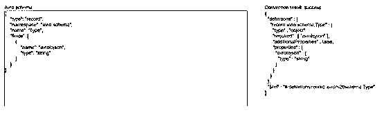

# Avro 到 JSON

> 原文：<https://www.educba.com/avro-to-json/>


## Avro 到 JSON 的介绍

它被定义为，avro 是提供序列化、扁平化和行相关格式的数据存储库，并且它主要被用作序列化数据存储库格式，它具有用于从完整行读取数据的系统结构，并且它被更短地组织用于读取数据，文件具有模式，其中格式和类型已经被保留并且以 JSON 格式展示，因为它由 avro 支持，对于任何系统都非常容易被人读取，对于转换，我们需要进行直接映射，以便结果 JSON 将具有相同的结构。

### Avro 对 JSON 来说是什么？

它是一种序列化机制，可以构建该机制来序列化和交换各种 Hadoop 项目中的大量数据，它能够以密集的二进制格式序列化数据，模式是 JSON 格式，可以描述字段名和数据类型，我们能够以各种语言(如 Java 和 Python)转换为 JSON，因为在 Java 中使用 avro 进行转换，我们需要使用“ConvertRecord”或“ConvertAvroToJSON”， 如果 avro 文件中没有模式，那么我们必须给出，它可以转换为模式和文件，这意味着 avro 可以转换为 JSON 格式和 JSON 文件。 我们还可以借助数据帧和 JSON 格式以另一种方式将 avro 文件转换为 JSON 文件格式，这样 avro 文件就可以使用标记将大量数据集分成子集。

<small>网页开发、编程语言、软件测试&其他</small>

### (计划或理论的)纲要

它是一种基于模式的序列化机制，可以将模式作为输入，avro 可以有自己的标准来描述模式，其中可以有文件类型、记录位置、记录名称和记录中的字段，以及与其相等的数据类型，avro 模式可以以 JSON 的文档格式构造，这是一种数据交换格式，可以是 JSON 字符串、JSON 对象和 JSON 数组。

如果我们试图用数据操作属性构造一个模式，那么我们需要描述格式，以便对象能够读和写，当我们试图描述 avro 格式时，我们必须在。avsc '文件，当我们试图在 JSON 模式中安排数据操作属性时，我们需要描述格式，以便数据对象能够读写，为了指定 JSON，我们需要描述 JSON 文件。

**举例:**

**代码:**

```
{
"type": "record",
"namespace": "avroschema",
"name": "Student",
"fields": [
{"name": "Name", "type": "string"},
{"name": "Class", "type": "int"}
]
}
```

**输出:** JSON 模式




在上面的例子中，type 可以描述数据类型，namespace 可以描述其中的 object 可以是余数，name 可以描述字段的名称，而 fields 也可以描述字段的名称。

### 文件

让我们看看如何在 scala 中将文件转换为 JSON 文件格式，因此，为了转换它，我们首先必须将 avro 文件读取到数据帧中，然后，我们可以将其转换为 JSON 文件，因为我们知道 avro 是开源的，可以支持数据序列化和交换，并且可以一起使用，通过使用序列化，任何程序都可以高效地将数据序列化为文件。 正如我们所知，它有密集的数据仓库，因此它可以在一个文件中保留数据定义和数据，avro 可以以 JSON 格式保留数据定义，以便人们可以轻松地读取和写入。

avro 文件可能包含有助于将大型集合分配到子集的标记，在某些情况下，一些数据交换服务可以使用代码生成器来显示数据定义并生成数据要接收的代码。

#### 1.使用数据帧读取 Avro 文件

spark 不支持这些函数，因此我们可以使用“DataSource”格式作为 avro，load 函数已经用于读取 avro 文件。

**代码:**

```
val df = spark.read.format("avrofile")
.load("src/main/resources/zipcodes.avro")
df.show( )
df.printSchema( )
```

如果我们有数据分离，那么我们可以使用 where()函数来加载特定的分离。

**代码:**

```
spark.read
.format("avro")
.load("zipcodes_partition.avro")
.where(col("Zipcode") === 19802)
.show()
```

spark.read.json("path ")能够将 json 文件读入 spark 数据帧，在该数据帧中，该方法可以接受文件路径作为参数。

#### 2.转换文件

这是将文件转换成 JSON 文件的另一种方式，让我们看看如何借助 JSON 文件格式将文件转换成 JSON 文件。

我们必须使用一个链接来转换成 JSON，如下所示:

**代码:**

```
df.write.mode(SaveMode.Overwrite)
.json("https://cdn.educba.com/tmp/json/zipcodes.json")
```

我们可以把上面写为:

**代码:**

```
df.write
.json("https://cdn.educba.com/tmp/json/zipcodes.json")
```

**举例:**

**代码:**

```
package com.sparkbyexamples.spark.dataframe
import org.apache.spark.sql.{SaveMode, SparkSession}
object AvroToJson extends App {
val spark: SparkSession = SparkSession.builder()
.master("local[1]")
.appName("avrotojsonfile")
.getOrCreate()
spark.sparkContext.setLogLevel("mistake")
val df = spark.read.format("avro")
.load("src/main/resources/zipcodes.avro")
df.show()
df.printSchema()
df.write.mode(SaveMode.Overwrite)
.json("https://cdn.educba.com/tmp/json/zipcodes.json")
}
```

在上面的例子中，我们有使用数据帧将 avro 文件转换为 JSON 文件格式的代码，因为我们已经导入了包，然后我们编写了五行代码来读取 avro 文件，我们还编写了最后两行代码来将文件转换为 JSON 文件格式。

### 结论

在本文中，我们已经看到了 avro 如何转换为 JSON 模式和 JSON 文件，avro 文件可以在数据帧和 JSON 格式的帮助下转换为 JSON 文件，因此本文将有助于理解这个概念。

### 推荐文章

这是 Avro 转 JSON 的指南。为了更好地理解，我们在这里讨论引言、模式和文件。您也可以看看以下文章，了解更多信息–

1.  [TypeScript JSON](https://www.educba.com/typescript-json/)
2.  [jQuery getJSON()](https://www.educba.com/jquery-getjson/)
3.  [JQuery JSON 解析](https://www.educba.com/jquery-json-parse/)
4.  [c#中的 JSON 解析器](https://www.educba.com/json-parser-in-c-sharp/)


