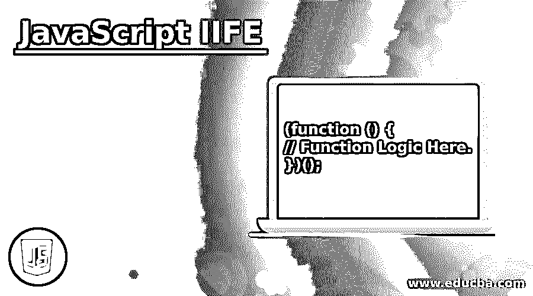
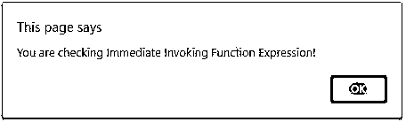
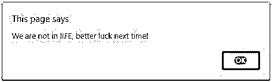
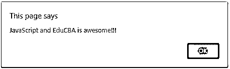
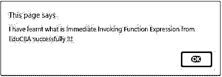
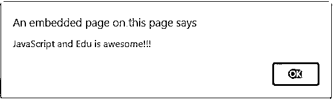

# JavaScript 生活

> 原文：<https://www.educba.com/javascript-iife/>




## JavaScript IIFE 简介

JavaScript 立即调用函数表达式(IIFE)是一个帮助提供定义特定上下文序列的方法的函数。一旦变量在函数内部定义，就不可能在定义它的函数外部访问它。JavaScript 中创建的函数有命名函数和匿名函数，通过使用 IIFE，我们可以在安装后立即执行这些函数。这种功能使它们具有生命。让我们详细看看这个函数是如何工作的

### 句法

下面是 JavaScript IIFE 的语法:

<small>网页开发、编程语言、软件测试&其他</small>

```
(function () {
// Function Logic Here.
})();
```

**解释:**这个函数的主要用途是变量应该只能在已定义的函数范围内访问。

声明应该以关键字 function()开始。在函数定义中，您可以定义要执行的任何语句。这个功能要吊起来。当 JavaScript 代码被执行时，被提升的函数总是被放置在程序或函数作用域的开始。您也可以使用下面的语法:

```
(() => { // Code that runs in your function })()
```

括号让 JavaScript 知道有一个函数表达式，最后一对括号将调用该函数。

### JavaScript 是如何工作的？

让我们看看它是如何工作的:

**代码:**

```
(function () {
var userName = "Snehal";
function display(name)
{
alert("MyCode2.js: " + name);
}
display(userName);
})();
```

上面的代码是生活的一个例子。IIFE 有助于包含同名的所有函数和变量，并且它们可以被全局访问。这里我们定义了一个函数，在它的定义中，我们创建了一个变量 username。我们立即编写另一个函数来显示这个用户名。这是显示函数，我们将用户名作为参数发送。我们为此创建了一个警报，其中显示了代码脚本名称，然后通过使用 IIFE，我们只需在最后调用该函数。这样，我们一个接一个地调用了两个函数。我们立即援引了。让我们看几个例子，以便更好地理解。

### 实现 JavaScript IIFE 的示例

下面是提到的例子:

#### 示例#1

**代码:**

```
<!DOCTYPE html>
<html>
<body>
<p>JavaScript to check the working of Immediate Invoking Function Expression. </p>
<p id="demo"></p>
<script>
// anonymous function #1
var isLucky = function() {
var iife = Math.round(Math.random() * 100);
if (iife > 50) {
return "You are checking Immediate Invoking Function Expression!";
} else {
return "We are not in IIFE, better luck next time!";
}
};
var me = isLucky();
alert(me);
// anonymous function #2
window.setTimeout(function() {
alert("JavaScript and EduCBA is awesome!!!");
}, 2000);
</script>
</body>
</html>
```

**输出:**







首先，根据条件显示结果。当我们再次运行程序时，结果是 else 部分。一旦超时结束，上述程序的输出将如下所示:




**解释:**上面的脚本帮助我们更好地理解 Javascript 中的生活。在这里，我们创建了一个函数 isLucky，我们将一个随机数四舍五入，然后乘以 100。随机数是由 Math.random()函数生成的。生成该数字后，我们检查该数字是小于还是大于 50。如果该数字大于 50，则消息将显示为:“您正在检查立即调用函数表达式！”.否则将显示相应的消息。一旦这个函数完成，我们就调用它，并把它存储在一个名为 me 的变量中。无论返回什么消息，它都将显示在浏览器的警告窗口中。就在这之后，另一个函数被调用。此功能将超时，并显示另一个警报。下面是我们第一次运行时的输出。

#### 实施例 2

让我们再举一个生活的例子。我们也可以在没有 if else 块的情况下使用这个函数。

**代码:**

```
<!DOCTYPE html>
<html>
<body>
<p>JavaScript to check the working of Immediate Invoking Function Expression. </p>
<p id="demo"></p>
<script>
(function() {
var create = "I have learnt what is Immediate Invoking Function Expression from EduCBA successfully !!!";
alert(create);
})();
// anonymous function #2
window.setTimeout(function() {
alert("JavaScript and Edu is awesome!!!");
}, 2000);
</script>
</body>
</html>
```

**输出:**




上述代码一运行，就会显示该消息。一旦超时，警告窗口会自动出现。




解释:上面的代码是一个经典而简单的生活的例子。我们创建一个函数并立即调用它。我们没有给这个函数起任何名字。我们刚刚创建了一个变量 create。然后，这个函数使用它来显示这个消息，就像调用函数时的太阳一样。根据语法，我们必须正确使用括号。如果括号中有任何遗漏，那么代码将不会给出期望的结果。一旦函数被声明和定义，我们就可以很容易地调用它。为了调用我们已经创建的函数，我们将只传递空括号。我们将变量 create 作为参数发送给警报。当程序运行时，警报将被调用，所创建的变量中的任何内容都将显示在警报窗口中。我们还创建了一个与示例 1 相似的函数。这将以类似的方式工作。它将等待超时，并再次显示带有指定消息的警报窗口。我们这里提到的超时时间是 2 毫秒。一旦结束，信息将自动显示。让我们看看上面代码的输出。

### 结论

立即调用函数表达式是一种在函数创建后立即调用函数的简单方法。它有助于在需要时保持局部变量为局部变量或全局变量为全局变量。它很快，因此使用起来非常高效。它实现了程序员保持变量完整的目的。生命可以有名字也可以没有名字。需要时，它们也可以与一元运算符一起使用。

### 推荐文章

这是 JavaScript 生活指南。在这里，我们讨论 JavaScript 的生命，语法，它是如何工作的介绍和编程例子。您也可以浏览我们的其他相关文章，了解更多信息——

1.  JavaScript 中的[对象](https://www.educba.com/object-in-javascript/)
2.  [JavaScript getelement byid()](https://www.educba.com/javascript-getelementbyid/)
3.  [JavaScript 中的定时器](https://www.educba.com/timer-in-javascript/)
4.  [JavaScript 键盘事件](https://www.educba.com/javascript-keyboard-events/)


