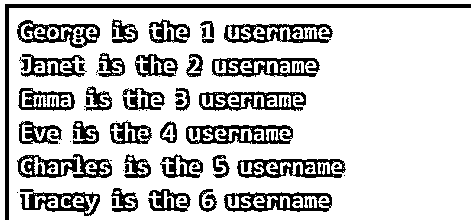
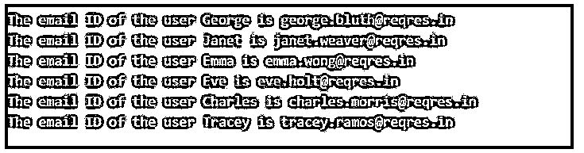

# JavaScript 获取 API

> 原文：<https://www.educba.com/javascript-fetch-api/>


## JavaScript 获取 API 简介

JavaScript API 基于在浏览器中异步发出 HTTP 请求的承诺，就像 XMLHttpRequest (XHR)一样，在 JavaScript 中被称为 Fetch API。这是一个非常干净和简单的 API，它利用 promise 特性来提供一个强大而灵活的特性集，以便从服务器获取资源。除了 Internet Explorer 之外，所有现代浏览器都支持 Fetch API，如果有必要的话，还可以让这个 Fetch API 特性在 Internet Explorer 上工作。将 polyfill 发布的 github 添加到我们正在进行的项目中，使我们能够在 Internet Explorer 上工作。

### JavaScript 中 Fetch API 的用法

JavaScript 中 Fetch API 的使用可以分为三个部分。

<small>网页开发、编程语言、软件测试&其他</small>

#### 1.发送请求

*   可以向 fetch()方法传递一个参数，这个参数通常是我们试图获取的网页或资源的 URL。
*   然后 fetch()方法返回一个承诺，可以使用 then()和 catch()方法来处理这个承诺。
*   一旦请求完成，所请求的资源或网页内容是可用的。
*   一旦请求完成，承诺就被解析成一个响应对象。

发送请求的过程可以演示如下:

**代码:**

```
let response = fetch(url);
fetch(url)
.then(response =>
{
// response is handled
}
)
.catch(error =>
{
//error is handled
}
);
```

#### 2.阅读回复

*   如果内容的响应是原始文本的形式，可以使用 text()方法。
*   text()方法返回一个承诺，该方法解析显示获取的网页内容或资源的完整内容。
*   async 或 await 也可以用于返回的响应。

使用 text()方法可以如下演示读取响应的过程:

**代码:**

```
fetch('filename.txt')
.then(response => response.text())
.then(data => console.log(data));
```

*   使用 async/await 可以如下演示读取响应的过程:

**代码:**

```
async function fetch()
{
let response = await fetch('filename.txt');
let data = await response.text();
console.log(data);
}
```

#### 3.处理响应返回的状态代码

*   状态代码和状态文本由响应对象通过 Status 和 status text 属性提供。
*   200 是状态代码，OK 是响应对象在状态为成功时返回的状态文本。
*   400 是状态代码，Not Found 是响应对象在请求的网页或资源不存在时返回的状态文本。
*   500 是当请求的 URL 引发服务器错误时，响应对象返回的状态代码。

### JavaScript 获取 API 示例

以下是 JavaScript 获取 API 的示例:

#### 示例#1

演示 Fetch API 的 JavaScript 程序，用于从传递给 Fetch API 方法的 URL 中获取相应用户的名字和用户 ID。

**代码:**

```
//fetch method is used to read the contents of the web page whose URL is passed as a parameter to the fetch method. Here we are passing the URL which consists of the list of user details like user ID, user first name, user last name etc.
fetch('https://reqres.in/api/users')
//the response from the fetch API is stored in the result variable which is then used to read and display the user first name and user ID alone as the output.
.then(result => result.json())
.then(result =>
{
result.data.map(user =>
{
console.log(` ${user.first_name} is the ${user.id} username `);
});
});
```

**输出:**




在上面的程序中，fetch 方法用于读取网页的内容，该网页的 URL 作为参数传递给 fetch 方法。这里我们传递的是 URL，它由用户 ID、用户名、用户姓等用户详细信息列表组成。然后，来自 fetch API 的响应被存储在 result 变量中，该变量随后被用来读取并显示用户的名字和用户 ID 作为输出。

#### 示例 2

演示 Fetch API 的 JavaScript 程序，从传递给 Fetch API 方法的 URL 中获取相应用户的电子邮件 ID，并显示用户的名字和电子邮件 ID。

**代码:**

```
//fetch method is used to read the contents of the web page whose URL is passed as a parameter to the fetch method. Here we are passing the URL which consists of the list of user details like user ID, user first name, user last name, email ID etc.
fetch('https://reqres.in/api/users')
//the response from the fetch API is stored in the result variable which is then used to read and display the user first name and email ID alone as the output.
.then(result => result.json())
.then(result =>
{
result.data.map(user =>
{
console.log(` The email ID of the user ${user.first_name} is ${user.email}`);
});
});
```

**输出:**




在上面的程序中，fetch 方法用于读取网页的内容，该网页的 URL 作为参数传递给 fetch 方法。在这里，我们传递的是 URL，它由用户 ID、用户名、用户姓、电子邮件 ID 等用户详细信息列表组成。然后，来自 fetch API 的响应存储在 result 变量中，该变量用于读取并显示用户的名字和电子邮件 ID 作为输出。

### 优势

在 JavaScript 中使用 Fetch API 的优点:

*   与使用 XMLHttpRequest 相比，使用 Fetch API 方法可以很容易地发出异步请求和处理响应。
*   利用 JavaScript 中的 Fetch API 可以创建更好的 API，因为它利用了诸如 promises 等现代特性。

### 推荐文章

这是一个 JavaScript 获取 API 的指南。这里我们讨论 JavaScript 中 fetch API 的介绍、用法、例子和优点。您也可以看看以下文章，了解更多信息–

1.  [JavaScript object.is()](https://www.educba.com/javascript-object-is/)
2.  [JavaScript 数组切片](https://www.educba.com/javascript-array-slice/)
3.  [卸载 JavaScript](https://www.educba.com/unshift-javascript/)
4.  [JavaScript test()](https://www.educba.com/javascript-test/)


