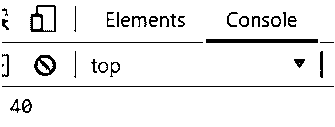

# JavaScript 下划线

> 原文：<https://www.educba.com/javascript-underscore/>


## JavaScript 下划线的定义

Java 向用户提供了 JavaScript 库，即 unserscore.js。下划线. js 提供了不同类型的函数，该函数有助于程序员在没有内置对象的帮助下构建任何类型的应用程序。基本上，下划线是 JavaScript 中的标识符，这意味着我们可以在下划线的帮助下识别或执行任何类型的操作。通常 JavaScript 中使用下划线来定义任何字段 private 或 public，而不使用 private 和 public 关键字。通过使用下划线(_)，我们可以很容易地识别私有类和该类的成员，因此它是编程语言中广泛使用的概念，所有程序员都会识别它。

**语法:**

<small>网页开发、编程语言、软件测试&其他</small>

```
<script sc="underscore-main.js"></script>
<script type="text/javascript">
{function(){
var list=['jenny','pooja','sameer'];
_.each(list, function(name, key))
console.log(name);
console.log(key);
}
};
```

**解释**

在上面的语法中，我们使用 JavaScript 这里我们首先需要导入下划线库，如上面的语法所示。之后，我们采用脚本类型并创建一个新的函数，在函数内部我们写值，在语法末尾，我们使用。每个函数来访问我们已经写在列表中的列表值。最后，我们使用控制台语句打印该值。

### 下划线 JavaScript 是如何工作的？

现在让我们看看下划线在 JavaScript 中是如何工作的，如下所示。首先，理解下划线的一些重要特性，如下所示。

**收藏**

js 通常为 collection 提供不同种类的函数，比如 each map 和 reduce。我们可以应用于集合的函数也提供了不同的方法，如 groupBy、countBy、min 和 max。

**数组**

js 还为数组提供了不同的函数，如 initial、lastindexOf、intersection 等。

**功能**

当我们需要实现 bind、delay、before 和 after 函数时，这时候我们也可以使用下划线. js。

**物体**

我们可以操纵物体；我们可以映射对象，也可以使用下划线. js 库来比较对象。

**实用程序**

如果我们需要实现不同的工具，如转义、随机和迭代等。

现在让我们看看如何设置下划线. js，如下所示。

基本上，有两种方法可以实现下划线. js，如下所示。

**1。我们可以使用浏览器执行下划线. js 文件:**

这是实现下划线. js 文件的第一种方法；在这个方法中，我们可以直接在浏览器中执行。所以我们需要遵循如下一些步骤。

**步骤:**

1.首先，我们需要访问 understand.js 的官方网站，还有一个选项可以提供最新的下划线-min.js 文件，在这个文件中，我们不能做任何更改。

2.之后，我们需要将下划线-min.js 文件添加到脚本中，我们可以开始处理下划线. js 文件。

现在让我们使用第二种方法如下。

**2。使用 Node.js:** 实现下划线. js

这是实现下划线. js 的另一种方法，但是要确保 Node.js 和 npm 必须安装在您的系统中。否则，我们可以使用下面的命令来安装所需的设置。
npm 安装下划线

现在让我们看看下划线中的迭代集合，如下所示。

*   _.each():我们可以把这个方法的语法写成是 _。each (list，iteratee)并用于获取每个参数。在这个方法中有两个部分如一个数组或对象来迭代和回调函数。这个方法的执行非常容易，其中数组中的每个对象。each()将回调该函数，在该函数中，我们再次拥有不同的参数，如数组、索引或数组的值，以及我们在语法中显示的数组迭代。
*   _.map():这是下划线. js 库的内置函数。基本上 _。map()函数用于创建一个新的数组，并通过使用一个转换函数来映射列表中的每个元素。

**语法**

```
_.map(array_list, transformation_function)
```

**解释**

在上面的语法中，我们使用如下两个参数。

array_list:用于将元素存储到数组列表中。

Transformation_function:这是一个函数，它执行数组列表中的所有元素。

现在让我们看看如何将元素传递给用户定义的函数。我们知道我们有一个包含数组元素的数组列表，我们需要使用一个用户定义的函数来逐个访问它们。在这种情况下，用户定义的函数一个接一个地获取元素并执行我们需要的操作，并通过使用控制台在屏幕上显示结果。

现在让我们来看看处理集合的一些方法，如下所示。

*   _.contains():下划线. js 还提供了 _。contains()方法检查元素是否出现在列表中。

**语法:**

`_.contains (array_list, value_to_search, [array_index])`

**解释**

在上面的语法中，我们使用了如下不同的参数。

*   array_list:用于将元素存储到数组列表中。
*   value_to_search:用于存储我们需要搜索的元素。
*   array_index:这是该语法的可选部分；基本上它是用来保存搜索的起始索引的。

在处理集合时，我们有不同的方法，下面列出了一些方法。

Invoke，pluck，max，min，sortBy，groupBy，indexBy，countBy 等。

现在让我们看看如下迭代数组方法。

下划线. js 提供了下面列出的数组迭代方法。

first，initial，last，rest，indexOf，lastIndexOf，sortedIndex 等。

现在让我们看看下面列出的下划线. js 中的不同函数。

通过使用函数，我们可以轻松地处理下划线. js 函数，如下所示。

绑定、部分、延迟、一次、换行、求反等。

下划线. js 为用户提供了 100 多种方法。

### 例子

现在让我们看看 JavaScript 中下划线. js 的不同例子，如下所示。

```
<!DOCTYPE html>
<html>
<head>
<title=Underscore.js in JavaScript /title>
<script sc = underscore-min.js></script>
<body>
<script type="text/javascript">
var num = [150, 100, 50, 40, 200];
console.log(_.min(num));
</script>
</head>
</body>
</html>
```

**解释**

在上面的例子中，我们在一个 Html 文件中编写代码，并且我们使用了一个内置的库 understand-min . js。这个程序的最终输出用下面的截图来说明。




这样，我们可以使用不同的方法来执行不同的操作。

### 结论

我们希望从这篇文章中，你学会强调 JavaScript。从上面的文章中，我们已经学习了下划线 JavaScript 的基本语法，我们也看到了下划线 JavaScript 的不同例子。从本文中，我们了解了如何以及何时使用下划线 JavaScript。

### 推荐文章

这是 JavaScript 下划线的指南。这里我们讨论下划线 JavaScript 的定义、语法和工作原理。代码实现示例。您也可以看看以下文章，了解更多信息–

1.  [哈希表 JavaScript](https://www.educba.com/hash-table-javascript/)
2.  [JavaScript 中的选择排序](https://www.educba.com/selection-sort-in-javascript/)
3.  [在 JavaScript 中排序字符串](https://www.educba.com/sort-string-in-javascript/)
4.  [JavaScript 表单](https://www.educba.com/javascript-modulo/)


