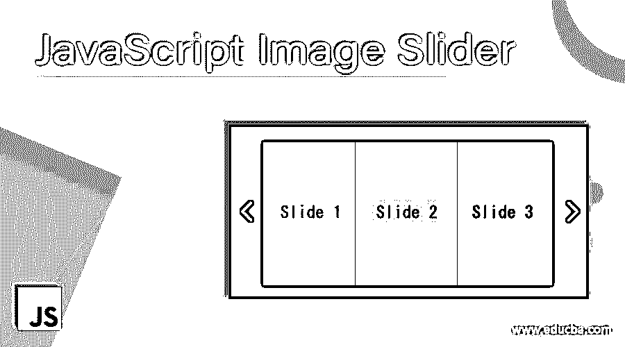
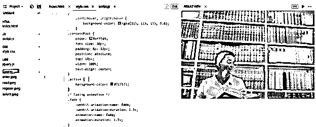
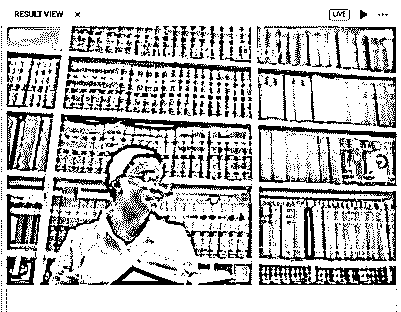
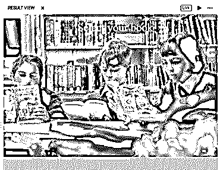
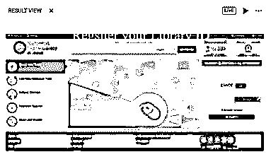
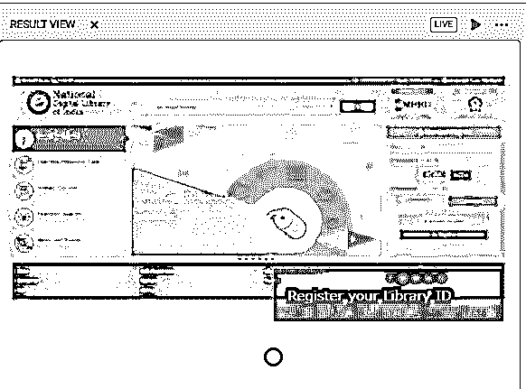

# JavaScript 图像滑块

> 原文：<https://www.educba.com/javascript-image-slider/>




## JavaScript 图像滑块简介

JavaScript 图像滑块不仅仅涉及 JavaScript，你还可以玩 [HTML 和 CSS](https://www.educba.com/html-vs-css/) 来创建一个图像滑块。更简单地说，它是一个滑块，允许在 web 应用程序上显示多个图像。它也被称为图像传送带或幻灯片，用于在 web 应用程序上显示多个图像、视频或图形。这种图像滑块会很有吸引力，会吸引用户的注意力。

在实时场景中，当我们需要在应用程序上开发图像滑块时。开发人员的快速反应是使用 jQuery 插件。这里我们不使用 jQuery，而是使用 Javascript、HTML 和 CSS 来设计图像滑块。在[使用 jQuery 插件](https://www.educba.com/jquery-plugins/)时，我们可能会面临与应用程序中使用的插件库和现有库发生代码冲突的机会。

<small>网页开发、编程语言、软件测试&其他</small>

### 创建 JavaScript 图像滑块的步骤

因此，让我们看看如何使用 JavaScript、HTML 和 CSS 创建 JavaScript 图像滑块，

**第一步:将首先在一个滑块中创建包含所需图像的 HTML 内容，**

```
<body>
<div class="container">
<div class="showSlider fade">

<div class="contentBook">Enter into Library</div>
</div>
<div class="showSlider fade">

<div class="contentBook">Select your book</div>
</div>
<div class="showSlider fade">

<div class="contentBook">Register your Library ID</div>
</div>
<div class="showSlider fade">

<div class="contentBook">Return your book after 7 days</div>
</div>
<!-- Navigation arrows -->
<a class="left" onclick="nextSlide(-1)">❮</a>
<a class="right" onclick="nextSlide(1)">❯</a>
</div>
</body>
```

这里，容器是图像滑块的主容器，showSlider 用于重复图像。

第二步:现在，我们将为图片滑块添加 JavaScript 逻辑部分。

```
var slide_index = 1;
slidesDisplay(slide_index);
function nextSlide(n) {
slidesDisplay(slide_index += n);
}
function currentSlide(n) {
slidesDisplay(slide_index = n);
}
function slidesDisplay(n) {
var i;
var slides = document.getElementsByClassName("showSlider");
if (n > slides.length) { slide_index = 1 }
if (n < 1) { slide_index = slides.length }
for (i = 0; i < slides.length; i++) {
slides[i].style.display = "none";
}
slides[slide_index - 1].style.display = "block";
}
```

这里所有的功能都是用户定义的

第三步:现在，我们将 CSS 添加到 HTML 中，它将使用样式定位图像。

```
body {
margin: 0;
background: #e6e6e6;
}
.showSlider {
display: none
}
.showSlider img {
width: 100%;
}
.container {
max-width: 1000px;
position: relative;
margin: auto;
}
.left, .right {
cursor: pointer;
position: absolute;
top: 50%;
width: auto;
padding: 16px;
margin-top: -22px;
color: white;
font-weight: bold;
font-size: 18px;
transition: 0.6s ease;
border-radius: 0 3px 3px 0;
}
.right {
right: 0;
border-radius: 3px 0 0 3px;
}
.left:hover, .right:hover {
background-color: rgba(115, 115, 115, 0.8);
}
.contentBook {
color: #eff5d4;
font-size: 30px;
padding: 8px 12px;
position: absolute;
top: 10px;
width: 100%;
text-align: center;
}
.active {
background-color: #717171;
}
/* Fading animation */
.fade {
-webkit-animation-name: fade;
-webkit-animation-duration: 1.5s;
animation-name: fade;
animation-duration: 1.5s;
}
@-webkit-keyframes fade {
from {
opacity: .4
}
to {
opacity: 1
}
}
@keyframes fade {
from {
opacity: .4
}
to {
opacity: 1
}
}
```

第四步:现在，我们将结合以上三个步骤，在我们的浏览器上运行。

这里，我们已经采取了一些图像滑块的样本图像。在“资源”文件夹中，为滑块添加所需的图像。




因此，在运行代码时，我们将得到以下输出:










这里我们有一个滑动选项，正如我们在上面的图片中看到的，每次点击，图片都会滚动

**例 2:通过设置超时，我们可以自动滑过所有图像，**

只有 JavaScript 代码必须更改为 setTimeout

```
var slideIndex = 0;
showImageSlider();
function showImageSlider()
{
var i;
var slides = document.getElementsByClassName("image-sliderfade");
var dots = document.getElementsByClassName("dot");
for (i = 0; i < slides.length; i++) {
slides[i].style.display = "none";
}
slideIndex++;
if (slideIndex > slides.length)
{
slideIndex = 1;
}
for (i = 0; i < dots.length; i++) {
dots[i].className = dots[i].className.
replace(" active", "");
}
slides[slideIndex - 1].style.display = "block";
dots[slideIndex - 1].className += " active";
setTimeout(showImageSlider, 1000);
}
```

HTML 和 CSS 的变化不会出现；可以遵循实例 1。输出如下所示，




所以这里我们用点表示每 1 秒钟后有 4 张图片自动滚动

### 图像滑块的优点和缺点

*   图像滑块使信息更容易适应 web 应用程序。
*   滑块提供了专业的外观，也允许链接重定向到其他页面。
*   使 web 页面更具响应性和创新性，这使得 web 应用程序的整体外观有了很大的不同。
*   该应用程序的大多数用户并不关心图像滑块，也不关心看到图像滑动。
*   有时滑块会因为内存不足而卡住，有时在手机上看起来也不太好，而且没有功能。
*   图像滑块可以影响搜索引擎优化的网络应用程序，由于该网络应用程序可能会获得较低的排名。

这样，我们就可以结束我们的话题了。如上所述，滑块包括基于超时或滚动的一个接一个的多个图像。我们已经看到了如何使用 JavaScript、HTML 和 CSS 创建 JavaScript 图像滑块的两个例子。我们也看到了一些优点和缺点的图像滑块，所以你的人可以得到为什么或为什么没有图像滑块。这些图像滑块不仅用于图像，还可以包括视频和图形。谢谢！快乐学习！!

### 推荐文章

这是一个 JavaScript 图像滑块的指南。这里我们讨论创建 JavaScript 图像滑块的步骤以及优缺点。您也可以看看以下文章，了解更多信息–

1.  [JavaScript onmouseout](https://www.educba.com/javascript-onmouseout/)
2.  [Javascript 求和数组](https://www.educba.com/javascript-sum-array/)
3.  [JavaScript 计数器](https://www.educba.com/javascript-counter/)
4.  [JavaScript 事件处理程序](https://www.educba.com/javascript-event-handler/)


