# JavaScript 复制到剪贴板

> 原文：<https://www.educba.com/javascript-copy-to-clipboard/>

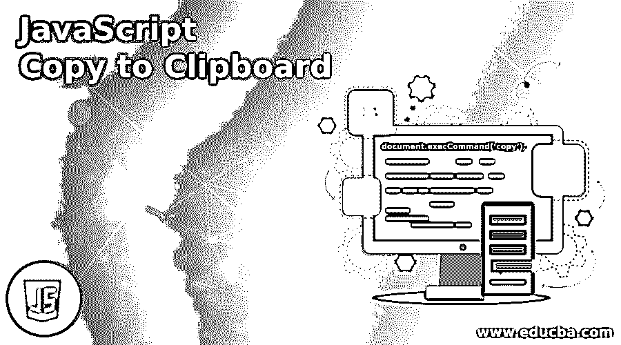


## JavaScript 复制到剪贴板简介

JavaScript 复制到剪贴板是一个核心功能，能够将文本复制到剪贴板。这是我们经常使用但在客户端 API 中缺少的功能之一。在网站建设中经常出现的一个主要问题是能够将文本复制到剪贴板，而不需要手动选择文本。使用 JavaScript 的 execCommand()方法，只需 5 个步骤就可以轻松实现，这有助于粘贴选定的文本。

**语法:**

<small>网页开发、编程语言、软件测试&其他</small>

```
document.execCommand('copy');
```

这正是 JavaScript 中用来将文本复制到剪贴板的方法。Chrome、Firefox 和 Safari 等大多数浏览器都支持该功能。execCommand()方法的执行可以通过 5 个简单的步骤来完成。

### 如何在 JavaScript 中复制到剪贴板？

下面给出了步骤:

*   **步骤 1:** 创建要追加到文档中的< textarea >元素。设置要复制到剪贴板的字符串的值。
*   **第二步:**将< textarea >元素追加到 HTML 文档中。
*   **第三步:**在使用 HTMLInputElement.select()时，< textarea >元素的所有内容都被选中。
*   **步骤 4:** 下一步是使用 Document.execCommand('copy ')将<文本区>的内容复制到剪贴板上。
*   **步骤 5:** 从文档中移除< textarea >元素的最后一步。

让我们实现 execCommand()并看看它是如何工作的。

#### 示例#1

**代码:**

```
<!DOCTYPE html>
<html>
<body>
<h3>Click Copy Text Here button to copy the text put inside the text field.</h3>
<h3>Paste (CTRL+v) in the next tab or clipboard</h3>
<input type="text" value="Hi, Please copy the text here to paste on clipboard" id="input">
<button onclick="copyClipboard()">Copy text Here!</button>
<p>The method document.execCommand() is not supported in IE8 and lower versions</p>
<script>
function copyClipboard() {
var sampleText = document.getElementById("input");  // getting the text field
sampleText.select();          // selecting the text field
sampleText.setSelectionRange(0, 99999)
document.execCommand("copy");     // Copying text inside text field
alert("Copied the text: " + sampleText.value);        // alerting the copied text
document.write("Copied Text here:", sampleText.value);
}
</script>
</body>
</html>
```

**输出:**

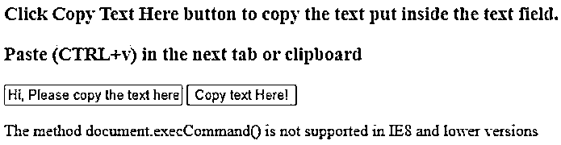


点击按钮时，带有数据“嗨，请复制此处的文本以粘贴到剪贴板上”的文本区域将被复制，我们可以在下面的警告框中看到，也可以在控制台上打印出来，如下所示。

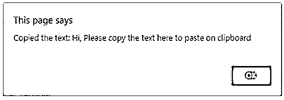


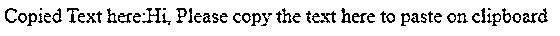


你可以直接在新窗口中使用 CTRL+v 粘贴它。

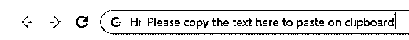


#### 实施例 2

与 CSS 一起复制到剪贴板。

**代码:**

```
<!DOCTYPE html>
<html>
<head>
<meta name="viewport" content="width=device-width, initial-scale=1">
<style>
.tooltip {
position: relative;
display: inline-block;
}
.tooltip .tooltiptext {
visibility: hidden;
width: 130px;
background-color: #555;
color: #fff;
text-align: center;
border-radius: 6px;
padding: 5px;
position: absolute;
z-index: 1;
bottom: 140%;
left: 60%;
margin-left: -75px;
opacity: 0;
transition: opacity 0.3s;
}
.tooltip .tooltiptext::after {
content: "";
position: absolute;
top: 100%;
left: 40%;
margin-left: -5px;
border-width: 5px;
border-style: dotted;
border-color: #555 transparent transparent transparent;
}
.tooltip:hover .tooltiptext {
visibility: visible;
opacity: 1;
}
</style>
</head>
<body>
<h3>Click Copy Text Here button to copy the text put inside the text field.</h3>
<h3>Paste (CTRL+v) in the next tab or clipboard</h3>
<input type="text" value="On mouse hover, you can see the tooltip" id="input">
<div class="tooltip">
<button onclick="copyClipboard()" onmouseout="outFunc()">
Copy to clipboard
Copy text
</button>
</div>
<p>The method document.execCommand() method is not supported in IE8 and lower versions</p>
<script>
function copyClipboard() {
var sampleText = document.getElementById("input");
sampleText.select();
sampleText.setSelectionRange(0, 99999)
document.execCommand("copy");
alert("Copied the text: " + sampleText.value);
document.write("Copied Text here:", sampleText.value);
}
</script>
</body>
</html>
```

**输出:**

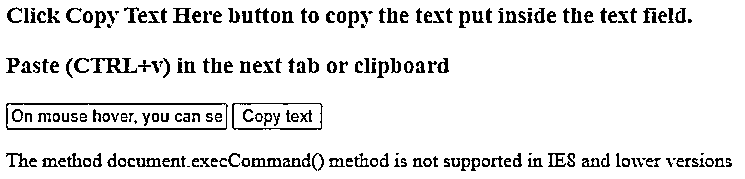


点击复制文本按钮，文本区数据将被复制，我们可以很容易地粘贴它。

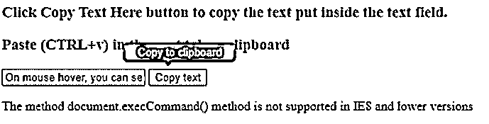


这里你可以看到我们已经实现的工具提示。

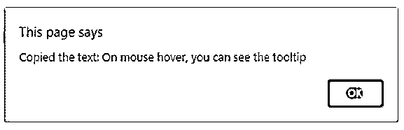


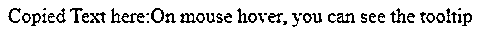


#### 实施例 3

**代码:**

```
<!DOCTYPE html>
<html>
<body style = "text-align:center;">
<h1 style = "color:green;" >
Copy to Clipboard JavaScript
</h1>
<input type="text" value="Todays topic is JavaScript forEach Array" id="input">
<button onclick="copyTextClipboard()">Copy text</button>
<script>
function copyTextClipboard() {
var copyText = document.getElementById("input");
copyText.select();
document.execCommand("copy");
alert("Text copied is: " + copyText.value);
}
</script>
<h3 style = "text-align: left;">
Click on the button to copy the text from the
text area. Paste it in a browser window to see the effect</h3>
</body>
</html>
```

**输出:**

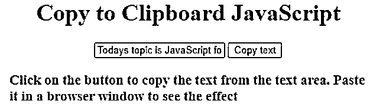


在这里，您可以看到数据将使用“复制文本”按钮进行复制，复制的文本将使用警报弹出。

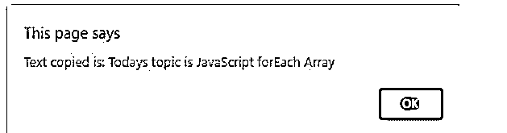


#### 实施例 4

**代码:**

```
<!DOCTYPE html>
<html>
<body style = "text-align:center;">
<h1 style = "color:green;" >
Copy to Clipboard JavaScript and remove the execCommand child
</h1>
<input type="text" value="EduCBA" id="input">
<button onclick="copyTextClipboard()">Copy text</button>
<script>
function copyTextClipboard() {
const value = document.getElementById("input");
document.body.appendChild(value);
value.select();
document.execCommand('copy');
document.body.removeChild(value);
};
</script>
<h3 style = "text-align: left;">
Click on the button to copy the text from the
text area. Paste it in a browser window to see the effect
</h3>
</body>
</html>
```

**输出:**


现在点击复制文本，文本区域中的文本将被复制。document . body . remove child(value)，将删除文本区域元素。

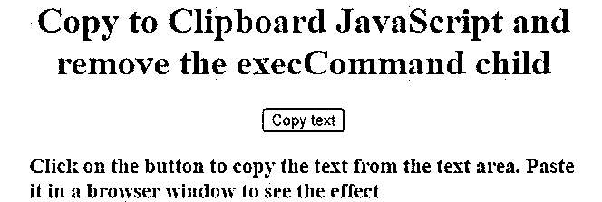


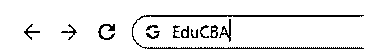


所以同样的东西被贴在了另一扇窗户上。

### 结论

我们已经看到了 JavaScript 中的复制到剪贴板。它的方法 execCommand()使用' select()'从文本区域复制输入，从文本区域选择所有输入数据。我们已经在上面看到了 4 个例子，其中一个我们已经用工具提示实现了。我们已经看到了复制到剪贴板要遵循的 5 个简单步骤，最后使用 document . body . remove child(value)从文档中删除了文本区域元素。

### 推荐文章

这是一个 JavaScript 复制到剪贴板的指南。在这里，我们讨论介绍和如何复制到剪贴板在 JavaScript 中完成？您也可以看看以下文章，了解更多信息–

1.  [JavaScript object.is()](https://www.educba.com/javascript-object-is/)
2.  [JavaScript 动画](https://www.educba.com/javascript-animation/)
3.  [JavaScript 数组包含](https://www.educba.com/javascript-array-contain/)
4.  [JavaScript 数组切片](https://www.educba.com/javascript-array-slice/)


