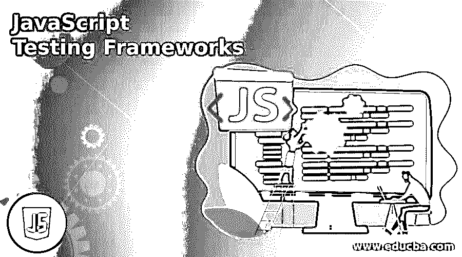

# JavaScript 测试框架

> 原文：<https://www.educba.com/javascript-testing-frameworks/>

## JavaScript 测试框架简介

在网页制作领域，已经有了许多重要的发展。JavaScript 测试框架是基于 JS 的动态框架，它以易于前端和后端创建而闻名。JavaScript 测试框架方式由开发人员开发，用于构建动态框架，而不是传统的编程语言，如 PHP、Java 和. NET。随着时间的推移，这些转变通常意味着需要优秀的测试工具。

### 顶级 JavaScript 测试框架

让我们看看 JavaScript 测试框架

<small>网页开发、编程语言、软件测试&其他</small>

#### 1.莫卡杰斯

自 2011 年以来，MochaJS 是 JavaScript 最常见的测试框架之一。它运行在 Node.js 上，并提供与前端和后端的异步测试兼容性。近年来，在公司文件的帮助下，Mocha 已经被证明是一个完善的结构。Github 上的 Mocha 主机已经被证明是 JavaScript 开发者中最可靠的库，并以其多功能性而闻名。

#### 2.玩笑

脸书使用和维护的 JEST 测试框架可能是 JavaScript 中最常见的。JEST 测试系统提供了“零配置”的研究体验 JEST 是最常见的基于 React 的应用程序框架。它提供了一个非常简单和舒适的用户界面。这个系统包含许多有趣的特性，比如快照检查和一个集成的代码覆盖工具。JEST 还支持多种在线服务。

#### 3.茉莉

Jasmine 于 2010 年作为 JavaScript 的开源测试平台发布。它能够评估 JavaScript 中的各种应用程序。该系统支持组件创建(BDD)。你可以在网站上测试与你的用户在 Jasmine 上的行为相似的案例。Jasmine 的 JS Spec，Rspec，影响不错。对于正面检查，茉莉很有用。它包含针对不同分辨率的不同设备的可见性测试和 UI 反应性测试。您还可以自动化用户行为，并等待模拟真实的用户活动。

#### 4.操纵木偶的人

Jasmine 于 2010 年作为 JavaScript 的开源测试平台发布。它能够评估 JavaScript 中的各种应用程序。该系统支持组件创建(BDD)。你可以在网站上测试与你的用户在 Jasmine 上的行为相似的案例。Jasmine 的 JS Spec，Rspec，影响不错。对于正面检查，茉莉很有用。它包含针对不同分辨率的不同设备的可见性测试和 UI 反应性测试。您还可以自动化用户行为，并等待模拟真实的用户活动。

#### 5.因果报应

Karma 是开源研究的另一个常见开发环境。它有助于 QA 在应用的各种条件下进行实验。Karma 将在真正的浏览器和手机、平板电脑等设备上执行应用脚本。Karma 旨在为开发人员提供一个测试环境，他们需要在其中配置配置负载。相反，他们只能进行实验并获得即时反馈。

#### 6.量角器

对于自动化反应 JS 测试，我们有 Jest。但是 Angular 的创作者呢。作为创建单页应用的最古老和最重要的框架机制之一，它为评估 Angular JS 和 Angular 应用程序提供了一个框架。这是量角器的救星。这是一个真实浏览器自动化测试的最终测试框架，目的是验证你的 angular 程序。

#### 7.柏树

Cypress 是一个新的基于网络的平台，用于下一代前端研究。开发人员可以用 Cypress 编写端到端、集成和单元测试。Cypress 基于 JavaScript 流行的前端语言，只支持 Mocha JS 框架。Cypress research 没有网络缺陷和弱点，因为测试是在浏览器中进行的，应用程序中同步发生的所有事情都很清楚。

#### 8.守夜

NightwatchJS 是一个强大的自动化框架，使用 Selenium WebDriverAPI，允许用户执行端到端的自动化 web 应用程序测试，尤其是 Node.js 应用程序。Nightwatch 的主要目标是促进自动化测试用例的编写和持续集成过程到您的开发周期中。

#### 9.Selenium Webdriver

考虑到 JavaScript 框架，Selenium WebDriver 无疑是最受认可和喜爱的 web 应用程序测试自动化系统。Selenium 可用于广泛测试自动跨浏览器。由于它是开源的，Selenium WebDriver 是业界领先的 JavaScript 测试框架之一。除了使用 Selenium 执行 JavaScript 自动化测试之外，它还可以用于其他编程语言。

### 推荐文章

这是 JavaScript 测试框架指南。在这里，我们还讨论了介绍和顶级 javascript 测试框架以及解释。您也可以看看以下文章，了解更多信息–

1.  [JavaScript UUID](https://www.educba.com/javascript-uuid/)
2.  [JavaScript 中的函数](https://www.educba.com/functions-in-javascript/)
3.  [JavaScript 对象符号](https://www.educba.com/javascript-object-notation/)
4.  [JavaScript 循环数组](https://www.educba.com/javascript-loop-array/)

