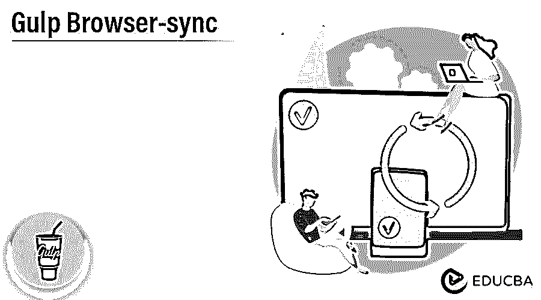
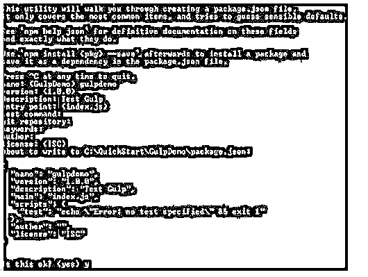
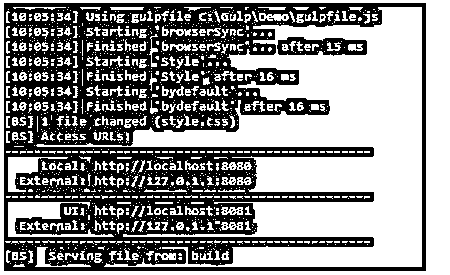

# 吞咽浏览器-同步

> 原文：<https://www.educba.com/gulp-browser-sync/>




## Gulp 浏览器同步简介

我们知道 gulp 是用来自动完成不同的任务的，比如 CSS 和 HTML，它还支持根据我们的要求合并其他文件，并编译 SASS 文件。此外，gulp 支持前端工作流的浏览器同步支持，这意味着我们可以根据需要重新加载特定的任务或事件。在同步过程中，Gulp 通知了所有浏览器这些变化。在同步过程中，browser-sync 会在编译完成后处理 CSS。这里我们确保在 gulp.dest 之后调用 stream()方法。

### Gulp 浏览器同步概述

Browsersync 是用于在实时环境中对我们的特定网站进行测试的最强大的工具。它与本地服务器一起工作，并与我们的本地浏览器同步。从那以后，每当我们修改代码或者我们可以说文件时，它会自动重新加载浏览器。利用 Browsersync 将帮助你更快更有效地编码。任何网络工程师都应该知道如何使用这种令人惊讶的适应性设备。重新加载决定了记录框架中的进度。BrowserSync 用于观察 CSS 目录中的所有 HTML 和 CSS 文档，并在所有程序中的记录发生更改的任何时间点播放重新加载到页面的生命。BrowserSync 通过跨各种小工具同步 URL、关联和代码更改，使工作过程更快。

<small>网页开发、编程语言、软件测试&其他</small>

Swallow 是 Node.js 的请求行任务运行器。Swallow 让我们机械化循环，毫无问题地完成多余的事情。Gulp 不等同于其他任务运行器，因为它使用节点流，将产出从一个努力作为数据开始，然后传递到下一个努力。它只需要仔细检查一次记录，然后通过各种任务处理它，最后形成结果报告。BrowserSync 是一个不可思议的资产，您可以与 Gulp 或 Grunt 一起使用，通过高效的同步程序测试来进一步开发您的改进工作过程。从现在开始不久，您将不再需要在每次更改代码时恢复页面。当你在你的风险管理器中保存一个记录时，它会为你做的。当今的 web 改进有许多单调乏味的任务，比如运行附近的服务器、精简代码、增强图片和预处理 CSS 天空是无限的。本文研究了 Gulp，一种用于使这些差事自动化的成型装置。与另一项任务相比，它更有限、更简单、更快捷。

### 大口浏览器同步配置

让我们看看如何配置浏览器同步，但在此之前，我们必须考虑以下先决条件:

首先，我们需要检查 Node 是否安装在我们的本地机器上，第二件事是安装带有命令行界面的 Gulp。

假设我们已经有了 node.js，如果我们想安装 Gulp，那么我们需要使用下面的命令。

**代码:**

```
npm install --global gulp-cli
```

下一步，我们需要在 NPM 的帮助下安装 gulp、浏览器同步和引导程序，包括所有的依赖项，如下所示。

在第一步中，我们需要使用以下命令创建 package.json 文件，如下所示:

**代码:**

```
npm init
```

**说明:**

*   这里我们得到了一些与应用程序相关的问题列表，最后，我们在根文件夹下创建了 package.json 文件。这个新创建的文件存储了所有的依赖项。
*   作为参考，可以看到如下截图。

我们可以在下面的结构中看到创建的 JSON 格式如下。




**代码:**

```
{
"emp_name":"Jenny",
"Dept":"HR",
"emp_id":"10",
"scripts":{
"status":"echo\"Error Message: No employee added\ " && exit 2"
},
}
```

之后，我们需要使用下面的命令安装依赖项。

**代码:**

```
npm install browser-sync gulp gulp-sass --save-dev
```

**说明:**

*   使用上面的命令，我们可以安装 BrowserSync 和 Gulp 这里——save-dev 用于在创建的 JSON 文件中添加开发依赖项。

在 gulp 命令行中，我们需要创建本地服务器来观察 SASS 文件的修改，并用 CSS 编译它。所以首先，我们需要在根文件夹中创建名为 gulpfile.js 的文件；在文件内部，我们需要添加不同的命令和下面的代码。

**代码:**

```
var gulp = require('gulp');
var browserSync = require('browser-sync').create();
var sas = require('gulp-sass');
gulp.task('sas', function() {
return gulp.s("C:Gulp/Demo/*.scss")
.pipe(sass())
.pipe(gulp.dest("C:Gulp/Demo/css"))
.pipe(browserSync.stream());
});
gulp.task('ser', gulp.series('sass', function() {
browserSync.init({
ser: ". C:Gulp/Demo/"
});
gulp.watch("C:Gulp/Demo/scss/*.scss", gulp.series('sass'));
gulp.watch("C:Gulp/Demo/*.html").on('change', browserSync.reload);
}));
gulp.task('default', gulp.series('ser'));
```

现在，我们需要使用以下命令设置启动引导工作流，如下所示。

**代码:**

```
npm install bootstrap --save
```

下一步，我们需要借助 BrowserSync 和 Gulp 启动本地服务器。

### 如何一口气设置浏览器同步？

让我们看看如何设置 gulp 浏览器同步的例子，如下所示:

首先，我们需要添加插件，或者我们可以使用如下语法在配置文件中添加依赖项:

**代码:**

```
var bSync = require('browser-sync').create();
```

您想让 BrowserSync 的任务与使用 Gulp 的服务器一起工作。既然你在运行服务器，你想告诉 BrowserSync 你的服务器的基础。这里，我们将一个基本索引作为构建。

**代码:**

```
gulp.task('bSync', function(){
browserSync.init({
ser:{
Dir: build}})
})
```

如果我们想给浏览器添加一个新的样式，我们需要根据我们的需求使用一个 CSS 文件。

现在运行浏览器同步并监控检查重新加载更改的任务；有跑和看两种选择。第一个选项可以使用单独的命令行窗口，或者我们可以使用单个命令行窗口来运行和监控更改。

所以如果你想使用单一命令行窗口，那么使用如下命令:

**代码:**

```
gulp.task('bydefault', ['browserSync', 'style'], function (){
gulp.watch(' C:Gulp/Demo/style /*.css', ['style']);
});
```

**说明:**

*   执行上述命令后，我们可以将结果输入命令行，如下图所示。

**输出:**




### 结论

在上述文章的帮助下，我们看到了 Gulp 浏览器同步。从这篇文章中，我们看到了关于 Gulp 浏览器同步的基本内容，我们也看到了 Gulp 浏览器同步的集成以及我们如何在 Gulp 浏览器同步中使用它。

### 推荐文章

这是一个指南吞咽浏览器同步。在这里，我们讨论介绍，吞咽浏览器同步配置，以及如何设置浏览器。您也可以看看以下文章，了解更多信息–

1.  [JavaScript 重新排列](https://www.educba.com/javascript-onresize/)
2.  [JavaScript onload](https://www.educba.com/javascript-onload/)
3.  [JavaScript 字符串到布尔值](https://www.educba.com/javascript-string-to-boolean/)
4.  [Javascript 字符串转换成小写](https://www.educba.com/javascript-string-to-lowercase/)


