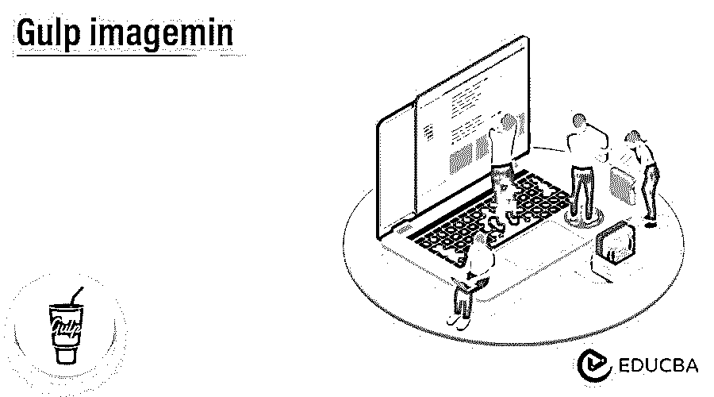
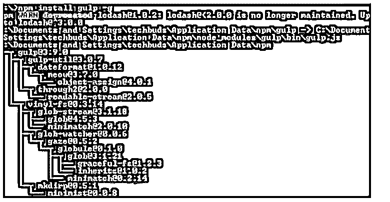
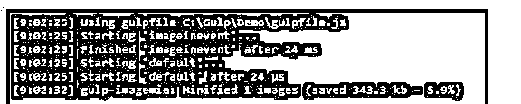

# 吞咽图像

> 原文：<https://www.educba.com/gulp-imagemin/>




## 吞咽图像简介

我们知道图像在互联网上随处可见；如今，我们无法搜索出任何包含单一图像的网页或应用程序，因为图像是表达概念的直接方式，或者我们可以讲述那个故事。但是如果我们有一个直接影响应用程序性能的大图像。所以 gulp 向开发人员提供了一个名为 gulp-imagemin 的包，帮助我们减小图像大小，提高应用程序或网页的性能。所以通过使用 gulp imagemin，我们可以自动化开发人员的任务，减少开发人员的工作量。

### 什么是 Gulp imagemin？

图片在互联网上随处可见。你将无法观察到一个单独的页面或应用程序，它在某种结构中包含不少于一张图片。图像是帮助叙述故事和强调我们生活中重要部分的非凡方法。

<small>网页开发、编程语言、软件测试&其他</small>

然而，假设我们有一个巨大的图片可以真正影响你的网站/应用程序的介绍。所以今天，我们将看到如何利用 Gulp 和一个名为 gulp imagemin 的 npm 包来动态缩小图像的大小。缩小，或者我们可以说缩小，是消除多余的源代码片段以减小大小的演示或循环。Gulp 是一个 JavaScript 构造设备，它允许您将工作流程的某些部分机械化，以使您的周期变得顺畅。它处理你工作过程中一些不吸引人但重要的部分(比如缩小图片尺寸)，所以你可以专注于结构。你可以在这里找到 Gulp。

为了利用 npm，我们必须引入 Node.js，它或多或少是一种允许设计人员在服务器(后端)环境中使用 JavaScript 代码的结构。你可以在这里找到节点。npm(节点包管理器)是并且做它的名字所推断的事情。它是 JavaScript 和“世界上最大的编程库”的捆绑监管者。将 npm 视为巨人储存区域，为设计师提供强大的包/实用程序。你可以在这里找到 npm。Gulp imagemin 是我们之前提到的那些神奇的包之一。利用这个包，我们可以选择在每次保存时自然缩小图像的大小。你可以在这里找到 gulp imagemin。

### 吞咽图像最小配置

让我们看看如何配置 gulp imagemin，如下所示:

但是首先，我们需要借助下面的命令来确认 Node js 的安装。

**代码:**

```
node -v
```

**说明:**

*   使用上面的命令，我们可以看到 Node.js 的安装版本；执行之后，我们可以在下面的命令中看到结果。

**输出:**


在命令行提示符下，输入附带的命令以显示 npm (Node.js bundle chief)的变体，它用于引入模块。它将借助下面的命令显示引入的 Node.js 表单。

**代码:**

```
npm -v
```

**说明:**

*   执行上面的命令后，我们可以在我们的机器上看到当前安装的 npm 版本，如下面的截图所示。

**输出:**


我们成功安装了 Node.js 现在，我们需要在下面命令的帮助下安装 gulp。

**代码:**

```
npm install gulp -g
```

**说明:**

*   在上面的命令中，我们使用 g 作为标志，确保 gulp 对所有项目都是全局可用的。
*   输入上面的命令后，我们得到下面的屏幕，如下面的截图所示。

**输出:**




为了验证 gulp，我们需要运行如下命令。

**代码:**

```
gulp –v
```

**说明:**

*   执行上面的命令后，我们得到了当前安装的 gulp 版本，如下图所示。

**输出:**


现在我们可以如下安装 imagemin 的插件。

**代码:**

```
npm install gulp-imagemin --save-dev
```

**说明:**

*   借助上面的命令，我们可以一口气添加 imagemin 的包。
*   之后，我们需要创建 gulp 项目，在 gulpfile.js 中，我们需要如下声明所有的依赖项。

**代码:**

```
var gulp = require('gulp');
var gchange = require('gulp-changed');
var gimagemin = require('gulp-imagemin');
```

在依赖关系声明之后，下一个任务是使用下面的代码优化来自网页或应用程序的图像:我们需要在配置文件中编写下面的代码。

**代码:**

```
gulp.task('imagevevent', function() {
var imgSource = 'Gulp/Demo/simg/*.+(png|jpg|gif)',
imgDst = 'Gulp/Demo/build/images';
gulp.src(imgSource)
.pipe(changed(imgDst))
.pipe(imagevevent ())
.pipe(gulp.dest(imgDst));
});
gulp.task('default',[ imagevevent],function(){
});
```

**说明:**

*   imagemin 任务将识别来自 src/ images /organizer 的 png、jpg 和 gif 图像，并在将它们合成到物镜之前缩小它们。
*   change()保证了新文档可以轻松地进行缩小。gulp changed 模块将处理最新的记录，从而使用宝贵的时间。

要执行上面的代码，我们需要使用下面的命令。

**代码:**

```
gulp
```

**说明:**

*   执行上述命令后，我们可以在下面的截图中看到结果。

**输出:**




### Gulp imagemin 插件

下面我们来看看 imagemin 插件。

**代码:**

```
[imagemin.gifsicle(), imagemin.mozjpeg(), imagemin.optipng(), imagemin.svgo()]
```

默认情况下，上面提到的类型是 imagemin 我们可以根据需要添加插件。插件用于覆盖所有默认插件；有时候，我们需要添加一些自定义插件；那时候我们也可以要求默认插件，也就是默认和附加插件的组合。插件的关键在于，有时默认插件在 imagemin 的实现过程中起着至关重要的作用，而外部插件只支持特定的动作。

### 功能

*   Gulp 是一个跨阶段的流任务冲刺器，它允许工程师将大量的改进任务机械化。
*   在一个不可否认的层面上，将配置文件作为流吞下，并将流连接到各种分配。
*   这些差事是基于代码的，使用模块。
*   企业改变记录，将源文件构建成创建记录。

### 结论

借助上面的文章，我们看到了关于 Gulp imagemin。从这篇文章中，我们看到了关于 Gulp imagemin 的基本内容，Gulp imagemin 的集成，以及我们如何在 Gulp imagemin 中使用它。

### 推荐文章

这是一个吞咽图像的指南。这里我们讨论一下简介、gulp imagemin 配置、插件和功能。您也可以看看以下文章，了解更多信息–

1.  [JavaScript 重新排列](https://www.educba.com/javascript-onresize/)
2.  [JavaScript onload](https://www.educba.com/javascript-onload/)
3.  [JavaScript 字符串到布尔值](https://www.educba.com/javascript-string-to-boolean/)
4.  [Javascript 字符串转换成小写](https://www.educba.com/javascript-string-to-lowercase/)


