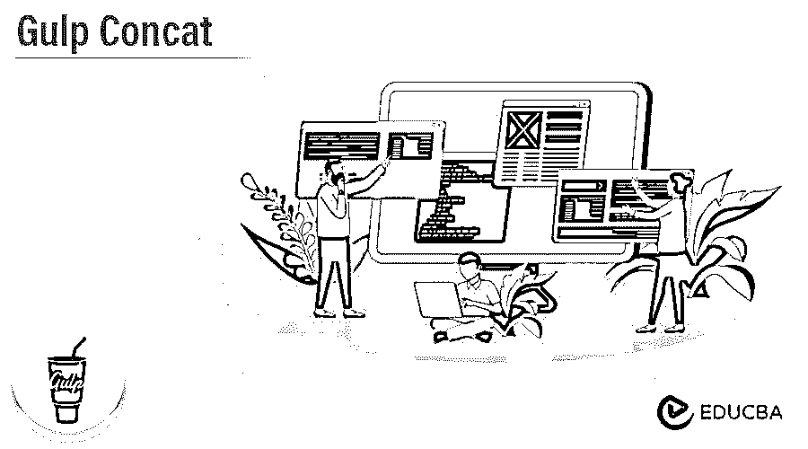
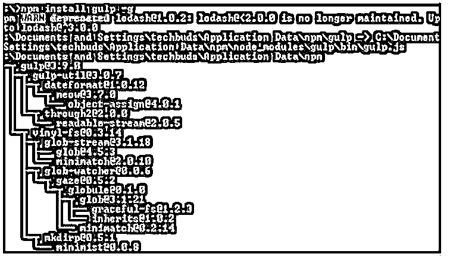
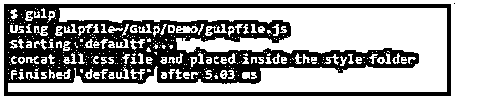

# Gulp Concat(英国石油公司)

> 原文：<https://www.educba.com/gulp-concat/>




## Gulp Concat 简介

gulp 为开发者提供了一种不同的特性；concat 是 gulp 提供的特性之一。gulp 是一个开源工具，用于根据开发人员的要求自动执行 web 任务，但有时开发人员需要组合不同的 JavaScripts 文件；那时，我们可以按照我们的要求，将所有文件合并在一起。管道概念这里我们需要实现 concat 函数，给新创建的文件传递不同的参数；例如，我们认为文件名是需要传递的参数之一。

<small>网页开发、编程语言、软件测试&其他</small>

### 什么是 Gulp Concat？

总的来说，一个站点或一个 JavaScript 应用程序包含一些 JavaScript 文档。此外，程序应该从服务器获取这些记录来堆叠页面。下载更多的记录需要额外的时间，因为程序需要发送更多的 HTTP 请求。

每当我们制作网站时，我们都试图传达一种理想的体验。这包括让我们的网站页面快速显示。一段时间以前，这意味着在一个 CSS 文档中包含我们的所有样式。相反，所有 Gulp 设置都记录在一个名为 gulpfile.js 的记录中，该记录位于企业的基础上。编写作业的例子是，您首先加载一个模块，您将使用该模块，然后描述依赖于该模块的项目的特征。

Gulp 是模块驱动的；你想知道利用哪个模块来完成某件事。通常，一个孤立的模块有一个孤立的原因，所有的模块都是习惯的 JavaScript。虽然这使我们的网站页面加载更快，但它使跟上 CSS 文档成为一个夜猫子。如今，我们可以大量利用它。

CSS 文档进行更好的关联，然后将记录连接成一个巨大的记录。假设我们的 construct/CSS 信封中有两个独立的 CSS 文档。我们将利用一个 gulp 模块来连接样式信封中的所有 CSS 文档。Gulp 包含一些基本的任务，但是 gulp 的强大之处在于你可以通过使用模块来定制你的组装周期。

### 如何使用 Gulp Concat？

让我们看看如何使用 gulp concat，如下所示:

**代码:**

```
var concatf = require('gulp-concat');
gulp.task('scrcon, function() {
return gulp.src('./css/*.js')
.pipe(concat('all.js'))
.pipe(gulp.dest('./distf/'));
});
```

**说明:**

*   在上面的代码中，我们可以联系我们机器上的文件，它从第一个文件开始使用基目录，并通过进程发送它。
*   之后，连接过程将在 gulp.src 函数中以指定的顺序开始，例如/css/file1.js。/css/file2 等等。所以按照这个顺序，我们可以使用如下代码。

**代码:**

```
var concatf = require('gulp-concat');
gulp.task('scrcon, function() {
return gulp.src(['./css/file2.js', './css/file3.js', './css/file1.js'])
.pipe(concat('all.js'))
.pipe(gulp.dest('./dist/'));
});
```

如果我们想要更改一个新行，我们需要在代码中添加如下行:

**代码:**

```
.pipe(concat('main.js', {newLine: ';'}))
```

### 大口连接安装

让我们看看如何安装 gulp concat，如下所示:

但是，首先，我们需要借助下面的命令来确认 gulp 的所有设置和安装。

**代码:**

```
node -v
```

**说明:**

*   使用上面的命令，我们可以看到 Node.js 的安装版本；执行之后，我们可以在下面的命令中看到结果。

**输出:**


在命令行提示符下，输入附带的命令以显示 npm (Node.js bundle chief)的变体，它用于引入模块。

它将借助下面的命令显示引入的 Node.js 表单。

**代码:**

```
npm -v
```

**说明:**

*   执行上面的命令后，我们可以在我们的机器上看到当前安装的 npm 版本，如下面的截图所示。

**输出:**


现在我们成功安装了 Node.js 现在，我们需要使用下面的命令安装 gulp，如下所示:

**代码:**

```
npm install gulp -g
```

**说明:**

*   在上面的命令中，我们使用 g 作为标志，确保 gulp 对所有项目都是全局可用的。
*   输入上面的命令后，我们得到下面的屏幕，如下面的截图所示。

**输出:**




为了验证 gulp，我们需要运行以下命令，如下所示:

**代码:**

```
gulp –v
```

**说明:**

*   执行上面的命令后，我们得到了当前安装的 gulp 版本，如下图所示。

**输出:**


现在我们已经全部设置好了；我们需要借助如下语句安装 Concat 函数:

**代码:**

```
npm install --save-dev gulp-concat
```

**说明:**

*   使用上面的命令，我们可以添加 concat 的包和开发依赖项。

### 大口连接示例

以下是 Gulp Concat 的示例:

我们有两个不同的文件，如下面的代码所示。

sample CSS 1 . CSS
smaplecss 1 . CSS

**说明:**

*   我们使用了源文件夹中的两个不同的 css 文件，并且需要通过使用 concat()来组合这两个文件。

在创建一个新文件并根据我们的要求用。js 扩展。

**代码:**

```
var gulpc = require('gulp');
var concat = require('gulp-concat');
gulp.task('concatf', [], function() {
console.log("concat all css file and placed inside the style folder");
gulp.src("https://cdn.educba.com/Gulpdemo/styles/**.css")
.pipe(concat('final.css'))
.pipe(gulp.dest('dest/styles'));
});
```

**说明:**

*   在上面的代码中，我们可以看到我们所做的一些改变。首先，我们决定将它命名为 concat。根据开发者的不同，我们可以给它起任何我们需要的名字；然而，concat 传达了模块如何对待那些阅读我们编造的脚本的人。
*   在下面的步骤中，我们在 src 和 pipe (gulp.dest…)步骤之间添加了另一个任务，并添加了 pipe (concat(…))。这是因为 gulp 的工作方式是从一个周期到下一个周期传输文件。这使得我们可以用简单的小进步来完成复杂的任务。
*   现在运行 gulp，如下图所示，结果是 concat。

**输出:**




### 结论

借助上面的文章，我们看到了关于 Gulp concat。从本文中，我们了解了关于 Gulp concat 的基本知识，我们还看到了 Gulp concat 的集成以及我们如何在 Gulp concat 中使用它。

### 推荐文章

这是 Gulp Concat 的一个指南。这里我们分别用例子讨论入门以及如何使用和安装 gulp concat。您也可以看看以下文章，了解更多信息–

1.  [JavaScript 重新排列](https://www.educba.com/javascript-onresize/)
2.  [JavaScript onload](https://www.educba.com/javascript-onload/)
3.  [JavaScript 字符串到布尔值](https://www.educba.com/javascript-string-to-boolean/)
4.  [Javascript 字符串转换成小写](https://www.educba.com/javascript-string-to-lowercase/)


