# JavaScript 中的模式

> 原文：<https://www.educba.com/patterns-in-javascript/>

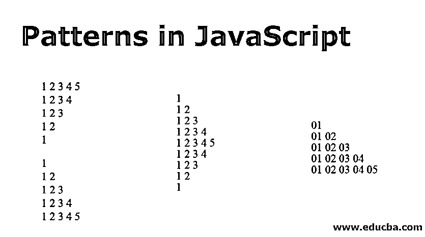


## JavaScript 模式介绍

模式是一种常见的 Java 模式程序，广泛用于改善逻辑思维和提高流程控制知识。模式是对象的可重用模型和交互。每种模式都有一个名称，当讨论复杂的设计方案时，它就成了词汇表的一个组成部分。每个开发人员都希望编写可管理、可读和可重用的代码。对于更大的应用程序，结构化代码变得更加重要。设计模式对于解决这一挑战至关重要——为特定情况下的常见问题提供一个组织结构。在本文中，我们将讨论 JavaScript 中的模式。

JavaScript 的 Web 开发人员通常在开发应用程序时使用设计模式，甚至是在不知不觉中。尽管在某些情况下使用了各种各样的设计模式，但是 JavaScript 的设计者倾向于更多地使用一些模式。设计模式是常见软件设计问题的可重用解决方案。设计模式是有经验的软件开发人员使用的最佳实践。设计模式可以被认为是脚本的模板。

<small>网页开发、编程语言、软件测试&其他</small>

### 为什么要使用模式？

许多程序员认为模式是浪费时间，或者他们不知道如何正确地应用它们。但是使用合适的设计模式可以帮助您编写更好、更容易理解的代码，并且因为它更容易理解，所以代码可以很容易地保存。最重要的是，模式为软件设计者提供了一个流行的词汇表。他们立即展示了某人为了你的代码的目的而学习代码。

### JavaScript 中的模式(数字模式、星形模式、字符模式)

让我们详细讨论 JavaScript 中的模式。

#### 1.数字模式

##### 示例#1

**代码:**

```
<html>
<head>
<title>JavaScript Number Patterns</title>
<script type="text/javascript">
var num;
var no=prompt("Please provide a number for the no of rows to be print in a pattern...");
for(var m=1;m<=no;m++)
{
for(var n=1;n<=m;n++)
{
document.write("0"+n+" ");
}
document.write("<br />");
}
</script>
</head>
<body></body>
</html>
```

保存您选择的文件名，然后双击该文件。它将在支持 JavaScript 的浏览器中打开，并显示如下所示的输出:

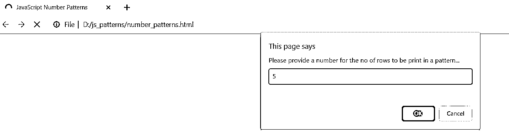


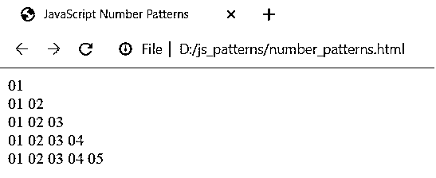


##### 实施例 2

**代码:**

```
<html>
<head>
<title>JavaScript Number Patterns</title>
<script type="text/javascript">
for(m=1; m <= 5; m++)
{
for(n=1; n<=m; n++)
{
document.write(n);
if(n == m)
continue;
else
document.write(' ');
}
document.write('<br />');
}
</script>
</head>
<body></body>
</html>
```

在浏览器中运行该程序，您将看到以下输出:

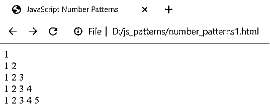


##### 实施例 3

**代码:**

```
<html>
<head>
<title>JavaScript Star Patterns</title>
<script>
var m, n;
for(m=1;m<=5;m++)
{
for(n=m;n<=5;n++)
{
document.write(""+n+" ");
}
document.write('<br/>');
}
</script>
</head>
<body></body>
</html>
```

在浏览器中运行该程序，您将看到以下输出:

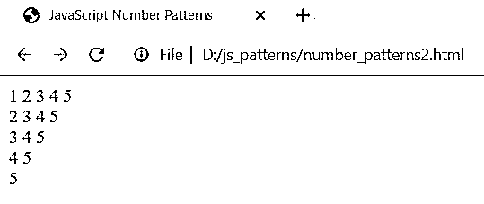


##### 实施例 4

**代码:**

```
<html>
<head>
<title>JavaScript Number Patterns</title>
<script>
var m,n,count = 5;
for (m = 1; m <= count; m++) {
for (n = 1; n <= m; n++) {
document.write(""+m+" ");
}
document.write('<br/>');
}
</script>
</head>
<body></body>
</html>
```

在浏览器中运行该程序，您将看到以下输出:

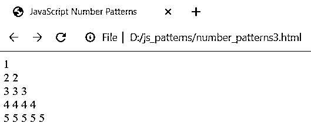


##### 实施例 5

**代码:**

```
<html>
<head>
<title>JavaScript Number Patterns</title>
<script>
var num = 5;
var m, n;
for (m = 1; m < num; m++) {
for (n = 1; n <= m; n++)
document.write(""+n+" ");
document.write('<br/>');
}
for (m = num; m >= 0; m--) {
for (n = 1; n <= m; n++)
document.write(""+n+" ");
document.write('<br/>');
}
document.write('<br/>');
</script>
</head>
<body></body>
</html>
```

在浏览器中运行该程序，您将看到以下输出:

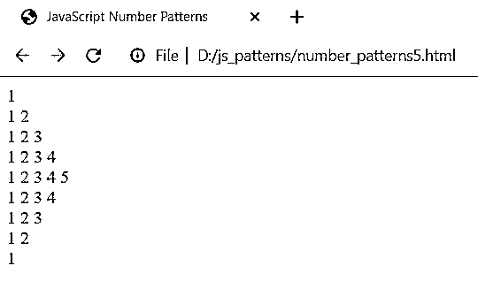


##### 实施例 6

**代码:**

```
<html>
<head>
<title>JavaScript Number Patterns</title>
<script>
var num = 5;
var m, n;
for (m = num; m >= 0; m--) {
for (n = 1; n <= m; n++)
document.write(""+n+" ");
document.write('<br/>');
}
for (m = 1; m <= num; m++) {
for (n = 1; n <= m; n++)
document.write(""+n+" ");
document.write('<br/>');
}
document.write('<br/>');
</script>
</head>
<body></body>
</html>
```

在浏览器中运行该程序，您将看到以下输出:

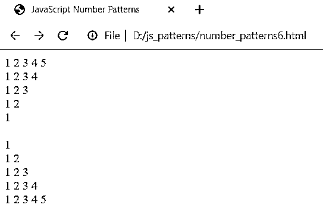


##### 实施例 7

**代码:**

```
<html>
<head>
<title>JavaScript Number Patterns</title>
<script>
var num, p, q, m, n;
num = 5;
for (m = 1; m <= num; m++) {
if (m % 2 == 0) {
p = 1;
q = 0;
} else {
p = 0;
q = 1;
}
for (n = 1; n <= m; n++)
if (n % 2 == 0)
document.write(""+p+" ");
else
document.write(""+q+" ");
document.write('<br/>');
}
</script>
</head>
<body></body>
</html>
```

执行上面的代码，您将得到如下所示的输出:

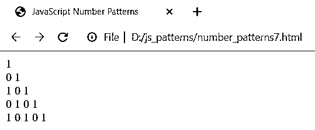


##### 实施例 8

**代码:**

```
<html>
<head>
<title>JavaScript Number Patterns</title>
<script>
var rows, m, n, num = 1;
rows = 5;
for (m = 1; m <= rows; m++) {
for (n = 1; n <= m; n++)
document.write(num++);
document.write('<br/>');
}
</script>
</head>
<body></body>
</html>
```

执行上面的代码，您将得到如下所示的输出:

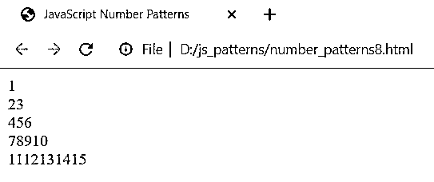


##### 实施例 9

**代码:**

```
<html>
<head>
<title>JavaScript Number Patterns</title>
<script>
var i = 5;
while (i >= 1) {
var j = 5;
while (j >= i) {
document.write(""+j+" ");
j--;
}
i--;
document.write('<br/>');
}
</script>
</head>
<body></body>
</html>
```

执行上面的代码，您将得到如下所示的输出:


##### 实施例#10

**代码:**

```
<html>
<head>
<title>JavaScript Number Patterns</title>
<script>
var m,n,k;
for(m=1;m<=4;m++)
{
for(n=4;n>=(m-1)*2-1;n--)
document.write(" ");
document.write(m);
for(n=2;n<=(m-1)*4;n++)
document.write(" ");
if(m>1)
document.write(m);
document.write("<br/>");
}
for(m=3;m>=1;m--)
{
for(n=4;n>=(m-1)*2-1;n--)
document.write(" ");
document.write(m);
for(n=2;n<=(m-1)*4;n++)
document.write(" ");
if(m>1)
document.write(m);
document.write("<br/>");
}
</script>
</head>
<body></body>
</html>
```

执行该程序，您将获得以下输出:

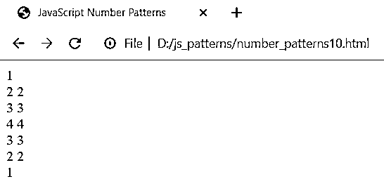


##### 实施例 11

**代码:**

```
<html>
<head>
<title>JavaScript Number Patterns</title>
<script>
var m, n;
for(m=1;m<=5;m++)
{
for(n=5;n>=m;n--)
{
document.write(i);
}
document.write("<br/>");
}
</script>
</head>
<body></body>
</html>
```

执行该程序，您将获得以下输出:

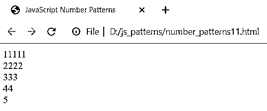


##### 实施例#12

**代码:**

```
<html>
<head>
<title>JavaScript Number Patterns</title>
<script>
var m,n,k;
for(m=4;m>=1;m--)
{
for(n=1;n<=4;n++)
{
if(n<=m)
document.write(n);
else
document.write(" ");
}
for(n=4;n>=1;n--)
{
if(n<=m)
document.write(n);
else
document.write(" ");
}
document.write("<br/>");
}
</script>
</head>
<body></body>
</html>
```

执行该程序，您将获得以下输出:


##### 实施例#13

**代码:**

```
<html>
<head>
<title>JavaScript Number Patterns</title>
<script>
var m,n,k;
k=1;
for(m=1;m<=5;m+=2)
{
for(n=5;n>=1;n--)
{
if(n>m)
document.write(" ");
else
document.write(k++);
}
document.write("<br/>");
}
</script>
</head>
<body></body>
</html>
```

执行上面的代码，您将得到如下所示的输出:

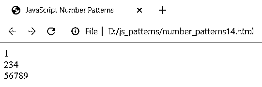


##### 实施例#14

**代码:**

```
<html>
<head>
<title>JavaScript Number Patterns</title>
<script>
var i,j;
for(i=1;i<=4;i++)
{
for(j=1;j<=i;j++)
document.write(j);
for(j=i-1;j>=1;j--)
document.write(j);
document.write("<br/>");
}
</script>
</head>
<body></body>
</html>
```

执行该程序，您将获得以下输出:

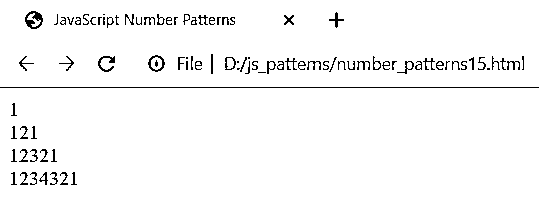


##### 实施例#15

**代码:**

```
<html>
<head>
<title>JavaScript Number Patterns</title>
<script>
var i,j,k;
for(i=1;i<=5;i++)
{
for(j=1;j<=5;j++)
{
if(j<=i)
document.write(j);
else
document.write(" ");
}
for(j=5;j>=1;j--)
{
if(j<=i)
document.write(j);
else
document.write(" ");
}
document.write("<br/>");
}
</script>
</head>
<body></body>
</html>
```

执行上面的代码，您将得到如下所示的输出:

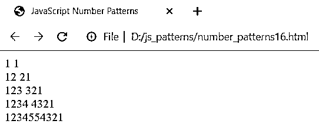


##### 实施例#16

**代码:**

```
<html>
<head>
<title>JavaScript Number Patterns</title>
<script>
var m,n,k;
for (m=1;m<=5;m++)
{
for(k=m;k>1;k--)
document.write(k);
for(n=1;n<=6-m;n++)
document.write(n);
document.write("</br>");
}
</script>
</head>
<body></body>
</html>
```

执行上面的代码，您将得到如下所示的输出:

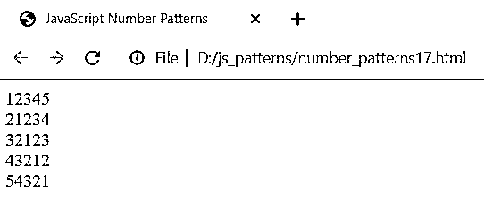


##### 实施例#17

**代码:**

```
<html>
<head>
<title>JavaScript Number Patterns</title>
<script>
var i,j;
for(i=1;i<=10;i++)
{
for(j=1;j<=i;j++)
{
document.write(i*j);
}
document.write("<br/>");
}
</script>
</head>
<body></body>
</html>
```

执行上面的代码，您将得到如下所示的输出:

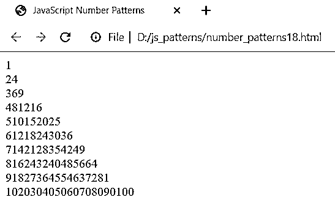


##### 实施例 18

**代码:**

```
<html>
<head>
<title>JavaScript Number Patterns</title>
<script>
var m, n, num=5;
for(m=num; m>1; m--)
{
for(n=num;n>=1;n--)
{
if(n>m) document.write(n);
else document.write(m);
}
for(n=2;n<=num;n++)
{
if(n>m) document.write(n);
else document.write(m);
}
document.write("<br/>");
}
for(m=1; m<=num; m++)
{
for(n=num;n>=1;n--)
{
if(n>m) document.write(n);
else document.write(m);
}
for(n=2;n<=num;n++)
{
if(n>m) document.write(n);
else document.write(m);
}
document.write("<br/>");
}
</script>
</head>
<body></body>
</html>
```

执行上面的代码，您将得到如下所示的输出:

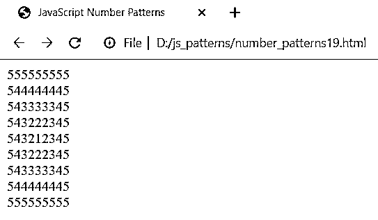


#### 2.星形图案

##### 示例#1

**代码:**

```
<html>
<head>
<title>JavaScript Star Patterns</title>
<script type="text/javascript">
var m,n;
for(m=1; m <= 5; m++)
{
for(n=1; n<=m; n++)
{
document.write('*');
}
document.write('<br />');
}
</script>
</head>
<body></body>
</html>
```

执行该程序，您将获得以下输出:

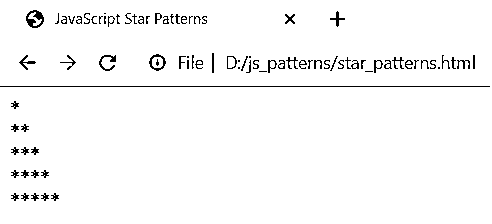


##### 实施例 2

**代码:**

```
<html>
<head>
<title>JavaScript Star Patterns</title>
<script>
var m, n;
for(m=5;m>=1;m--)
{
for(n=1;n<=m;n++)
{
document.write('*');
}
document.write('<br/>');
}
</script>
</head>
<body></body>
</html>
```

执行该程序，您将获得以下输出:

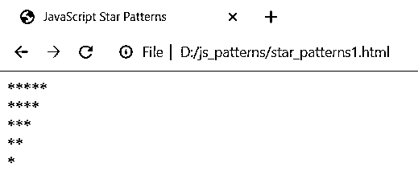


##### 实施例 3

**代码:**

```
<html>
<head>
<title>JavaScript Number Patterns</title>
<script>
var num = 5;
var m, n;
for (m = 1; m < num; m++) {
for (n = 1; n <= m; n++)
document.write(" * ");
document.write('<br/>');
}
for (m = num; m >= 0; m--) {
for (n = 1; n <= m; n++)
document.write(" * ");
document.write('<br/>');
}
document.write('<br/>');
</script>
</head>
<body></body>
</html>
```

执行上面的代码，您将得到如下所示的输出:

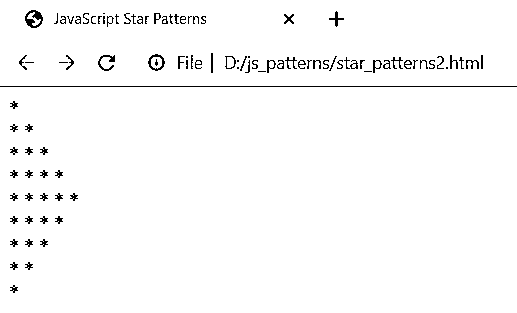


##### 实施例 4

**代码:**

```
<html>
<head>
<title>JavaScript Star Patterns</title>
<script>
var num = 5;
var m, n;
for (m = num; m >= 0; m--) {
for (n = 1; n <= m; n++)
document.write(" * ");
document.write('<br/>');
}
for (m = 1; m <= num; m++) {
for (n = 1; n <= m; n++)
document.write(" * ");
document.write('<br/>');
}
document.write('<br/>');
</script>
</head>
<body></body>
</html>
```

执行上面的代码，您将得到如下所示的输出:

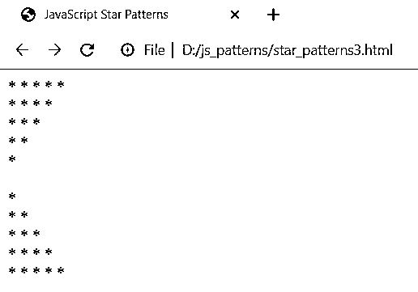


##### 实施例 5

**代码:**

```
<html>
<head>
<title>JavaScript Star Patterns</title>
<script>
var i, j, k;
var n = 5;
for (i = 1; i <= n; i++) {
for (j = 1; j <= i; ++j)
document.write(j);
for (k = n - i; k >= 1; k--)
document.write("*");
document.write('<br/>');
}
</script>
</head>
<body></body>
</html>
```

执行上面的代码，您将得到如下所示的输出:

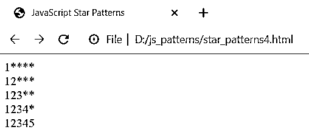


##### 实施例 6

**代码:**

```
<html>
<head>
<title>JavaScript Star Patterns</title>
<script>
function pyramid(n) {
for(var i=1; i<= n; i++){
var myval = ' '.repeat(n-i);
var myval1 = '*'. repeat(i*2 -1)
console.log(myval + myval1 + myval);
}
}
pyramid(5);
</script>
</head>
<body></body>
</html>
```

执行上述代码，您将在控制台中获得如下图所示的输出:

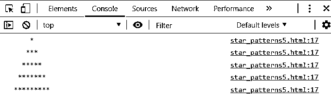


#### 3.字符模式

##### 示例#1

**代码:**

```
<html>
<head>
<title>JavaScript Character Patterns</title>
<script type="text/javascript">
var m,n;
for(m=1; m <= 5; m++)
{
for(n=1; n<=m; n++)
{
document.write('A');
}
document.write('<br />');
}
</script>
</head>
<body></body>
</html>
```

执行该程序，您将获得以下输出:


##### 实施例 2

**代码:**

```
<html>
<head>
<title>JavaScript Character Patterns</title>
<script>
var m,n;
for(m=5;m>=1;m--)
{
for(n=1;n<=m;n++)
{
document.write('A');
}
document.write('<br/>');
}
</script>
</head>
<body></body>
</html>
```

执行上面的代码，您将得到如下所示的输出:

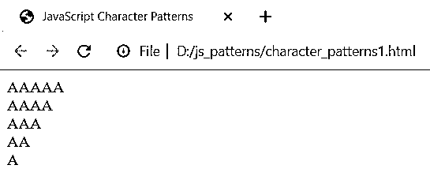


##### 实施例 3

**代码:**

```
<html>
<head>
<title>JavaScript Character Patterns</title>
<script>
var num = 5;
var m, n;
for (m = 1; m < num; m++) {
for (n = 1; n <= m; n++)
document.write(" # ");
document.write('<br/>');
}
for (m = num; m >= 0; m--) {
for (n = 1; n <= m; n++)
document.write(" & ");
document.write('<br/>');
}
document.write('<br/>');
</script>
</head>
<body></body>
</html>
```

执行该程序，您将获得以下输出:

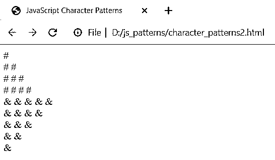


##### 实施例 4

**代码:**

```
<html>
<head>
<title>JavaScript Character Patterns</title>
<script>
var num = 5;
var m, n;
for (m = 1; m < num; m++) {
for (n = 1; n <= m; n++)
document.write("$");
document.write('<br/>');
}
for (m = num; m >= 0; m--) {
for (n = 1; n <= m; n++)
document.write("#");
document.write('<br/>');
}
document.write('<br/>');
</script>
</head>
<body></body>
</html>
```

执行上面的代码，您将得到如下所示的输出:

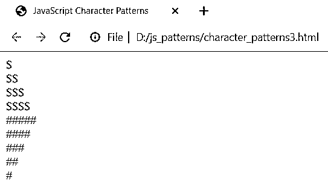


##### 实施例 5

**代码:**

```
<html>
<head>
<title>JavaScript Character Patterns</title>
<script>
var num = 5;
var m, n;
for (m = num; m >= 0; m--) {
for (n = 1; n <= m; n++)
document.write("A");
document.write('<br/>');
}
for (m = 1; m <= num; m++) {
for (n = 1; n <= m; n++)
document.write("B");
document.write('<br/>');
}
document.write('<br/>');
</script>
</head>
<body></body>
</html>
```

执行上面的代码，您将得到如下所示的输出:

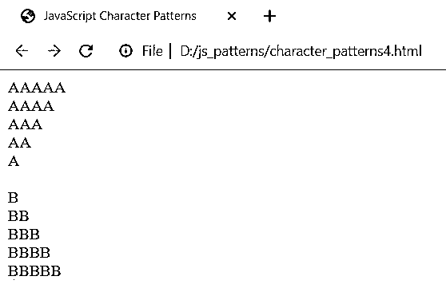


##### 实施例 6

**代码:**

```
<html>
<head>
<title>JavaScript Character Patterns</title>
<script>
var i, j, k;
var n = 5;
for (i = 1; i <= n; i++) {
for (j = 1; j <= i; ++j)
document.write(j);
for (k = n - i; k >= 1; k--)
document.write("$");
document.write('<br/>');
}
</script>
</head>
<body></body>
</html>
```

执行上面的代码，您将得到如下所示的输出:

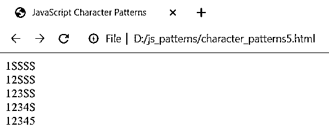


### 结论

在这篇文章中，我们看到了不同类型的模式，如数字，星形和字符模式。模式是软件工程中用来解决特定的、可重用的软件设计问题的一个词。出于多种目的，设计模式非常有用。它们是业内资深人士尝试和测试过的解决方案。它们是以普遍接受的方式解决问题的强有力的方法，反映了行业领先的开发人员的经验和帮助定义它们的想法。模式还增加了软件的可重用性和可读性，同时大大加快了开发过程。在任何编程语言中探索模式都是有趣的，也是一个引人注目的主题。

### 推荐文章

这是 JavaScript 模式指南。在这里，我们用示例代码详细讨论 JavaScript 中的基本概念、不同类型的模式。您还可以浏览我们推荐的其他文章——

1.  [c++中的模式](https://www.educba.com/patterns-in-c-plus-plus/)
2.  [C 中的星形图案](https://www.educba.com/star-patterns-in-c/)
3.  [C 编程中的模式](https://www.educba.com/patterns-in-c-programming/)
4.  [Java 中的模式](https://www.educba.com/patterns-in-java/)


