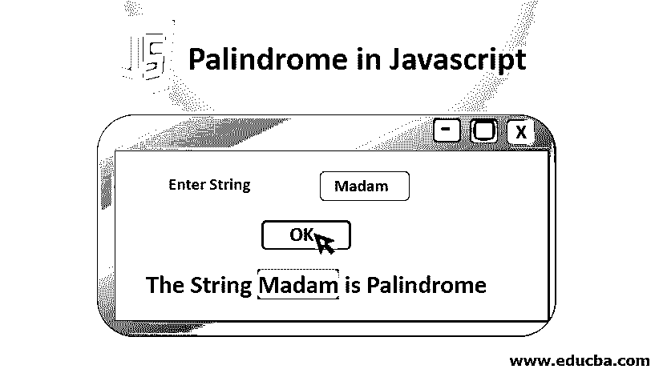
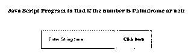
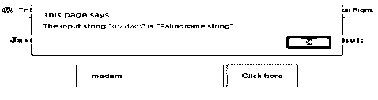
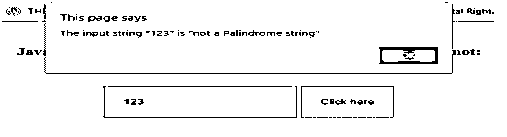

# JavaScript 中的回文

> 原文：<https://www.educba.com/palindrome-in-javascript/>




## JavaScript 中的回文介绍

下面的文章提供了 JavaScript 中回文的概要。一般来说，回文是这样一个词，当我们从前面一个字符一个字符地读这个词时，它与从后面读同一个词时形成的词完全匹配。比如:“级别”、“夫人”等。这里，当单词“level”从后面写时，那么最后形成的单词也将是“level”。这些种类的单词、数字、字符串或一系列字符是由任何计算机语言编写的。那么这样的功能就叫做回文。在程序员的语言中，回文是一系列字符，数字，即使从相反的方向书写也不会改变，形成一个重新排列的单词。JavaScript 提供了各种内置函数来实现这一功能。我们也可以使用[循环来获得](https://www.educba.com/vb-dot-net-loops/)相同的结果。

### JavaScript 中回文的逻辑解释

下面是使用 javaScript 内置函数向您解释回文字符串背后的逻辑的代码片段:

<small>网页开发、编程语言、软件测试&其他</small>

函数 PTest()被定义，其中我们将发送需要测试回文功能的字符串。如果字符串是回文，那么我们应该在输出中收到一个确认相同的文本，否则反之亦然。函数在函数定义后的最后被调用。这里 reverse()、split()、join()、replace()、toLowerCase()是内置函数。

*   **Replace():** 这个函数将替换字符串中的特殊字符和空格。
*   **toLowerCase():** 这个函数将整个字符串小写。
*   **Split():** [Split 函数将把](https://www.educba.com/split-function-in-python/)字符串拆分成单个字符。
*   **Reverse():** Reverse 函数将对上述函数输出的字符串进行反转。这意味着字符串将从最后一个字符开始逐字符读取，直到第一个字符。
*   **Join():** Join 函数将连接从上述函数以相反方式输出的字符。

****代号:****

```
Function PTest (TestString) {
var remSpecChar = TestString.replace(/[^A-Z0-9]/ig, "").toLowerCase(); /* this function removes any space, special character and then makes a string of lowercase */
var checkingPalindrome = remSpecChar.split('').reverse().join(''); /* this function reverses the remSpecChar string to compare it with original inputted string */
if(remSpecChar === checkingPalindrome){ /* Here we are checking if TestString is a Palindrome sring or not */
document.write("<div>"+ myString + " is a Palindrome string <div>"); /* Here we write the string to output screen if it is a palindrome string */
}
else{
document.write("<div>" + myString + " is not a Palindrome string </div>"); /* Here we write the string to output screen if it is not a palindrome string */
}
}
PTest('"Hello"') /* Here we are calling the above function with the test string passed as a parameter. This function’s definition is provided before function calling itself so that it is available for the compiler before actual function call*/
PTest('"Palindrome"')
PTest('"7,1,7"') /* This is a Palindrome string */
```

回文函数也可以用循环来写。

在下面的代码中，for 循环用于循环迭代。在这种情况下，每次执行循环时，将前端的字符与后端的字符进行比较。如果它们匹配，那么函数将返回布尔值 true。这个循环将一直执行到输入字符串长度的一半。因为当我们比较字符串的前后字符时，我们不需要遍历整个字符串。将字符串的前半部分与后半部分进行比较就会得到结果。这使得程序节省空间并且速度更快。

****代号:****

```
function Findpalindrome(TestStr) {
var PlainStr= TestStr.replace(/[^0-9a-z]/gi, '').toLowerCase().split("");
for(var i=0; i < (PlainStr.length)/2; i++){
if(PlainStr[i] == PlainStr[PlainStr.length-i-1]){
return true;
} else
return false;
}
} Findpalindrome("ta11at");
```

如果这个程序的输入字符串是一个回文，这个程序的输出将为真。

### 检查字符串/数字是否为回文的例子

下面是 HTML 表单中 javaScript 的详细代码，无论字符串是否是回文都要打印出来。

****代号:****

```
<html>
<head>
<script src="http://ajax.googleapis.com/ajax/libs/jquery/1.11.1/jquery.min.js"></script>
<title>Palindrome using JS</title>
<style>
input{
padding: 20px;
}
</style>
<script>
function TestFunction()
{
//Here we are getting the value from the textbox on browser
var InputStr = document.getElementById('tbox').value; //here we are calling checkingPalindrome() function and passing a string into it
var resStr = checkingPalindrome(InputStr);
alert('The input string "'+InputStr+'" is "'+resStr+'"'); // This will allow a //rectangular box to be popped up on the screen to display result
}
function checkingPalindrome(InputStr)
{
var origString;
//here we are converting the string into a lowercase string
InputStr = InputStr.toLowerCase();
//here we are storing the InputStr in origString for reference
origString= InputStr;
//here we are reversing the entered string
InputStr = InputStr.split(''); //this function will split the input string
InputStr = InputStr.reverse(); //this function will reverse the string
InputStr = InputStr.join(''); //this function will join the reversed string characters
var revString = InputStr;
//here we are checking if both the input string and the reversed string are same
//and based on it the string will be declared palindrome or not
if(origString == revString){
return 'Palindrome string'; //  this will return "Palindrome" if true //otherwise control will flow to else condition
}
else
{
return 'not a Palindrome string';
}
}
</script>
</head>
<body>
<form action="" method="get"> &nbsp
<h3 align='center' >Javascript Program to find if the number is Palindrome or not: </h3> &nbsp
<p align='center'><input type="text" id="tbox" placeholder="Enter the string here" />
<input type="button" onclick="TestFunction()" value="Click here" /></p>
</form>
</body>
</html>
```

****输出:****










### 结论

因此，在所有的编程语言中，回文是传授给求知者的一个至关重要的概念。例如，无论是 C、PHP、C++、Python、Java 还是任何其他编程语言，所有语言的标准库中都有支持回文的基本函数。如果没有函数支持，那么我们总是可以使用 while、for 之类的循环或者 if、else、 [break 语句之类的控制结构来实现这个功能。](https://www.educba.com/break-statement-in-javascript/)

### 推荐文章

这是一个 JavaScript 的回文指南。这里我们用一个例子来讨论逻辑解释，检查字符串/数字是否是回文。您也可以阅读以下文章，了解更多信息——

1.  [JavaScript 数学函数](https://www.educba.com/javascript-math-functions/)
2.  [JavaScript 中的正则表达式](https://www.educba.com/regular-expressions-in-javascript/)
3.  [JavaScript MVC 框架](https://www.educba.com/javascript-mvc-frameworks/)
4.  [JavaScript 中的合并排序](https://www.educba.com/merge-sort-in-javascript/)


