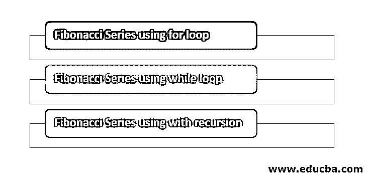
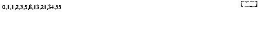

# JavaScript 中的斐波那契数列

> 原文：<https://www.educba.com/fibonacci-series-in-javascript/>


## JavaScript 中的斐波那契数列介绍

下面的文章将帮助我们如何在 JavaScript 中找到斐波那契数列。我们在网络应用中享受的功能是由在服务器上运行的编程语言提供的，但这还不是全部。应用程序的用户界面是帮助用户与 web 应用程序交互的东西，因此在设计 Web 应用程序时被认为同样重要。在本文中，我们将了解一种支持 UI 设计的客户端脚本语言，即 JavaScript。 [JavaScript 支持](https://www.educba.com/what-is-javascript/)应用程序动态创建填充网页组件。使用 JavaScript 需要使用逻辑来实现特定的功能。这里我们将看到斐波纳契数列是如何用 JavaScript 编写的。

### 使用各种方法的 JavaScript 的斐波那契数列

让我们借助下面提到的一个例子来看看 fibo 系列使用的各种方法:

<small>网页开发、编程语言、软件测试&其他</small>




#### 1.使用 for 循环的斐波那契数列

*   斐波纳契数列可以被认为是一个数列，其中每个人的数字都是前面连续数字的总和。列表从 0 开始，一直持续到定义的数字计数。它不是 JavaScript 的任何特殊函数，也可以使用任何编程语言编写。为了准确理解这一点，让我们举个例子。假设我们被要求[制作一个有 10 个项目的斐波那契数列](https://www.educba.com/fibonacci-series-in-java/),那么它将会是 0 1 1 2 3 5 8 13 21 34

*   在上面的数列中，我们可以看到每个数字都是前面两个连续数字的和。当序列从 0 和 1 开始时，第一个数字和第二个值分别是 0 和 1。实际功能从第三个索引中的值开始。第三个位置的值是 1，它只不过是前面两个连续数字 0 和 1 的和。
*   第四个索引中的值是 2，它是前面两个连续数字的和的结果。将前两位数字相加并将其添加到序列中的过程一直持续，直到序列中的值的计数等于我们在序列中想要的总计数。
*   现在让我们用 JavaScript 写一个实际的程序来计算斐波纳契数列。JavaScript 代码必须添加到 HTML 页面，或者也可以添加到以 js 扩展名结尾的 JavaScript 页面。当 web 应用程序打算使用外部 Javascript 时，在这种情况下，可以将该代码定义为可以添加到 Javascript 文件中的文件，但是将代码添加到 HTML 网页中更容易，而且效果很好。
*   如果在 HTML 页面中使用，则必须通过使用脚本标签来定义，该标签指示浏览器代码是在其中编写的，必须将其视为 javascript 命令，而不是 HTML 代码。

**程序**

```
<script type="text/javascript">
var pop = prompt("Enter the count of values in the series", " ");
var var1=0, var2=1;
document.write("Here is the fibonacci series : ");
document.write("",var1," ");
document.write("",var2," ");
var counter, sum;
for(counter=2; counter<pop; counter++)
{
sum=var1+var2;
document.write("",sum," ");
var1=var2;
var2=var3;
}
</script>
```

**输出:**


*   在上述斐波那契数列的代码中，脚本标签被定义为使用 javascript 作为类型。text/javascript 属性确认代码必须在客户端执行，因为它是 javascript 代码。这将在以后添加到 HTML 页面，以便与网页组件一起工作。当页面加载时，它会弹出一个窗口，询问序列中的值的个数。
*   无论用户输入什么数字，它都将存储在名为 pop 的变量中。该变量将存储该系列应该具有的值的总数。稍后，我们初始化了变量 var1 和 var 2，分别存储值 0 和 1，因为这是斐波那契数列中的两个强制值，它启动了开发该数列所需的过程。

#### 2.使用 while 循环的斐波那契数列

*   有多种方法可以得到斐波纳契数列，在这一节中，我们将看到如何使用 while 循环来开发斐波纳契数列。在下面的程序中，所有的东西都与我们在上面的程序中使用的东西相似。
*   主要区别是我们使用了 while 循环而不是 [for 循环。](https://www.educba.com/for-loop-in-javascript/)变量也是一样的，变量在保存值方面的作用与上一节相同。

所以作为结果，这个程序的输出也将和我们执行最后一个 for 循环代码后得到的一样。

**程序**

```
<script type="text/javascript">
var var1 = 0, var2 = 1, var3;
document.write("Here is the Fibonacci series with 10 values : ");
while(var1<40)
{
document.write(var1 + " ");
var3 = var1+var2;
var1 = var2;
var2 = var3;
}
</script>
```

**输出:**


*   这个程序在 while 循环中运行良好，可以生成斐波那契数列中的项目列表。pop 变量必须接受来自用户的值，这些值将给出序列中元素的总计数。
*   变量 var1 和 var2 分别被赋值为 0 和 1，以便在序列开始时输入这些值。
*   之后，引入了 while 循环来检查计数器是否小于存储在 pop 变量中的值。如果发现是肯定的，它将终止执行，并给出它将在执行时维持的其他列表。

#### 3.斐波那契数列与递归一起使用

*   在这个程序中，斐波那契数列是使用递归生成的。在上两个示例中，我们使用 for 和 while 循环开发了序列，但在本节中，我们将使用可以反复调用的函数来开发相同的序列，以便获得预期的序列。
*   它与上面提到的两个程序的不同之处在于，它不是从使用输入框的用户那里取值，而是只使用值可以被硬编码的函数。
*   在应用程序中，开发人员希望防止应用程序出于任何原因使用循环，可以使用这种方式来获得与循环相同的功能。

**程序**

```
<script>
var fseries = function (var1)
{
if (var1===1)
{
return [0, 1];
}
else
{
var sum = fseries(var1 - 1);
sum.push(sum[sum.length - 1] + sum[sum.length - 2]);
return sum;
}
};
document.write(fseries(10));
</script>
```

**输出:**




*   该程序使用名为 f 系列的函数来产生斐波纳契数列。列表中必须包含的元素数量存储在 val 变量中，该变量的值是在调用函数时分配的。
*   在这个程序的倒数第二行，我们写了 series(10 ),它在函数被调用时给 val 变量赋值 10。这个程序的结果将与上述两个应用程序的结果相同。这个程序的结果列表将有 10 个元素。
*   当要在屏幕上显示序列的数据时，它将打印变量 var1 和 var2，变量 var 1 和 var 2 为序列提供 0 和 1 的值，然后调用函数将前面两个连续的数字相加，并将它们相加。
*   实现了一个 for 循环，它将确保计数器在循环运行时一直递增 1，同时还确保计数器应该小于 pop 中的值。该过程将继续，直到循环终止，这将在所需序列生成后立即发生。最后，script 标记已经结束，并声明在此之后的代码属于父文件。
*   在开发斐波那契数列时，有一些事情需要注意，这就是编写代码的方法。这段代码可以缩短，以提高应用程序的效率。如果这必须以函数的形式定义，那么就必须遵循相应的方法来调用函数。
*   javascript 文件中定义的脚本必须以函数的形式编写，以便可以从调用文件的页面调用它。在这里，我们已经编写了脚本，打算在 HTML 页面上使用[它，因此不需要该功能，但可以肯定的是，为了在多个网页上使用该功能，必须在 javascript 文件中提及该功能，随后将添加到所有想要使用该功能的网页中。](https://www.educba.com/what-is-xhtml/)

### 结论

现代 web 应用程序在前端和后端都需要各种功能，斐波那契数列是一种可以用来为应用程序提供特定功能的方法。学生们也用它来开发编写应用程序的逻辑，并且它在许多方面都有帮助。

### 推荐文章

这是一个 JavaScript 的斐波那契数列指南。在这里，我们讨论 JavaScript 中的斐波那契数列的介绍，使用 For 循环、While 循环和递归来生成数列。您也可以浏览我们推荐的其他文章，了解更多信息——

1.  [在 JavaScript 中反转](https://www.educba.com/reverse-in-javascript/)
2.  [JavaScript 确认](https://www.educba.com/javascript-confirm/)
3.  [JavaScript 对象](https://www.educba.com/javascript-objects/)
4.  [JavaScript 中的模式](https://www.educba.com/patterns-in-javascript/)


