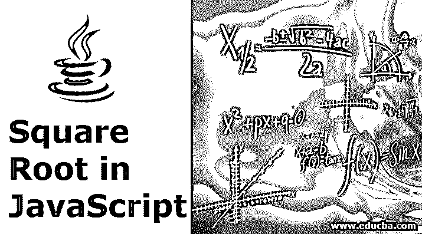
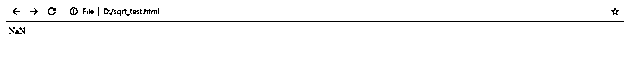
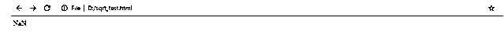
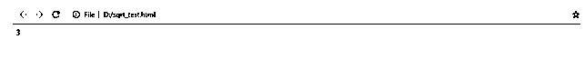
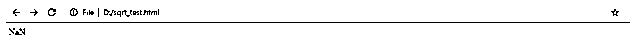
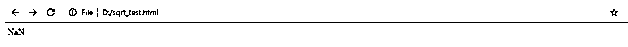
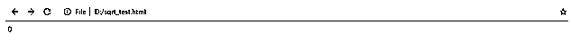
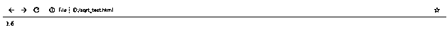
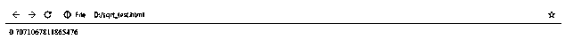
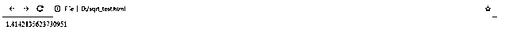

# JavaScript 中的平方根

> 原文：<https://www.educba.com/square-root-in-javascript/>




## JavaScript 中的平方根介绍

Javascript 是一种在浏览器中呈现的前端脚本语言，在我们今天在互联网上看到的所有 web 应用程序和网站中都可以找到。它被如此广泛地使用，以至于所有的浏览器在默认情况下都兼容 Javascript。我们可以简单地说，没有 Javascript 就没有 web 应用程序或网站，它已经发展了几年来支持 web 应用程序今天提供的复杂功能。例如，它支持算术运算，如求和、乘法、除法、减法、平方、平方根等等。在本教程中，让我们通过例子来探索如何使用 Javascript 来求一个数的平方根。

首先，让我们回顾一下平方根数学运算的基本定义。简单地说，一个数的平方根是一个数乘以它自己就得到这个数。使用的[平方根](https://www.educba.com/square-root-in-matlab/)是几个公式，是理解函数的先决条件，如函数和图形的二次方程、三角学中的勾股定理、函数和图形的分数指数、无理数和实数。

<small>网页开发、编程语言、软件测试&其他</small>

例如，9 的平方根是 3，因为 3×3 是 9。同样，25 的平方根是 5，因为 5 x5 是 25。

现在让我们将上面的数学等式转换成 Javascript 代码。

Javascript 使用 Math 对象进行各种数学运算。它有许多属性和功能来执行各种算术和算法操作。在它提供的众多算术函数中，我们可以使用它的 sqrt()方法来查找提供给它的数字的 sqrt()。

**sqrt()函数的语法:**

```
Math.sqrt(value)
```

**输入参数:**sqrt 函数接受一个要求平方根的数字作为参数。

**输出:**如果参数以正确的格式提供，该函数将返回一个数字，当该数字与自身相乘时将给出参数值，否则它将提供各种响应，我们将在前面的教程中探讨这些响应。

### JavaScript 中的平方根示例

让我们看看下面的例子，我们正在创建一个 id 为“myDiv”的 HTML 段落，我们将用 Javascript 为它分配各种平方根值:

```
Input : Math.sqrt(36)
Output : 6
Input : Math.sqrt(-36)
Output : NaN
```

虽然 sqrt()方法非常容易使用，但是如果输入参数以错误的格式提供，我们将不得不额外处理异常。

例如，如果我们传递一个非数字实例，sqrt()函数将返回一个 NaN 对象。

```
<!DOCTYPE html>
<html>
<body>
<p id="myDiv"></p>
<script>
document.getElementById("myDiv").innerHTML = Math.sqrt("string");
</script>
</body>
</html>
```

上述代码的输出将在浏览器窗口中显示为 NaN:




当我们传递一个包含多个数字的数组时，该函数将返回一个 NaN 响应，如下所示:

```
<!DOCTYPE html>
<html>
<body>
<p id="myDiv"></p>
<script>
document.getElementById("myDiv").innerHTML = Math.sqrt([9,16]);
</script>
</body>
</html>
```

上述代码的输出将在浏览器窗口中显示 NaN 值:




但是，如果我们提供一个带有一位数参数的数组，sqrt()函数将返回正确的响应，如下所示:

```
<!DOCTYPE html>
<html>
<body>
<p id="myDiv"></p>
<script>
document.getElementById("myDiv").innerHTML = Math.sqrt([9]);
</script>
</body>
</html>
```

上述代码的输出将在浏览器窗口中显示为 3:




当提供一个负数时，sqrt()函数返回一个 NaN 对象。

```
<!DOCTYPE html>
<html>
<body>
<p id="myDiv"></p>
<script>
document.getElementById("myDiv").innerHTML = Math.sqrt(-9);
</script>
</body>
</html>
```

上述代码的输出将在浏览器窗口中显示为 NaN:




当传递一个空参数时，sqrt()函数返回一个 n an 对象。

```
<!DOCTYPE html>
<html>
<body>
<p id="myDiv"></p>
<script>
document.getElementById("myDiv").innerHTML = Math.sqrt();
</script>
</body>
</html>
```

上述代码的输出将是:




当[传递一个空数组](https://www.educba.com/javascript-empty-array/)时，sqrt()函数返回 0 值

```
<!DOCTYPE html>
<html>
<body>
<p id="myDiv"></p>
<script>
document.getElementById("myDiv").innerHTML = Math.sqrt([]);
</script>
</body>
</html>
```

上述代码的输出将是:




但是，当提供一个十进制数作为输入参数时，sqrt()函数可以很好地工作。

```
<!DOCTYPE html>
<html>
<body>
<p id="myDiv"></p>
<script>
document.getElementById("myDiv").innerHTML = Math.sqrt(2.56);
</script>
</body>
</html>
```

浏览器上显示的上述代码的输出如下:




现在让我们理解并在浏览器中执行代码规范。

我们将首先创建一个名为“sqrt_demo.html”的文件，并将其保存在名为“sqrt_demo”的文件夹中。

我们的文件将包含 HTML 代码和 Javascript 代码。

```
<!DOCTYPE html>
<html>
<body>
<p id="myDiv"></p>
<script>
document.getElementById("myDiv").innerHTML = Math.sqrt(2.56);
</script>
</body>
</html>
```

我们现在可以通过在浏览器窗口中键入该文件的确切位置来加载该文件，以查看其输出。

除了 sqrt()函数，Math 对象还有两个属性可以帮助我们得到特定数字的平方根。

让我们通过下面的例子来回顾一下:

数学。SQRT1_2:该属性返回其平方根，大约等于 0.707。

**举例:**

```
<!DOCTYPE html>
<html>
<body>
<p id="myDiv"></p>
<script>
document.getElementById("myDiv").innerHTML = Math.SQRT1_2;
</script>
</body>
</html>
```

浏览器上显示的上述代码的输出将是:




在上面的例子中，我们打印了 Math，而不是 Math.sqrt()的值。SQRT1_2，在浏览器窗口中显示为 0.7071067811865476。

数学。SQRT2:该属性返回 2 的平方根，大约等于 1.414。

**举例:**

```
<!DOCTYPE html>
<html>
<body>
<p id="myDiv"></p>
<script>
document.getElementById("myDiv").innerHTML = Math.SQRT2;
</script>
</body>
</html>
```

web 浏览器上显示的上述代码的输出将是:




在上面的例子中，我们打印了 Math，而不是 Math.sqrt()的值。SQRT2 将在浏览器窗口中显示为 1.414。

除了 sqrt()这样的平方根函数，Javascript 中还实现了其他几个复杂的函数。这些函数有助于轻松实现复杂的计算，因为 javascript 本身很容易提供这些函数。这节省了开发人员的时间，并通过帮助他们在更短的时间内开发更多的代码来提高他们的生产力。这也是 javascript 如此受欢迎的主要原因之一，它不仅是一种前端语言[了，而且随着 NodeJS](https://www.educba.com/how-node-dot-js-works/) 的出现，它还成为了一种后端语言，可以实现用传统的[编程语言](https://www.educba.com/best-programming-languages/)如 Php、Java、Python、Go 等可以实现的所有操作。

### 推荐文章

这是 JavaScript 中的平方根指南。在这里，我们通过例子讨论如何使用 Javascript 来求一个数的平方根。您也可以看看以下文章，了解更多信息–

1.  [JavaScript 中的数组方法](https://www.educba.com/arrays-methods-in-javascript/)
2.  [JavaScript 中的快速排序](https://www.educba.com/quick-sort-in-javascript/)
3.  [JavaScript 中的模式](https://www.educba.com/patterns-in-javascript/)
4.  [Python 中的平方根](https://www.educba.com/square-root-in-python/)


