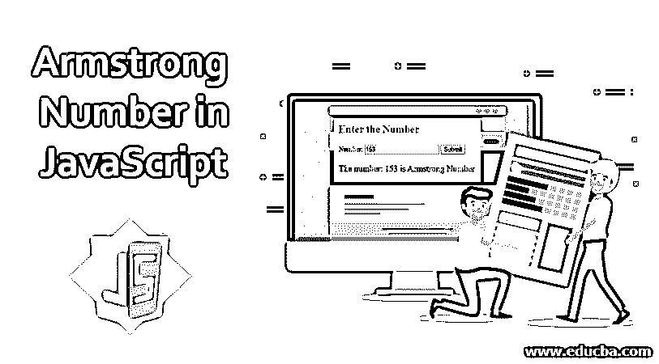
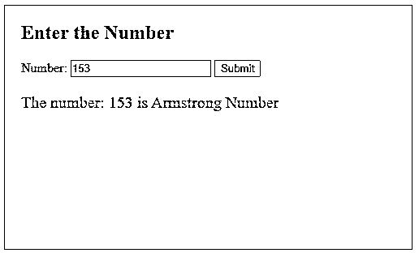
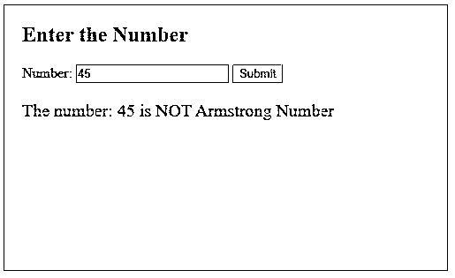
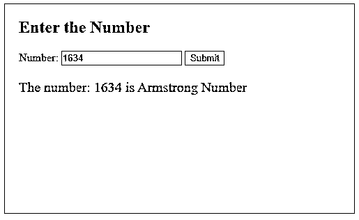

# JavaScript 中的阿姆斯特朗数

> 原文：<https://www.educba.com/armstrong-number-in-javascript/>




## JavaScript 中的阿姆斯特朗数概述

阿姆斯特朗数是这样一个数，它的所有数字的立方之和等于它本身。一般来说，也叫自恋号。自恋型数提出，如果这个数的所有位数的 n 次方之和等于这个数本身，那么这个数就是自恋型数或阿姆斯特朗数，其中 n 是位数。

### 逻辑

为了检查该数字是否是 Armstrong 数字，我们将检查该数字要填充的标准或属性。我们可以从该数字计算所有数字的 n 次方之和，然后将这个和与原始数字进行比较。如果总和与原来相符，那么，我们可以说[这个数就是阿姆斯特朗数](https://www.educba.com/armstrong-number-in-python/)。一般来说，使用或广泛使用立方或三的 n 次方是一种常见的范例，但这仅适用于 3 位数。这是因为一般会要求检查 3 位数是不是阿姆斯特朗。简而言之，所有三位数将有 3 的幂相加形成阿姆斯特朗数。

<small>网页开发、编程语言、软件测试&其他</small>

下面是一个三位数的例子:

153 =(1)<sup>3</sup>+(5)<sup>3</sup>+(3)<sup>3</sup>

= (1 * 1 * 1) + (5 * 5 * 5) + (3 * 3 * 3)

= 1 + 125 + 27

= 153

所以，数字 153 是阿姆斯特朗数字。

123 = (1)3 + (2)3 + (3)3

= (1 * 1 * 1) + (2 * 2 * 2) + (3 * 3 * 3)

= 1 + 8 + 27

= 36

它不等于原来的数，所以这个数不是阿姆斯特朗数。只有四个三位数的阿姆斯特朗号码。在不是 3 的其他幂的情况下，n 将变化。在 4 位数的情况下，幂将是 4。

例如 1634 = (1)4 + (6)4 + (3)4 + (4)4

= (1 * 1 * 1 * 1) + (6 * 6 * 6 * 6) + (3 * 3 * 3 * 3) + (4 * 4 * 4 * 4)

= 1 + 1296 + 81 +256

= 1634

这里，因为我们有 4 个数字，所以我们用 4 作为幂。

### JavaScript 中阿姆斯特朗数的例子

下面给出的是 JavaScript 中阿姆斯特朗数的例子:

#### 示例 1:使用 while 循环

**代码**:

```
<!DOCTYPE html>
<html>
<head>
<title>
Armstrong Number in JavaScript
</title>
<style>
.results {
border : green 1px solid;
background-color : aliceblue;
text-align : left;
padding-left : 20px;
height : 300px;
width : 95%;
}
.resultText {
font-size : 20px;
font-style : normal;
color : blue;
}
</style>
</head>
<body>
<div class = "results">
<h2> Enter the Number </h2>
Number: <input type = "number" name = "number" required id = "number">
<button type = "button" onclick = "checkArmstrong()" > Submit </button>
<div class = "resultText">
<p id = "result"> </p>
</div>
</div>
</div>
<script>
function checkArmstrong(){
num = document.getElementById("number").value;
var Number = num;
var digits = 0;
// Finding the number of digits
while(num > 0){
digits = digits + 1;
num = parseInt(num/10);
}
num = Number;
var sum = 0;
// calculating sum
while(num > 0) {
var digit = num%10;
sum = sum + Math.pow(digit, digits);
num = parseInt(num/10);
}
// checking sum with original number
if(sum == Number){
document.getElementById("result").style.color = "blue";
document.getElementById("result").innerHTML = "The number: " + Number + " is Armstrong Number";
}else{
document.getElementById("result").style.color = "red";
document.getElementById("result").innerHTML = "The number: " + Number + " is NOT Armstrong Number";
}
}
</script>
</body>
</html>
```

**输出**:

在这里，我们已经推广了计算阿姆斯特朗数的公式。首先，我们已经找出了用户输入的数字的位数，这样就可以用它来找出功率。我们使用了一个 while 循环从数字中逐个提取数字并进行处理。

对于有效的阿姆斯特朗数:




对于无效的阿姆斯特朗编号:




#### 示例 2:使用 for 循环

使用 for 循环找出总和可以获得相同的结果。在这两种情况下，找出阿姆斯特朗数的逻辑将保持不变。这个例子只是展示了 JavaScript 中[实现的另一种方式。](https://www.educba.com/what-is-javascript/)

**代码**:

```
<!DOCTYPE html>
<html>
<head>
<title>
Armstrong Number in JavaScript
</title>
<style>
.results {
border : green 1px solid;
background-color : aliceblue;
text-align : left;
padding-left : 20px;
height : 300px;
width : 95%;
}
.resultText {
font-size : 20px;
font-style : normal;
color : blue;
}
</style>
</head>
<body>
<div class = "results">
<h2> Enter the Number </h2>
Number: <input type = "number" name = "number" required id = "number">
<button type = "button" onclick = "checkArmstrong()" > Submit </button>
<div class = "resultText">
<p id = "result"> </p>
</div>
</div>
</div>
<script>
function checkArmstrong(){
num = document.getElementById("number").value;
var Number = num;
var digits = 0;
// Finding the number of digits
while(num > 0){
digits = digits + 1;
num = parseInt(num/10);
}
num = Number;
var sum = 0;
// calculating sum
var i;
for (i = 0; i<digits; i++ ) {
var digit = num%10;
sum = sum + Math.pow(digit, digits);
num = parseInt(num/10);
}// checking sum with original number
if(sum == Number){
document.getElementById("result").style.color = "blue";
document.getElementById("result").innerHTML = "The number: " + Number + " is Armstrong Number";
}else{
document.getElementById("result").style.color = "red";
document.getElementById("result").innerHTML = "The number: " + Number + " is NOT Armstrong Number";
}
}
</script>
</body>
</html>
```

**输出:**

这里，为了计算循环的和。我们可以重复所有的位数，直到所有的数字都被处理。




### 结论

一个[阿姆斯特朗数是一个数字](https://www.educba.com/armstrong-number-in-php/),它等于它的位数之和的 n 次幂，其中 n 是位数。我们可以用同样的逻辑检查这个数字是不是阿姆斯特朗。

### 推荐文章

这是一个用 JavaScript 编写的阿姆斯特朗数的指南。这里我们讨论 JavaScript 中阿姆斯特朗数的概述、逻辑和例子。您也可以看看以下文章，了解更多信息–

1.  [在 JavaScript 中继续](https://www.educba.com/continue-in-javascript/)
2.  [JavaScript parseInt](https://www.educba.com/javascript-parseint/)
3.  [c#中的阿姆斯特朗数](https://www.educba.com/armstrong-number-in-c-sharp/)
4.  [Java 中的强数字](https://www.educba.com/strong-number-in-java/)


