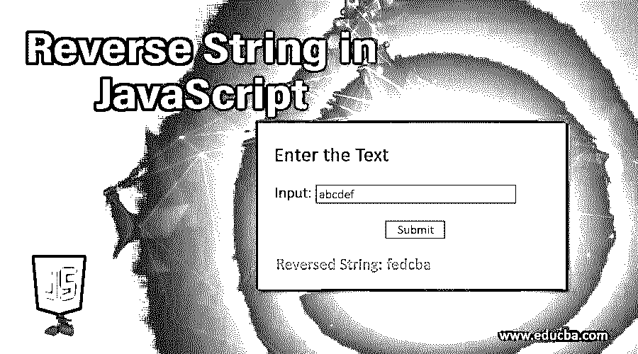
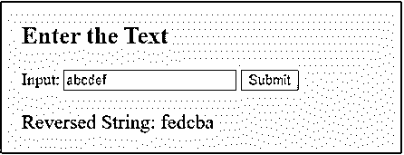
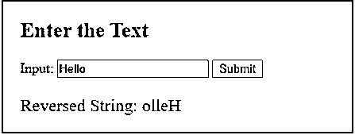
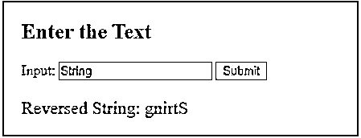
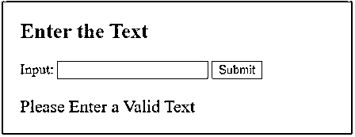
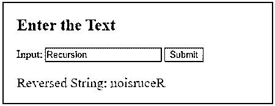

# JavaScript 中的反向字符串

> 原文：<https://www.educba.com/reverse-string-in-javascript/>




## JavaScript 中的反向字符串介绍

反转字符串意味着从最后一个字符到第一个字符遍历一个原始字符串，并形成一个新的字符串。这个新字符串将是原始字符串的反向字符串。新形成的字符串将具有与原始字符串相同的字符数。字符串反转的简单例子是原字符串为“abcd”会反转为“dcba”。有各种可能的方法来反转字符串。

**逻辑**

<small>网页开发、编程语言、软件测试&其他</small>

反转字符串最简单的逻辑是从最后一个字符到第一个字符逐个解析字符串，并继续连接它们。我们将输入作为一个文本，并将其传递给函数来反转一个字符串。在 null 或空白值的情况下，我们将简单地返回并向用户显示错误消息。要确定一个字符串的大小，我们可以使用一个内置函数来找出长度。

### 使用各种循环反转字符串的示例

以下是 JavaScript 中反向字符串的例子，请参考下文:

#### 示例 1–使用 For 循环

让我们看看使用 For 循环的例子

**代码**:

```
<!DOCTYPE html>
<html>
<head>
<title>
Reverse a String in JavaScript
</title>
<style>
.results {
border : green 1px solid;
background-color : aliceblue;
text-align : left;
padding-left : 20px;
height : 150px;
width : 95%;
}
.resultText {
font-size : 20px;
font-style : normal;
color : blue;
}
</style>
</head>
<body>
<div class = "results">
<h2> Enter the Text </h2>
Input: <input type = "text" name = "inputText" id = "inputText" required>
<button type = "button" onclick = "reverseString()" > Submit </button>
<div class = "resultText">
<p id = "reveserStringResult"> </p>
<p id = "result"> </p>
</div>
</div>
</div>
<script type = "text/javascript">
function reverseString() {
input = document.getElementById("inputText").value;
if(input == '') {
document.getElementById("reveserStringResult").innerHTML = '';
document.getElementById("result").style.color = "red";
document.getElementById("result").innerHTML = "Please Enter a Valid Text ";
return;
}
let reverseResult = "";
document.getElementById("result").innerHTML = '';
for ( var i = input.length -1; i >= 0; i--) {
reverseResult = reverseResult + input[i];
}
document.getElementById("result").style.color = "blue";
document.getElementById("reveserStringResult").innerHTML = "Reversed String: " + reverseResult;
}
</script>
</body>
</html>
```

**输出**:




这里，我们使用了 string.length 来计算字符串中的字符数，并在 for 循环中使用了它。使用 for 循环，我们从头到尾解析字符串，并以相反的顺序追加字符。

#### 示例 2–使用 While 循环

同样的逻辑也可以使用 while 循环来实现。

**代码**:

```
<!DOCTYPE html>
<html>
<head>
<title>
Reverse a String in JavaScript
</title>
<style>
.results {
border : green 1px solid;
background-color : aliceblue;
text-align : left;
padding-left : 20px;
height : 150px;
width : 95%;
}
.resultText {
font-size : 20px;
font-style : normal;
color : blue;
}
</style>
</head>
<body>
<div class = "results">
<h2> Enter the Text </h2>
Input: <input type = "text" name = "inputText" id = "inputText" required>
<button type = "button" onclick = "reverseString()" > Submit </button>
<div class = "resultText">
<p id = "reveserStringResult"> </p>
<p id = "result"> </p>
</div>
</div>
</div>
<script type = "text/javascript">
function reverseString() {
input = document.getElementById("inputText").value;
if(input == '') {
document.getElementById("reveserStringResult").innerHTML = '';
document.getElementById("result").style.color = "red";
document.getElementById("result").innerHTML = "Please Enter a Valid Text ";
return;
}
let reverseResult = "";
document.getElementById("result").innerHTML = '';
var i = input.length -1;
while ( i >= 0) {
reverseResult = reverseResult + input[i];
i--;
}
document.getElementById("result").style.color = "blue";
document.getElementById("reveserStringResult").innerHTML = "Reversed String: " + reverseResult;
}
</script>
</body>
</html>
```

**输出:**




#### 示例 3–使用 do While 循环

让我们用 do while 循环修改相同的代码。

**代码:**

```
<!DOCTYPE html>
<html>
<head>
<title>
Reverse a String in JavaScript
</title>
<style>
.results {
border : green 1px solid;
background-color : aliceblue;
text-align : left;
padding-left : 20px;
height : 150px;
width : 95%;
}
.resultText {
font-size : 20px;
font-style : normal;
color : blue;
}
</style>
</head>
<body>
<div class = "results">
<h2> Enter the Text </h2>
Input: <input type = "text" name = "inputText" id = "inputText" required>
<button type = "button" onclick = "reverseString()" > Submit </button>
<div class = "resultText">
<p id = "reveserStringResult"> </p>
<p id = "result"> </p>
</div>
</div>
</div>
<script type = "text/javascript">
function reverseString() {
input = document.getElementById("inputText").value;
if(input == '') {
document.getElementById("reveserStringResult").innerHTML = '';
document.getElementById("result").style.color = "red";
document.getElementById("result").innerHTML = "Please Enter a Valid Text ";
return;
}
let reverseResult = "";
document.getElementById("result").innerHTML = '';
var i = input.length -1;
do {
reverseResult = reverseResult + input[i];
i--;
}
while ( i >= 0);
document.getElementById("result").style.color = "blue";
document.getElementById("reveserStringResult").innerHTML = "Reversed String: " + reverseResult;
}
</script>
</body>
</html>
```

**输出:**




在输入字符串为空的情况下，我们会得到下面的错误。




#### 例子# 4——使用递归

让我们看看使用递归的例子

**代码**:

```
<!DOCTYPE html>
<html>
<head>
<title>
Reverse a String in JavaScript
</title>
<style>
.results {
border : green 1px solid;
background-color : aliceblue;
text-align : left;
padding-left : 20px;
height : 150px;
width : 95%;
}
.resultText {
font-size : 20px;
font-style : normal;
color : blue;
}
</style>
</head>
<body>
<div class = "results">
<h2> Enter the Text </h2>
Input: <input type = "text" name = "inputText" id = "inputText" required>
<button type = "button" onclick = "reverseString()" > Submit </button>
<div class = "resultText">
<p id = "reveserStringResult"> </p>
<p id = "result"> </p>
</div>
</div>
</div>
<script type = "text/javascript">
function reverseString() {
input = document.getElementById("inputText").value;
if(input == '') {
document.getElementById("reveserStringResult").innerHTML = '';
document.getElementById("result").style.color = "red";
document.getElementById("result").innerHTML = "Please Enter a Valid Text ";
return;
}
let reverseResult = reverseByRecursion( input );
document.getElementById("result").innerHTML = '';
document.getElementById("result").style.color = "blue";
document.getElementById("reveserStringResult").innerHTML = "Reversed String: " + reverseResult;
}
function reverseByRecursion( text){
if( text === "") {
return text;
} else {
let subString = text.substr(1);
return reverseByRecursion( subString ) + text[0];
}
}
</script>
</body>
</html>
```

**输出:**




这里，每次当我们调用递归函数时，我们通过留下唯一的第一个字符来传递所有的字符。我们有一个基本情况，当字符串由于在每次调用中砍掉一个字符而变空时。我们留下的第一个字符将从末尾开始一个接一个地追加，我们将得到反向字符串。

### 结论

在 JavaScript 中，通过实现简单的逻辑来解析字符串中的字符，反转字符串是非常容易的。我们已经看到了这个实现以及一个递归样式来反转一个字符串。

### 推荐文章

这是一个在 JavaScript 中反转字符串的指南。这里我们讨论 JavaScript 中使用各种循环的反向字符串的例子，比如(For 循环，While 循环，do While 循环)。您也可以看看以下文章，了解更多信息–

1.  [在 C++中反转字符串](https://www.educba.com/reverse-string-in-c-plus-plus/)
2.  [在 C#中反转字符串](https://www.educba.com/reverse-string-in-c-sharp/)
3.  [Java 中的字符串反转功能](https://www.educba.com/string-reverse-function-in-java/)
4.  [c++中的字符串](https://www.educba.com/string-in-c-plus-plus/)


