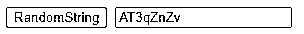
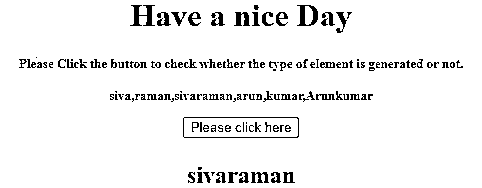
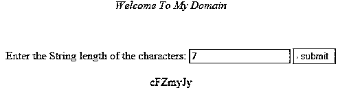

# JavaScript 随机字符串

> 原文：<https://www.educba.com/javascript-random-string/>


## JavaScript 随机字符串介绍

在 JavaScript 中，我们在不同的场景中使用了字符串概念，而且主要是用字符串格式声明变量值。在 string 中，格式有不同类型的条件来检查 javascript 代码中的多个变量。像反向字符串、随机字符串等，这些技术将使用字符串数据类型值进行比较，并满足用户条件。这些技术在 javascript 字符集合中有默认的方法来组合调用字符串，所以如果我们想使用随机字符串，那么我们必须计算脚本中的字符。

### 句法

所有编程语言都有在项目中编写代码的默认规则和语法。同样的，javascript 也有自己的语法来编写网页中的脚本，我们要计算脚本中的随机字符串，我们必须遵循下面的语法来生成脚本中的随机字符串字符。

<small>网页开发、编程语言、软件测试&其他</small>

```
<html>
<head>
<script>
function name()
{
var variable name; ///declaration using string datatype values
using some loop to iterate the string
using Math.random() default function to generate random strings.
---some javascript logics—
}
</script>
</head>
<body>
</body>
</html>
```

**解释:**上面的代码我们使用了 javascript 函数和一些逻辑，我们使用了一个名为 Math.random()的内置方法来生成网页上的随机字符串。

### javascript 随机字符串是如何工作的？

当我们想要在脚本中生成随机字符串时，我们必须遵循 ASCII 代码和名为 Math.random()方法的默认方法。我们都知道 ASCII 代码从 a 到 z 开始(同时使用小字母)。如果我们想要使用数字，它从 97 到 122 开始，所以随机字符串将从数字 97 到 122 计算。默认范围是 97 到 122，所以在特定范围内，随机数是使用 Math.random 方法生成的。

如果我们想生成随机的大写字母的字符串字符，它将从 65 到 90 之间的范围开始。在各种情况下，生成的随机字符串将用于其他一些框架，如 node.js 或任何其他 javascript 框架。我们还可以使用加密密钥生成应用程序，希望以最小的字符串重复或字符串冲突机会创建随机字符串。

我们还使用 Math.floor()方法在 javascript 中生成随机字母数字字符串。它没有默认的随机字符串生成器方法。我们将创建自定义的侧脚本函数，用于在脚本中生成随机和唯一格式的字符串。字符串的长度被传递到 javascript 的内置方法中，它将返回随机格式的字符串。

有时，我们可能在脚本中使用了随机字符串，它也用字符串的唯一格式来标识，并且它有一些其他 UI 标签元素，如面板或脚本中的任何其他文档对象模型(dom)元素。如果我们想识别并容易检测到这个溶液我们可以使用上面的两个方法 Math.random()和 Math.floor()。

当我们使用 Math.random()函数时，它将返回浮点类型的值，0<1 之间的伪随机数范围也将是近似范围，在算法的角度来看，均匀分布在范围和所需范围之间。上述点用于随机数或字符串的逐步过程，但在实现的角度来看，它将是随机数生成算法的初始种子。它将被遵循，不能由网络用户选择或重置。

当我们在 java 中使用相同的随机字符串生成时，我们将导入名为 java.util.Random 的类，以便在 java 代码中导入 Math.random()函数，在 javascript 中也是如此，我们在 UI 中使用标签元素，如登录页面中的密码生成器，它主要用于网页中，random()函数将用于生成字符串，或者以随机方式生成任何整数值。这些值可以是大写，小写，或者任何其他带有密钥字符串的符号，这些都是在 javascript 中生成随机字符串所需要的。

### 实现 JavaScript 随机字符串的例子

下面是提到的一些例子:

#### 示例#1

**代码:**

```
<html>
<head>
<title>Welcome To My Domain</title>
<script type="text/javascript">
function demo() {
var c = "ABCDEFGHIJKLMNOPQRSTUVWXTZ0123456789abcdefghiklmnopqrstuvwxyz";
var strlength = 8;
var random = '';
for (var i=0; i<strlength; i++) {
var num = Math.floor(Math.random() * c.length);
random += c.substring(num,num+1);
}
document.rdform.random.value = random;
}
</script>
</head>
<body>
<form name="rdform">
<input type="button" value="RandomString" onClick="demo();">&nbsp;
<input type="text" name="random" value="">
</form>
</body>
</html>
```

**输出:**




#### 实施例 2

**代码:**

```
<!DOCTYPE HTML>
<html>
<head>
<title>
Welcome To My Domain
</title>
</head>
<body style = "text-align:center;">
<h1 style = "color:green;">
Have a nice Day
</h1>
<p id = "first" style =
"font-size: 13px; font-weight: bold;">
</p>
<button id = "button" onclick = "demo()">
Please click here
</button>
<p id = "second" style =
"font-size: 24px; font-weight: bold; color: green;">
</p>
<script>
var u = document.getElementById('first');
var d = document.getElementById('second');
var a = ["siva", "raman",
"sivaraman", "arun","kumar","Arunkumar"];
u.innerHTML = "Please Click the button to check "
+ " whether the type of element is generated or not.<br><br>" + a;
function demo() {
d.innerHTML =
a[Math.floor(Math.random() * a.length)];
}
</script>
</body>
</html>
```

**输出:**




#### 实施例 3

**代码:**

```
<!DOCTYPE HTML>
<html>
<head>
<title>
Welcome To My Domain
</title>
<script>
body {
padding: 2rem 5rem;
}
#r { color: green; }
</script>
</head>
<body style = "text-align:center;">
<div>
<p><em>Welcome To My Domain</em></p>
</div>
<br>
<br>
<div>
Enter the String length of the characters:
<input type='text' id="n">
<button onclick="demo()">submit</button>
<p id="r"></p>
</div>
<script>
function demo() {
var t = "";
var l = document.getElementById("n").value;
var ch =
"ABCDEFGHIJKLMNOPQRSTUVWXYZabcdefghijklmnopqrstuvwxyz0123456789";
for (var i = 0; i < l; i++) {
t += ch.charAt(Math.floor(Math.random() * ch.length));
}
document.getElementById("r").innerHTML = t;
return t;
}
</script>
</body>
</html>
```

**输出:**




### 结论

以上段落描述了随机函数，该函数将以不同的方式用于 javascript 中的字符串数据类型，同时我们使用 Math.floor()方法来生成随机字符串，我们还使用字符串长度和字符 id 来生成随机字符串。

### 推荐文章

这是一个 JavaScript 随机字符串的指南。这里我们讨论 JavaScript 随机字符串的介绍，包括适当的语法、工作原理和例子。您也可以浏览我们的其他相关文章，了解更多信息——

1.  [JavaScript WeakMap](https://www.educba.com/javascript-weakmap/)
2.  [JavaScript 中的 pop()](https://www.educba.com/pop-in-javascript/)
3.  [JavaScript 中的插入排序](https://www.educba.com/insertion-sort-in-javascript/)
4.  [JavaScript 设置类](https://www.educba.com/javascript-set-class/)


