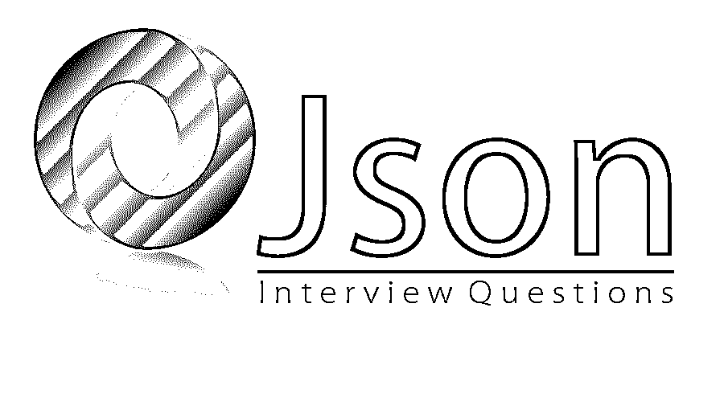

# JSON 面试问题

> 原文：<https://www.educba.com/json-interview-questions/>

## JSON 面试问答介绍

JSON 被称为 [JavaScript 对象符号](https://www.educba.com/uses-of-javascript/)。这是一种交换和存储数据的语法。它是独立于语言的数据格式，也是一种开放的标准文件格式。它主要基于 Javascript。 [JSON](https://www.educba.com/what-is-json/) 使用其他编程中正在使用的编程约定，如 C、C++、C#、Perl、Python 等。解析和翻译并不复杂。JSON 格式最初是由道格拉斯·克洛克福特在 21 世纪初规定的。JSON 与编程、脚本语言或工具一起被广泛使用。

现在，如果你正在寻找一份与 JSON 相关的工作，那么你需要准备 2022 年的 JSON 面试问题。的确，每个面试都因不同的职位而不同。在这里，我们准备了重要的 JSON 面试问题和答案，将帮助你在面试中取得成功。

<small>网页开发、编程语言、软件测试&其他</small>

在这篇 2022 JSON 面试问题的文章中，我们将呈现 10 个最重要和最常用的 JSON 面试问题。这些顶级面试问题分为以下两部分:

### 第 1 部分 JSON 面试问题(基础)

这第一部分涵盖了基本的 JSON 面试问题和答案。

#### Q1。JSON 支持所有平台吗？

**答:**
JSON 由于其文本格式，几乎支持所有的平台和编程语言，并且大部分技术主要处理支持 JSON 格式的系统之间的数据传输。有许多语言，如 PHP、Java、javascript 等。

#### Q2。JSON 是如何构建的？

**答案:**
这是面试中问的基本 JSON 面试问题。JSON 建立在两种结构上，即名称/值对的集合和值的有序列表。这些是通用的数据结构，如对象、数组、字符串、数字和值。

#### Q3。哪些开发人员更喜欢使用 JSON 而不是 XML？

**答案:**
优点如下:

*   JSON 比 XML 更快更轻。
*   JSON 有类型化的对象，而 XML 中的对象通常更少。
*   在 JSON 中，有不同的对象类型，如整数、字符串、数组等。而在 XML 中，只有一种对象类型是字符串。
*   在 JavaScript 中，JSON 数据可以很容易地作为 JSON 对象获得或访问，但是在 XML 中，需要使用 API 对数据进行解析并分配给变量。
*   在 JSON 中，检索值就像从 javascript 代码的对象属性中读取值一样简单。

让我们转到下一个 JSON 面试问题。

#### Q4。解释一下 JSON 的特点？

**回答:**
JSON 有很多可以使用的特性，并且比数据交换格式更有优势。这是易于使用和快速的性质。JSON 结构的轻量级使得它能够快速响应。它主要兼容所有的编程语言、浏览器和平台。它不需要任何额外的努力来确保与其他平台的兼容性。它还支持广泛的数据类型，数据可以很容易地获取。

#### Q5。解释 JSON-RPC 及其特性？

**答案:**
JSON-RPC 是指简单的远程过程调用。它使用轻量级 JSON 格式。它类似于 XML-RPC，但是它不使用 XML 格式。它使用 java 实现 JSON-RPC 协议。还有一些相同的特性，比如异步通信，透明地将 Java 对象映射到 javascript 对象。这是一个轻量级协议。它从 javaScript DHTML web 应用程序中动态调用服务器端 Java 方法。没有页面重载的情况发生。它支持所有浏览器，如 internet explorer、Mozilla Firefox、safari、opera，并使用 J2EE 安全模型和特定于会话的对象导出。

### 第 2 部分 JSON 面试问题(高级)

现在让我们来看看高级的 JSON 面试问题。

#### Q6。JSON 的局限性和用途是什么？

**答案:**
它有自己的局限性:
它不适合处理非常庞大复杂的数据。当数据变得复杂，具有多个嵌套和层次结构时，对于人类的可读性来说就变得复杂了。JSON 不支持评论。它不支持处理多媒体格式，如图像或富文本格式。

JSON 有很多用途，比如它主要用于 API 和 web 服务传输数据。它可以与大多数现代编程语言结合使用。它可以与 javascript 应用程序一起使用，如网站或浏览器插件。JSON 最重要的用途是通过系统间的网络连接传输序列化数据。它可以用来从 web 服务器读取数据，并在网页中显示数据。

#### Q7。用 JSON 解释 Newtonsoft？

**答案:**
Newtonsoft 是指主要用于。net 框架来执行 JSON 操作。它也被称为 Json.net。使用 Newtonsoft 有很多功能，比如它使用户能够使用其内部框架来解析、创建、修改和查询 JSON。它简单易用。它使用户能够用 JSON 序列化器序列化和反序列化任何对象。它比其他序列化程序更快。它支持从 XML 到 JSON 的转换，反之亦然。它的语法很简单，提供了一种更简单的查询 JSON 的方法。这是一个免费的开源软件。为了将数据转换成 JSON 结构，需要创建一个对象来存储数据，一旦创建了对象，我们就可以将变量和键存储在对象中。将数据存储在对象中后，我们可以序列化该数据，这就是序列化的工作方式，而反序列化则正好相反。

让我们转到下一个 JSON 面试问题。

#### Q8。JSONP 是什么？

**答案:**
JSONP 简称 JSON padding。它可以被定义为 javascript 程序从域中可用的服务器调用数据的过程，它不同于客户端。这是用于在 web 浏览器中绕过跨域策略的方法。可以这样说，当从客户机的不同域发送 JSON 响应时，要处理浏览器限制。它允许系统和环境的同源策略共享数据。

#### Q9。解释一下 JSON 的语法规则？

**答案:**
这是 JSON 面试中问得最多的问题。在 JSON 中，数据被安排在键值对中。在这里，左边代表键，右边代表值，这两个部分用冒号分隔。数据主要是借助逗号来分隔的。在 JSON 中，花括号定义对象，数组在 JSON 对象中用方括号定义。

#### Q10。解释一下 JSON 文件？

**答案:**
JSON 文件的扩展名为’。“json”和 JSON 文本的 MIME 类型是“应用程序/JSON”。JSON 文件可以用任何带有 notepad++或 notepad 的文本编辑器来编辑或查看。

### 推荐文章

这是 JSON 面试问题和答案列表的指南。这里我们列出了最有用的 10 组面试问题，这样求职者就能轻松应对面试。您也可以阅读以下文章，了解更多信息——

1.  [Java EE 面试问题](https://www.educba.com/java-ee-interview-questions/)
2.  [JSF 面试问题](https://www.educba.com/jsf-interview-questions/)
3.  [Javascript 面试问题](https://www.educba.com/javascript-interview-questions/)
4.  [JavaScript Web 开发工具](https://www.educba.com/web-development-frameworks/)

