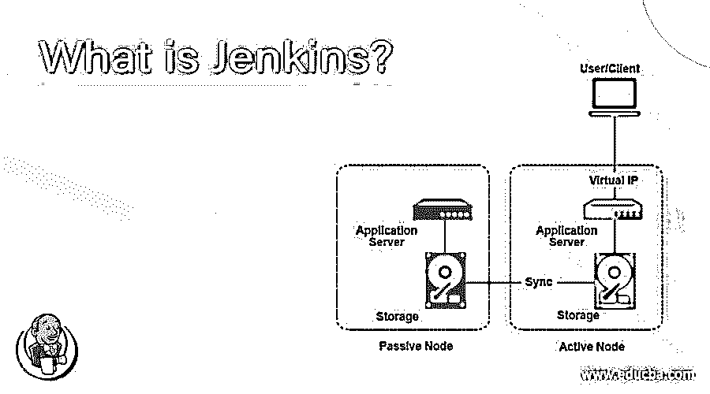
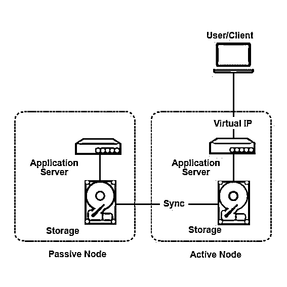

# 詹金斯是什么？

> 原文：<https://www.educba.com/what-is-jenkins/>

## 詹金斯简介

*   Jenkins 是一个持续集成自动化工具(开源)，安装在构建发生的服务器上。持续集成指的是这样一个过程:开发人员一完成开发，就将他们的代码提交到一个共同创建的存储库中。
*   在 CI/CD 过程中也会导致开销增加，因此我们在 Jenkins 中有管道来维护用户和标记给他们的权限。增加项目也是如此。
*   一旦建筑增加，相应的需求也随之增加，以创建测试代理及其维护。

### 詹金斯是什么？

Jenkins 是一款独立的开源自动化服务器，可用于自动化与构建、测试、交付或部署软件相关的各种任务

因此，当引入持续集成或部署的概念时，像 Jenkins 和 circles 这样的工具就出现了。但在这里，我们将只谈论詹金斯。

<small>网页开发、编程语言、软件测试&其他</small>

#### 理解詹金斯

*   持续集成管道是一组顺序或并行作业；这些作业旨在执行一组使用 GUI 界面配置的任务。
*   由于维护越来越多的项目、构建、构建修订和副本变得越来越困难，因此引入了 Jenkins pipeline 的概念。这条管道被称为詹金斯文件。
*   它还支持 docker 和 Kubernetes 等运行微服务的技术。
*   有时会出现某些问题，比如由于生成大量日志而导致速度变慢。
*   这会导致高 CPU 使用率，与访问 Jenkins 的用户数量成比例。
*   它可以纵向扩展(需要硬件升级)和横向扩展(需要多个 Jenkins masters)。
*   可以看出，拥有一个单独的 Jenkins master 是令人愉快的，但必须在可用性和处理的方便性之间进行权衡，因为万一单个 master 停机，那么它将停止业务。
*   It 奴隶同样在构建的同时贡献测试；Jenkins 提供了并行测试的概念，这也使得流水线更快。
*   提供了高可用性，以及主系统和辅助系统的故障转移处理。

### 詹金斯是如何工作的？

在您开始与 Jenkins 合作之前，有一些先决条件需要满足。

推荐的硬件如下

1.  RAM >= 1GB
2.  驱动器空间> = 50 GB 就足够了。

软件先决条件如下-

1.  Windows/Linux(最好)
2.  JDK 8
3.  必须有符合 Servlet 3.1 的 web 容器。

我们可以在两种架构中进行设计

1.  主从架构
2.  主-主架构

*   我们可以从“管理节点”页面设置从属节点。然后指定节点及其名称，设置节点的属性，将从节点关联到主节点，然后启动从节点。
*   有一些基础技术将会出现

1.  节点包管理器和 GIT
2.  Eclipse IDE 和 Maven
3.  数据库ˌ资料库
4.  用于自动化测试的类似 Junit 或 selenium 的测试工具
5.  任何像 Docker 这样的环境(最好)都可以。

它分三个阶段工作——构建前操作、构建操作和构建后操作。

在预构建操作中——在将代码放入构建之前，有 JS 最小化器来最小化和压缩代码；这是使用预构建插件完成的。除此之外，可以在需要的情况下调用 ant builder，可以执行窗口批处理、shell 命令，并且可以调用 maven 目标来提供配置文件。

预构建插件执行代码推送、轮询、编译、打包和发布。

在构建操作阶段——编译和测试从上一阶段提交到此阶段的代码。

在后期构建阶段——这里，代码被归档为可部署的格式，最后，它们被推送。

### 我们为什么要用詹金斯？

*   兼容使用 Kubernetes 和 Docker 部署微服务
*   下一个应用时代将仅仅是基于微服务的开发，因为只有在最大的应用场景中，某些服务才需要可伸缩性和可用性。因此，部署和服务可以通过 Jenkins 以自动化的方式推送，只需在输入中为其提供 shell 脚本，它就可以为您完成剩下的任务。
*   管道受到支持。

### 你能拿詹金斯怎么办？

*   如上所述，在两个架构中创建一个流程。
*   如果你只想要一个主人，你可以用那种方法；如果你需要匹配可用性限制，那么你可以选择许多大师。
*   有许多开源插件可以自动处理多个任务。
*   单片或基于微服务的应用得到了很好的支持。

### 詹金斯的优势

1.  它本质上是一个开源的持续集成服务器。
2.  詹金斯现在负责管道。
3.  现在任何语言都提供交付环境。
4.  产品交付过程变得更快，从而更紧密地遵循敏捷模型。
5.  Jenkins 是一个 CI/CD 工具。
6.  提供了基于角色的访问控制等功能。
7.  它是可扩展的；因此，可以满足可用性和可伸缩性问题。
8.  分布式团队可以工作，而且现在很容易管理。
9.  容器支持在那里。
10.  LDAP 服务器是其架构不可或缺的特性。
11.  詹金斯 2.0 也是向后兼容的。
12.  在 Jenkins 2.0 中，工作页面配置页面以一种即兴的方式出现

### 我们为什么需要詹金斯？

*   对于 CI/CD 流程
*   这些过程可以以自动化的方式设计；编码人员提交代码，只需点击一下鼠标(运行给定的脚本)，就可以构建相应的新版本。
*   受到开源插件和报告工具如 Ant、Maven、Gradle、BitBucket、NodeJs 等的良好支持。

### 谁是学习这项技术的合适受众？

*   任何一个 DevOps 角色的人都会喜欢使用这个工具来自动化构建过程。
*   寻求 DevOps 职业的 web 开发新手应该知道这个工具如何工作，以及我们如何配置构建创建过程。

### 这项技术将如何帮助你的职业发展？

*   这个工具随着时间不断进化，新版本都拿出了[微服务架构](https://www.educba.com/what-is-microservices-architecture/)支持；这是所有像网飞这样的大型项目都要遵循的架构；所有这些都将在建造过程中与詹金斯一起处理。

### 结论

Jenkins 是一个 CI/CD 工具，开源，兼容各种插件，当软件交付必须在敏捷的基础上进行时，它使生活变得简单。

### 推荐文章

这是一个什么是詹金斯的指南。在这里，我们讨论了它的工作原理、优势以及 Jenkins 的职业发展。您也可以看看以下文章，了解更多信息–

1.  [安装詹金斯](https://www.educba.com/install-jenkins/)
2.  [JIRA 的替代方案](https://www.educba.com/jira-alternatives/)
3.  [硒是什么？](https://www.educba.com/what-is-selenium/)
4.  [詹金斯 vs 哈德森](https://www.educba.com/jenkins-vs-hudson/)

