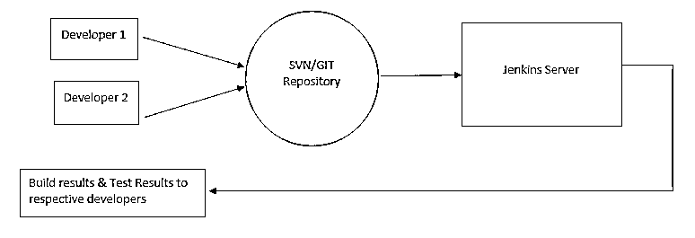
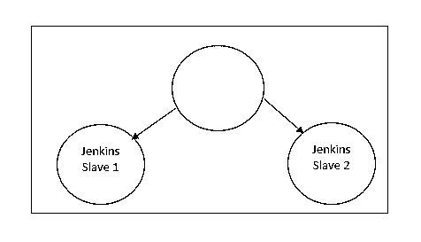
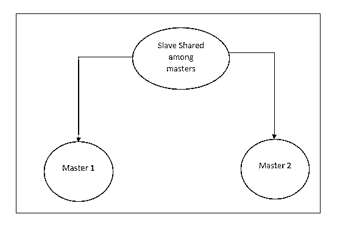
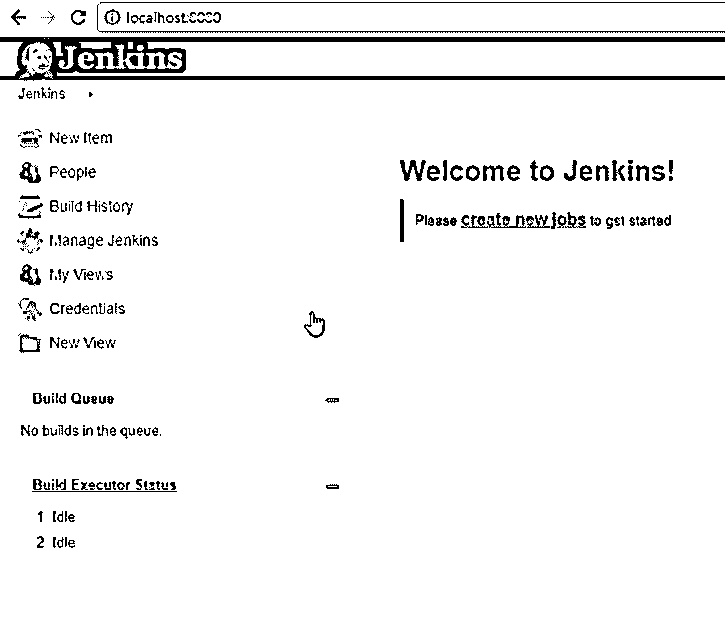
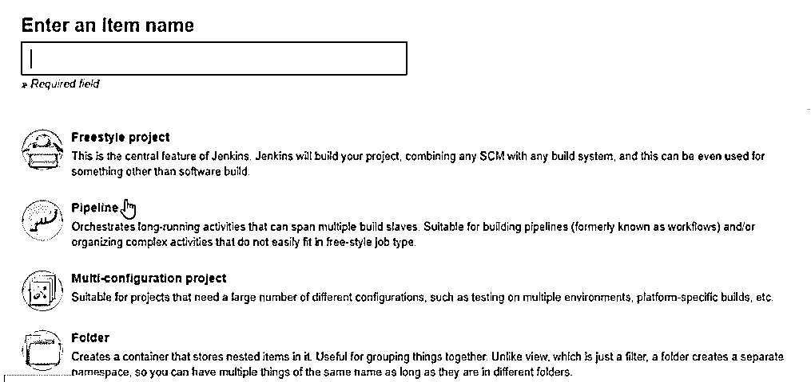
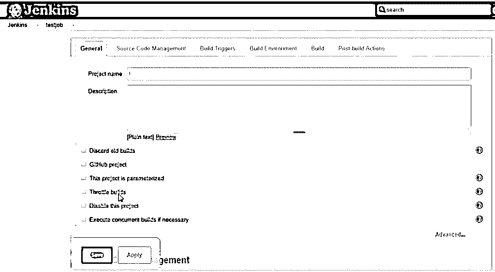
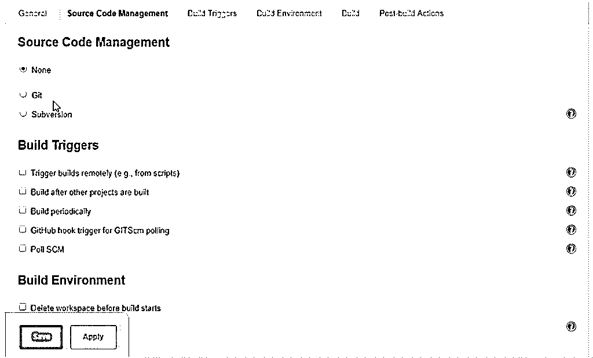

# 詹金斯有空吗

> 原文：<https://www.educba.com/is-jenkins-free/>

## 詹金斯自由了吗

你是否在考虑 Jenkins 是否是免费的，并使用它来制作要部署的构建文件？选择的确是对的！!

*   Jenkins 是绝对免费的，即开源工具，有助于自动化与构建、测试、交付和部署应用程序相关的各种任务。
*   Jenkins 可以通过提供的系统包安装，也可以在机器上安装 JRE 的情况下单独运行。
*   Jenkins 对持续集成和持续交付等术语非常满意。
*   成千上万的插件让工作变得更容易，所以免费的 Jenkins 和免费的插件让开发者和开发者的生活变得更容易。
*   Jenkins 适用于所有平台和不同的操作系统。
*   它帮助开发人员防止错误的集成，大多数集成工作是自动化的。

在您的机器上探索 Jenkins 之前，请满足以下与机器相关的要求:

<small>网页开发、编程语言、软件测试&其他</small>

1.  内存:大于 256 MB
2.  10 GB 的驱动器空间(用于 Jenkins 和 docker 镜像)，注意这需要巨大的内存。
3.  安装了 Docker 或 Java 8

### 如何经营詹金斯？

#### 詹金斯可操作性

*   每当开发人员将代码提交给各自的 SVN/GIT 存储库时，Jenkins 就会生成响应，并反馈给开发人员，告诉他们提交的代码是否成功构建，或者是否存在任何问题(例如，与数据库模式相对应的 DTO 未更新是新手开发人员的常见问题之一)，因此 Jenkins 很容易发现这些问题。
*   这种持续集成过程的好处是，开发人员可以在构建失败的基础上了解错误，如果失败了，Jenkins 就在测试服务器上部署构建。
*   对于 Jenkins 来说，在存储库中检查源代码提交的过程是一个无限循环。它总是对这些变化保持警惕。

### 詹金斯的重要和典型特征

以下是这些功能:

*   **基于角色的访问控制**
*   **简化管理–**Jenkins 使用图形用户界面为管理员提供便利。
*   **高可用性–**由于它构建在 java 之上，我们可以使用任何具有高可用性的应用服务器。
*   **可扩展性–**高度可扩展，因此成为最佳性能工具。
*   **高级安全性—**您是否在应用程序中使用 LDAP 进行角色管理和授权？然后 Jenkins 在这里对 LDAP 提供整体支持。
*   **轻量级容器支持—**提供对各种框架的支持，比如 docker。
*   **分布式开发—**Jenkins 使用分布式开发来促进团队管理。

### 詹金斯建筑

以下是架构:

#### 1.主从架构

在主-从模型中，Jenkins 服务器充当主服务器，负责分配要由从服务器执行的作业，从服务器通过发送针对执行的任务的报告来确认主服务器(就像将从服务器执行的测试任务的结果发送给主服务器)。

#### 2.主-主架构

在这种架构中，主设备共享从设备，它们也共享安全性。所以在失败的情况下，其他主设备也知道，所以从设备运行的作业记录在两个主设备中。

### 配置 Jenkins 自动化工具和设置项目

在 Jenkins 配置之前，您需要在此过程中安装某些其他软件，并设置某些系统属性。

*   下载 Eclipse
*   从[https://maven.apache.org](https://maven.apache.org)下载 maven 二进制 zip 文件
*   如果您的系统中没有系统变量，将为 maven 添加这些变量

1.  Var name = M2_HOME，它的值应该设置为你下载的 apache-maven 目录的值。
2.  Var name = path，其值应设置为 maven 的 bin 文件夹
3.  应安装 SVN/GIT。

*   现在只需[执行顶部提供的 Jenkins URL](https://www.educba.com/install-jenkins/) 导航到仪表板页面，就会出现如下所示的屏幕

现在，单击“创建新作业”选项，将出现如图所示的屏幕

*   在 freestyle 项目中，我们可以使用任何构建系统中的触发器来构建流程或作业
*   当我们编排跨越多个从设备的复杂构建任务时，会使用管道类型。
*   在多配置项目中，我们可以在不同的地方测试我们的代码。

现在让我们创建一个自由式项目:

在添加了这些常规设置之后，我们应该添加源代码管理属性。

所以很有可能[如果你正在和 SVN](https://www.educba.com/install-svn/) 一起工作，你可以从这里选择，构建触发器代表构建将被自动启动的时间。

我们可以在构建步骤中调用 shell 命令或 ant。

与此类似，我们可以导航到构建后操作，它表示构建完成时要执行的任务。

保存所有这些数据，将为我们创建一个项目，一个仪表板将在那里，我们可以管理构建历史，检查提交的用户，等等。

### Jenkins 中的重要插件

1.  LDAP 插件
2.  邮件程序插件
3.  坞站公用插件
4.  PAM 授权插件

[Jenkins 提供了插件](https://www.educba.com/jenkins-plugins/)管理器，我们可以在其中管理以下任务:

1.  添加插件
2.  管理插件
3.  升级插件
4.  启动时可以添加所需的插件

**插件类别:**

1.  源代码管理–Git、SVN、Bitbucket
2.  构建工具——Ant、Gradle、Maven
3.  分布式构建-窗口从属，矩阵-项目
4.  构建分析和报告–Junit，警告

### Jenkins 2.0 的特性和增强功能

1.  向后兼容——您可以安装新版本，而无需处理先前版本的依赖关系(可以由 Jenkins 自动完成)。
2.  提高了可用性。
3.  内置的管道支持，因此没有额外的设置要求。
4.  创建职务页面增强功能。
5.  与以前的版本相比，作业配置页面得到了改进。

### 推荐文章

这是一个指南是詹金斯自由。这里我们已经讨论了关于詹金斯的基本概念以及詹金斯的重要和典型特征。您也可以阅读以下文章了解更多信息:

1.  [Matlab 免费吗？](https://www.educba.com/matlab-free/)
2.  [詹金斯的用途](https://www.educba.com/uses-of-jenkins/)
3.  [詹金斯 vs 梅文](https://www.educba.com/jenkins-vs-maven/)
4.  [詹金斯面试问题](https://www.educba.com/jenkins-interview-questions/)

