# 詹金斯备份

> 原文：<https://www.educba.com/jenkins-backup/>

## Jenkins 备份简介

Jenkins backup 是一个解决方案，用于保存与 Jenkins 相关的关键配置设置的备份。詹金斯有一个备份插件，可以用来备份。Jenkins 备份和恢复指的是定期复制数据(如配置和访问权限设置)的服务和实践。所有备份数据，包括与 IAM(身份访问管理)相关的设置、插件、工件归档和构建日志，都保存在 JENKINS_HOME 目录中。最简单的备份方法就是用新的备份设置新的文件夹，只要需要就复制回来。

对于任何组织来说，备份数据对任何业务都至关重要，Jenkins 也不例外。如果您有正确的备份，它将为任何业务提供强大的信心，以应对任何意外情况(如数据中心停机、Jenkins 系统故障或数据意外删除)所需的恢复。
备份 Jenkins 配置有多种方法，例如:

<small>网页开发、编程语言、软件测试&其他</small>

1.使用精简备份

2.使用 git repo

最简单的方法也是最常用的方法是使用 Jenkins 插件进行备份。

例如，对于任何组织来说，通过选择必要的插件来设置访问权限和作业配置都需要相当长的时间，因此最好定期备份所有必要的设置和参数。Jenkins 目录包含已配置的构建作业列表以及这些作业的所有相关设置。此外，Jenkins 的一个特性提供了随时重命名现有作业的选项。我们需要在 Jenkins 主页上单击 reload config 来反映应用的更改。因为 Jenkins 有几个插件可以让用户多次使用。它已经有一个插件，可以用于备份管理，即“瘦备份插件”。

### Jenkins 设置备份和恢复的过程

我们将逐步考虑设置备份并将 Jenkins 恢复到新服务器的过程:

#### 登录到 Jenkins UI

**第一步:**管理 Jenkins - >管理插件- >点击可用- >选择“瘦备份”- >不启动安装。

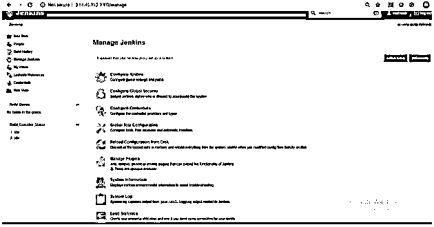

**步骤 2:** 从 Jenkins 主页点击管理 Jenkins，重定向到下一页，该页有一个管理插件的选项。在下一页，我们可以看到“available”选项卡，现在选择“Thin Backup plugin ”,然后单击“Install without restart”按钮。

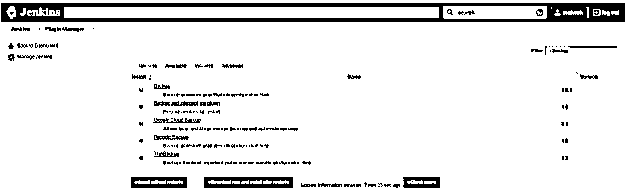

重启 Jenkins 后，我们可以看到插件安装成功。我们可以在管理 Jenkins 链接下找到新安装的插件“精简备份插件”。

#### Jenkins 精简备份设置

**步骤 1:** 安装插件后，我们要做的第一件事就是“精简备份”配置- >管理 Jenkins - >精简备份- >设置

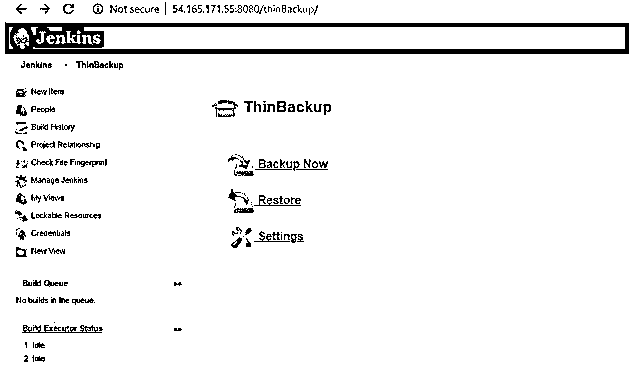

我们可以看到下面提供了备份配置设置。运行 Jenkins 服务的用户负责定义以下所有配置。定义目录的第一个配置，与 Jenkins 相关的所有设置和配置将存储在该目录中。我们还可以安排备份，以便不时更新。

#### 执行备份

**步骤 1:** 为了测试上述配置的备份设置是否有效，我们提供了一个选项“立即备份”。点击“立即备份”选项，基本上它会根据下面配置的目录创建 Jenkins 数据和设置的备份。通常，备份会根据备份计划中配置的时间自动触发。我们也可以按照以下步骤手动触发备份:

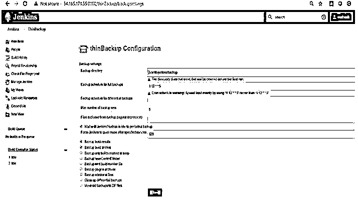

#### 还原备份

检查备份数据的最佳方式是，导航到指定的备份目录。您可以看到创建的备份在文件夹名称中附加了时间戳。您还可以根据您的保留策略设置找到您的旧备份文件。

#### 生成备份的输出目录

`ubuntu@ip-172-31-94-14:/var/lib/jenkins/backup$ ls -lrth
total 4.0K
drwxr-xr-x 4 jenkinsjenkins 4.0K May 27 10:06 FULL-2020-05-27_10-06
ubuntu@ip-172-31-94-14:/var/lib/jenkins/backup$`

**Note:** Perform sanity once Jenkins restore task has been successfully done.

让我们来看一个场景，我从 Jenkins 目录中删除了一些文件，并从备份中恢复了这些文件。

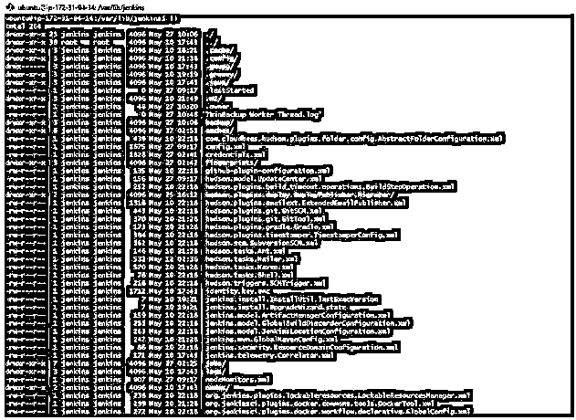

RM/Jenkins/Hudson . plugins . git . git tool . XML

rm:删除常规文件。/lenkIns/Hudson . plugins . git . git tool . XML '？英语字母表的第 25 个字母

ls-l/Jenkins/Hudson . plugins . git . git tool . XML

ls:无法访问/Jenkins/Hudson . plugins . git . git tool . XML:没有这样的文件或目录

删除一些文件后，我们已经从备份中恢复了数据。

#### 用于恢复

**步骤 1:** 管理 Jenkins - >精简备份- >恢复

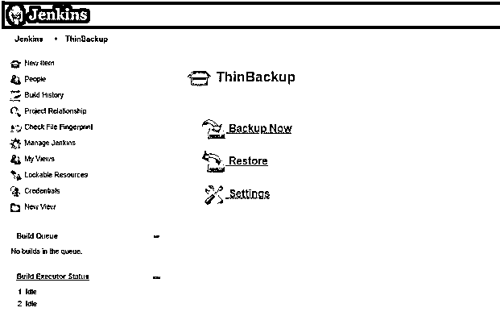

**第二步:**选择要恢复的备份点。

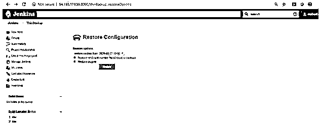

现在，我们已经运行了命令来验证被删除的文件是否已成功恢复。

键入命令“ls–l/apps/Jenkins/Hudson . plugins . git . git tool . XML”验证文件。

RM/aaps/Jenkins/Hudson . plugins . git . git tool . XML

rm:删除常规文件“/apps/Jenkins/Hudson . plugins . git . git tool . XML”？英语字母表的第 25 个字母

ls-l/apps/Jenkins/Hudson . plugins . git . git tool . XML

ls:无法访问/apps/Jenkins/Hudson . plugins . git . git tool . XML:没有这样的 or 目录

ls-l/apps/Jenkins/Hudson . plugins . git . git tool . XML

-rw-r-r-。1 Jenkins Jenkins 370 月 27 日 04:31/apps/Jenkins/Hudson . plugins . git . git tool . XML

#### 使用 git repo

让我们假设在任何组织中，it 都遵循 devops 实践，并将 Jenkins 配置为他们构建过程的一部分。基本上，DevOps 团队希望配置一个流程，并作为流程的一部分，为任何灾难建立定期备份。

#### 进行备份的管道脚本

**步骤 1:** 创建一个新的 Jenkins 职位。你应该选择自由式项目

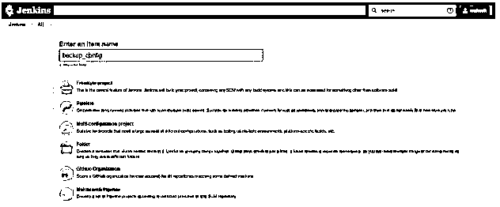

**步骤 2:** 让我们添加一个作业，该作业将完全备份 Jenkins，包括所有作业、行动手册以及您在那里拥有的任何其他内容。它将备份位于/var/lib/Jenkins 的所有内容。选择“定期构建”构建触发器，并配置为按您喜欢的频率运行。

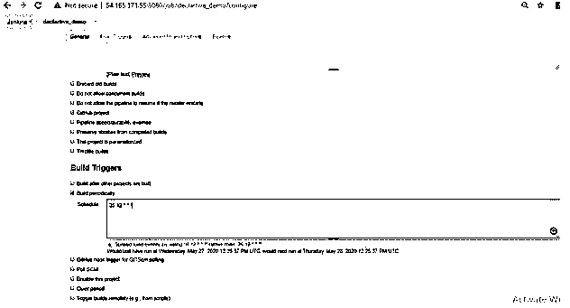

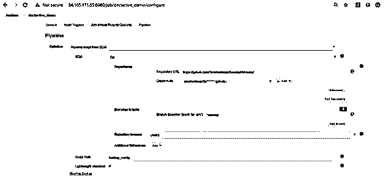

创建一个新文件 Backup_config，并添加以下脚本。一旦添加了脚本，就将文件提交到源代码存储库中。

**代码:**

`pipeline {
agentany
stages {
stage("BACKUP"){ steps{
sh """#!/bin/bash
pushdbackup_config
sudogitconfig --local user.email "mahes.sharma23@gmail.com"
sudogitconfig --global user.name "Smaheshwar85"
find .|xargsgitrm
popd
cp -v var/lib/jenkins/*xml $WORKSPACE/backup_config
pushdvar/lib/jenkins/
fori in \$( find jobs|grep config.xml ); do
mkdir -p $WORKSPACE/backup_config/`dirname \$i`
cp \$i $WORKSPACE/backup_config/`dirname \$i`
done
popd
cp -rfvvar/lib/jenkins/secret* $WORKSPACE/backup_config/
cp -rfvvar/lib/jenkins/user* $WORKSPACE/backup_config/
pushdbackup_config
find .|xargsgit add
sudogit commit -a -m"Jenkins Backup Job"
"""
}} //steps // stage
stage("PUSH"){ steps{
sshagent(["$GIT_CREDENTIAL_ID"]) {
sh "cdbackup_config&&git push origin HEAD:$BACKUP_BRANCH"
} // sshagent
}} //steps // stage
}} //stages // pipeline`

**输出:**

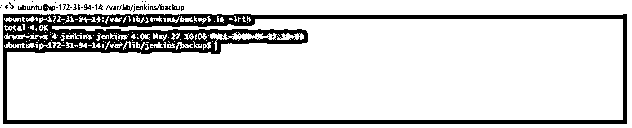

一旦你触发了建筑备份就产生了。

### 推荐文章

这是詹金斯备份指南。在这里，我们将讨论 Jenkins 备份的介绍、设置过程和恢复步骤，以便更好地理解。您也可以浏览我们的其他相关文章，了解更多信息——

1.  [詹金斯的用途](https://www.educba.com/uses-of-jenkins/)
2.  [什么是云计算？](https://www.educba.com/what-is-cloud-computing/)
3.  [如何安装 Joomla](https://www.educba.com/install-joomla/)
4.  [詹金斯面试问答](https://www.educba.com/jenkins-interview-questions/)

