# Jenkins 电子邮件通知

> 原文：<https://www.educba.com/jenkins-email-notification/>

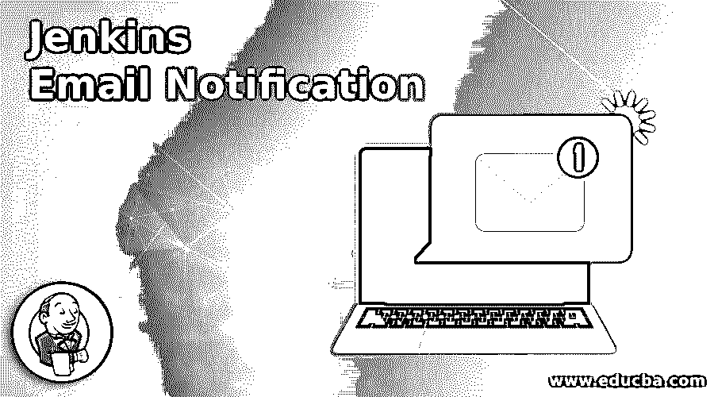

## Jenkins 电子邮件通知简介

Jenkins 电子邮件通知是根据发生的事件或发生的某些操作进行通知的方式。Jenkins 电子邮件通知是一种自动发送给你的消息，并更新你的一个社交媒体帐户(如 Google，slack)上的活动。由于电子邮件是 Jenkins 电子邮件通知在其他社交媒体中的主要通知方式。Jenkins 提供了一个插件来扩展电子邮件通知的功能。它基本上是通知用户一些事件或状态或任何需要更新的信息。

### Jenkins 电子邮件通知的 3 个部分

以下是 jenkins 电子邮件通知的 3 个部分:

<small>网页开发、编程语言、软件测试&其他</small>

*   **触发器:**这是导致发送电子邮件通知的定义条件。
*   **内容:**基本定义了邮件主题和正文的内容。
*   **Recipients:** 我们可以提到当任何事件发生时应该接收电子邮件的相关用户。

### Jenkins 电子邮件通知的使用案例

在任何组织中，it 都遵循 devops 实践，并将 Jenkins 配置为其构建流程的一部分。基本上，devops 团队希望配置一个流程，并作为流程的一部分，在自由配置的帮助下，如果任何构建失败，将自动向开发人员团队发送电子邮件。为了发送和接收电子邮件，我们需要在詹金斯配置电子邮件服务器。基本上，在一个组织中，他们有自己的电子邮件服务器，用于触发。电子邮件，在我们的例子中，我们没有自己的服务器，所以我们将使用 Gmail SMTP 服务器。

### 在 Jenkins 中配置 Gmail SMTP 服务器

成功安装 Jenkins 后，它带有几个内置功能和几个插件，如邮件发送。只是我们需要配置任何插件或电子邮件发送插件与定义的必要值，因为在电子邮件的情况下，SMTP 服务器所期望的。

当 Jenkins 电子邮件通知触发时，这是一个事件，在该事件下事件发生并发送到相应的收件人。对于自动化构建作业，有许多事件，如成功、失败、中止等等。点击触发选项后，基本上是邮件需要触发的必需事件的选择。完成所有更改后，保存配置。

转到詹金斯仪表板。

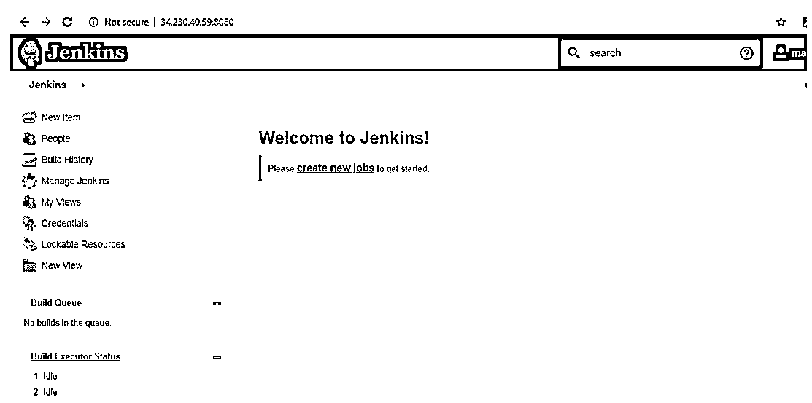

转到 Jenkins 主页，单击“管理 Jenkins”菜单选项。然后，选择“配置系统”选项。

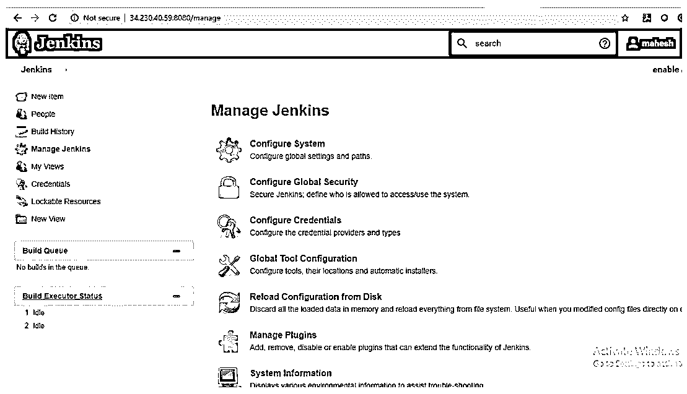

转到电子邮件通知部分，输入所需的 SMTP 服务器和用户电子邮件后缀详细信息。单击“高级”按钮，然后单击“使用 SMTP 验证”选项旁边的复选框。现在，设置以下字段。

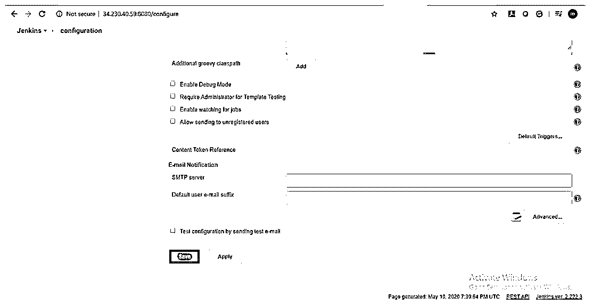

我们必须在相应的文本框中提供 SMTP 服务器的详细信息，单击高级按钮，下面我们有字段给配置 SMTP 服务器设置。请查找以下详细信息以配置电子邮件服务器。

在电子邮件通知下，将提到的详细信息放在下面:

*   SMTP 服务器→smtp.gmail.com
*   选择使用 SMTP 验证
*   输入您的 gmail id
*   输入您的 gmail 密码
*   使用 SSL 选择
*   SMTP 端口 465
*   保存配置

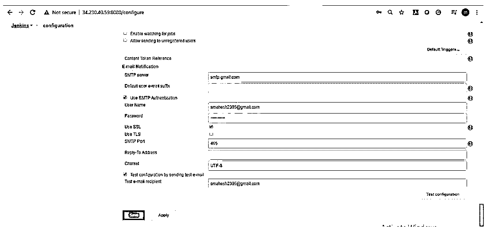

要验证电子邮件通知功能，请单击“通过发送测试电子邮件收件人来测试配置”选项下面的复选框。

输入有效的电子邮件 id，然后单击“测试配置”按钮检查电子邮件 id 是否有效。

选中用于 SMTP 身份验证的框，为 SMTP 帐户提供用户凭据。

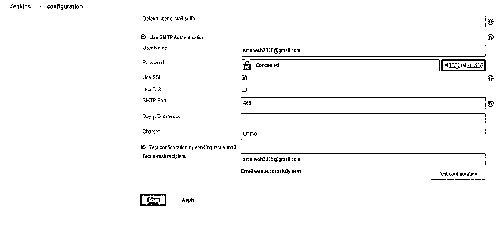

将 jenkins 作业配置为在构建失败时触发电子邮件。

打开您的作业→配置→后期生成操作→添加后期生成操作→电子邮件通知

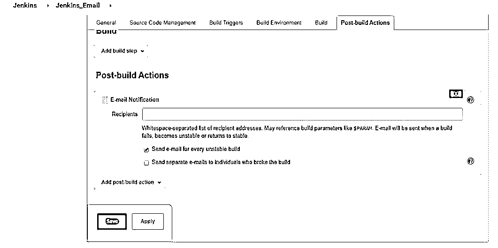

在 Recipients 下输入团队的邮件 id 并保存配置。

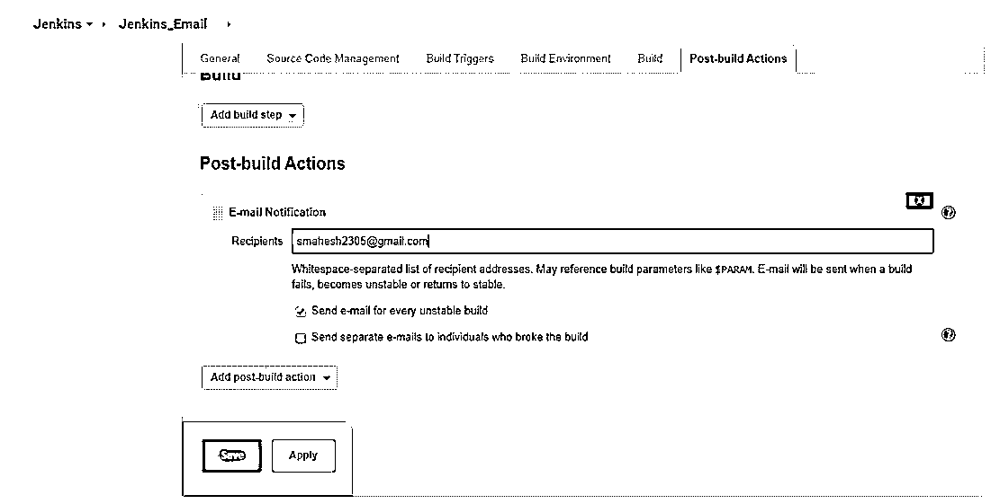

成功配置后，单击立即构建选项以触发构建。根据发生的构建事件，如成功或失败，服务器发送邮件进行通知。

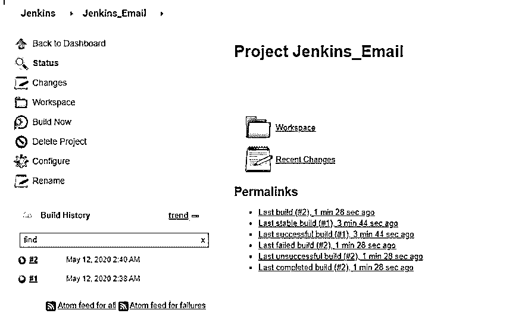

我们可以得到构建失败通知，因为 Jenkins 服务器上发生了失败事件。

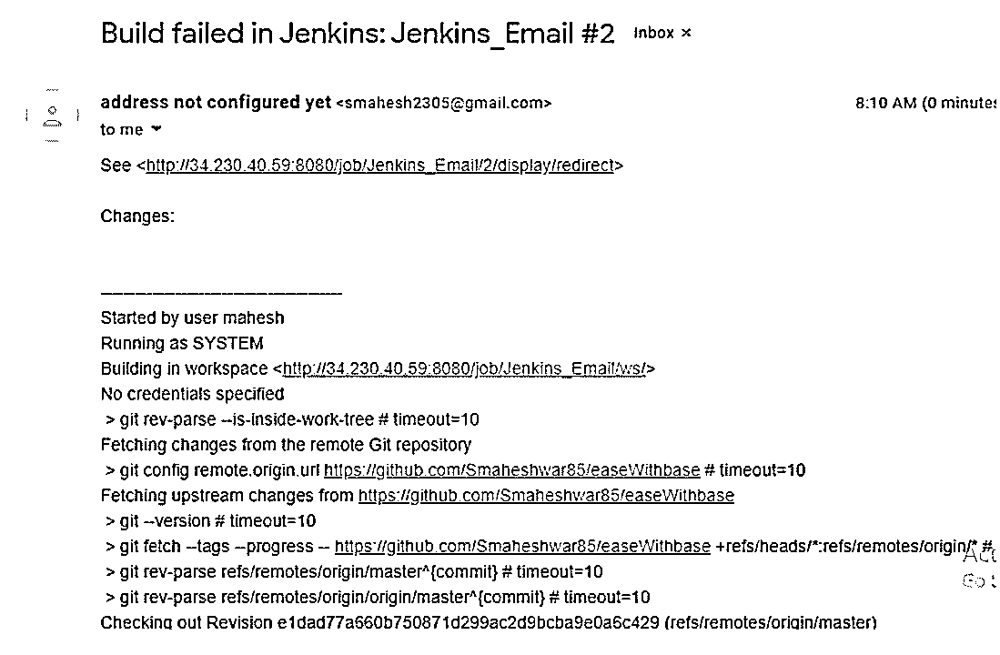

找到使用管道脚本自动发送电子邮件通知的用例。

让我们假设在任何组织中，它都遵循 devops 实践，并将配置 Jenkins 作为其构建过程的一部分。基本上，devops 团队希望配置一个流程，如果构建成功，作为流程的一部分，向开发人员团队发送自动电子邮件。

将 Jenkins 管道脚本作业配置为在构建成功时触发电子邮件。

请查找以下管道脚本:

**代码:**

`node{
stage('SCM Checkout'){
git 'https://github.com/Smaheshwar85/easeWithbase'
}
stage('Compile-Package'){
defmvnHome =  tool name: 'Mavan3', type: 'maven'
sh "${mvnHome}/bin/mvn package"
}
stage('Email Notification'){
mail bcc: '', body: '''Build successful!!!!
Thanks,
Mahesh''', cc: '', from: '', replyTo: '', subject: 'Build successfull', to: 'smahesh2305@gmail.com'
}
}`

我们已经在上面的管道脚本中配置了下面的 git 存储库。为了执行管道脚本，我们创建了 Jenkins 文件，并将我们的脚本保存在其中。

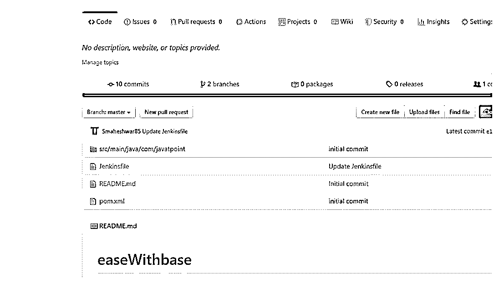

请查看下面的配置截图。我们必须定义管道部分的所有细节。基本上在 repositories 部分，它定义了我的 Jenkins 文件所在的 Git 存储库路径。此外，我们必须标记拥有更新代码并准备好构建的分支。最后需要定义脚本路径，这个路径就是 Jenkins 文件。

我们已经将我们的电子邮件内容定义到管道脚本中，只要有任何事件发生，我们就会收到这些电子邮件内容。我们可以看到，下面的电子邮件是在构建活动成功后立即收到的。

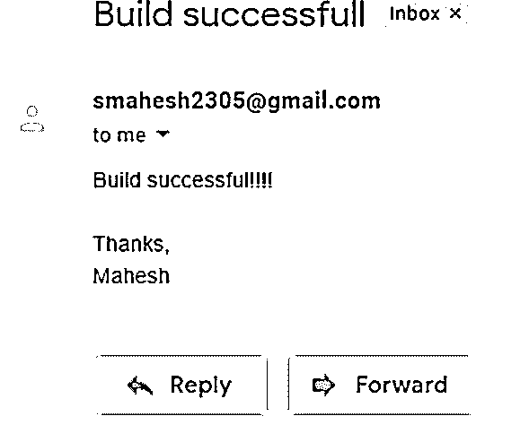

### 故障排除提示

如果您的构建失败，您可以在控制台中看到下面的错误堆栈跟踪。

534 5 . 7 . 14 https://support.google.com/mail/answer/78754 p10sm 11420422 qkm . 121–GSM TP

*   位于 com . sun . mail . SMTP . SMTP transport＄authenticator . authenticate(SMTP transport . Java:809)
*   位于 com . sun . mail . SMTP . SMTP transport . authenticate(SMTP transport . Java:752)
*   位于 com . sun . mail . SMTP . SMTP transport . protocol connect(SMTP transport . Java:669)
*   位于 javax . mail . service . connect(service . Java:317)
*   位于 javax . mail . service . connect(service . Java:176)
*   位于 javax . mail . service . connect(service . Java:125)
*   位于 javax . mail . transport . send 0(transport . Java:194)
*   位于 javax . mail . transport . send(transport . Java:124)
*   位于 Hudson . tasks . mail sender . run(mail sender . Java:130)
*   位于 Hudson . tasks . mailer . perform(mailer . Java:176)
*   位于 Hudson . tasks . mailer . perform(mailer . Java:139)
*   位于 Hudson . tasks . buildstepmonitor＄1 . perform(buildstepmonitor . Java:20)
*   位于 Hudson . model . abstract build＄abstractbuildexecution . perform(abstract build . Java:741)
*   位于 Hudson . model . abstract build＄abstractbuildexecution . performallbuildsteps(abstract build . Java:690)
*   位于 Hudson . model . build＄build execution . post 2(build . Java:186)
*   位于 Hudson . model . abstract build＄abstractbuildexecution . post(abstract build . Java:635)
*   位于 Hudson . model . run . execute(run . Java:1881)
*   位于 Hudson . model . freestylebuild . run(freestylebuild . Java:43)
*   位于 Hudson . model . resource controller . execute(resource controller . Java:97)
*   位于 Hudson . model . executor . run(executor . Java:428)

已完成:失败

为了修复上述错误，请遵循以下解决方案:

这种错误通常要求许可，以允许从应用程序的不安全访问。

**第一步:**登录您发送邮件的 gmail 帐户。

**第二步:**进入管理你的谷歌账户- >安全- >不太安全的应用访问- >打开访问。

或者

**访问网址:**

[https://www.google.com/settings/security/lesssecureapps](https://myaccount.google.com/intro/security)

将“允许不太安全的应用程序:关闭”改为“允许不太安全的应用程序:打开”。

如果上面的提示没有帮助，请访问[https://www.google.com/accounts/DisplayUnlockCaptcha](https://www.google.com/accounts/DisplayUnlockCaptcha)并按照页面上的步骤操作。

### 推荐文章

这是一个詹金斯电子邮件通知指南。这里我们讨论 jenkins 电子邮件通知的 3 个部分，使用案例和在 jenkins 中配置 gmail SMTP 服务器。您也可以看看以下文章，了解更多信息–

1.  [詹金斯的用途](https://www.educba.com/uses-of-jenkins/)
2.  [詹金斯是什么？](https://www.educba.com/what-is-jenkins/)
3.  [詹金斯插件](https://www.educba.com/jenkins-plugins/)
4.  [詹金斯的替代方案](https://www.educba.com/jenkins-alternatives/)

