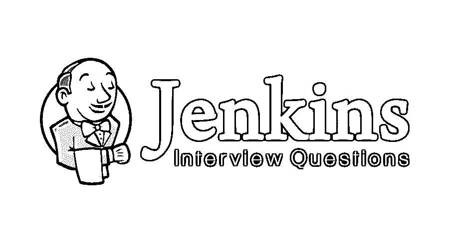

# 詹金斯采访问答

> 原文：<https://www.educba.com/jenkins-interview-questions/>

## 詹金斯面试问答介绍

[Jenkins 是](https://www.educba.com/what-is-jenkins/)一个软件工具，用于开发过程的持续集成。它是一个开源工具，随时可用，用 Java 编写。它被用作自动化工具来自动化软件开发过程中的所有任务，如编码、测试和部署。Jenkins 可以与几乎所有的插件一起使用，以使持续集成顺利进行。Jenkins 本身并不做任何类似检查代码或测试的事情，它只是在特定任务完成后向插件发出运行命令。这意味着 Jenkins 形成了一个要完成的任务流程，这个任务流程被称为 pipeline 或 Jenkins pipeline。当一个任务在管道中成功完成时，其他任务将开始，以此类推。

Jenkins 只是一个指挥者，这使得开发人员更容易跟踪成功的构建，不断地集成变更，并按时纠正缺陷。Jenkins 也被称为 CI 工具(持续集成工具)。[持续集成是一个](https://www.educba.com/what-is-continuous-integration/)过程，其中每个团队成员都在不同的模块上工作，在一天结束时，每个人都提交他们在 SCM(源代码管理，代码集中到一个团队)中的更改，并检查集成的代码是否工作良好或每天都进行测试。

<small>网页开发、编程语言、软件测试&其他</small>

所以，你终于在詹金斯找到了你的梦想工作，但想知道如何破解 2022 年的詹金斯面试，以及哪些可能是詹金斯面试的问题。每次面试都不一样，工作范围也不一样。牢记这一点，我们设计了最常见的詹金斯面试问题和答案，以帮助您在面试中取得成功。

以下是詹金斯面试中经常被问到的一些问题:

### 第 1 部分 Jenkins 面试问题(基础)

这第一部分包括基本的 Jankins 面试问题和答案。

#### 1.定义詹金斯的过程？

**答案:**
请从上面介绍部分解释的关于 Jenkins 的简要介绍开始。詹金斯的过程如下:

*   在源代码管理存储库中，开发人员需要每天或者按照团队的指示提交他们的代码，因为 Jenkins 会定期检查存储库的变更。SCM 可以是 GIT、SVN 和 TFS。GIT 和 SVN 现在被广泛使用。
*   提交变更后，Jenkins 将从存储库中检测变更，将提取变更，并将启动新构建的流程。
*   它将重复詹金斯管道中提到的不同阶段。如果一个阶段成功完成，它将进入另一个任务或阶段。
*   如果特定阶段失败，詹金斯建立也停止在那里，它不会进一步进行。Jenkins 有一个向相关团队或特定电子邮件 id 发送电子邮件通知的功能，这是为 Jenkins 配置的。
*   如果所有阶段都将成功完成，那么它会将代码部署到特别提到的服务器中，然后开始测试。
*   如果测试阶段成功通过，Jenkins 将与团队分享结果。每当在 SCM 中提交代码时，整个过程都会不断迭代。

#### 2.提及使用 Jenkins 的先决条件？

**回答** :
前提条件是:

*   访问源代码管理库，如 GIT 或 SVN 库。
*   应该像专家构建脚本一样工作的构建脚本。

#### 3.解释一下代理，后期制作，詹金斯档案这些术语？

**答:**
**代理:–**它是告诉詹金斯以特定的方式和顺序执行流水线的指令。

**后分段:–**如果我们必须在一个管道的末端添加一些通知并执行其他任务，后分段肯定会在每个管道执行的末端运行。

**Jenkins 文件:–**它是一个文本文件，包含关于 Jenkins 管道的信息，并被签入源代码控制。

**推荐课程**

*   [完成 C++和 DirectX 课程](https://www.educba.com/design/courses/directx-course/)
*   [胡迪尼计划](https://www.educba.com/design/courses/houdini-training-course/)

#### 4.解释使用 Jenkins 的优势？

**回答** :
使用 Jenkins 的优点有:

*   不需要检查代码并开始手动构建。
*   每当源代码有变化时，自动构建就会开始。
*   如果有任何构建失败，会自动向相关团队发送电子邮件。
*   bug 或缺陷可以很容易地在早期被跟踪和解决。
*   帮助实现敏捷开发和测试驱动开发的持续集成。
*   它使这个过程更快更顺利。

#### 5.詹金斯的管道有什么用？

**答:**
Pipeline plugin 在 Jenkins 中使用，用于制作 Jenkins Pipeline，以流水线的形式给我们一个接一个地执行阶段或任务的视图。它模拟了一系列相关的任务。管道帮助团队审查、编辑和迭代任务。管道是持久的，它可以选择停止并等待人类的批准来开始下一个任务。管道是可扩展的，可以并行执行工作。它支持复杂的 CD 要求。

#### 6.提及设置 Jenkins 职务的步骤？

**答案:**
步骤是:

*   转到 Jenkins 页面，选择“新工作”
*   输入作业的名称，然后选择“构建自由样式项目”。
*   单击确定并开始配置您的作业。
*   放入 SVN 或 GIT 库的细节，源代码就放在那里。
*   提供项目中需要使用的插件的所有其他信息，如单元测试、[代码覆盖率](https://www.educba.com/code-coverage/)、代码质量。
*   提到像 Maven script 这样的构建工具脚本。
*   收集关于结果的信息
*   配置通过电子邮件等发送通知的步骤。

### 第 2 部分 Jenkins 面试问题(高级)

这第二部分涵盖了先进的詹金斯面试问题和答案。

#### 7.你如何手动启动詹金斯？

**回答** :
步骤如下:

*   打开命令行提示符，并前往詹金斯安装目录。
*   “Jenkins.exe start”命令有助于启动 Jenkins。
*   “Jenkins.exe restart”重新启动 Jenkins，而“Jenkins.exe stop”停止 Jenkins。

#### 8.提及将 Jenkins 从一台服务器复制/移动到另一台服务器的步骤？

**回答** :
步骤如下:

*   从第一台服务器复制整个 Jenkins 目录，并将其粘贴到其他服务器。
*   通过用不同的名称克隆作业目录来制作现有作业的副本。
*   通过重命名目录来重命名现有作业。

#### 9.如何为詹金斯创建备份？

**答:**
定期备份 JENKINS_HOME 目录，只需将该目录复制到其他地方即可。还可以对作业进行重命名、克隆和复制。

#### 10.我们如何安排在詹金斯的建设？

**答:**
每当一个变更被提交到一个存储库中，在一个指定的时间被调度，手工构建，其他的构建被完成。

#### 11.Jenkins 中哪些插件有用？

**答案:**
下面列出一些插件:

*   [Maven](https://www.educba.com/maven-plugins/) (构建工具)
*   转到(单片机)
*   硒(连续测试)
*   亚马逊 EC2
*   Puppet(配置管理)
*   Nagios(连续监测)
*   复制工件
*   HTML 发布者

#### 12.你怎么保护詹金斯？

**答案:**

*   应该启用全局安全性。
*   詹金斯应该与适当的插件集成。
*   自动化设置权限和特权的过程。
*   限制对文件夹的物理访问。
*   定期运行安全审计。

### 推荐文章

这是詹金斯面试问答列表的指南。在这里，我们涵盖了一些常见的面试问题及其详细的答案，以帮助候选人轻松应对面试。您也可以阅读以下文章，了解更多信息——

1.  [星火面试试题](https://www.educba.com/spark-interview-questions/)
2.  [从头开始面试问题](https://www.educba.com/ab-initio-interview-questions/)
3.  [Windows Server 面试问题](https://www.educba.com/windows-server-interview-questions/)
4.  [Java 面试问题](https://www.educba.com/java-interview-questions/)

