# 詹金斯用户

> 原文：<https://www.educba.com/jenkins-user/>

## Jenkins 用户简介

Jenkins 用户可以是“管理员”用户或“系统”用户。Jenkins Admin 用户有一个用户 id，可用于登录。Jenkins admin 用户通常已经过身份验证，可以执行与 Jenkins 相关的所有关键配置设置。Jenkins admin 用户拥有对服务的命令，包括与 IAM(身份访问管理)、插件、工件归档和构建日志相关的设置。Jenkins 系统用户通常拥有用户 id，并拥有对 Jenkins 服务的有限访问权限。例如，Jenkins 系统用户只有在给出了启动、停止和重启的操作后，才会执行这些操作。

我们来举个例子；在一个组织中，有十个团队成员，包括一个开发人员、测试人员、devops 工程师和一些经理。在这里，管理员用户是开发运维工程师，管理员是管理员用户，因为他/她需要触发构建，并且必须在高度安全的生产环境以及其他较低的环境(如 QA 环境、开发人员环境)中执行许多其他任务。此外，开发人员和测试人员是系统用户，他们只能有限地访问底层环境，并能完成一些特定的任务。

<small>网页开发、编程语言、软件测试&其他</small>

如果我们想在 Jenkins 中给不同的用户分配不同的角色和权限，我们需要安装角色策略插件。

登录您的 Jenkins 仪表板

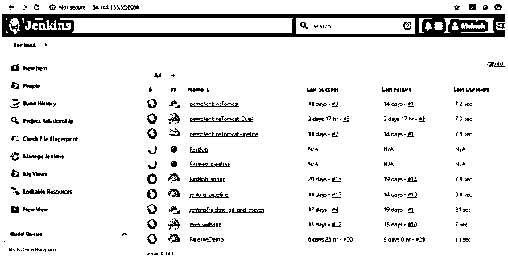

我点击“管理詹金斯”,然后点击“管理插件”。

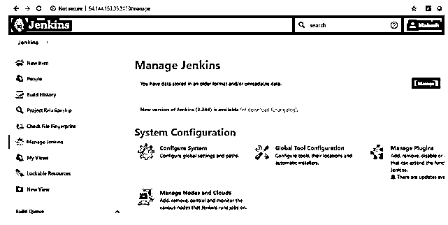

一旦你进入插件管理器部分，有不同的标签，如更新，可用，已安装，高级。

点击可用选项卡并搜索基于角色的授权。

现在，选择插件并点击“安装无需重启”按钮。

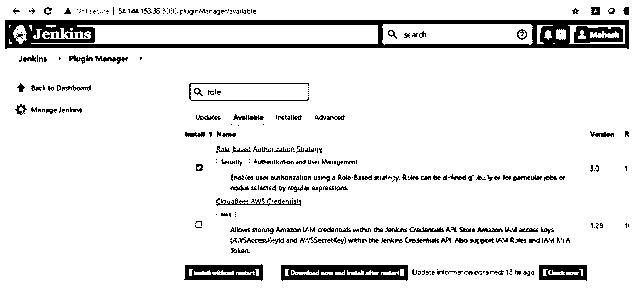

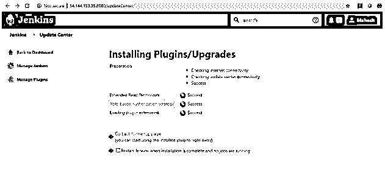

插件安装后，进入“管理詹金斯”，然后点击“配置全球安全。”当您单击“配置全局安全性”选项时，您将看到以下页面:

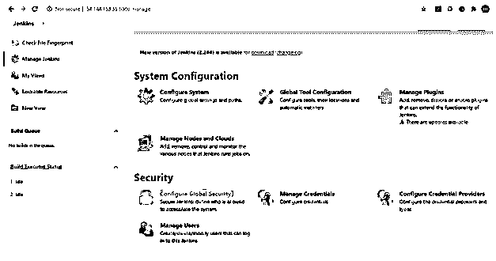

以管理员身份登录 Jenkins 后，管理 Jenkins >配置全局安全性，并选择“启用安全性”复选框。接下来，在访问控制下为安全领域选择“Jenkins Own User Database ”,然后在授权下选择“登录用户可以做任何事情”,并保存它。否则，请不要选择 Jenkins 自有用户数据库部分下的“注册用户”复选框；，就会成为安全隐患；启用注册后，网络上的任何人都可以成为经过身份验证的用户。在这种情况下，建议最小化授予任何经过身份验证的用户的权限。

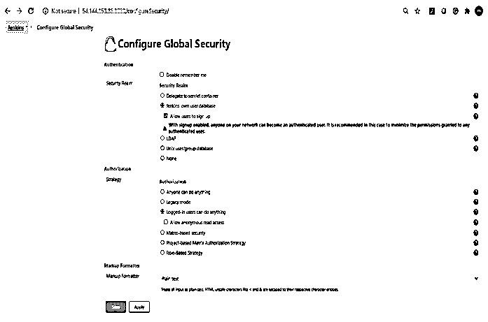

单击授权部分下的“基于角色的策略”,然后单击保存按钮。

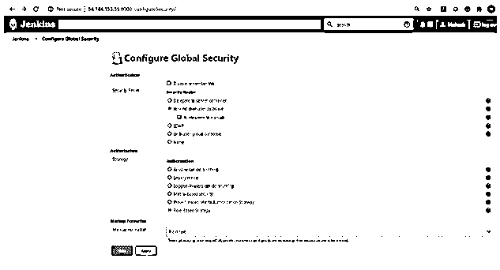

成功保存后，您可以看到如下屏幕

创造

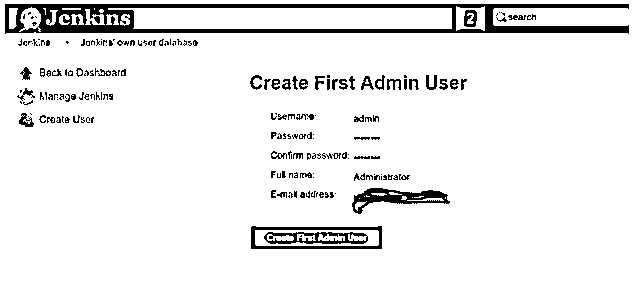

### 在 Jenkins 上创建用户

现在您可以在 Jenkins 系统中设置您的用户了。首先，去管理詹金斯，向下滚动；您将看到“管理用户”选项。点击此选项。

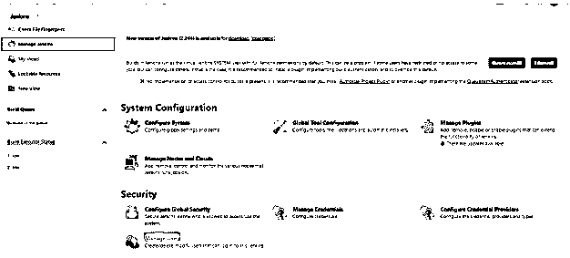

您也可以通过以下步骤重定向到直接页面:-

登录 Jenkins

点击管理詹金斯

点击创建用户

输入所有详细信息–用户名、密码、确认密码、全名、电子邮件

选择创建用户

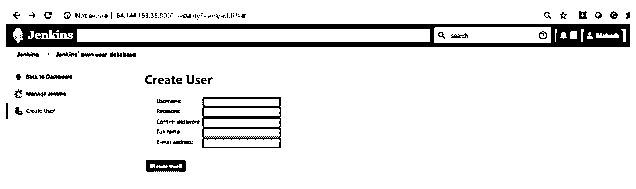

成功输入详细信息后，单击“创建用户”按钮，用户将被创建。

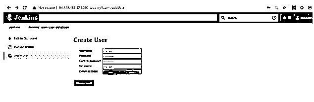

您可以看到如下用户详细信息如下:-

### 管理用户角色

我们按照以下步骤为用户配置角色:-

转到“管理詹金斯”。然后选择管理和分配角色。如果您成功安装了角色策略插件，则只有管理和分配角色选项可用。

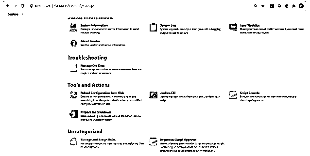

单击管理和分配角色下的管理角色。

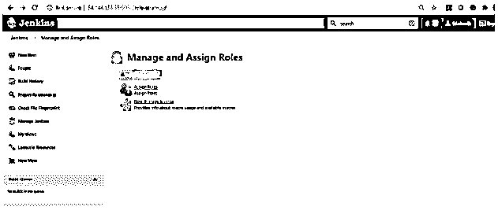

创建名为“管理员”的新角色在角色中键入“admin”以添加选项。然后，通过单击 Add 按钮，我们为用户创建一个新角色。现在，只有我们可以通过选择适当的权限来分配角色，这可以通过成功保存它来实现。请在屏幕下方找到解释。

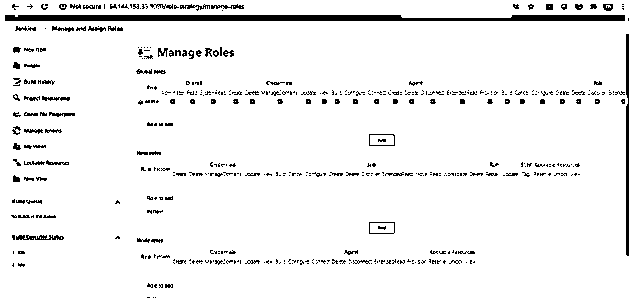

### 在 Jenkins 中分配用户角色

我们已经成功地创建了上面的角色。现在，我们必须将这些角色分配给任何特定的用户。

请按照以下步骤分配角色:-

点击管理詹金斯

转到下一页，选择管理和分配角色。请在下面的截图中找到它。

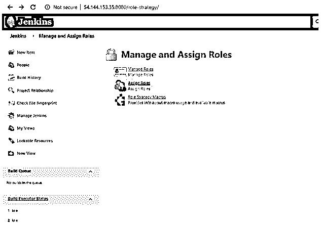

现在单击分配的角色，选择特定用户前面的复选框。以下是可用的不同角色，如全局角色、节点角色和项目角色

全球角色—为我们提供全球级别的访问和授权。

节点角色—创建特定于项目的角色

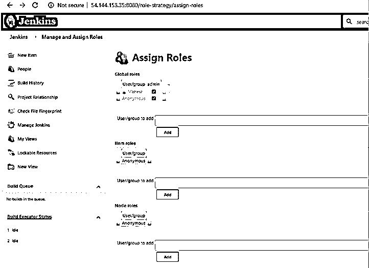

现在，按照上面的步骤，我们可以成功地创建不同的用户，并相应地分配特定的角色。

### 推荐文章

这是詹金斯用户指南。这里我们讨论在 Jenkins 中创建、管理和分配用户角色，以及创建不同用户和分配特定角色的步骤。您也可以看看以下文章，了解更多信息–

1.  [詹金斯插件](https://www.educba.com/jenkins-plugins/)
2.  [詹金斯是什么？](https://www.educba.com/what-is-jenkins/)
3.  [詹金斯有空吗](https://www.educba.com/is-jenkins-free/)
4.  [詹金斯的替代方案](https://www.educba.com/jenkins-alternatives/)

