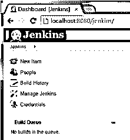
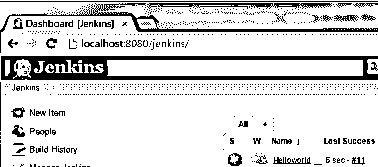
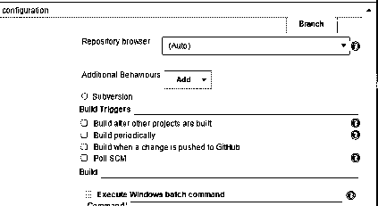
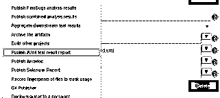

# 朱尼特·詹金斯

> 原文：<https://www.educba.com/junit-jenkins/>

## JUnit Jenkins 简介

Jenkins 的意思是 JUnit 测试 XML 报告格式。当我们需要关于测试用例的额外信息时，我们可以在 TestNg 工具中使用这种格式。但在此之前，我们需要配置詹金斯。换句话说，我们可以说它为 JUnit 和其他技术的插件提供了一些不同类型的功能。通常，Jenkins 是一个开源的自动化服务器，它为开发人员提供不同种类的功能来构建测试用例、部署他们的软件、管道等。

### 什么是 JUnit Jenkins？

Jenkins 理解 JUnit 测试报告 XML 设计(TestNG 也使用它)。因此，当这个选择被安排时，Jenkins 可以给出关于测试结果的有价值的数据，例如，记录的测试结果漂移，用于回顾测试报告的 web UI，跟踪失望，等等。

<small>网页开发、编程语言、软件测试&其他</small>

为了利用这个元素，首先设置您的工作来运行测试，然后，在这一点上，在 Ant glob 语法中指出 JUnit XML 记录的方法，例如，* */construct/test-reports/* . XML。您可以确定由逗号分隔的记录的不同示例。

你是否也觉得功能测试是传达顶级编程的主要元素之一？你同意我的观点，我们应该帮助设计师将这个任务自动化，以获得实际上相同的结果，并得到有意义的模式报告。

### 如何使用插件 JUnit Jenkins？

现在让我们看看如何使用 JUnit 插件，如下所示:

JUnit 模块提供了一个分发器，该分发器使用表单生成的 XML 测试报告，并提供一些可验证的实验结果的图形表示(参见 JUnit 图表中的示例),以及用于调查测试报告、后续失望等的 web UI。Jenkins 理解 JUnit 测试报告 XML 设计(同样被 TestNG 使用)。Jenkins 可以给出关于测试结果的有价值的数据，比如模式，无论何时设计这个选择。

同样，该模块为 Jenkins 中的其他单元测试分发模块提供了一个传统的 API。这种有用性对 Jenkins 核心很重要，直到它以 1.577 的形式被划分到这个模块。

### JUnit Jenkins 配置

现在我们来看看 JUnit 中 Jenkins 的配置，如下所示:

*   **测试报告 XML:**指定在 Ant glob 语言结构中 JUnit XML 文档的方式，例如，* */fabrite/Test-reports/* . XML。确保不要将任何非报告记录合并到此示例中。您可以指出许多用逗号分隔的记录示例。文件集的基本注册表是工作区根目录。
*   **保留长标准结果/错误:**如果选中，测试套件中的任何预期结果或错误将在表格完成后保留在测试结果中。(这里指的是为了舒适而打印的不同信息，而不是令人失望的堆栈跟随)。这样的结果是不断假设测试失败，然而，作为一个理所当然的事情，通过评估轻松获得的广泛结果被缩短以节省空间。看一下这个选择，假设您希望看到轻松通过评估的每个日志消息，但是要注意 Jenkins 的内存利用率可能会相应地增加，不管您是否从未检查过实验结果！
*   **健康报告增强因子:**在处理表格健康分数的实验结果承诺时，应用于测试失望的增强元素。默认系数为 1.0。一个 0.0 的分量将损害试验结果对制造幸福分数的承诺，例如，一个 0.5 的分量意味着 10%的轰炸试验将获得 95%的幸福分数。该组件保留表单结果，以反映新表单中的更改。
*   **允许作废结果:**如果勾选，默认对缺失的实验结果记录进行轰炸和展开，或者作废实验结果，这样不会影响表单的情况。如果不太麻烦的话，请注意，这种设置使得检测错误配置的职业或组装测试仪器不存在错误代码而不交付测试报告记录的失望变得更加困难。
*   **跳过分发检查**:如果该选择不受控制，那么，在该点上，模块随后分发测试结果以比较 SCM 促进阶段。例如，如果您在 GitHub 关联项目中包含这个元素，警告将通过 Checks API 分发到 GitHub。如果此活动回拨您的装配件，或者您不想将警报分发到 SCM 阶段，您可以使用此选项来停用此组件。
*   **看名字:**如果给定并且分配检查被授权，模块将在分配结果时使用这个名字来比较 SCM 促进阶段。在不太可能的情况下，将使用默认值“Test”。

### JUnit Jenkins 示例

现在让我们看看 Jenkins 的例子，以便更好地理解:

让我们看一个基于 JUnit 的受欢迎的测试用例的简单例子。

首先，我们需要打开 Jenkins，如下图所示。

现在根据我们的要求创建一个新项目；我们已经创建了项目，如下面的屏幕截图所示。

现在点击项目名称选择配置命令；点击配置后，我们得到不同的选项，如下图所示。

这里我们需要添加构建步骤和构建。xml 文件，我们需要提供文件的路径。

在下一步中，我们必须根据我们的要求选择 post 选项，如下面的屏幕截图所示。

现在点击保存并构建项目；转到窗口的控制台；我们得到了测试用例的结果，如下面的截图所示。

### 结论

我们希望通过这篇文章，你能更多地了解 JUnit Jenkins。从上面的文章中，我们已经了解了 JUnit Jenkins 的基本思想，我们还看到了 JUnit Jenkins 的表示和示例。此外，本文还告诉我们如何以及何时使用 JUnit Jenkins。

### 推荐文章

这是一个朱尼特詹金斯指南。在这里，我们讨论插件的定义和如何使用它的配置，以及一个例子。您也可以看看以下文章，了解更多信息–

1.  [詹金斯插件](https://www.educba.com/jenkins-plugins/)
2.  [詹金斯是什么？](https://www.educba.com/what-is-jenkins/)
3.  [詹金斯有空吗](https://www.educba.com/is-jenkins-free/)
4.  [詹金斯的替代方案](https://www.educba.com/jenkins-alternatives/)

