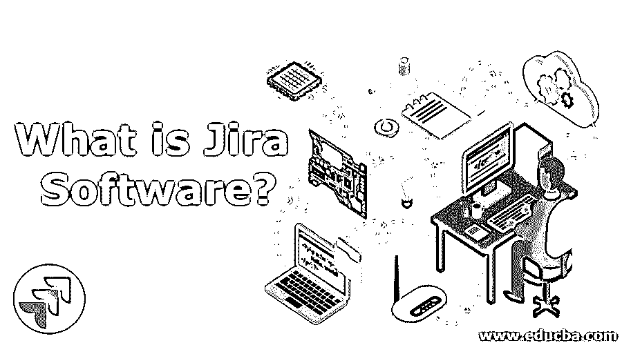

# 什么是吉拉软件？

> 原文：<https://www.educba.com/what-is-jira-software/>

## 吉拉软件介绍

吉拉软件是帮助各种团队管理其工作的产品家族的一部分。吉拉最初被设计成问题和错误的追踪器。然而今天，吉拉已经成为所有类型应用程序的强大工作管理工具，从需求和测试用例管理到敏捷软件。在本指南中，您将了解吉拉的哪些特性和功能可以帮助您的团队满足您的独特需求。

**吉拉重点:**

<small>网页开发、编程语言、软件测试&其他</small>

*   JIRA 名字是 Gojira(日语中哥斯拉的名字)的一个截断，它可能是 Bugzilla(Mozilla 的一个错误跟踪器和测试工具)的一个引用。
*   它是一个独立于平台的工具；可以在不同类型的操作系统上运行。
*   它是用 JAVA 编程语言编写的。

### 了解吉拉软件

在开始与吉拉，你应该知道吉拉软件。用户应该知道吉拉的特点是什么，与其他软件工具相比，它将如何管理软件和移动应用程序的项目任务，等等。

JIRA 可以与不同类型的工具集成，例如 GIT、ClearCase、Team Foundation 软件、Mercury、并发版本系统等等。JIRA 是一个商业工具，允许利用吉拉服务的项目任务。它为个人用户提供了一个免费的使用许可，但是试用版可以在有限的时间内使用。

### 吉拉软件是如何让工作变得如此简单的？

它通过跟踪与软件和移动应用程序相关的问题和错误，简化了工作流程。在吉拉平台上开发的产品帮助团队进行计划、分配任务、跟踪项目问题和管理工作。

当出现问题时，吉拉使用以下工作流阶段:

*   **未解决的问题:**当问题变得未解决时，它将分配给受理人以开始处理它。
*   **进行中问题:**此阶段通知受分配人已开始处理该问题。
*   **已解决的问题:**在此阶段，一旦某个问题的工作完成，就会等待举报人的核实。如果验证成功，它将被标记为已解决的问题，或者如果需要任何进一步的更改，可以重新打开。
*   **重新打开的问题:**如果某个问题在此阶段被重新打开，那么该问题要么是不正确的，要么是遗漏了一些东西或一些修改。
*   **关闭问题:**一旦您完成对问题的处理，受理人将关闭该问题。以后可以根据需要重新打开它。

### 顶级吉拉软件公司

在今天的世界里，吉拉已经成为一个有用的项目管理工具来构建产品和协作。因此，有许多公司使用吉拉软件。

以下是使用 Atlassian 吉拉软件的公司列表:

*   国家航空与航天局
*   SpaceX
*   吱吱叫
*   美国电脑软件公司
*   奥迪
*   易趣
*   Spotify
*   特斯拉
*   加拿大白鲑
*   商务化人际关系网
*   邢 （中国姓氏）
*   索尼
*   超级的
*   贝莱德
*   汉莎系统公司
*   凯捷
*   角落
*   思杰
*   Blubolt
*   耳蜗的
*   达尔
*   码头工人
*   全球捐赠
*   轮毂点
*   Illumina
*   确实是
*   Netapp
*   潘多拉
*   红巨星
*   滩头雅罗
*   洛克威尔·柯林斯
*   Skyscanner
*   源头一
*   易燃物
*   黄页组和更多。

### 你能用吉拉软件或吉拉软件做什么

正如我们在前面的章节中所讨论的，它用于管理与软件和移动应用程序相关的项目、任务、错误跟踪和问题跟踪，并且您可以在各种操作系统上轻松使用吉拉软件，因为它是一个跨平台的工具。

[吉拉仪表板包含](https://www.educba.com/jira-dashboard/)许多有用的功能和特性，可以轻松处理问题**。**

*   **问题跟踪&管理:**它定义了项目管理的工作流程来跟踪问题，管理日常任务，并跟踪团队所做工作的进度。
*   **产品管理:**它允许创建项目，并在项目内部创建 sprints，帮助项目团队交付产品。
*   **可配置的小部件仪表板:**吉拉提供了一个小部件仪表板，以跟踪项目任务，用户工作流程，烧毁图表，验证团队的速度等。
*   **汇报:**吉拉提供报告，了解项目进展情况。报告包括估计的总花费时间、项目预算等。
*   **scrum &看板:**吉拉使用可配置的 Scrum 和看板，其中 Scrum 板可以用来管理你的板，看板可以用来管理系统中的 bug 和 epics。
*   **插件支持:**吉拉提供大量外部插件来管理您的产品。

### 吉拉软件的优势

以下是一些优点:

*   吉拉是一款开源软件工具，用于管理项目任务、问题跟踪以及其他与软件和移动应用相关的问题。
*   它是一个独立于平台的工具；可以在不同类型的操作系统上运行。
*   正如我们所知，吉拉是一个问题跟踪平台，所以它被开发和技术支持团队用来更快地完成工作。
*   吉拉允许对任务进行优先级排序，它通知团队成员哪些任务需要先完成，哪些任务可以稍后再完成。
*   它支持 10 多种语言和 100 多个插件；这些连接不同的软件，使工作更容易和更快。

### 必需的吉拉软件技能

团队成员需要一些技能来完成分配给他们的工作，并在团队中对不同类型的工作进行分类，以避免工作瓶颈。吉拉需要以下技能:

*   Java 语言(一种计算机语言，尤用于创建网站)
*   J2EE
*   创建交互式、快速动态网页应用的网页开发技术
*   Java Script 语言
*   UI–UX 设计技巧
*   前端开发技能

### 为什么我们应该使用和需要吉拉软件？

我们应该使用吉拉软件，因为它是一个很好的软件工具，可以用于不同的目的，如项目管理，问题跟踪，缺陷跟踪等。无论是大公司还是小公司，非常容易地跟踪你公司的进展都是有用的。

我们需要吉拉，因为

*   它有一个很好的基于网络的图形用户界面。
*   它包括良好的用户管理。
*   它有很好的问题搜索选项和查询语言来搜索问题和报告。
*   它可以编辑问题，在项目之间移动问题，问题可以导出到 pdf 或 excel。
*   它为您的不同需求提供了大量的插件。
*   它可以很容易地在服务器上托管，并提供来自 Atlassian 的良好支持。

### 谁是学习吉拉软件技术的合适受众？

*   企业主和高管可以学习吉拉软件
*   任何对学习吉拉和敏捷项目管理感兴趣的人
*   管理人员可以通过了解吉拉来了解项目的工作流程

### 这项技术将如何帮助你的职业发展？

吉拉技术将有助于插件的开发。如果你擅长吉拉 API 类、模板、插件开发等技能，那么肯定有机会。如果你有很好的编程知识，那么以后可以考虑这个。

### 结论

到目前为止，我们已经讨论了顶级 JIRA 软件技术及其优势、工作流程、工作进度跟踪等。与其他吉拉替代品相比；它擅长与软件和移动应用程序相关的项目管理、任务、bug 跟踪和问题跟踪。在这篇文章中，我们已经涵盖了关于吉拉软件的最大限度的信息，所以研究所有的东西，并作出良好的选择。

### 推荐文章

这是一个什么是吉拉软件的指南。在这里，我们讨论吉拉软件公司的工作、技能、职业发展、顶级公司和优势。您也可以浏览我们推荐的其他文章，了解更多信息——

1.  [JIRA vs Bugzilla](https://www.educba.com/jira-vs-bugzilla/)
2.  [什么是 Splunk 工具？](https://www.educba.com/what-is-splunk-tool/)
3.  [吉拉测试工具](https://www.educba.com/jira-testing-tool/)
4.  [JIRA Bug 生命周期](https://www.educba.com/jira-bug-life-cycle/)

