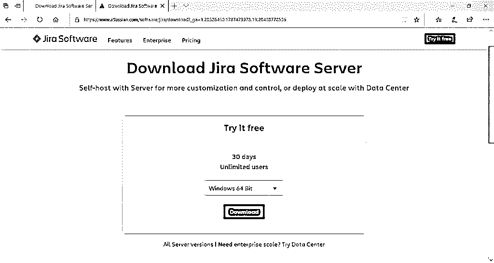
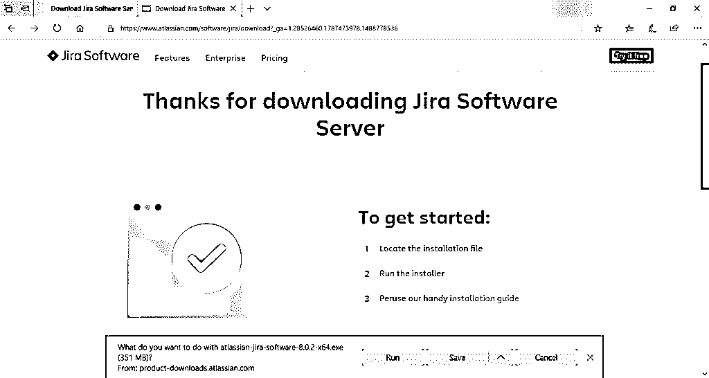
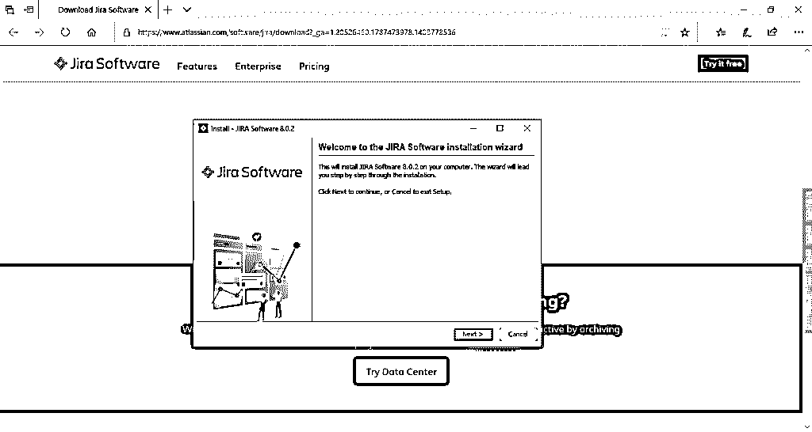
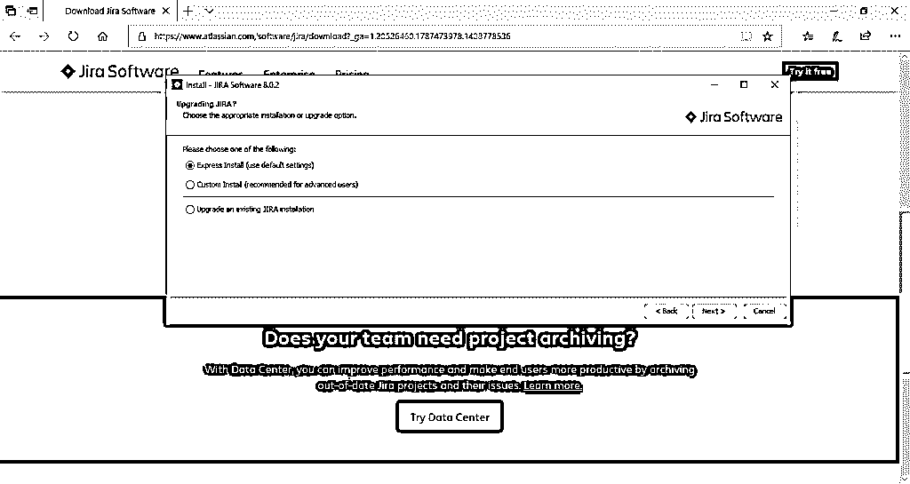
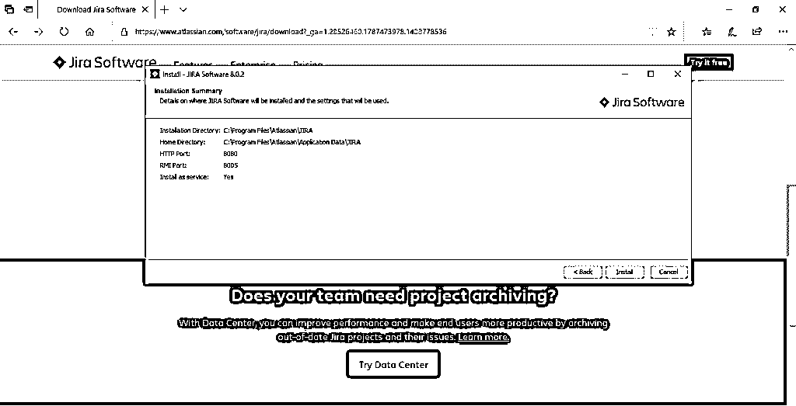
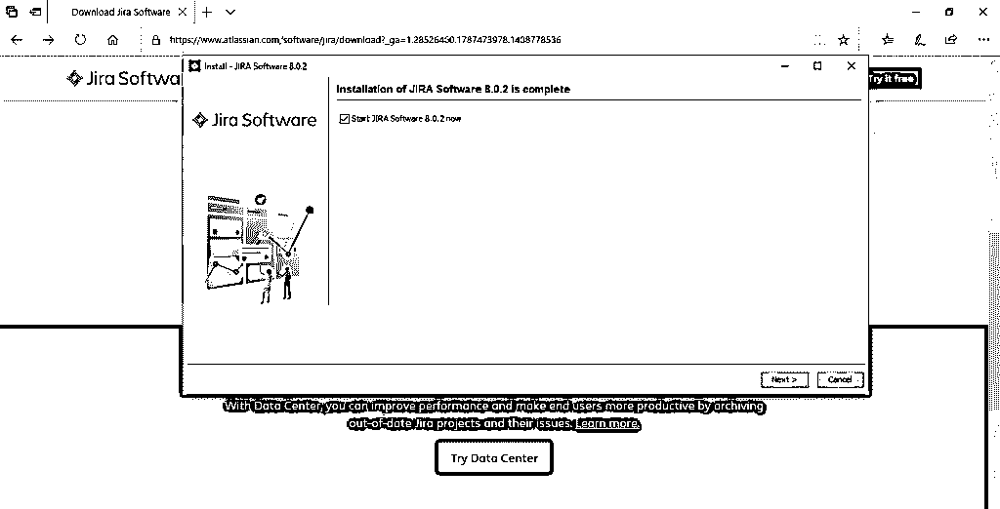
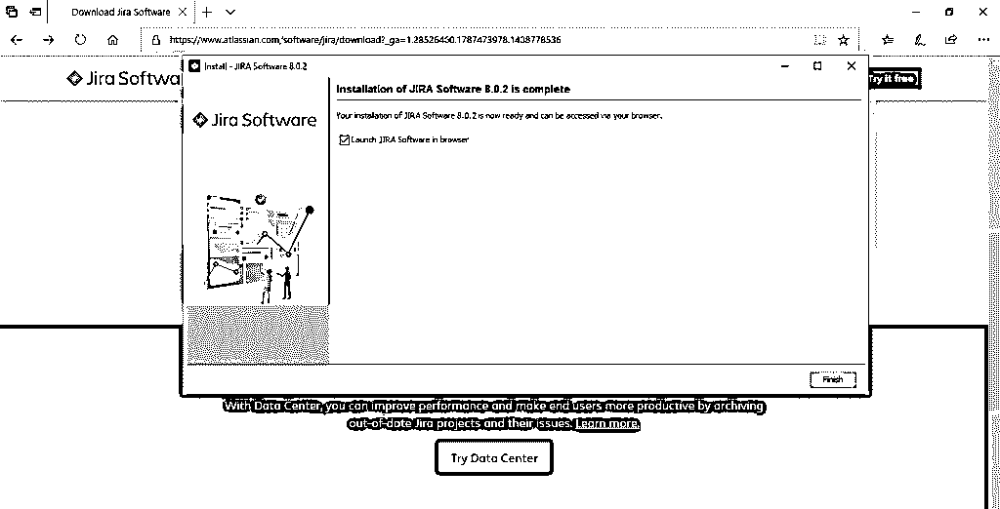

# 如何安装 JIRA

> 原文：<https://www.educba.com/install-jira/>

## 安装 JIRA 简介

JIRA 是一个由澳大利亚公司 Atlassian Inc .开发的项目跟踪工具。它是一个独立于平台的工具，这意味着它可以用于任何操作系统。它基本上是一个用于软件开发的项目管理工具，在工作流管理、过程管理、需求管理、任务跟踪、错误跟踪等等方面非常有用。吉拉不仅功能强大，而且在自我磨练项目管理的许多高级在线解决方案方面也不可同日而语。它被开发和技术支持团队用来在设定的时间框架内完成更多的工作。这里需要知道的重要一点是，吉拉是一个 web 应用程序，这意味着它可以在服务器上集中运行。因此，不同的用户可以在同一网络上的任何计算机上通过 web 浏览器与它进行交互。JIRA 很方便，很像一块白板，你可以在上面直观地记录所有团队成员在项目不同阶段的状态。当检查团队中的每个人如何以及在哪里参与项目变得非常具有挑战性的时候，吉拉证明是非常有用的。

当你完成一项任务时，你只需要点击并滑动你的职责到某些部分(这些可以是进行中的、已完成的、未开始的等等。)，以便您自己的任务和团队工作流的状态可以直观地展示给团队中的每个人。因此，它消除了不断发送电子邮件和跟踪每个项目进展情况以及分配给每个人的任务状态的需要。除此之外，每个人的实时可视化进度保持了团队的高生产率和敏捷基础。
JIRA 是一个多语言工具，因此其内容可以呈现并翻译成英语、法语、德语、日语和西班牙语。它也可以作为移动应用程序使用。它支持所有已知的互联网浏览器，如 Chrome、IE、Mozilla 和 Safari。吉拉是一个商业产品，所以为了利用 Jira 的服务，你需要购买许可证。然而，30 天的免费试用对无限的用户是可用的。

<small>网页开发、编程语言、软件测试&其他</small>

在详细介绍安装 Atlassian 的吉拉之前，让我们先了解一下吉拉在系统中正常运行的先决条件。

**步骤 1**–要访问系统的全部功能，应在浏览器中启用 Javascript，而不使用任何脚本拦截工具。

第二步–JRE/JDK 应更新至最新版本。

### 在服务器端安装 JIRA

下面是安装吉拉的详细步骤如下:

**步骤 1**–访问 Atlassian 官方网站下载并安装吉拉。该网站的链接是-https://www.atlassian.com/software/jira/download?_ ga = 1.28526460.1787473978.1 488778536
您可以通过单击下拉菜单来更改操作系统类型。

**第 3 步**–下载完吉拉后，点击。exe 文件。此后，您将看到显示运行确认弹出窗口，单击运行继续。可以参考下面的截图。

**步骤 4**–注意，将显示 JIRA 安装向导。如果是，请单击下一步

**第 5 步**–选择所需的安装选项，然后再次点击下一步。
安装摘要将显示目标目录、主目录、RMI 端口、HTTP 端口等。下面附上相同的截图供你参考。

**第 6 步**–点击安装。JIRA 将开始安装。完成安装需要几分钟时间。

**Step 7** – Please make sure that the “Start JIRA Software 8.0.2 now” checkbox is checked in order to start Jira automatically. After that click on Next, if not, it can be accessed using the Windows Start Menu shortcut.

**第 8 步**–点击完成按钮。

### 设置您的 JIRA 应用程序

安装程序将在开始菜单上创建以下快捷方式——访问 JIRA
启动 JIRA 服务器
停止 JIRA 服务器
卸载 JIRA
**步骤 1**—点击访问 JIRA
**步骤 2**—选择许可类型为 JIRA 软件(服务器)，组织名称为 Self。
**第 3 步**–“您的实例是”字段应已启动并运行
**第 4 步**–单击生成许可证
**第 5 步**–将出现一个确认弹出框。点击“是”即可。
**步骤 6**–您现在必须输入管理员帐户的详细信息，一旦设置完成，就可以添加更多的管理员。
**第 7 步**–之后输入您的邮件服务器详细信息以设置电子邮件通知。JIRA 现在可以在出现问题时发送通知。
**步骤 8**–完成后，吉拉将自动完成设置！一旦 JIRA 完成设置并开始在服务器上运行，用户可以从任何浏览器访问它。您的吉拉站点将可以从您的基本 URL 或如下 URL 访问:http:// <计算机名或 IP 地址> : <端口>

### 从 ZIP 文件安装 JIRA

**步骤 1**–下载适用于您的操作系统的 zip 文件:

https://www.atlassian.com/software/jira/core/download 的吉拉核心公司
https://www.atlassian.com/software/jira/download 的吉拉软件公司

第二步–你需要一个地方来安装吉拉。为此，创建一个目录，也称为安装目录，其路径中没有任何空格。假设这是你的<安装目录>。
确保吉拉 zip 文件被解压到<安装目录>。

**步骤 3**–要在吉拉中存储文件、日志、搜索索引等数据，需要创建一个名为 home directory 的目录。安装目录和主目录不应相同。假设这是您的<主目录>。
在启动时，可以指示吉拉找到<主目录>的方法如下:
设置首选的环境变量。
编辑 jira-application.properties 文件

**第四步**–吉拉默认监听端口为 8080。如果已经有一个应用程序使用同一个端口在服务器上运行，您可能需要使用不同的端口。

### 推荐文章:

这是一个如何安装 JIRA 的指南。这里我们已经讨论了在服务器端安装 JIRA 的基本概念和不同步骤。您也可以阅读以下文章了解更多信息:

1.  [安装引导程序](https://www.educba.com/install-bootstrap/)
2.  [安装 C](https://www.educba.com/install-c/)
3.  [安装硒](https://www.educba.com/install-selenium/)
4.  [吉拉测试工具](https://www.educba.com/jira-testing-tool/)

